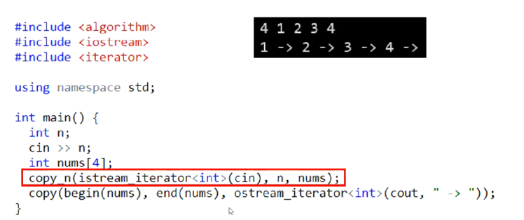

# 第一次习题课讲解

## IO操作

### char输入

- 读入一个字符（包括空白符）

  ```c++
  char ch
  cin.get(ch)
  ```

- 读入非空白符

  ```c++
  char c;
  cin >> c;
  ```

- 读取未知个数的字符（包含空白符）

  ```c++
  char ch;
  while (cin.get(ch)) {
      // do something ...
  }
  ```

  > get 的返回值为 istream 对象，而 istream 对象可以转换为 bool 值，因而可以出现在 while 的条件中； >> 实际上会转换成函数 operator>> 的调用，函数的返回值也为 istream 对象
  >
  > https://en.cppreference.com/w/cpp/io/basic_ios/operator_bool

### int 输入


### String 输入

- 读入，以空白字符或 EOF 作为结束标志

  ```c++
  cin >> s
  ```

- 读入一行，以换行符（默认）或指定的字符（称为 delimiter）作为结束标志，delimiter 会被读取但不会出现在 s 中

  ```c++
  getline(cin, s);       // 以换行符为结束标志
  getline(cin, s, ',');  // 以 , 为结束标志
  ```

- 例子：

- 注意：

- 解决：

### 简便操作



> 红框框处表示从输入缓冲区读取n个数字复制到num函数
>
> 红框框下一行同理，将数组复制到输出流

## 2. 编译错误

见pdf

## 3. 题目讲解

# 第二次习题课讲解

## 1. 写出好程序的建议

### 头文件

- 头文件可以按照字母表排序，方便之后的查找
- 头文件可以按照一定规律分段

### using

- 可以用于使用命名空间中的一些短名字
  - using std::size_t 即不使用命名空间std时，也可以用size_t的简写
- 可以定义别名
  - using hash_code_t = long long 能够为long long类型定义一个别名，方便阅读理解

### 函数

- 如果确定函数的参数不应该被改变，函数参数最好被定义为const
- 尽可能的将功能进行抽象形成函数，方便复用，提高可读性

### assert

- 可以使用assert来判断当前的传入参数是否正确，如果不正确直接使得函数在当前部分崩溃，而不会进行错误传递，方便debug

### &

- 可以使用别名实现数据复用，避免重复计算
- 可以使用别名代替全局变量
