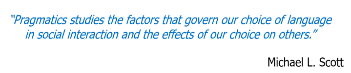
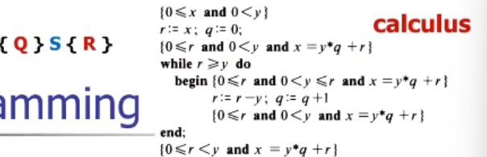

# 1

## 1. 语言 language

### 构成

#### 语法（Syntax）

- bacjus-Naur Form EBNF/语法图

  - 其中黑色的是实际不出现在编码语言中，是可替换的，相当于是变量

  - ::= 表示的可以替换

  - 蓝色的字母和数字表示终止字符，即不可能出现在式子左端，计算机中即为ASCII码

  - 其解析方法有deduct（推导）和reduce（归纳），deduct例子如下

    > 左边是推导过程，右边是推导树

  - 要判断一个程序是否符合某种特定语言，那就让该程序在该语言对应的语法树下进行推导，如果能够推导至终止字符，则其满足该语言的语法规则

#### 语义（Semantics）

- static Semantics
- Dynamic Semantics

#### 语用（Pragmatics）

### 定义

​	语言是在特定的字母表（一般为ASCII）上，按照一定的规则（语法图EBNF），所构成的一个符号串的集合

​	高级的语言计算机时无法识别的，必须要通过compiler翻译，等价的翻译

### 分类

- Regular Gammar	                     Finite Automate
- context Free grammar               pushDown  Automate
- context sensitive  grammar      LBA
- PSG                                                TM(turing mashing)

## 2. 编程 Programming

### 编程性质

#### 科学性 Science

即在编程的过程中思考其前后置条件，在进入语句前使之满足前置条件，语句执行后满足后置条件，以计算为例，其需要符合数学的规则，数学的科学性

#### 艺术性 Art

### 编程范式 Programming Paradigm

#### 命令式程序设计

当停止时能够直到程序的运行状态，直到执行到那一条指令，指令的位置

> 为什么OO时命令式程序设计，小编也不知道呢（×）因为其编译后结果运行时仍然能知道指令，函数的位置等等，符合命令式程序设计

#### 函数式程序设计

- 在命令式程序设计（比如C）函数的值不仅来源于其参数，还有可能来源于其上下文（比如全局变量），称为副作用
- 而在函数式编程中要求没有副作用，即函数的值全都来自于参数
- 而这带来的好处是不同的函数可以任意安排顺序执行或并行执行
  - 先函数F，再G；先函数G，再F；F, G并行的结果是一样的
  - 方便分工，实现高效率

#### 逻辑式程序设计

- 需要给定规则与事实

- 当给定问题时，计算机会根据规则和事实自动分析得到结果

- 例子：看病

  

注：后面两种程序设计时只给定输入，希望得到结果，但是其过程并不清晰，比如不知道哪一步开始化简

## 3. C++发展史

### C++的前身

- FORTRAN 最早的编程语言：解决机器语言到高级语言的衔接
  - 问题：移植能力差

- Algol 60：
  - 实现了作用域，局部化
  - 有了符合语句
  - 有函数，值传递
  - 实现递归，动态数组
- Algol 68：结构化编程语言的巅峰，<u>为C++提供结构化编程（Structure programming）思想</u>
- BCPL：为了写编译器而诞生，语言偏底层（CPL的简化版）
- B：BCPL的升级版
- C：是BCPL的精简版，并且也能够写出操作系统，<u>给C++提供了C的基础（底层语言）</u>
- C with Class
- Simula 67：诞生于一个项目，为了完成这个项目需要这个语言的OO特性，<u>为C++提供了OO思想</u>
  - 背景：核反应需要一个仿真系统来先进行模拟其过程
  - 选择：选择ALGOL 60：块结构，安全性，在欧洲
  - 入手：需要打破先进先出的栈结构
  - 措施：
  - 实现：写了一个complier，把用simulaⅠ写的程序翻译成ALGOL60，而不是直接翻译成机器语言
  - 思考：程序的不同部分有相同的地方，能否共用？
  - 方法：使用class和subClass，class用于抽象程序不同部分的共性；subClass抽象class之间的共性
  - 形成Simula 67！
  - 没能够传承下去的原因：
    - 二战后工业中心在北美，它出现在欧洲
    - 贵
    - 缺乏开发环境（IDE）
    - 用它写的程序代码非常大

### C++的诞生

#### 史前1979

- 背景：研究分布式系统的系统软件组织
- 实现：
  - 第一阶段：Simula
    - 良好的可读性
    - 类的层次结构
    - 性能差
  - 第二阶段：BCPL
    - Debug难

- 思考

- 科学观

  - 设计
    - 程序组织			Simula
  - 效率		
    - 连接规则简单、灵活（异构语言） BCPL
  - 移植性
    - 不能依赖复杂的运行系统
  - 其他
    - protected、const、区分初始化和赋值、异常     

- 哲学观、历史观		

  - 存在主义：尊重个体差异性，存在即合理；

    - 对C++来说：尊重所有有益工具，对工程师有用的东西，即使它会对程序带来伤害

    - 实验很重要！不是科学家的玩物，不是证明一种观点，而是解决一个问题，风格多样，而不是“真理之路”

      > 这可能也是C++包容，复杂，难用的原因之一 

- 带类的C

  - UNIX内核分布到局域网
    - 内核模块化
    - 流量分析
  - 本质
    - 组织方式使用class — 接近问题
    - 计算方式使用C       — 接近机器
    - 舍弃并行走向通用
    - 舍弃复数，矩阵，字符串等
    - 兼容C
  - 工具
    - Cpre：C   +   class
      - C是灵活高效可用可移植的，但是某些语言结构不安全
      - C++是包容C的，C++不能舍弃C中“危险”“丑陋”的特性而符出效益的代价

- 

- 

#### 1983

- C++

  - 影响语言设计的因素、
    - 用户：产业界+大学
    - 运行环境 硬件 + OS
    - 避免提供工具
  - Cfront

- 标准化

  - 1994年 进入ANSI
  - 1998年 进入ISO
  - ANSI和ISO都是标准化组织，前者是类似于工程师组成的标准化组织，语言的诞生，扩城，更新都需要经过其审核；后者是国际标准化组织，类似于联合国？ 

- 观点

  - 好的语言不是设计的，而是成长起来的
  - 相比于数学，与工程学，社会学，哲学的关系更紧密
  - 亲历实验，依赖于老练的程序员
  - 正交性要让位于有用性和效率

  

#### 当前的编译模式

​                                                                                                                                                                               

STL

