# 一. 结构化程序设计部分

## 1. Data

数据的格式：“性质（可复数）” + “变量名” + “=” + “变量值”  
例如：

```c++
const int A = 1
```

别名：typedef int INT16，这个语句的作用是给int取了一个别名INT16，即可int表示INT16，如果程序迁移后，short是16位，则只要改一个地方，即改成typedef short INT16

数据处理：算数、逻辑、IO

类型系统的强弱，动静

- 强类型：字符串“12”和整数8不能相加  <u>**√**</u>
- 弱类型：字符串“12”+ 整数8 = “128”
- 动类型：能够实现多态

### 基本数据类型

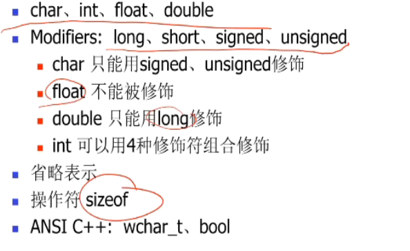

- char  int float double
- modifiers: long    short     signed     unsigned
  - char只能用signed或者unsigned来修饰
  - 
- typedef：为已有类型定义一个同义词
  - typedef double profit
  - typedef int INT

### 表达式

#### 组成与求值

- 组成

  - 操作只
  - 操作符
  - 其他

- 求值

  - 优先级

  - 结合性

  - 类型转换约定！

  - 求值顺序（从右往左还是求左往右）

    - 取决于compiler

    - 例子:

      ```c++
      int x = 10
      int y = 3
      double d = 2.0
       d + x/y*d + ++y // 存在编译副作用
      ```

#### 不同类型的表达式

- 种类

  - 算术表达式
  - 关系和逻辑表达式 >,<,&&,||
  - 赋值
    - x = 8是赋值表达式
    - x = 8; 是赋值表达式语句
  - 逗号

- 操作符可重载

- 赋值表达式

  - 左值 = 右值表达式
  - 左边不是必须是一个变量，也能够是一个refrence，比如A[1]

- 条件运算符表达式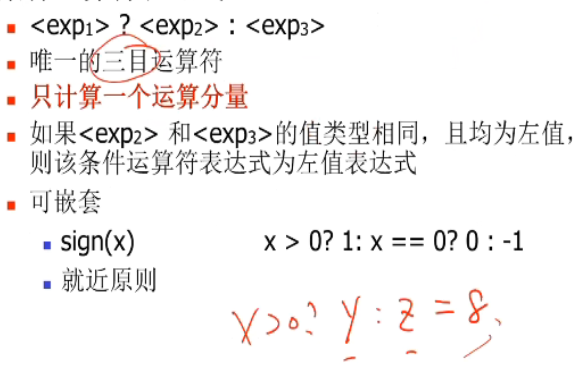

- 逗号表达式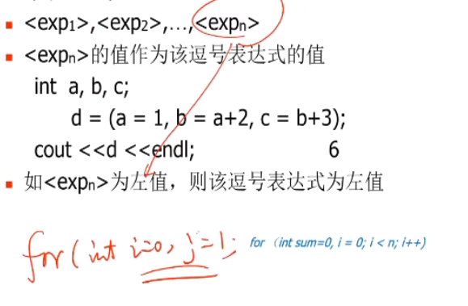

- 字位运算符表达式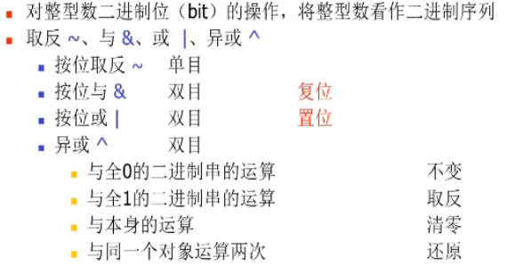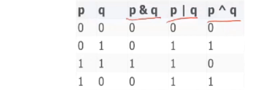

  练习：交换a,b的值

  ```c++
  a1 = a ^ b
  b1 = b ^ a1
  a2 = a1 ^ b1
  ```

- 移位运算符表达式

## 2. 语句

### 表达式语句

- 表达式加上分号形成表达式语句
- 方便之后的操作符重载

### IO语句

- cin、cout
  - 使用这两个对象得先导入 stdio.h , iostream.h
- />> , <<可重载
  - 

### 控制流语句

if else , while , for, switch

- for
  - 循环三要素
    - 初始化
    - 终止条件
    - 改变循环控制的变量
  - for能够将三要素全部放在一起，直观
- switch
  - switch（）
    - 括号里面是整形表达式
  - case 
    - 其后值是整形常量表达式
    - 值不重复
    - 次序任意
    - 标号作用，不改变执行顺序
    - 和if相比，它只需要一次比较就能够跳转到目标位置，但是如果是区间比较，就得用if了
- 在语句中尽量避免出现字面量，可以使用枚举类型，case后面的常量表达式就可以换成对应的枚举类型对象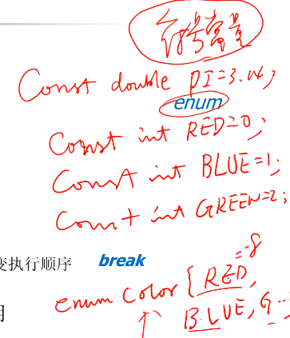

## 3. 函数

- Code：code区存放代码，同样会根据**函数名 和参数**构建符号表，只读
  - 为什么也需要参数来构建表：因为可能存在重载
  
- Data：存放全局变量

- Stack：引入栈存放局部变量，好处在于使用函数时存入，退出函数时排除，能够节省空间，并且因此**能够使用递归**（因为如果全是全局变量，则无法使用递归）

- Heap：存放对象，对象封装是给人看的，其数据操作该在哪还是在哪
  - 数据在？
  - 操作在？
  
  

> 详细见ZHY笔记

## 4. 程序组织

### 变量作用域

- 程序级：即本文件的全局变量，本文件可用，其他文件可调用

  - 其他文件想要调用，需要声明 

    - extern float salary;

      > float salary 本文件没有定义，在其他文件有定义，所以加一个extern进行声明，使得本文件也可用

  - 声明方法还可以使用 #include a.h

    - 这个的实现过程是把声明语句统一存入a.h文件，然后使用#include 把a.h文件种所有声明语句给复制过来
    - 带#的操作都是编辑操作(edit)
    - .h结尾的是头文件，头文件的内容如下
      - 常量定义
      - 变量/函数声明
      - 编译预处理
      - 类型定义
      - 内联函数

- 文件级：使用static限制，文件的全局变量被修饰后，只能在本文件内用，其他文件无法调用，维持私有变量，避免产生冲突

  - static还能够改变变量的生命周期，用其修饰函数级变量，则该函数级变量会存在知道函数结束

- 函数级：在一个函数内，在函数内生效

- 块级：在循环语句内，在语句内生效

### namespace

- 防冲突
- 

#### 理念

- 兼容
  - link时不冲突
  - 程序种定义新名称不必担心和其他（比如库）冲突
  - 在库里增加名字，不影响用户
  - 不同库例含有同名元素
- 快速
  - 十分钟能够理解
  - 两周就能实现

#### 两种形式

- declaration

  - using std :: cin; // 这个只能使用std种的cin方法

    cin >> ‘xxx’

- directive

  - using namespace std; // 这个能够使用cin中所有变量和方法
  - cin >> ‘xxx’

#### detail

具体例子见ppt

- 别名：
- 全局
- 开放
- 可嵌套
- 重载
  - 在一个文件里面，不要用两次 directive，因为不同namespace种的函数可能会发生重载，可能会导致原有函数的语义改变

### 编译预处理 — CPP

它和作用域，类型，接口等概念格格不入，能够作用全局，穿透作用域，不考虑程序

#### #include

#include a.h 把a.h文件全部复制到当前文件来

#### #define

#define  a  b 的作用时将程序中出现的a全都换成b

- 定义常量

  - #define PI 3.14;
  - 能够使用const来定义常量来代替

- 定义函数

  - #define max(a,b) a>b ? a : b;

    - 这边不需要定义参数变量类型

  - 通过inline 和 template 来代替

    ```c++
    template <class T> // 
    inline T max(T a,T b) // 这个函数只是一个模板函数，当确认被传入参数的类型，这个函数才真正确定
    ```

- 实现宏！可看ppt例子

#### #ifdef

这个的作用相当于是选择出我们要编译的代码，满足条件的代码才会被编译，不满足的直接被当成注释扔掉了，用于版本控制，划分代码

#### #pragma

能够控制warning 的等级，调高或降低都可用

## 5. 数组

特征：==**相同类型，连续存储**==

- 无论是几维数组，它们的存储方式都是连续的，所以它能够实现升维降维，所以它能够越界？（存疑）

### 一维数组

#### 类型定义

#### 函数接口

- int a[16] 这边的a是数组类型，不是指针类型
  - 数据函数接口需要通过参数显示给出，不能通过sizeof取得
  - 比如在作为函数参数传入时，需要同时传入a和数组a的大小，这样才能够遍历，如：int func(int a[] , int n)
    - 但是字符数组char a[] 有个约定，数组最后一位必定是 ‘\0’ 所以不需要传数组大小，如果需要遍历则只需要使用     while（a[i] != ‘\0’）即可


### 多维数组

- 定义
  - int a\[2][3] 相当于是 两个 int a[3]数组合起来的，是在一维数组基础上进行叠加
  - 也可以理解定义成一个新的类型 typeof T a[3] 然后在T的基础上建立一个一维数组 T a[2]
- 存储组织
  - 多维数组在空间上也是占据一段连续空间，一维数组空间的叠加
  - 在理解其组织形式的基础上，能够实现升降维度处理
- 参数传递
  - 能够缺省第一维 如  void f(int a[]\[3] , int n)
- 与java差别
  - java中能够实现ragged array，即多维数组中，每一维的大小能够不同，而c++不行

### Struct

类似于类，将元素封装在struct内部

- 赋值 ——必须要同类型才能赋值

- 参数传递 —— call by reference，

  - 因为其内容较多，传值资源较大
  - 但是会带来函数副作用

- alignment 对齐

  - 在安排struct存储空间时 c++会自动对齐，即每个消耗的空间数始终是4的倍数，用空间换取时间

    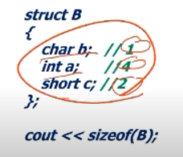

    > 这边消耗实际空间不是 1+4 +2 = 7；而应该是4+4+4 = 12！
    >
    > 而多出来的部分称<u>padding</u>

  - __attribute\_\_(aligned(8))能够将对齐方式从4改成8

  - #pragma pack(n)能够将其压缩空间，即关闭对齐

### Union

类似于struct，和其不同的一点在于union是**共享存储空间**

```c++
union  B
{
    char b;   // 1
    int a;    //4
    short c; //2
};
cout << sizeof(B);
B b;
//这边b的空间是4，是 max of （B）
```

#### 例子：矩阵实现

```C++
union  Matrix
{
    struct
    {   double  _a11, _a12, _a13;
        double  _a21, _a22, _a23;
        double  _a31, _a32, _a33;
    };
    double  _element[3][3];
};
// 这边struct占9个int类型的空间，_element也占9个，二者空间共享，同时同一个空间只能存在一个数据，可以有两种方式进行空间修改，从而在能够实现矩阵初始化的基础上（使用数组）更好地表达矩阵（使用结构体）
```

内存空间展示图：**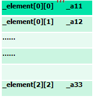**

#### 例子：存放一百个图形（直线，矩形，椭圆）

```c++
struct Line	｛int x1, y1, x2, y2;};

struct  Rectangle ｛int lef, top, rig, bot;}；

struct Ellipse{int x, y, r; }；

```

##### 方法一：分别创建空间

```c++
Line         figures_L[100];
Rectangle    figures_R[100];
Ellipse      figures_E[100];
```

- 缺点：浪费空间，一百个图形需要三百个空间

##### 方法二：使用union

```c++
enum FIGURE_TYPE  {LINE, RECTANGLE, ELLIPSE};
struct  Rectangle{  
    // 每个图形都有一个type，以便于之后标记类型
    FIGURE_TYPE  t ; 	 
    int lef, top, rig, bot;
 };
struct Line{
  	FIGURE_TYPE  t; 
    int x1, y1, x2, y2;	                       	
};
struct Ellipse{
    FIGURE_TYPE  t; 
    int x, y, r; 
};
union FIGURE{
    // union这边也有一个type，不占用额外空间，可以更方便地识别当前figure的类型
    FIGURE_TYPE  t ; 	
	Line            line;	
	Rectangle    	rect; 
	Ellipse         ellipse;
};

```

FIGURE中空间占用情况：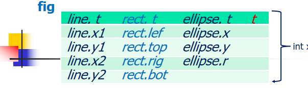

```c++
FIGURE  figures[100];
void main()
{   input( figures, 100 ); // 
    for (int i=0;i<100;i++)
         draw(figures[i]);
} 
```

input 和draw方法的实现：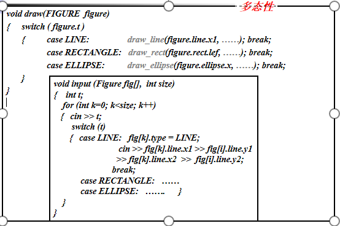

如果想要增加 color 和width 属性？：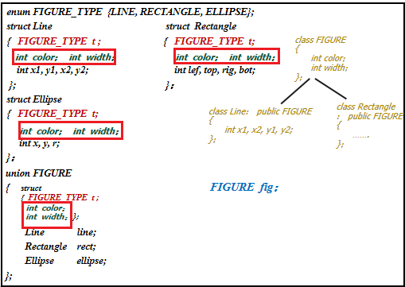

> 直接在struct 和union中都加上即可，而这个很像java中的抽象类继承，union FIGUGE就是抽象类，而其他的struct如Line，…等等都是它的子类。一次只能放一种类型，但是能够存储多种类型，确实！

## 6. 指针

### 指针定义与基本操作

#### 定义

- 格式

  - 基类型 * 指针变量
  - int *p // p为一个指针变量
    - p为地址，int为对应地址的数据类型
    - 如果只想操纵地址，可以使用void，使用后则无法操纵对应地址中的数据

- 用typeof来定义一个指针类型

  ```c++
  typeof int* Pointer;
  pointer p,q;
  // 如果使 int *p,q，则p是指针类型，q是int类型，这也是引入typeof的意义
  ```

- 赋值

  ```c++
  int *p = 0x0000000A;
  int *p = (int*)0x0000000A;//必须要将地址做类型转换才能对其中的数据操作
  ```

#### 操作

##### 操作符

- &：取地址

- \*  :   间接取内容

  ```c++
  int x=9;
  int *p; // 这边没有初始化，不好
  p = &x;
  *p = 1000;
  ```

  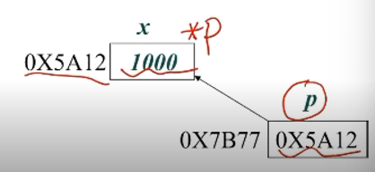

- 指针初始化

  - 一旦指针超出程序规定范围会导致程序崩溃，所以需要初始化
  - 初始化中一般是 ：int *p = nullptr

##### 赋值

同类型赋值

##### \+ -整形

- 结果类型，不变

- 数值类型，+sizeof(x)

  ```c++
  int x;int *p;
  p = p+1;
  p = &x + 2;
  p++;p--;
  ```

  > 在加的过程中是 |p| + sizeof(x)，而不是没有意义的绝对加一

##### 比较运算


#### 输出

```c++
int x=1; int *p=&x;
cout << p; // p的值，x的地址
cout << *p; // p所指向的元素的值
//特例：
	char *p = "ABCD";
	cout << p; // p指向的字符串：这个是cout函数的规定，当p是字符指针时，输出整个空间的内容
	cout << *p // p指向的字符，A
    cout << (void *)p //p的值，即A的地址：当想要输出地址时做类型转换即可    
```

##### void*

只管理地址信息 不对数值进行操作 — void*p;

- 作为**指针类型的公共接口**：所有类型的地址都可以传递给它，并且其无法更改指针指向的内容更加安全

- 任意想要进行的操作都要做强制类型转换

- 例：将某块内存清零

  ```c++
  void  memset ( void *pointer, unsigned size) 
  {   char *p = (char *)pointer;
      for (int k=0;k<size;k++)
          *p++ = 0;
  }
  ```

  因为它定义的时void *pointer，所以任何类型的指针都可以传进来，；操作的时候强制转换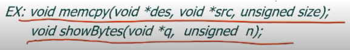

  

##### 常量指针

- 常量指针   const <类型> * <指针变量>

  ```c++
  const  int  c=0;     
  const  int *cp; // cp即为常量整数指针，代表(*cp)即cp指向的的值只能为常量整数
  int *q;
  int y=1;
  cp = &c; // 常量指针指向常量，√
  q = &y;  // 一般指针指向一般，√
  *cp = 1; // 修改常量指针的值，×
  *q = 2;  // 修改一般指针的值，√
  cp = &y; // 常量指针指向变量！！！ 可以的！
  // 因为常量指针表示的时 (*cp)时只读不写，但是y是程序所有者定义的另外一个可读可写的变量，其权限范围大于(*cp),就结果而言，使用*cp时只读，直接使用y时，可读可写
  q = &c;  // 变量指针指向常量，×，理解同上 
  ```

- 常量指针的<u>作用</u>：消除***函数副作用***

  - 函数副作用指的是通过一般指针传递参数后，函数内部的操作可能会改变外部的值 
  - 使用常量指针即const约束后，函数内部对于这个指针只读不写，保护外部数据

- 常量指针使用场景：比如有一块很大的struct A的结构体，内部定义了很多变量，当想要把A的实例a传入一个函数时，直接传入a，栈消耗过大（因为a里面所有变量都得入栈），那么一个好的方法就是传入结构体的起始地址，但是传入地址又有可能改变其数据内容，所以最好的办法就是传入**常量地址**；

- 而且参数作为常量地址还有一个<u>作用</u>是：拓展函数的实用性：不管是变量还是常量都可以使用这个函数；而如果是一般地址，则常量地址无法使用该函数（因为内部可能改变它的值）

  - 事实上常量地址可以通过 const_cast<指针类型> <常量地址>的方法脱去常量符号，进而使用以一般地址为参数的函数

    ```c++
    const int x=10;
    const int*cp = &x;
    int *p = const_cast<int *> cp // 将常量指针cp转为一般指针p，进而调用使用一般指针的函数
    ```

    但是这样做有一个风险，就是在调用函数的过程中，如果p指向的值被改变（它本来是不可改变的），会导致奇妙的bug，比如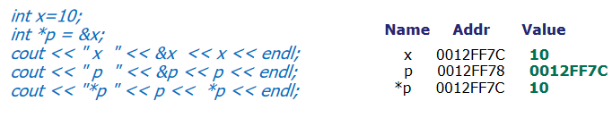

    > 这个是正常的操作，定义x，地址赋值给指针p，输出 x,p,*p的变量名，地址，值

    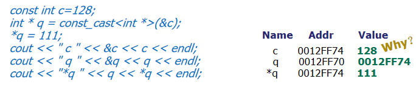

    > 这边则是将常量c的地址（常量指针类型）脱去常量符号赋给一般指针q，通过*q将c实际的值改变了；
    >
    > 在输出结果中可以看到 c和 *q的地址相同，但是二者的值不同
    >
    > 原因在于编译器在编译const int c = 128; 时，直接将程序代码中所有的c都**<u>直接替换</u>**成128，即使c对应地址的数据后面被用指针强行改变，第一行输出语句中输出的还是128，因为那边的c在编译的时候就已经被替换掉了

- 常量指针使用原则：

  - 常量指针可以指向常量或者变量，一般指针只能指向变量，不能指向常量
    - 只有在确认函数不会改变常量的值时，才能将常量的地址脱去常量符号，进而调用以一般指针为参数的函数；否则会导致语义上的bug
  - 要避免函数副作用（不希望函数改变其外部的值）使用常量指针

##### 指针常量

- 格式：<类型> *  const <指针变量>
     必须在定义时初始化 

  > ```c++
  > int  x, y;
  > int * (const p) = &x;  
  > p = &y;     // 错：p的值时常量不可改变
  > *p = 1;     // 对：p指向的内容可以时变量，可以改变
  > ```
  >
  
  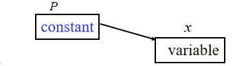


### 指针和数组

#### 一维数组

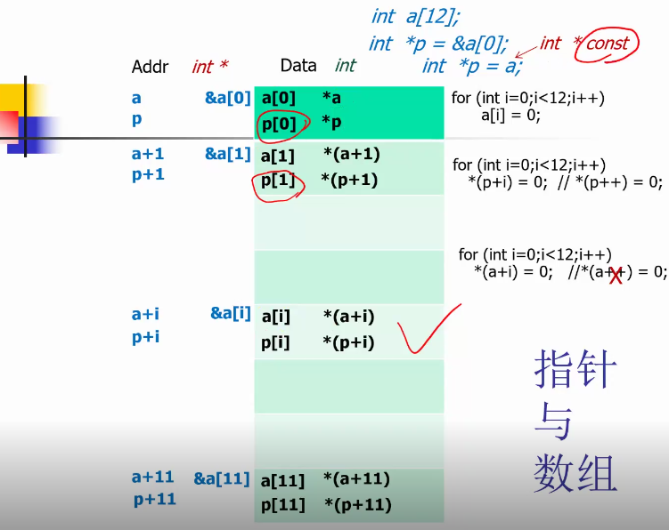

> 绿色区域内部是数组的数值，int类型；那么数组的地址如&a[0],为int*类
>
> 可以通过a[i], *(p+i), \*(p++),*\*(a+i)等方式更新数组，但是不可以使用\*(a++),因为a是一个指针常量，其 不可哥哥该
>
> 实际上a[i]最后的实现都是 变成 *(a+i)来进行，都是指针

通过数组下标的方式进行操作

```c++
int a[12];
for(int i=0;i<n;i++) a[i] = 0;
```

通过指针对数组进行操作

```c++
int *p = &a[0];
for(int i=0;i<n;i++) *(p+i)=0 // 结果等同*(p++)=0，后者p在移动
```

数组类型和指针类型的转化

```c++
int a[8];
sizeof(a); // =8×4=32，这边的a是数组类型
sizeof(a+1) // a用于表达式，转为指针常量类型，其内容为地址，8个字节
int *p = a;// 当数组类型进入表达式中，其类型自动转化为 int * const
void f(int a[],int size); // 这边的a就已经是表达式了
// 所以int a[] == int const * a;不能够直接得到数组的大小
```

#### 二维数组

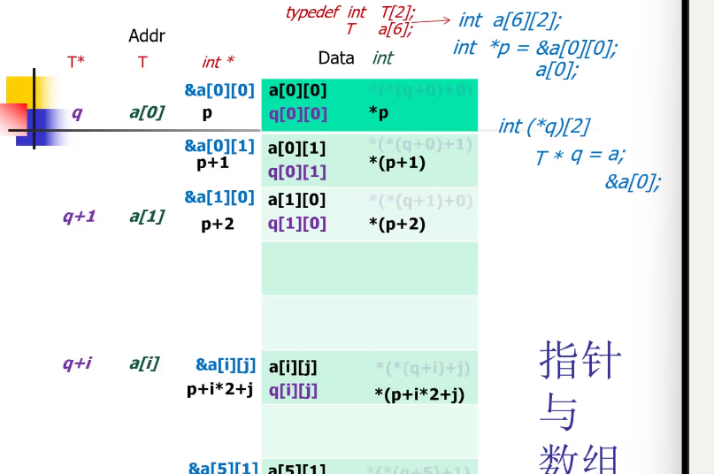

> 和一维数组相同，通过能够通过定义指针p指向数组起始位置即 a[0]\[0]，如果想要访问a[i]\[j],可以通过 *(p+ i\*2 +j)
>
> a[0]是一个 int[2] 的一维数组类型 // int[2]语法不规范，只用于理解  
> 所以 int *p = &a[0]\[0] **<u>实际上等于 int *p = a[0]</u>**,但是“a[0]”这个一维数组实际上空间只有两个，按理来说只有 *p,\*(p+1)使合法的，但是外面可以通过p访问到二维数组全部的12个元素，**这是因为c++允许数组下标越界，不做检查，我们才能实现，越界是一种技巧**
>
> 关于定义一维数组，二维数组指针的详情可以看后面的升降维

#### 一二维总结

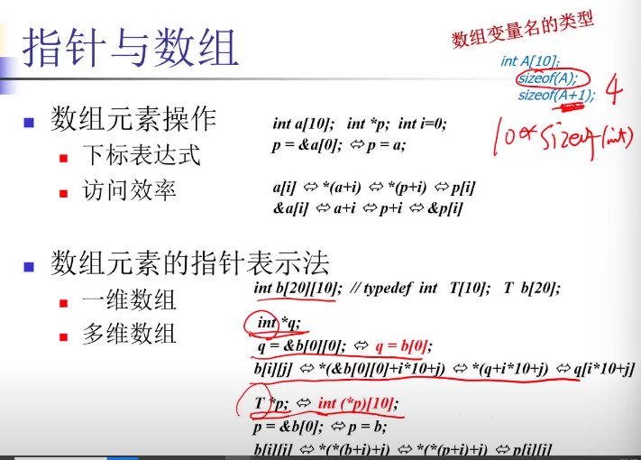

#### 降维和升维

降维：函数需要一维，但是实际中已有的是二维

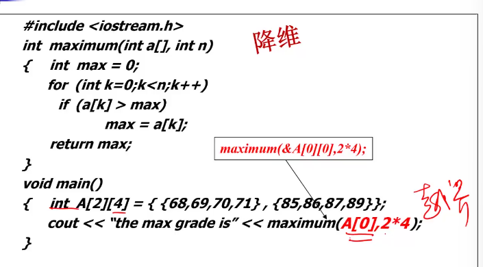

- 通过传入“A[0]” 这个实际空间为4的数组（传入之后就已经变成了指针常量）（ “&A[0]\[0]”表示的也是A[0]数组起始位置的指针常量），以及我们需要的访问size：8.来实现降维，利用到了越界的技巧

升维：函数需要高维，但是实际中已有的是一维

二维数组

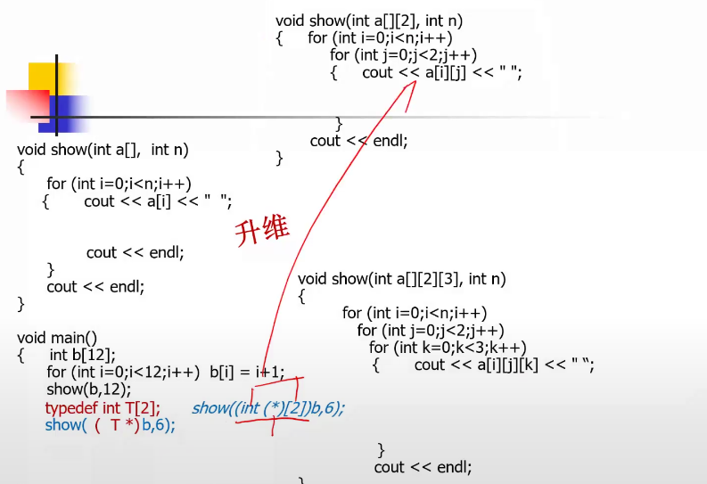

- ==typedef int T[2]== : 该语句的T不是一个变量，其作用是定义了一种指向包括两个int的数组的类型，更形象的写法应该是 typedef int[2] T;但是c++中语法不允许。

- ==(T *)b==：*表示指向，T是指向的类型，T \*表示指向T类型的指针，
  T \* b则是指向T类型的指针b，而T类型是一个 int[2]类型的一维数组，
  b作为指向一个一维数组的指针，自然就是**二维数组类型**

  - 这边的二维数组类型指的是b[0]指向的是第一个T,即b[0]\[0];
    b[1]指向的是第二个T，即b[1]\[0]；b每加一次1，其指向的地址需要加上一个T的大小，一个T是一个int[2]型的一维数组

  因为一个T有两个int，b数组原来一共12个int，所以当将b转化成T *类型后，其大小为 12/2 = 6，所以传入的size为6

- ==(int(*)[2])b==: 作用等于 (T *)b，\*表示指向, int(\*)[2]表示指向的对象是有2个int 的一维数组的指针类型，等价于上面的 T *

- 

三维数组

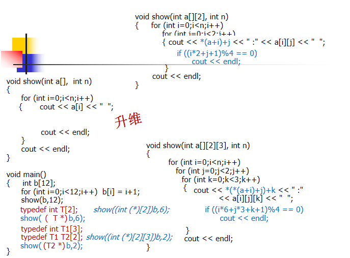

- ==typedef int T1[3]==：作用同上
- ==typedef T1 T2[2]==：同样是定义了一个包括了两个 T1类型的T2类型
- ==i\*6+j\*3+k+1==:  当前指针指向的位置

### 指针数组

#### 概念

数组中的元素为指针
	char  *s1[] = {“C++”, “PASCAL”, “FORTRAN”};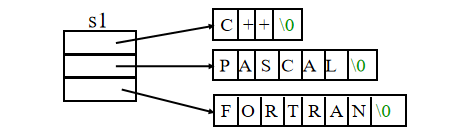

char  s2[][8] = {“C++”,  “PASCAL”, “FORTRAN”};

#### 应用

- main 函数
  - int main(int argc, char *argv[], char *env[])
    - argc: 命令行参数个数
    - argv: 命令行参数
    - env:  环境参数（未知个数，其以null结尾）
- Ex:    c:> ping  -t  192.168.0.1
  - argc : 3
  - argv:  ping / -t / 192.168.0.1
  - env：

### 可变参数

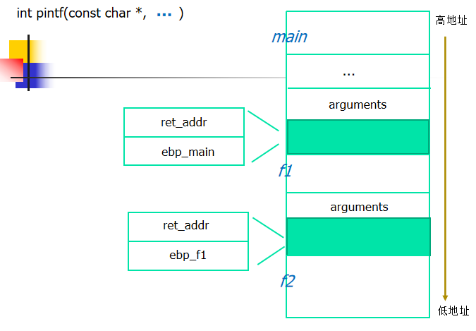

根据第一个参数（必当存在）来判断之后的参数情况

#### 具体实例

定义一个myprint函数

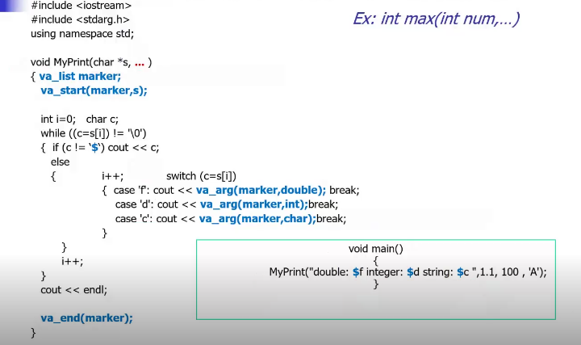

- 使用宏来找参数

  - marker是定义的一个变量
  - va_start 找到变量的起始位置
  - va_arg(market,double) 去拿double给market
  - va_end 结束

- 宏的具体实现

  - va_list: 就是字符指针

    ```c++
    typedef   char *  va_list; 
    ```

  - va_end: 结束，将指针置为0，无效化

    ```c++
    #define  va_end(ap)  ( ap = (va_list)0 )
    ```

  -  va_start(marker,s);：将market放在起始位置上

    ```c++
    #define  va_start(ap,v)                     ( ap = (va_list)&v + _INTSIZEOF(v) )
    // v是最开始的参数，从v的地址开始，加上 INTSIZEOF(v)
    // 为什么不直接用用sizeof(v)?
    // 因为在内存中需要对齐！！！
    ```

  -  va_arg(marker,double):

    ```c++
    #define  va_arg(ap,t)  ( *(t *)((ap += _INTSIZEOF(t)) - _INTSIZEOF(t)) )
    
    ```

  - **_INTSIZEOF(x)**：如何来做对齐

    #define  _INTSIZEOF(x)   
    ( (sizeof(x) + sizeof(int) - 1) & ~(sizeof(int) - 1) )

    - 需要对齐的size是x，要按照int 的方式进行对齐
    - 换成数学表达式就是 **(x+n-1) & (~(n-1))**

  - **(x+n-1) & (~(n-1))**为什么能够实现我们的目标

    - 目标：需要的size是x，对齐的方式以n为基准
      即 X = Q × n + r （-n≤r≤0），重点要求Q
    - C++中存在的表达：A = A/n *n + A % n ???
    - 每太明白，需要再看吧，，，
  
- 格式化串攻击：当传入的参数和第一个参数中定义的不同，可能会更改地址，这称为格式化串攻击。

### 指针和结构

- 结构成分的访问

  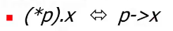

  - p是结构体的一个指针 即 A *p = new A; A当中有x变量

- 结构作为函数参数传输

  - 大块数据传输   使用指针
  - 避免改变结构体内部值，使用常量指针传输
    - void f(const A *p)
  - 提高传输效率

- 多次申请的相同类型的数据空间需要放在同一个容器，典型情况：链表

  - 结构体当中不仅有本身的数据内容，最后肯定还有一个结构体地址类型数据

- 磁盘文件存取，使用FAT：文件分配表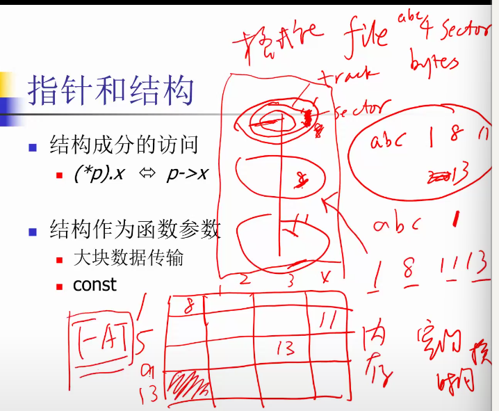

  - FAT是根据硬盘结构决定的，所以其在出厂时就已经确定了

### 指针与函数

- 指针作为形参
  - 提高传输效率
  - 会导致函数副作用
    - 使用常量指针避免
- 函数指针（Function Pointer）
  - 指向函数代码段的指针

#### 函数指针

##### 定义

```c++
double f(int x)  { … }
int g()   { … }
void main()
{
    double (*fp1) (int) = &f; //定义一个函数指针*fp1 指向函数f
    //  等价于  double (*fp1) (int) = f;
    (*fp1)(10); // 调用函数f
    fp1(10); // 等价于上一条语句
    fp = g;  // 函数指针的类型和函数必须相对应
}

```

- 注意 double (\*fp) (int) 中 \*fp的括号不可省略，如果省略 
  double \*fp (int)会被编译器理解为 fp是一个函数原型，其参数是int，返回值是 double*类型
- 也可以通过typedef 直接定义一类函数指针，如

```c++
double f1(int x1){...};
double f2(int x1){...};
double f3(int x1){...};

typedef double (*FP) (int); // 直接定义参数为int，返回值为double类型的函数指针，可以直接定义上面三个函数
FP fp = f1;
fp = f2;
fp = f3;
```

##### 应用

###### 形成框架

在程序执行过程中根据程序逻辑对函数进行调用，对相同接口的函数形成一个框架，当我们想要对当前的服务进行拓展时，只需要修改其中一部分（因为相同接口的函数已经形成了固定框架，不需要再度修改），降低耦合度

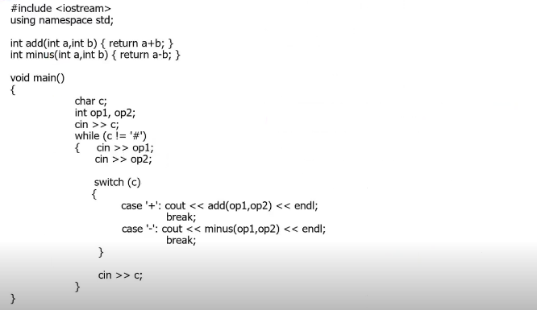

- 上面这段程序实现了根据前缀运算符计算加减并显示结果
- 缺点：耦合度过高，IO操作和计算过程都在main函数内部，难以修改（比如前缀运算改成后缀运算后main得全改），不稳定
- 优化：将IO和运算分离出main函数

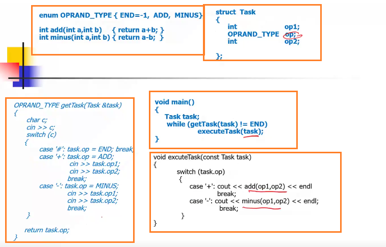

- 上述代码将IO操作交给 getTask,运算操作交给 excuteTask

- 优化：可以利用函数指针再度改进 excute 方法使其更加稳定

  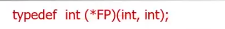

  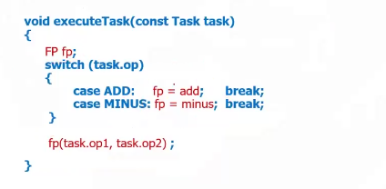

  - 定义函数指针fp，则switch内部只需要改变，fp的指向，后面函数调用的操作统一了

  - 优化：可以使用表驱动的方式进一步改进excute方法、

    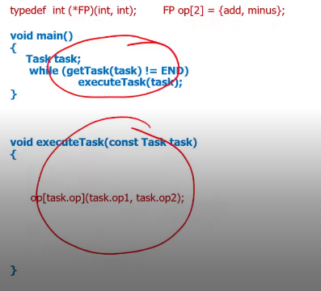

  - 定义一个FP类型数组（函数指针数组），里面存放的内容是需要调用的函数的地址，注意有一个小技巧就是op数组中的函数名 add 和 minus 与enum当中的value: ADD 和MINUS是一样的。

  - op[task.op]\(task.op1, task.op2)

    - task.op 只可能取到 ADD MINUS
    - op根据 task.op在数组内部寻找相同的函数指针
    - 将task.op1, task.op2交给对应的函数

  - 好处：结构稳定，形成框架，excute不需要再度更改，只需要修改其他部分

    - 比如增加乘法 只需要在enum OPRAND_TYPE 中加入 MULT，建立一个函数mult，再在函数指针数组op当中加入op即可

###### 形成泛型

能够使一个函数实现对于不同数据类型的计算！，实现泛型，体现多态（一名多用）

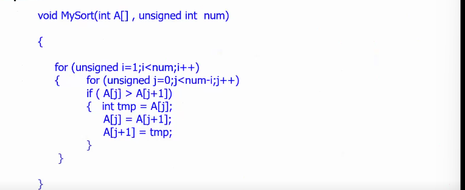

- 这是一个对整数数组进行冒泡排序的函数
- 其数据结构是存放一连串int类型数据的连续空间
- 我们想要将其改造为对任何类型数据都适用的冒泡排序算法，见下

- 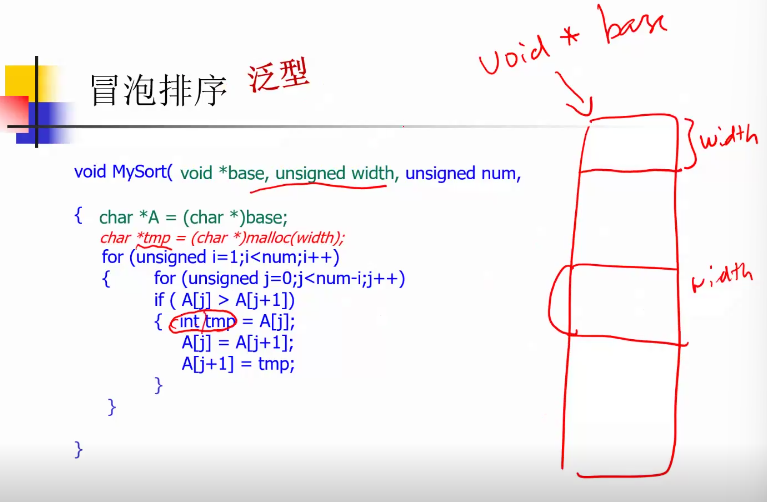

- 同样也是一块连续的空间，但是和int数组

  - 我们不知道数据类型，所以适用 void\* 来表示一段纯粹的地址,

  - 我们不知道数据大小，所以传入参数需要带上width(数据大小)

  - 与拿来定义的temp类型变量是int类型 ，其在编译时就决定好了空间大小，但是现在不知道数据大小，所以需要进行动态分配空间大小char *tmp = (char *)malloc(width); 并在使用完之后释放

  - 因为temp现在是一段内存空间，所以不能简单赋值，需要调用一个memcpy函数进行内存复制

    ```c++
    memcpy(tmp,A+j*width,width);
    memcpy(A+j*width, A+(j+1)*width,width);
    memcpy(A+(j+1)*width,tmp,width);
    ```

  - 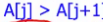这个比较调用函数是不知道谁大谁小的，大小只能由调用者进行判断，所以需要在mysort内部定义一个函数指针，指向比较函数，在比较的时候使用函数进行比较!

    ```c++
    int (*compare)(const void *elem1, const void *elem2))； // 将函数指针作为排序算法的参数传入，这个函数是由调用者定义，可以根据不同的比较方式进行排序!但是传入的指针的参数类型是void，为了泛型！
    compare(A+j*width,A+(j+1)*width)>0)// 在比较的时候使用函数compare 代替简单的 大于小于方式
    ```

修改后的Mysort：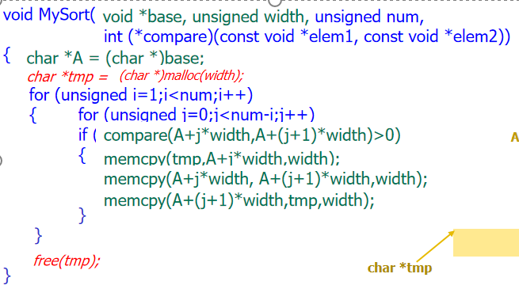

mysort调用

```c++
struct TStudent
{   char name[20];
     int age;
};
TStudent student[] = { … ... };
int num = sizeof(student)/sizeof(student[0]);
int width = sizeof(student[0]);
MySort(student, width, num, icompare);
MySort(student, width, num, scompare); 
int icompare(const void *elem1, const void *elem2)
    // 参数类型必须要和 mysort中函数指针的参数类型相同才能实现调用
{
     TStudent *p1 = (TStudent *)elem1; // 进行类型转换
     TStudent *p2 = (TStudent *)elem2;

      return p1->age - p2->age; // 进行自己的比较
}
int scompare(const void *elem1, const void *elem2)
{   TStudent *p1 = (TStudent *)elem1;
     TStudent *p2 = (TStudent *)elem2;

      return strcmp(p1->name, p2->name);
}


```

###### 计算定积分？

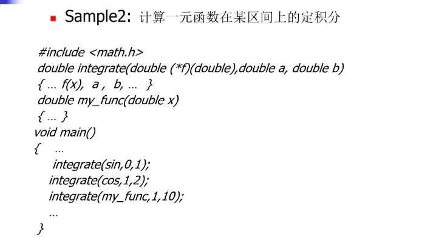

### 多级指针

- 基类型为指针类型
- 编写一个函数，交换两个字符串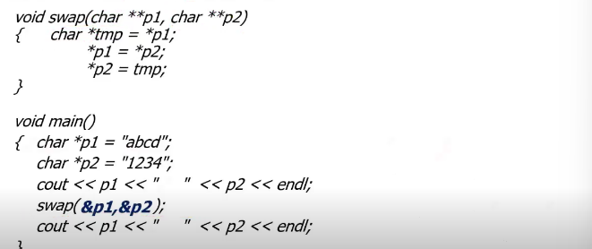
  - 和int类型的交换一样，想要交换字符串，实际上就是交换p1,p2地址中的内容（对应字符串的地址），那么就将p1，p2的地址传入swap函数，p1，p2本身就是字符指针类型，指针的地址就是字符指针的指针类型，即为 char **p1(可以理解成
    char\* (\*p)指向\*p的指针)，再对二者的值进行交换
  - 问题：能够对两个char数组类型的数组p1，p2进行交换吗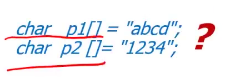
    - 数组被创建后，其地址是不能被移动的，所以不行？

### 引用  — &

- 定义：为一块已有空间取一个别名

  - int y=0; int &x = y;
    - x的地址 = y，那么就是x的内容和y的内容相同
    -  y空间值为0，x指向y空间，x的值也为0，x是y的别名
  - 引用变量和被引用变量，必须是同类型

- 引用与函数，返回引用实际上是返回地址

  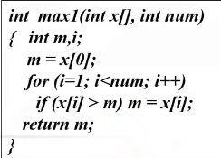

  - 这个返回的是其最大值，只能够得到最大值但是不能对其进行修改

    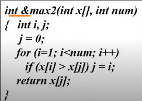

  - 这个函数返回的是最大值的引用（其实就是最大值所咋的地址空间），可以通过返回的引用对齐最大值进行修改，如：max2(a,16) = -1 将其原本的最大值的空间的值改为-1

  - 注意：返回类型为引用的是不能返回局部变量的，因为局部变量的生命周期只存在于函数调用时，当函数调用结束后，其生命周期也结束了，即其地址和地址对应的值已经被废弃了，返回其地址并对其进行修改显然没啥用

- 返回引用的作用

  - 应用于操作符重载，OO中会提到！


## 7. 动态变量

动态变量：变量大小和生命周期是动态的，非编译时刻确定，锁着程序运行的过程中而确定，存储在heap中

### 申请

#### C++

- new  <类型名>

  - new int; 创建一个整型空间
  - int *p = new int; 创建指针指向这块空间

  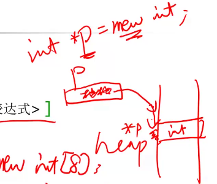

- new  <类型名> [ <整型表达式> ]

  - new int[18]; 创建了一个有18个int 的空间

  - int *q = new int[18]; q指向该块空间的起始位置

  - 注意C++中没有 类似于：new int[2]\[2]的东西，要创建多维数组，得先创建一维数组，在进行升维

    ```c++
    // 一维数组的访问过程
    int *p = new int[10];
    for (int i=0;i<10;i++)
        p[i] = i+1;
    // 二维数组的升维与访问
    // 方法1： 直接定义
    // 这边需要注意(int (*)[5])时一个类型(指向含有5个int 的指针类型)，等式左边的q是对应类型的变量
    int (*q)[5] = (int (*)[5])p; // 
    
    for (int j=0;j<2;j++)
    {   for (int k=0;k<5;k++)
            cout << q[j][k] << "   ";
        cout << endl;
    }
    
    // 方法2：通过typedef
    typedef int i5Array [5];
    void main()
    {   
       i5Array *p = new i5Array [2];
         for (int j=0;j<2;j++)
             for (int k=0;k<5;k++)
                  p[j][k]  = (j*5)+(k+1);
    }
    
    ```

  - 申请空间可能会被系统拒绝，所以一定要对指针做有效性判断（手动判断其是否为null），然后才决定是否使用

  - 在有效性判断的更近一步的是 异常处理：即当面对无法避免的问题即异常（socket连接数慢， 文件损坏，申请空间被拒等）时，程序需要有一套处理方案

    - 申请空间被拒的情况
      - c++有自己的异常处理 — std:: bad_alloc
      - 我们也可以自己写异常处理

#### C

C当中是通过malloc函数来进行申请空间

```c
malloc
void * malloc (unsigned int size)
p = (int *)malloc(sizeof(int));	  //new int 
q = (int *)malloc(sizeof(int)*20);    //new int [20]
```

- 注意 malloc的参数直接是所需要字节的大小，是一个数字
- malloc 的返回值是 void *，所以要想对这块内存空间进行操作的话，得做强制类型转换

#### C 与C++的区别

- 语法
- 语义：
  - C++当中使用 new <类型名> 会调用这个类型的构造函数，保证这个对象处于**有效状态**
  - C中使用malloc只是分配空间，不会调用构造函数

### 归还

#### 操作符 c++

- new － delete

  ```c++
  int *p = new int;
  delete p;
  ```

- new [] — delete []

  ```c++
  A *p = new A[10]; // A是我们自己定义对象，有构造函数和析构函数
  delete[] p; // 只有通过 delete[] A才能在归还内存的同时并且逐个调用其析构函数，调用十次；而如果是delete A则只归还内存而不调用析构函数
  ```

  - 为什么定义的时候有定义空间为 10，但是归还的时候不写
    delete [10] 而直接写 delete []就可以呢，它怎么知道我们要归还多少空间呢？
  - 使用**cookie**，当我们申请一个动态变量int *p = new int [10]定义了它的大小，我们在heap区开了一个空间，然后在这个空间的头上放这个空间的size即10，这个空间的值就叫做cookie；当归还这个空间的时候，我们就以p地址为起点，p地址上一个地址的值为size，归还下面的空间
    - 而这也就要求了，申请空间时候使用的指针不可更改，不然之后没法归还

#### 函数 C

- malloc — free

  

### 动态变量的应用  — 链表

- 数据结构

  - 链表（单、双） —— 栈，队列
    - 在头部插入形成栈，尾部插入形成队列
  - 树，图
    - 结构体中的节点指向两个结构体形成树

- 结点的定义

  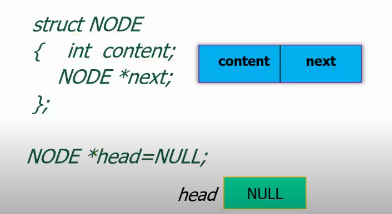

#### 链表操作

- 表头插入

  p->next = head;
   head = p;

  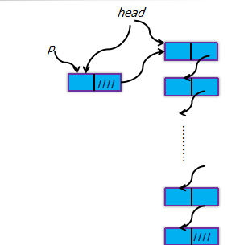

- 表尾插入

  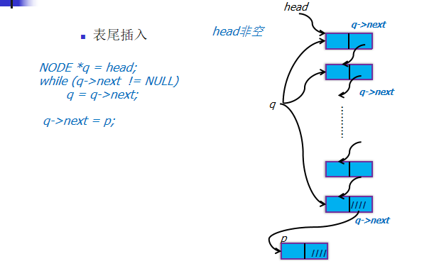

- 插在某节点（值为a）的后面

  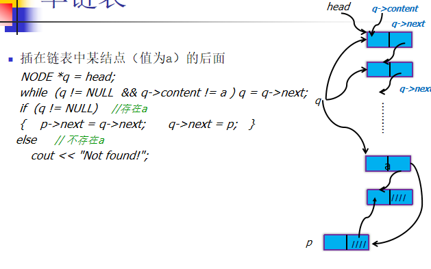

  > 插入如此麻烦，为什么需要插入呢；因为链表需要满足序的要求，在这种要求下，其查找速度会快得多，但是增删效率降低，二者成反比

- 插在某节点（值为a）的前面（前面就用两个指针就行）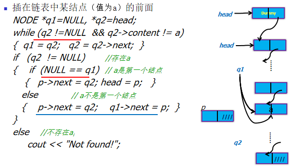

  > 这边需要反复判断q2 != null是因为这个可能是一个空表，头指针指向null，而调用空指针会产生exception错误；我们可以使得头指针指向我们自己定义的一个无意义但是有值的指针记作dunmming，dunmming的next才指向真实的数据指针，那么头指针就必定不为空， 也就不需要判断了，空间换时间

- 结点删除：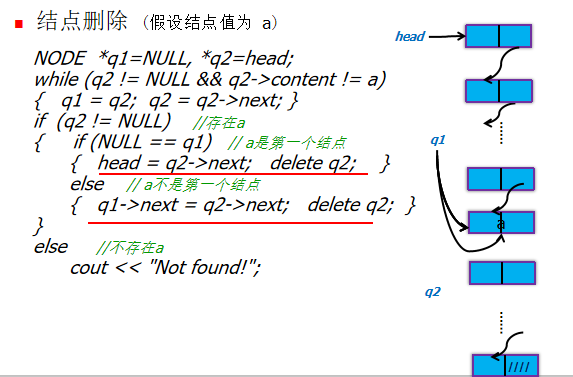

  

#### 单向排序链

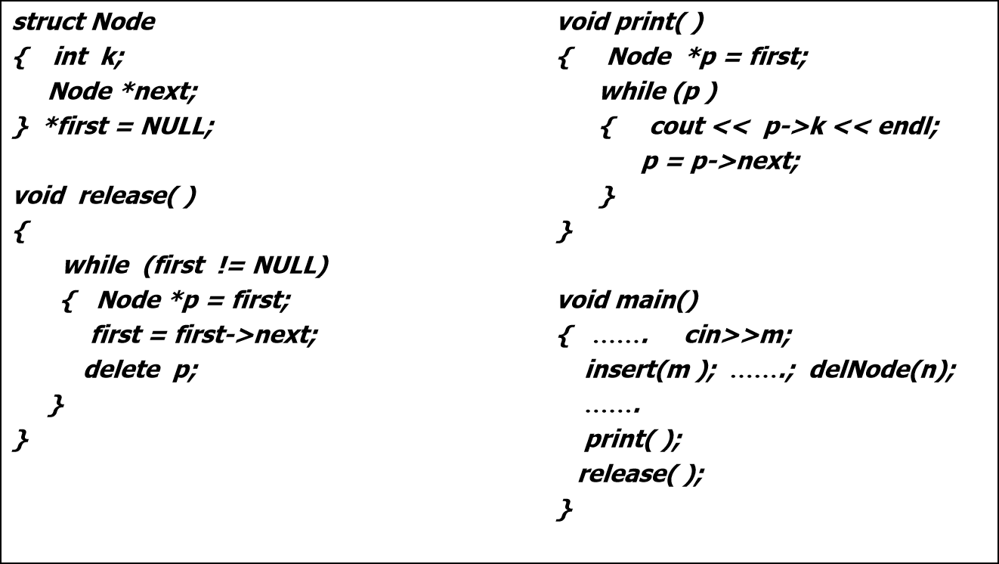

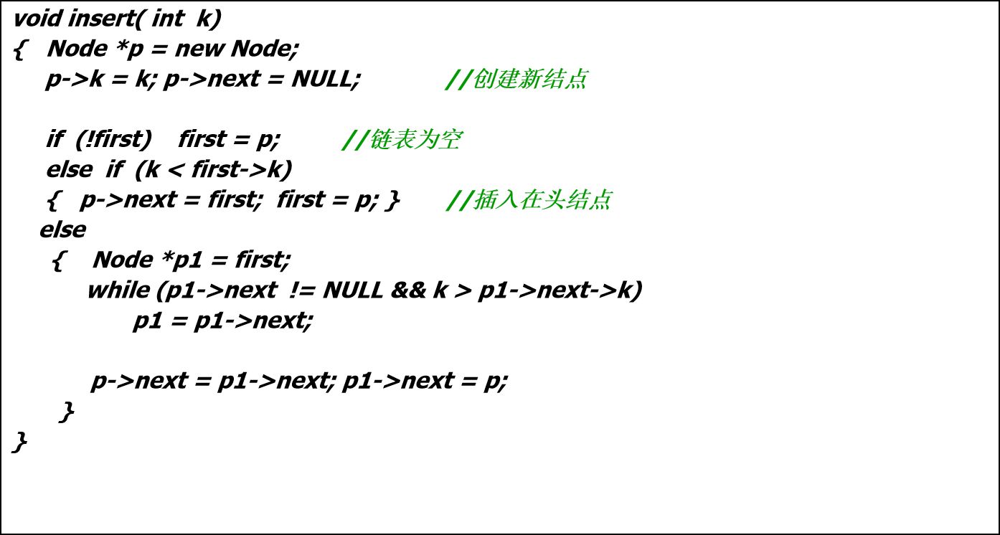


