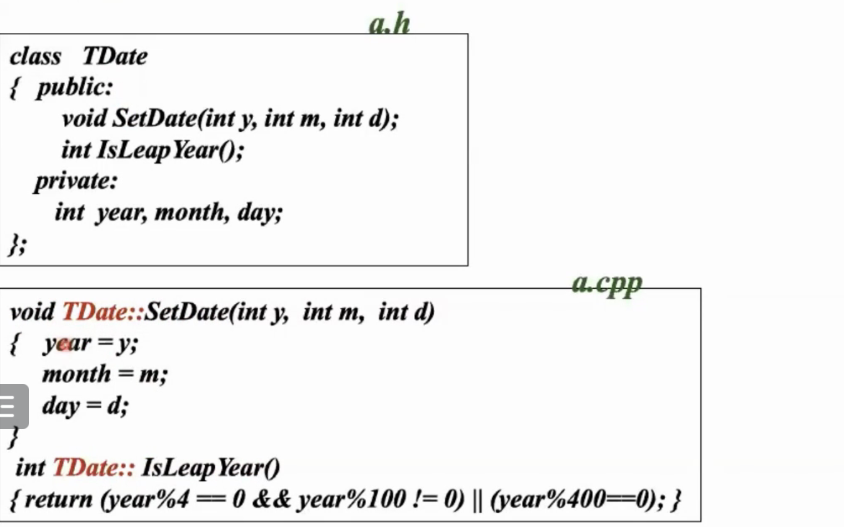
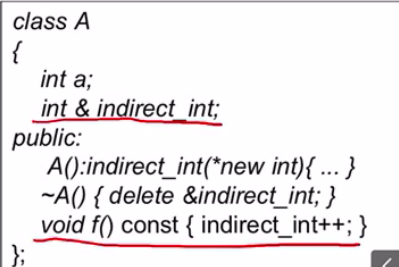
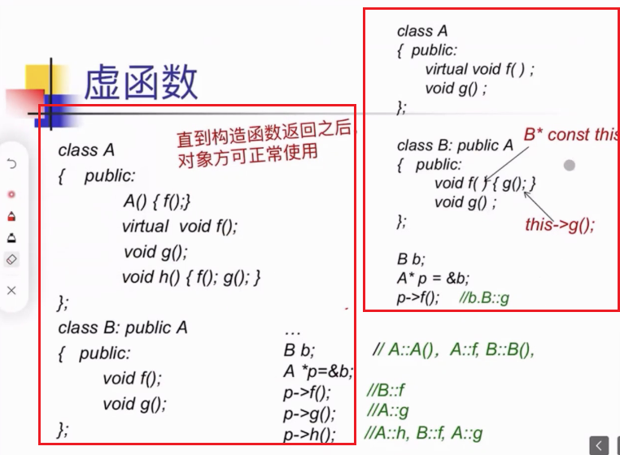

一 OO存在必要性

## 1. 结构体的弊端

使用结构体实现ADT抽象数据类型的不足


- 其必须得要进行top的初始化，不然在pop的时候会存在安全隐患
  - 其不能够再语言层面进行消除隐患，而需要手动消除
- 我们能够直接对结构体的内容进行操作，而不用使用 push，pop函数
  - 因为struct的变量是public的

## 2. OO solution


- 使用面对对象语句，编译器能够保证：构造函数在类构造时一定会被调用，私有变量不能被类外的方法进行访问
- 在调用面对对象语句时，其最后执行的语句还是结构化编程语句
  - 比如面向对象的构造函数中的语句，其在构造类的时候会自动加在后面
  - 面向对象语句实际上只是给程序员看的罢了
- 成员函数的参数中会自动省略一个指针：this，指向当前的类的实例
- 封装：将数据和方法封装起来，隐藏内部实现，通过外部接口被使用
  - 降低类间的耦合度
  - 便于程序理解
  - 便于内部变量控制（只要不影响对外接口的实现即可）


## 3. Why OO


## 3. 十个问题

1. 当类未自主定义构造函数，compiler会**提供默认的构造函数**，为什么？定义了一个空的类，编译器编译后会往里面加些什么？

2. **when** 类的构造函数析构函数被定义未 **private**？
   友元，static成员的使用，**when**？

3. **why** 引入成员初始化表？（用于初始化成员变量）
   **why** 初始化表执行次序 只和 类数据成员的定义次序相关？

4. **why** 引入copy构造函数、“=” 操作符重载？

   1. struct中变量默认public，class中默认未private
   2. 在结构体中没有定义 “=”操作符运算，但是compiler会在外面对结构体赋值时，调用重载的“=”。但是有时候 重载的“=”时不够的，要知道它有什么，它欠缺在哪里？
   3. A a = b;是赋值构造函数 ，A a; a=b，是操作符重载，为什么？

5. **what**  is **Late Binding**？c++是怎么实现虚函数（**vitural**）？

6. **when** 使用虚函数

   ```c++
   class Shape 
           {    public:
            virtual void draw() const = 0;
            virtual void error(const string& msg);
            int objectID() const;
    };
   // 什么时候使用？？
   ```

7. **What** public继承和non-public继承means？

8. **why** “=、( )、[ ]、->”不能作为全局函数重载？

9. **when** 成员函数能够返回 &（引用）？

10. **when** and **how** to 重载 **new**、**delete**？

    1. 什么时候需要自己写new 和delet 的方法？
    2. 要怎么写？


# 二 OOP概述

## 1. 概念

1. Program = Object<sub>1</sub> + Object<sub>2</sub> + ... + Object<sub>n</sub>
2. 对象:数据 + 操作
3. 信息:函数调用
4. 类

## 2. 分类

- 面向对象的程序设计 （object-Oriented）
- 基于对象的程序设计 （object-Based）
  - 面向对象去掉继承能力就是基于对象
  - 相当于是只把数据和方法封装起来直接用

## 3. 封装

### 3.1 类

- 类包括成员变量和成员函数

- 其需要在头文件中声明，在源文件中定义实现

- 为了将源文件的方法和头文件的类联系起来，使用“::”进行声明

  

  - 如果将一个方法的定义放在头文件中，会**建议**编译器将我这个类中的函数当作 **内联(inline)** 函数，如下图 setDate和IsLeapYear定义在头文件中，如果合理的话编译器会将其当作内联函数，在调用的时候直接将调用函数的语句勇函数题体进行替换，从而省去调用函数产生的开销，提高效率。

    

- 

  - 当声明 Tdata g 后g就已经是一个Tdata类型的对象，可以通过点运算符进行调用成员变量和方法
  - 而声明 Tdata *p = new Tdata，p是一个指向Tdate对象的指针，需要使用 -> 运算符进行调用
    - 注意java中声明类是通过指针实现，每次声明对象都得new一块空间

### 3.2 构造函数

构造函数是类的一部分

- 用于对象初始化

- 描述

  - 与类同名，无返回类型
  - 自动调用，不可直接调用、
  - 可重载
  - 当类中未提供构造函数时，编译系统提供**默认构造函数**
    - 默认构造函数作用：栈、堆中的变量都是不确定的，只有却拒比那辆和局部静态变量会被初始化为0。而默认构造函数则是实现堆当前对象的初始化，在定义时会被创建标识符，提供内存空间**？？？？**
    - 当没有构造函数的话，其内存是不确定了，不足以构成一个完整的对象
    - 当程序员自己写了构造函数（不管有参没参），编译系统就不再提供默认构造函数
  - 构造函数一般定义为public
    - 也可以**定义为private**，定义后可以实现单例多例等情况：因为构造函数时private，所以只能通过类内定义方法来构造类的对象，而这个方法中除了构造就还可以加入些其他操作，比如限定对象个数等等

- 调用

  - 自动调用：

    ```c++
    class A
    	{   …
    	  public:
    		A();
    		A(int i);
    		A(char *p);
    	};
    A a10=A(1); A a11(1); A a11 = 1; //调A(int i)
    A a20=A;    A a21;               //调A()
    A a30=A(“abcd”); A a31(“abcd”); A a32=“abcd”; 
    A a[4]; 	//调用a[0]、a[1]、a[2]、a[3]的A()
    A b[5]={ A(), A(1), A("abcd"), 2, "xyz“ };
    
    ```

#### 构造函数的补充：成员初始化表

- 成员初始化表

  - 是构造函数的补充，是在对象初始化的时候同时赋值，而构造函数则是在初始化后进行二次赋值

  - 执行：

    - 先于构造函数体

    - **按类数据成员声明次序**执行

      

      - 这边的 “y(1), z(x), x(0)” 就是成员初始化表
      - 其顺序是按照“x(0). y(1), z(x), ”执行

- 为什么需要成员初始化表，不能直接在类的内部进行定义吗？

  - C98规定，只有类的静态变量能够直接进行值的定义

- 那么不能再构造函数中定义吗？可以时可以，但是效率较低

  - 当我们在构造函数中进成员变量进行赋值时，需要两次操作
    - 首先创建类时，会为x分配内存空间
    - 之后才进行构造函数中的x的赋值
  - 而使用成员初始化表只需要一次操作，在分配空间的时候同时赋值，提高效率

- 成员初始化表的应用：初始化成员变量

  - ？？？？？

- 在构造函数中尽量使用成员初始化表取代赋值动作

  - const 成员/reference 成员/对象成员
    - 因为他们没办法在构造函数中进行赋值
  - 效率高
  - 数据成员太多或者构造函数太多时，不采用本条准则
    - 因为每个构造函数都得写一次，难以维护
    - 降低可维护性

### 3.3 析构函数

- 格式:`~<类名>()`
- 功能:RAII:Resource Acquisition Is Initialization(资源获取即初始化)，**释放对象持有的非内存资源**
- 析构函数的作用：其会自然地释放自己对象所占的内存，需要我们自己做的就是释放对象在创建后获得的其他资源（比如和数据库的连接，其中的成员对象）
- 类的析构函数的调用：
  1. 如果对象是创建在栈上的（比如在main函数，全局中直接创建 即 A a1(1)这样的形式），那么当函数调用或进程结束后，对象会自动消亡，此时系统会自动调用对象的析构函数
     1. 注意如果对象创建在堆上则不会
  2. 可以直接的通过delete关键字进行调用

#### 与Java的GC机制对比（待补充）

- java垃圾回收机制：其只能够自动回收分配出去的内存，而无法回收对象在创建后新占用的资源（比如和数据库的连接….）如果想要啊主动收回的话，可以使用finalize()???
  - sss
  - sss
  - sss
- C++的垃圾回收机制
- 、

#### Private的析构函数

- 其目的是实现 *强制自主控制对象存储分配*

- 即强制其通过指针形式创建，即创建在堆上，因为C++的类的特点是创建在栈上的类的对象肯定会消亡，会调用其析构函数，但是析构函数私有无法调用，所以当想要声明一个创建在栈上的，析构函数为私有的对象时，系统会报错并拒绝，能够保证其只能通过指针形式创建使之存在于堆上

  - 创建的堆上的形式可以时： A* p = new A(1);
  - 其需要删除时，不能 delete p，因为这个会调用p指向对象的A的析构函数，实际上其私有无法调用
  - 要实现删除作用，只能在类A内定义一个destroy函数，删除时进行 p -> destroy();

- 适用于内存栈较小的嵌入式系统，以及需要将很大的对象强制分配在堆上的情况

- ```c++
  class A{
      public:
          A();
          void destroy(){delete this;}
      private:
          ~A();
  };
  //析构函数私有，无法声明
  A a;
  int main(){
      A aa;//析构函数私有，无法声明
  };
  A *p = new A;//在堆上声明，在堆上声明的是不会自动消亡的，所以不需要调用其析构函数，所以能够实现，如果需要删除，调用类内自己定义的destroy函数
  delete p;//错误
  p->destroy();//可能出现p的null空指针问题
  ```

  

### 3.4 拷贝构造函数

- 创建对象时，对一同类的对象使其初始化

- 自动调用

- 如果未自主定义拷贝函数，其会调用默认默认拷贝函数，即将对象间的成员变量直接进行赋值，如果时成员对象的话，那么会调用成员对象**默认构造函数**生成的对象进行赋值

- 拷贝构造函数的实现：
  - 需要 const，因为拷贝的过程不能改变被拷贝的对象
  - 需要 & 引用，因为？？？？
  - 没写的话编译器中会调用默认的拷贝函数
  
- 使用场景：
  - 同类对象的赋值
  - 作为参数传入
  - 作为返回值返
  
- 拷贝函数的局限性
  
- ```c++
  String genrate(){
  	return string("test")
  }
  string S = generate()
  //这段代码中会调用三次拷贝构造函数，效率较低
  ```

### 3.5 移动构造函数

想法：对于需要赋值的string和被赋值的string的成员变量和对象进行**移动**


```c++
String genrate(){
	return string("test");
}
string::string(String&& s):p(s.p){s.p = nullptr};
// 移动构造函数同样是string类的构造函数
// string("test")时传入的参数是一个右值！他可以调用拷贝构造函数(相当于是给这个临时变量test起一个变量名，使用参数)，也可以调用上面的移动构造函数(因为它的参数是一个右值引用
// 当调用了移动构造函数后，其就只是将原来的string类型对象中的成员变量的指针交给了新的对象，在将其指针置空，只移动，b
```

- 使用**右值引用** A&&
  - 通常的 左值引用A& a = a0，相当于，是定义了变量的别名，而变量通常作为左值，所以是左值引用
  - 而右值引用？？？？
-  五三原则：如果移动构造函数，拷贝构造函数，析构函数中有一个函数自定义了，其他两个都不会合成，如果都没自定义系统才会都使用默认的
  - 如果自定义了析构函数，说明该对象有申请了额外资源需要进行释放，而默认的移动构造函数只能移动其原始声明的变量，是无法实现全部需求
  - 如果自定义了拷贝构造函数，说明赋值的过程已经自定义了，那那么同样实现赋值效果的默认移动构造函数可能会和自定义的拷贝构造函数发生冲突

### 3.6 成员变量

#### const成员变量

- const表示这个成员变量在当前对象的存活期间是不变的，但是对象和对象之间的const成员变量可以不同
  - const要求在变量定义的时候就进行初始化
  - 其可以放在成员初始化表中进行初始化（因为成员初始化表中实在函数构造的同时进行初始化的）
- 如果想要所有对象共享一份const成员变量，可以使用 static const成员变量
  - 其初始化必须要要在定义的时候进行，因为其要求所有类的对象都使用同一份值，且const要求在初始化的时候旧进行定义，所以只能在定义的时候就初始化了

#### const成员函数


- 定义了const A 的对象 a，表示a是一个const A类型，表示其内的成员变量是不能改变的

- 但是上述代码能够通过编译，是因为对于自定义函数是无法检测完整其是否改变了变量的值

  - 比如上图类的声明式在A.h文件中，类方法的实现是在 A.cpp文件中，创建A的常量对象的代码是在B.cpp文件中，但是当B.cpp只include了A.h文件的话，其能够通过编译，因为它不知道A.cpp中有方法会改变其成员变量的值

- 解决方法：在类A内的方法加上const关键字，当声明为const A类型的对象调用非const 方法时 会报错

  

- 注意1：如果将类内非“const”的方法（会改变对象成员变量的值）加上const关键字，编译器会进行检查报错

  - 实现方法：
  - 在函数未加 const时，其默认传入参数是 `A* const this`
    加const，默认传入参数是 `const A* const this` 
  - `A* const this` 表示this指针的内容是不可更改的
    `const A* const this` 还要求了this指向的对象的内容不可修改
  - 因此当函数加上const标识符，其就能够被const对象所调用
  - 另一种方面上，使用const-cast <A*> (this) 也能够在show方法内将this的const丢掉，进而能够修改成员变量的值

- 注意2：函数被声明为const后，是不是就无法修改任何成员变量呢？

  - 
  - 引用是不能被更改的，所以其需要在初始化的时候进行定义
  - `void f() const {inderect_int++}`是不会报错的！
    - 因为inderect_int实际上是 *new int，是堆上的一块空间的别名，所以 inderect_int++实际上是改变其空间内对应的值，而不改变inderect_int自身，不违反const要求

- mutable：当成员变量加上mutable后，const 成员方法能够对其修改

#### 静态成员

- 静态成员
  - 类刻画了一组具有相同属性的对象，使得不同实例都能够使用
  - 对象是类的实例

##### 静态成员变量

```c++
class A
	{    int   x,y;
	     static int shared;
        .....
	};
	int A::shared=0;
	A a, b;

```

- static成员变量是直接在全局数据区创建，是编译后就已经存在，程序结束后才进行销毁
- 其是类对象所共享，唯一拷贝，遵循类访问控制的
- 静态成员变量定义：头文件中定义类，在实现文件中定义其static变量
  - 如果将static定义在头文件中，其在被引入后会被反复定义，不合适
  - 特例：const static 变量由于const要求，必须在类声明的时候就进行定义，即头文件中定义

##### 静态成员函数

```c++
class A
	{    static int shared;
	     int x;
	 public:
	     static void f() { …shared…}
	     void q() { …x…shared…}
	};

```

- **只能存取静态成员变量，调用静态成员函数**
- 遵循类的调用原则

##### 静态成员的使用

- 通过对象使用
  - `A a; a.f();`
- 通过类使用
  - `A::f();`
  - 这是因为C++中有一个观点：类也是对象，所以可以直接调用

##### 静态成员的用处

- 最为所有实例共享的一个统计量
  - 
  - 为什么定义的时候需要加一个 int？
- 控制对象的创建— singleton
  - 
  - 将构造函数设置为private，类外部无法直接访问，只能使用静态成员变量来存储，使用静态成员函数来控制，在函数中设计自己的业务逻辑，实现单例的类
  - 这段代码只能保证在单线程的单例，多线程并发无法保证
  - 资源控制原则：谁创建，谁归还：类内有创建的方法也应该有归还的方法，而不能直接在外面直接delete

#### 友元

- 基础知识：类外不能直接访问该类的private成员

  - 其能实现封装，降低类间耦合度
  - 需要通过该类的public方法(如get，set)
  - 因需要反复调用函数(保存现场，调用，恢复现场)其**访问效率较低**，缺乏灵活性

- 例子：

  ```c++
  class Matrix
  {     
    int  *p_data;
    int   lin,col;
    public:
       Matrix(int l, int c) 
       {   
           lin = l;
           col = c;
           p_data = new int[lin*col];
        }
       ~Matrix() { delete []p_data; }
   
       int &element(int i, int j)
       {return *(p_data+i*col+j);}
  
       void dimension(int &l, int &c)
       {   
           l = lin;
           c = col;
        }
  
        void display()
       {   int *p=p_data; 
           for (int i=0; i<lin; i++)
           {   for (int j=0; j<col; j++)
               {  cout << *p << ' ';
                  p++;
               }
               cout << endl;
           }
       };
  
  
  
  ```

- 定义：被定义为某个类的友元的函数、类、成员函数能够直接访问该类的私有变量

- 分类

  - 友元函数
  - 友元类：概念上分开，数据访问一致
  - 友元类成员函数

- 作用

  - 提高程序设计灵活性
  - 是数据保护和对数据存取效率之间的一个这种

- 使用方法

  - 
  - `friend void func()` func是A的友元函数，实际程序中其无需声明，而可以直接定义是友元函数，在定义的时候其会自动引用`extern void func()` ，但是基本上还是遵循先声明后使用原则
  - `friend class B` B是类A的友元类，B可以使用A的成员变量
  - `friend void C::f()` C的成员函数是A的友元类成员函数

- 问题解决方法

  - 
  - 因为在类 Matrix的友元函数 multiply 中使用到 Vector对象未在前声明，所以编译不能通过，需要在最顶上声明：class Vector;
  - 又因为Vector只进行声明，不清楚实际空间大小，所以在类 Matrix的友元函数 multiply 中的Vector对象只能使用引用方式，即 `Vector &v`，这是因为引用本身大小是固定的

- 问题：互为友元类

  - 
  - 需要先声明后使用，类A前需进行B的声明，且show方法参数应该使用B的引用
  - 类A，类B只能一个include另外一个，而不能双方include彼此
  - 使用show方法应当在源代码文件中进行，必须A，B类都声明且实现后才可使用

#### 成员变量封装原则


- 接口完满：能够偶提供 其他类需要的所有变量
- 接口最小化：在完满的基础上提供的接口数量最少

## 4. 动态内存

### 4.1 动态对象

- 在heap中创建

- new|delete 

  - 这两个是操作符，C++中的操作符是可以重写的，比如可以从指定的空间中返回一块内存

  - C++主要使用new|delete 而不使用 malloc|free，因为后者只是申请一块内存，而无法调用其构造函数

  - 引入new|delete 的目的就是：申请内存同时调用构造函数，删除内存同时调用析构函数

  - 例子：

    ```c++
    A *p,*q;
    p = new A;     
    //在程序的heap中申请一块大小为sizeof(A)的内存
    //调用A的默认构造函数对该空间上的对象初始化
    //返回创建的对象的地址并赋值给p
    
    q = new A(1);   
    ……	
    //调用A的另一个构造函数 A::A(int)
    ……
    
    delete  p; 	
    //调用p所指向的对象的析构函数
    //释放对象空间
    	  delete q;	
    
    ```

#### 创建对象

- new
  - 能够和初始数据类型(Primitives)一起使用 
    - 如int* intPtr = new int；//创建在heap堆中的int对象
- 注意创建在堆上的对象都是**无名对象**，需要一个指针指向他们，并且指针大小固定，而栈上创建的对象无需指针，他们是存在“名字”的
  - 这个可能是因为堆上开辟空间是无序的，需要指针
  - 而栈是按照顺序入栈出栈的，所以可以根据名字找到对应的数据

#### 删除对象

- delete
  - call
  - 能够作用于基础数据类型和类
- 语法
  - delete ptrName
- ex.
  - delete intPtr;
  - intPtr = NULL;
- 注意事项：
  - 通过上面例子可以看到，在delete指针后需要将指针置为NULL
    - 因为在声明对象的时候是申请了两块空间：对象空间指针空间
    - 当删除对象时清空指针，能够防止很多内存安全问题，如当未清空旧指针时，其指向的空间有了新对象，用旧指针操作新对象就会出错
  - 当使用void* p指针指向对象，选哟 delete p时，系统只会清楚p的内存空间，而不会调用析构函数，因为不知道p的类型（c++中类型时非常重要的。不知道类型很多东西都没法做）

### 4.2 动态对象数组

#### 动态一维数组

- 动态对象数组的创建与撤销

  - A* p；
    p = new A[100]
    **delete[] p**

- 注意：

  - 不能显示初始化，相应的类必须要有默认构造函数

    - C++11标准中只能加了显示初始化能力，如下图

      所以不一定非得有默认构造函数了

  - delete中的[]不能省

    - 一开始创建对象数组的时候会在其顶部存放四个字节的数组大小，上面就是100
      - 而创建单个对象的时候不会？
      - 管理内存的时候需要额外记录内存的大小
        - malloc分配空间也会记录空间大小
      - 管理对象的时候需要额外记录对象的多少
    - 而使用delete[] p则实际删除的起始地址时p-4byte，其会先得到数组大小，依次删除这100个A对象以及调用析构函数
    - 如果没有[]的话，只是 delete p会有两个问题
      - 系统会将p当成指向一个对象即A[0]对象的指针，从而只删除 A[0]对象的内存空间和调用其析构函数，无法删除剩余对象的空间
      - 其无法删除顶部四个字节大小的内存空间？？存疑

#### 动态二维数组

##### 二维数组

- 创建

  - 分配行数
  - 对每一行分配相应的列数

  

  ```c++
  const int ROWS = 3; 
  const int COLUMNS = 4;
   
  char **chArray2; 
  
  // allocate the rows 
  chArray2 = new char* [ ROWS ]; 
  
  // allocate the (pointer) elements for each row 
  for (int row = 0; row < ROWS; row++ ) 
  	chArray2[ row ] = new char[ COLUMNS ]; 
  
  ```

- 删除

  - 

  ```c++
  for (int row = 0; row < ROWS; row++) 
  { 
  	delete [ ] chArray2[ row ]; 
  	chArray2[ row ] = NULL; 
  } 
  delete [ ] chArray2; 
  chArray2 = NULL;
  ```

- 局限性：存在额外的内存开销，即上图的粉色部分，解决方法，使用一维数组模拟多维数组

##### 一维数组模拟二维数组

```c++
int* i = new int[12];
// 则i[i][j] -> i[i*4+j]
// 如果还想要用i[i][j]的形式来访问其值，可以通过符号重载
```

# 四 继承

## 1. 继承

### 1.1 继承机制

- **基于对目标代码的复用**
- 对事物进行分类
  - 派生类(子类)是基类(父类)的具体化
    - 也就是说子类和父类有很深的耦合度，因此父类必须要稳定不能改变
    - 因此父类包括实现和接口，其中接口只提供声明不提供具体实现更加稳定
  - 把事务以层次结构表示出来，有利于描述和解决问题
- 能够实现增量开发
  - 需要新增功能只需要在父类的基础上新增即可

### 1.2 派生类对象的初始化

- 派生类对象初始化
  - 由派生类和基类共同完成
- 构造函数的执行次序
  - 基类的构造函数	
  - 派生类对象成员类的构造函数
    - 有多个的话就按照声明顺序来 
  - 派生类的构造函数
- 析构函数的执行次序
  - 和构造函数的执行次序相反

#### 基类构造函数的调用


- 派生类的构造函数中，缺省执行基类的默认构造函数
- 如果需要执行基类的**非默认构造函数**，则必须在派生类构造函数的**成员初始化表**中指出
- 如果是拷贝构造函数呢？和成员对象一样
  - 如果在类B中自定义拷贝构造函数 `B(const B& b){...}`，则其默认拷贝构造这件事情由程序员来进行接管，因此如果B的拷贝构造函数没有声明其成员对象的构造方式的话，其采用的是**成员对象的默认构造函数**，基类同理，没有声明的话调用的也是基类的默认构造函数
  - 解决办法：`B(const B& b):A(b){...}`
    - 在拷贝构造函数的成员初始化表上加上 A(b)（A的拷贝构造函数,需要自定义）
    - b是一个B类型的对象，但是由于B是A的派生类，其中包括所有A类所需要的数据，所以可以作为参数传入A的拷贝构造函数中去
    - 因为在初始化表中已经拷贝构造了A，那么就不会调用A的默认构造函数了
- 语法糖：“继承”A的构造函数 — using A::A
  - 问题：基类A中构造函数版本很多，派生类中要给基类A的构造函数都写一个B中相同形参的构造函数，比如这样：
  - 使用 using A::A 可以自动为派生类新增和基类形参完全相同的构造函数，寄使用usingA::A代替上面的繁琐写法

## 2. 单继承

- struct和class的区别：
  - class：没有public或private的成员默认是private
  - struct：没有public或private的成员默认是public


- Student是基类，Undergraduted_Student是派生类
- 基类必须要**声明且定义**了，才能创建派生类
  - 因此派生类声明的时候不能提继承(因为声明的时候基类还没定义完成)
- 派生类拥有基类的成员对象，是**存储**上的实现
- 二者具有不同的命名空间，调用派生类的方法实际上是去派生类的命名空间找对应方法，找不到再去基类中找
- 在数据上时通过包含对象的方式进行，方法调用上是通过**名称匹配**的方式进行

### 2.1 变量

- 派生类可以访问基类的保护成员(protect)，但是派生类不能访问基类的对象的保护成员

- 派生类不能访问基类的私有成员(private)

  - 当派生类继承后，实际上派生类对应对象所占空间中是包含基类对象的，即包括基类的所有成员变量(包括public，private，protect)，函数等

    但是派生类只能使用基类的public和protect，无法使用基类的private变量。那么基类private变量存在于派生类对象所占空间中的意义是什么呢？*是为了调用基类方法，其中可能会使用到基类的private变量。*

  

### 2.2 函数


- 基类中存在 showinfo() 方法，派生类中也存在着showinfo(int x)方法。当我们调用 Undergraduted_Student对象的 us.showinfo()方法时，其会先去派生类中寻找showinfo这个名字，如果名字不存在再去基类中寻找，如果存在就直接用派生类的。上面显然存在showinfo名字，程序决定调用派生类的，但是编译发现参数匹配不上，所以会报错
  - 总而言之，其寻找方法的方式时通过**名字匹配**，而不管其中的参数正确与否
- “那么基类和派生类中方法不能有重载版本？”
  解决办法：使用using关键字：`using Student::showinfo;`
  - 使用using关键字，声明：将基类Student名空间下的showinfo名称，引入到派生类Undergraduted_Student名空间，因此Student下的showinfo在Undergraduted_Student下可见，就相当于是在名字匹配的时候在Undergraduted_Student下面找到两个showinfo，所以可以实现重载
    - 因为是名称，所以showinfo不需要括号

### 2.3 不能被继承的函数

- 构造函数，拷贝函数，析构函数不能被继承
- 因为这三个是帮助对象获取或者释放资源的和资源相关的函数，如果能够被继承的话，就意味着派生类会获得比基类更多的资源，这不合适。

### 2.4 多态

- 通过指针指向的对象去寻找而不是通过指针类型去寻找

- 实现方式：虚函数 virtual关键字

  

### 2.5 改变基类的访问控制权限


- 派生类中可以将基类中的public变量改成private
- 注意需要改**基类对象**的权限，需要声明**命名空间**，比如上图
  - 只将基类中的nickname的访问权限改为private、
  - 第二行语句相当于是创建了一个Undergraduted_Student命名空间下的SetNickName方法，其为私有，而Student下的SetNickName方法仍然是public

### 2.6 继承方式

一共有三种：public，private，protect；其仅对派生类的用户起作用，对本身不起作用


- 因为存储上的实现方式是：派生类的对象所占空间包括自己所有的成员变量以及一个基类的对象，那么继承方式实际上就是在派生类对象内部，这个基类对象的访问权限是public，private还是protect
- 因为基类对象已经在派生类对象中存在了，所以这个对派生类自己访问基类对象没有影响
- 其作用在于限制派生类的用户：比如一个类继承了派生类，而且派生类是通过private的方式继承其基类，那么这个类就没有办法访问到最开始的基类，因为基类在派生类中是一个private变量

## 3. 友元和protected

实际上是验证了派生类无法访问基类对象


- 受保护的成员是可以被派生类所访问的，所以
- 派生类可以访问基类的protect，但是不能访问基类对象的protect
  - 只能访问基类的protect：只能访问自己对象中的基类对象的部分，也就是说自己对象实例中是有基类的成员对象的，我们只能访问自己的基类的成员对象
  - 不能访问基类对象的protect：不能访问直接通过基类创建的对象 比如 Base b；b对象中的protect成员的值，派生类对象是无法访问的
- 结合友元：
  - 友元是可以访问到Sneaky类的private和protect变量的
  - 因此当传入的参数是 Sneaky对象s的时候，私有变量s.j，保护变量s.prot_mem，clobber方法都可以访问
  - 但是当传入的参数是Base对象b时候，b.prot_mem是Base类的特定对象实例的一个受保护成员，派生类是没法访问到的，那么作为派生类的友元自然也没办法访问，所以报错
- 为什么要求“派生类可以访问基类的protect，但是不能访问基类对象的protect”？
  - 假设派生类对象能够访问基类对象的受保护成员，即从友元的角度上来说，派生类的友元能够访问基类对象的受保护成员，那么 `clobber(Base &b)`就是合法的，其不是base的友元但是可以改变base的protect变量的内容
  - 那么按照这个思路，每当我们需要访问一个类的某个对象的protect成员时，我们只需要给它定义一个派生类，再给派生类定义一个友元函数来访问这个类的指定对象的protect成员，protect名存实亡，因此派生类是不能访问基类对象的protect成员
- 因此也可以得出结论：友元不具有传递性
  - A是B的友元，B是C的友元，但是A不是C的友元
  - A是派生类的友元，但是A不是基类的友元
- 可见这个要求维护了之前定义的语义，棒！

## 4. 虚函数

我们希望的是：框架式编程：我们只需要给抽象基类进行编程，基类的接口赋给不同派生类的对象，让它呈现变化的行为，而这就需要多态，多态的实现需要虚函数。

两个问题：派生类对象如何赋值给基类对象？多条函数怎么实现？

- 

### 4.1 派生类对象赋值方式 — 引用赋值

**多态实现的条件之一：通过引用赋值**

- 类型相容：两个类型相同，或者一个类型是另外一个类型的子类(属于同一颗继承体系)

  - 对于类型相容的两个变量，我们能够将子类赋值给父类
  - 类型相容是继承的保障，只有类型相容才能继承

- 赋值相容：变量赋值之后信息没有丢失

  - 类型相容是可以赋值的，但是能否保证赋值相容呢
  - 具体问题就是下面的那个

- 具体问题：对象a，b是什么类型时，a = b合法？

  - a=b是要将b空间中的值给赋值到a空间中

    在a，b都是**对象**（不是引用），且a的空间小于b时，**b多余的信息会丢失**(如上图的z)

  - 对象切片：在将派生类对象赋给基类对象的时候，派生类自己独有的属性时已经不存在，只留下基类中存在的部分；相当于这个派生类对象已经变成了基类对象，**对象本身发生变化**

  - 因为信息丢失，往往很少这么做，一般都是采用下面的引用赋值

  

  - 这边只改变引用的值，对象本身不变，能够实现**多态**

- **赋值方式**：因此问题的解决办法是**改变引用的值**而不改变对象本省，避免信息切片

### 4.2 静态绑定和动态绑定

**多态实现的条件之二：需要动态绑定，C++中动态绑定依赖于虚函数实现**

- 前期绑定 （静态绑定）
  - 静态绑定的实现：在静态时刻确定调用函数，因为调用函数存在于代码区，在编译时候确认一下位置和位移，之后运行直接按着这个位置来
  - 编译时刻绑定
  - 依据对象的静态类型
  - 效率高灵活性差
- 后期绑定 （动态绑定）
  - 动态绑定的实现：见下
  - 运行时刻绑定
  - 依据对象的实际类型
  - 效率低灵活性高
- C++注重效率
  - 默认都是前期绑定
  - 后期绑定需要显示指出，使用虚函数，关键字 virtual

#### 动态绑定的实现


- 定义虚函数为了让编译器知道当前对象动态绑定函数的代码位置，可以在其顶部放上对象类型，以及当前对象动态绑定的函数的位置

- 但是这样有个问题，其顶部的偏移量由虚函数个数决定，不确定，因此改用虚函数表

  

  - 虚函数表：在内存中单独设置一个虚函数表，里面存放每个对象对应的虚函数的地址
    - 比如A中放的是A对象对应的虚函数，B表中放的是B对象对应的虚函数
  - `(**((char *)p-4))(p)`
    - `(char *)p-4 `：使得p指针向上偏移四个字节指向的空间内存放虚函数表的地址
    - `*((char *)p-4)`：对(char *)p-4 做一次取地址，其值指向虚函数表中的A对象的开头的地址
    - `(**((char *)p-4))` 再取一次地址，是其成为指向A::f的地址
    - `(p)` ： 相当于是给f函数传入一个参数，这个参数就是对象本身，即类型为`A* const this`
  - 只有当编译完成后，虚函数表构建完成，才能够进行虚函数调用，**所以构造函数不能调用虚函数**？

#### 实例


- 能够将派生类的对象或地址赋值给基类，但是不能将基类的对象或者地址赋给派生类
- 在调用func1，func2的时候，实际上调用的是A中的f函数
  - 因为C++是默认静态绑定，其在编译时刻就已经根据指针类型来确定代码区的函数位置和相对位移，在执行的时候直接根据这个结果来做，所以执行的是A中的f方法
  - 如果需要动态绑定的话，需要进行虚函数的声明

### 4.3 虚函数定义

- virtual

  ```c++
  class A{
  	public:
  		virtual void f();// 虚函数
  }
  ```

- 动态绑定

  - f声明成虚函数后，在调用对象的f方法的时候，编译器就不会根据引用类型来直接决定调用方法，而是在运行时候根据**引用指向的对象类型**来调用实际对象的f方法
  - 注意基类方法声明为virtual后，子类相同的方法自动为virtual
  
- 方法重定义？

- 限制

  - 静态成员函数不能是虚函数
    - 因为它是根据类来调用的，不需要对象
  - 内敛成员函数
    - 它是在编译的时候进行代码替换，需要编译时刻进行确定，而动态绑定在编译时刻无法确定，所以不能是虚函数
  - 构造函数
    - 构造函数的目的是获取资源，而基类和派生类获取资源量明显是不同的
    - 而且构造函数是在创建对象自动调用的，所以它也没有成为虚函数的必要性
  - 析构函数
    - 因为派生类获取资源数多余父类，所以调用析构函数不能根据父类的引用来调用父类的析构函数，而是应该调用实际子类的析构函数来释放全部的资源
  - 类的成员函数
    - 


### 4.4 关于虚函数调用问题

#### 问题及理解



- 首先是前期绑定，每个函数都会根据自己所在的类，传入又给当前类对象对应类型的指针，比如类A的h()函数在前期绑定的时候传入的指针类型是`A* const this`类型，h中调用的f和g都是 `this.f()`,`this.g()`，即直接存储A类下的f和g函数地址，之后执行直接调用
- 之后是判断是否为动态绑定，即判断这边的函数是否为虚函数，经检查，h中的f函数为虚函数，因此其前期绑定的得到的A类下的f对应的地址就失效，其实际地址回根据之后的实际对象类型来决定，具体可见下方的      p->h()的调用过程

#### 调用の解释

##### 左边的红框：

- B b：构造b的对象

  - 需要调用基类A的构造含糊
  - A的构造函数中调用了虚函数f，构造函数中调用的虚函数的类型**是根据当前类来决定的**，比如A的构造函数里面调用的f就是A类的f函数
  - 调用B的构造函数
- p->h()：调用p的h函数

  - A::h — 因为h不是虚函数，根据指针类型A进行调用类A的h方法
  - B::f — 类A的h()方法中调用了f方法，其前期绑定的指针是 `A* const this`，但是f方法是虚函数，所以其应该通过实际对象b顶上四个字节的指针找到虚函数表中的虚表B，在找到对应函数的地址，所以调用的是B的f
  - A::g — h()前期绑定时候传入的指针是 A* const 类型，且g为非虚函数，前期绑定，所以调用的是A的方法

##### 右边的红框

- p->f() ：调用 B::f , **B::g**
  - B::f  — f是虚函数，动态绑定，实际对象为B类型的
  - B::g — 虽然g不是虚函数，但是由于其是在f函数内被调用，且f()为虚函数，其在被调用的时候(运行时刻)传入的指针就是 `B* const`，即其中的方法缺省了一个`this.`的前缀，因此使用的都是传入指针类型对象即B类型对象的方法

##### 总结

- 在非虚函数下调用虚函数和普通函数会呈现多态，即虚函数调用的是实际对象的函数，而普通函数调用的是前期绑定的函数
  - 因为其会先进行静态绑定，并确认其中是否有虚函数，如果有的话就使其静态绑定得到的地址失效，在之后动态绑定过程中获得实际地址
  - 将非虚函数理解成main函数会更方便理解
- 在虚函数下调用的函数都呈现为实际对象的函数
  - 因为它实际被调用以及获得实际对象的引用都是在运行时刻，传入函数内部作为其他被调用函数的this指针，自然都是实际对象的函数了

从程序运行的逻辑上理解

- 静态绑定是普通的函数调用，是根据名空间下的名字决定调用版本
  - 默认情况下都是按照名称进行访问，比如在A中定一个main函数
  - main函数中调用 g，h都是A类中的，
- 动态绑定则是根据内存中的实际对象来决定方法调用版本
  - 一旦进入了虚函数，所有都和实际对象身份一致，因为传入的指针已经无法更改的了

#### 非虚接口


- 上图中的f()是虚函数，其能够通过派生类继承并自定义不同的f方法而实现多态
- 而 h()则被称为非虚接口，其能够通过在函数内部**调用虚函数**进而实现多态
  - 虚函数只能是成员函数
  - 但是多态不仅是成员函数能够实现，全局函数也可以，只需要在它的内部调用虚函数，其也能够实现多态
  - 并且在上面的h()中，虚函数f发生变化，而g函数是稳定不变，这是一种思路：当我们需要创建一种算法 f()其中包括f1，f2，f3，其中f1，f3是稳定不变，f2是需要改变的，那就可以将f2定位虚函数，通过子类继承实现复用和定义不同的算法。这个在设计模式中有专门的一个模式 **template method pattern**(模板方法模式)，能够呈现变化行为的设计模式

### 4.5 语法机制：override&final

- 在一个函数后面写上override，就表示这必须是一个虚函数的重定义，即在基类中其必然是虚函数，避免写到后面由于函数隐藏不确定是否为虚函数
- 在一个函数后面写上finnal

```c++
struct B {
    // const只表示 f1是 const B*,不代表其无法被重写
    virtual void f1(int) const ; 
    virtual void f2 ();
    void f3 () ;
    virtual void f5 (int) final;

};
struct D: B {
    // 正确：因为父类中f1是虚函数，所以能够使用override表示虚函数的重  		定义
    void f1(int) const override ; 
    //错误：因为父类中不存在void f2(int)的函数，重载的话必须得两个一摸一样的函数，且父类中为虚函数；如果没有override就可以了，因为那只是实现了函数隐藏而非动态绑定
    void f2(int) override ;
    // 错误：父类中f3不是虚函数
    void f3 () override ;
    //错误：父类中不存在f4
    void f4 () override ;
    //错误：f5是被声明为final的虚函数，是不能够重载的
    void f5 (int) ;
}

```

### 4.6 纯虚函数和抽象类

#### 纯虚函数

- 声明时在函数原型后面加上 **“=0”**：`virtual int f()=0;`

- 往往只给出函数声明不给出实现

  ```c++
  class AbstractClass 
  {      …
     public:
         virtual int f()=0; 
  };
  
  ```

- 虚函数表中的基类表将会给纯虚函数保留一个位置但是不放内容，只有当派生类实现了这个方法，才会在对应的派生类表中填上地址

- 因此当包含纯虚函数的类AbstractClass创建的对象 AC，需要调用f方法的时候，会报错，因为它不存在，所以我们要求包含纯虚函数的类**不能够创建对象**，即为**抽象类**

- 纯虚函数在声明处无法给出定义，但是能够在实现文件中给

  - 因为在声明中已经明确了是纯虚函数，没有实现，所以派生类也继承不到它的实现
  - 但是按照语法规格，派生类能够复用基类的实现
    - 这个实际上只是简化代码，防止重复写基类方法的一种方式

#### 抽象类

- 要求：

  - 至少包括一个纯虚函数
  - 不能用于创建对象
- 作用1：为派生类提供一个框架，派生类提供抽象基类的所有成员函数

  - 基类提供接口
  - 派生类复用接口并提供实现，实现多态
- 作用2：因为抽象类不能创建对象，所以其不能够以返回值的方式使用，不能够进行赋值，能够**防止误用对象赋值造成对象切片**

  - 有多个类型需要放在一个数组里，所以需要一个公共的类型 Figure
  - Figure不是一个具体的类型，作为一个抽象的“图形”类，作为一个框架接口，能够使得每一个具体的图形实现自己的行为，又能够将他们放到一起，而且能够防止对象切片？？？？为啥
    - 比如a[0]不小心创建了一个对象？？？然后嘞？？

#### 三类虚函数使用场景

- 纯虚函数

  只有函数接口会被继承

  - 子类必须继承函数接口
  - （必须）提供实现代码
  - 适用于子类中完全不相同的方法

  

- 一般虚函数

  函数的接口及缺省实现代码都会被继承

  - 子类必须继承函数接口
  - 可以继承缺省实现代码

  

- 非虚函数

  函数的接口和其实现代码都会被继承

  - 必须同时继承接口和实现代码
  - 适用于子类中完全相同的方法

- 示例：

  ```c++
  class Shape {
      public:
      	virtual void draw() const = 0;
      	virtual void error(const string& msg);
      	int objectID() const;
  };
  
  ```

  

### 4.7 虚函数应用


- 将WinButton和MacButton抽象出一个 Button类，类中有而这的共同接口 SetStyle

  

- Label同理

- 因为Button和Label的创建过程是绑定的（Win下的都是Win），所以创建过程也可以抽象成 WinFactory和MacFactory，进一步抽象成 AbstractFactory

  

- 其后的实现的话就直接对应系统调用对应工厂，然后再进行setStyle即可，实现复用！

- 抽象工厂模式：

  - 因为接口中的方法都不需要更改，所以当需要多家一种操作系统，只需要多加一种工厂即可，具体实现都不用更改

  

  - 首先是一个抽象工厂，子类中的工厂为具体工厂的创建方法
  - 子类工厂1，2都会创建产品A和产品B，所以产品A和B也分别需要一个抽象类来实现统一管理，而产品A1，A2的共同方法接口都放再抽象类A中，具体实现再放在A1，A2类中，当需要调用的时候可以直接通过 A* 类型的指针，动态绑定的方式访问到实际对象的方法， 实现多态，方便之后的修改与复用

### 4.8 虚析构函数


- 必要性：如上图中，如果析构函数非虚函数，delete p的时候是调用B的而不是D的，当D中相较于B有申请额外资源，其会无法释放
- 解决方法：
- 注意事项：
  - delete p后会先调用D的析构函数，再调用B的析构函数，所以D的析构函数只需要释放多获取的资源即可？（不确定）

### 4.8 

- 确定 **public inheriance**，是真正意义上的“is_a”关系

- 不要定义与继承而来的非虚成员函数同名的成员函数

  - 这个会导致同一个对象因为指针不同而导致行为不一致

    ```c++
    class B 
    {   public:
    		void mf();
        …    
    };
    class D: public B { 
    	public:
             void mf();
        … 
    };
    
    D x;
    B* pB = &x; // B:mf
    pB->mf();
    D* pD = &x; // D:mf
    pD->mf();
    
    ```

- 明智地运用 private inheritance，相当于是 “has_a”

  - 适用场景
    - 需要适用基类中的protected成员，或者重载虚函数
    - 不希望基类被client使用
  - 在设计层面无意义，只用于实现
    - eat(b)会报错，因为私有继承使得Cstudent不是一个CHumanBeing，关于后者的信息Cstudent内部都是隐藏的，因此其无法作为一个CHumanBeing进行其相关成员的访问与操作等
    - 因此其对实现多态是没有意义的，只能用于实现使用基类中的protected成员

理事代码原则：基类和所有派生类之间的代码是可替换的，即客户端上即使使用了不同的子类，但是客户端的代码时不需要修改的

比如基类bird中有fly方法，其能正常执行；企鹅penguin继承bird

- 要满足原则，要满足下面两点
  - 相较于父类，子类的前置条件要更加宽松
    - 保证在客户端以父类为原型设计的代码，在使用子类的时候也适用（因为前置条件更宽松了嘛，所以在实际子类之前能够满足父类要求的代码也能够满足子类要求）
  - 相较于父类，子类的后置条件要更加严格

### 4.9 注意事项

- 重新定义继承而来的缺省参数值是**无效的**,所以别重新定义

- p_a1指向的f是C的f函数，而C的f是没有缺省的x值的，理论上是无法执行`cout<<x`语句的，但是**编译器不报错**

  - 因为编译时在静态的时候进行的，检查 p_a1 -> f()的时候只能检查**定义时候**的f()函数，即类A中的f函数，其是没有问题的

-  `p_a1 -> f()`和`p_a -> f()`的执行结果**都是输出0**

  - 检查语法的时候是通过检查定义时候的语法是否正确，也只能检测到定义时候的缺省参数是否合法
  - 所以缺省参数值是**静态绑定**的（统一使用定义时候的缺省参数），即 `p_a1 -> f()`和`p_a -> f()`的缺省的x都是A::f中的0
  - 同时静态绑定的效率也更高：因为虚函数表中只存放了虚函数的入口地址，如果需要动态绑定的话，相当于虚函数表中也得存放缺省参数的地址，并且调用的时候也更麻烦

  

## 5. 多继承

最主要问题：基类初始化顺序与同名问题

- 基类的声明次序决定：
  对基类构造函数/析构函数的调用次序
  对基类数据成员的存储安排
- 同名问题：虚基类与虚继承

### 5.1 定义

- 定义

  class <派生类名>：[<继承方式>] <基类名1>，

  ​			   [<继承方式>] <基类名2>，…

  ​	{ 〈成员表〉}

- 继承方式

  - public、private 、protected

- 继承方式及访问控制的规定同单继承

- 派生类拥有所有基类的所有成员

### 5.2 同名问题与虚继承

#### 同名问题


- sleepSofa即是Bed也是Sofa，所以它继承至两个基类
- 但是Bed和Sofa中都有weight，继承之后相同的wieght会冲突
- 解决方法：再次抽象


- 将Bed和Sofa继承至Furniture类
- 但是它们继承下来的weight还是有两个，最后在SleepSofa处还是会冲突
- 解决方法
  - 使用 `<基类名>::<基类成员名>`
  - 导入新的语法：虚基类与虚继承

#### 虚继承

虚继承实际上是持有基类的一个对象的引用，并且不同的子类的引用都是相同的，可以实现多个子类持有一个相同的父类对象，相当于在接口定义上是 is_a关系，在实现层面上是 has_a 关系


- 不使用虚继承的情况：
  - 如果直接基类有公共的基类，则该公共基类中的成员变量在多继承的派生类中有**多个副本**
  - 类D拥有两个x成员：B::x和C::x
- 使用虚继承：
  - 虚基类
    合并
    			class A;
    			class B: virtual public A;
    			class C: public virtual A;
    			class D: B, C;
  - `virtual public` 和 `public virtual`实际上就是只创建了一个A对象，B，C类的实例持有相同引用，并且创建时间点是在最新的派生类创建时创建，上图中即为D（这样能够保证B，C创建的时候，已经有A对象的存在了）
  - 这样A对象只有一个，成员变量自然也只有一个，就不会重名了
- 注意
  - 虚基类的构造函数由**最新派生出的类的构造函数**调用
  - 虚基类的构造函数优先非虚基类的构造函数执行

### 5.3 多继承物理实现


- D继承 B1，B2，B3
- D新增变量a，重写B3的虚函数f3，改为V3，新增自己的虚函数VD


- 有几个虚函数，就得连到几个虚函数表上
- 新增的虚函数放到第一张虚函数表里
- 重写的虚函数，直接修改对应虚函数表里面的值

# 五 多态

- 多态的意义
  - 同一论域中一个元素可有多种解释
  - 提高语言的灵活性
- 程序设计语言中多态的类型
  - 一名多用： 函数重载（相同名字参数不同）
    - 函数重载和虚函数不同，前者是静态多态，编译时刻确定
    - 虚函数则是动态多态，运行时刻确定
  - 类属多态：泛型编程，使用template
    - 复用模板，给予其不同解释，实现多态
  - OO程序设计部分多态：即虚函数多态，之前讲过了
  - 这章节主要讲前两种多态

## 1. 一名多用：函数重载

- 函数重载：

  - 名字相同，参数不同

  - 静态绑定：名字确定，参数确定，则调用函数确定

- 函数重载中的歧义控制：确定调用正确版本

  - 看参数的顺序：参数个数相同，顺序类型匹配，则进行调用
  - 如果参数不是完全相符，则更好匹配，原则见下
    - 和其他函数相比，所有参数的类型不比其他函数的参数差，且有一个参数比其他函数的参数更好
      - 首先，查看是否有完全精确的匹配，有则最好
      - 如果没有，则看整形提升（布尔型转化为整形，枚举型转化为整形），再没有精确匹配的情况下，优先选择参数整形提升的
      - 再接下来，看标准转换，注意所有标准转化都是相同的，一视同仁，如int -> float, int ->double是无法区分好坏的
    - 基于以上标准，得到最合适的调用函数
    - 其也允许窄转换，如 double -> int

### 1.1 操作符重载概述

+、-、×、÷、（、）等都是操作符，操作符重载就是函数重载

- 动机：希望为自定义的数据类型定义一些操作符，方便操作，
- 作用
  - 提高可读性
  - 提高可复用性

#### 两个例子

例子：Complex的加法重载

- 需要实现complex对象成员的加法— a.add(b)有点抽象
- 希望能够转化成 c = a+b，其更容易理解，并且可以设置优先级和利用结合性
- 而这就需要操作符重载：
  - 编译器定义好一系列可重载的函数名,上面的就是`operator +`，这个相当于是重载了语言自带的“ + ”方法，当实际调用 + 时，其会根据实际参数类型调用对应加法
  - 当然，`operator +`也是Complex类的一个**成员函数**，可以直接使用 `a.opreator + (b)`的形式来进行调用
  - 也可以直接使用  a + b 进行调用，因为+就是c++中的一个方法，当其被使用后，岂会自动去找是否有对应类型数据的重载方法，有的话就自动调用
- 操作符重载的另外一种形式：通过定义**全局函数**
  - 使用全局函数对操作符+进行重载
  - 全局函数的参数中至少需要包含一个自定义类型
    - 改变内置类型的操作符方法是不合法的
    - 局部函数中this就是自定义类型了，不需要再次强调
  - 因为是全局函数，所以要待两个参数，又因为其使用了Complex的私有成员，所以需要声明为Complex的友元
  - 写成c=a+b后，编译器会知道a，b是+的两个参数，然后进行调用
  - 自定义类型不仅局限于class，也可以对其他自定义类型进行重载

例子：enum的自递增操作符(++)与重定向操作符(<<)重载

- ++重载：
  - 动机：++d在d = SUN - FRI的是能够实现正常的语义（会得到下一天），但是d = SAT的时候 ++d会得到SAT的下一个数据，但是不存在，需要操作符重载
  - 和之前的+重载对比
    - 参数类型：二者参数都是引用类型
    - 返回值类型：++的 重载的返回值类型是引用类型，+重载是返回值类型
- <<重载：
  - 参数是一个ostream引用，以及自定义类型的 Day引用
    cout << d 中前者是一个ostream对象后者是Day引用
  - 返回值是ostream引用
    - 为什么需要返回ostream引用类型的对象
    - 保证链式调用的可行性，如：
            `cout << d1 << d2 << d3…`
      cout<<d1 返回ostream引用保证了d2也可以以同样的方式被输出
  - 其能够自定义自己的输出格式

例子 ： `*` 乘法操作符的重载

​	需求：重载*操作符，返回Rational的引用


​	operator * 的函数体的不同实现方式

- 法一：利用对象拷贝方式 
  `return Rational(n*r.n, d*r.d);`

  - 需要进行对象拷贝，消耗资源
  - C++返回值优化：
    - 如果是在return的时候进行对象创建的话，意味着函数接下来不会对这个对象操作，C++会自动进行优化，在函数调用处直接创建对象，从而比卖你拷贝

- 法二：新建临时对象
  `Rational *result  = new Rational(n*r.n, d*r.d);`
  `return *result;`

  - 在连乘的情况下会导致内存泄漏：

    比如`w = x*y*z`，连乘的话会产生两个临时的Rational对象，但是delete w的话只能删除又给Rational对象

- 法三：新建静态变量
  `static Rational result;`
  `result.n = n*r.n;  result.d = d*r.d; return result;`

  - 静态变量使得类的全部实例共享进行修改，就不需要重新创建多个临时对象
  - 但是着也意味着其只能处理一个临时变量的情况，如：
    `if ((a*b) ==(c*d))` 会变成永真式

#### 不可重载的操作符

- 不可重载的操作符

  - 成员访问运算符：`.`

  - 成员指针访问预算符：`.*`

    

    - p_f是A类下的一个返回值为void函数指针

  - 域运算符：`::`

  - 条件操作符：`?:`

- 不能重载的原因：前两个是保证对象来访问成员的，比较重要，保证访问的对象不改变，所以不能被重载；域运算符后面是一个名称，而不是变量或者表达式，不好重载；

#### 重载的基本原则

- 重载的基本原则
  - 重载方式(绝大多数情况下都支持下面两种)：
    - 通过类的成员函数进行重载
    - 通过带有类参数的全局函数进行重载
    
  - 遵循原有语法
    - 参数数量需要符合单目/双目操作符的要求
    - 操作符的优先级和结合性在重载之后也是存在的，所以需要保证结合的语义是我们所需要的
    
  - 永远不要重载 && 和 ||
  
    - 因为二者具有短路效应，即前面判断为ture或false后面就不判断了
  
    - 然而如果重载了之后，如
  
      expression1 && expression2中的&&重载了之后，相当于会调用 operator&&(expression1,expression2)，两个都会计算，短路效果就没了

##### 重载方式选择标准

- **单目运算符**最好重载为类的**成员函数**，因为其只存在一个参数this
- **双目运算符**最好重载为**全局函数**，实际调用的时候，第一个参数可能不为this，（相当于是作为成员函数的补充）如
  - `obj+10; 10+obj;`前者是可以通过局部成员函数实现，但是后者无法通过成员函数实现（因为成员函数的第一个参数默认为this，后者第一个参数是int，不行）

### 1.2 双目操作符重载

- 双目操作符重载	

  - 类成员函数

    - 格式

      ​	`<ret type> operator # (<arg>)`

      > #号代表操作符，显示的参数仅一个，第一个参数隐式为this

    - 使用方式：两种见下

      ​     \<class name>  a, b;

      ​      a # b ;

      ​	  a.operator#(b) ; 

  - 全局函数

    - 首先需要将这个函数声明为自定义类型的友元函数
      `friend <ret type> operator # (<arg1>,<arg2>)`

    - 重载函数格式
      `<ret type> operator # (<arg1>,<arg2>) `

      > 需要两个参数

    - 使用方式同上

    - 限制：=   ()   []  →  不能作为全局函数重载，为什么？

      

### 1.3 单目操作符重载

- 类成员函数

  - 格式

    ​	`<ret type> operator # ()`

    > #号代表操作符，没有显示的参数，第一个参数隐式为this

  - 使用方式：两种见下

    ​     \<class name>  a, b;

    ​      a # b ;

    ​	  a.operator#(b) ; 

- 全局函数

  - 首先需要将这个函数声明为自定义类型的友元函数
    `friend <ret type> operator # (<arg1>,<arg2>)`

  - 重载函数格式
    `<ret type> operator # (<arg1>,<arg2>) `

    > 需要两个参数

  - 使用方式同上

#### 特殊的单目操作符：++a、a++

- ++a：++a本身的值就已经是a+1了。
- a++：a++本身的值是 a自己，之后用到a的话是a+1
- 重载的时候要怎么区分二者呢？


代码：

- ++a：++a自己的值已经是被+1了的，所以必须要放回当前的对象，所以修改当前对象并返回引用
- a++：a++自己的值并没有+1，所以需要对原本的值进行拷贝，再加一，返回拷贝的结果
- 哑元参数：参数本身没有作用，只是为了区分两个不同的重载函数，如上图中的int就是哑元参数

### 1.4 特殊操作符重载

#### 二目操作符： “=” 操作符重载

在自定义对象中，赋值操作符的使用频率会更高，如果没有提供赋值操作符重载，编译器会提供一个默认的重载函数

- 默认赋值操作符重载函数

  - 逐个成员赋值
  - 对含有对象成员的类，改定义是递归的
  - 和拷贝函数很像

- 赋值操作符重载不能继承

  - 和拷贝构造函数道理一样，派生类中会获取更多的资源，继承自父类的赋值操作符无法完整赋值

- 重载函数构成

  - 参数：同类型引用 

  - 重载函数：operator =

  - 返回值？

    

    - 实际上不管返回值是什么，=的作用即赋值都已经可以在函数体内部实现了
    - 我们可以利用返回值实现**链式赋值**，即实现 `c=a=b`
      因此**返回值**设置为 `A&`，使得 `a=b`表达式的值也为`b`，使得链式赋值有意义

- 例子：

  

  - 注意点：

    - `delete p[]`：需要先释放原来p指针占据内存，再创建新空间与赋值

  - 赋值 VS 拷贝构造

    - 赋值 `A a,b; a = b`：先给a，b调用构造函数，再使用重载后的=操作符机械能赋值，会先删除a的p指向的空间，再重新开
    - 拷贝构造：A a=b  <=> A a(b)，实际上是调用a的拷贝构造函数，重点在构造，p指向的空间还不存在，所以会先创建空间再赋值（没有删除）

  - 异常情况：

    - 内存不够：`p = new char[]`：可能会出现内存不够，赋值失败，且原先的p已经被delete了无法回退，导致恶劣后果
      - 解决办法：引入临时指针tempP，p指针先赋值，再根据tempP删除p原先指向空间
    - 自赋值：如果传进来的参数就是this自己，会导致delete p后再创建p时创建失败，导致赋值失败
      - 解决办法1：证同测试
      - 解决方法2：先拷贝后删除

    

####  “[]” 操作符重载

##### 一维数组的下标操作符

下标操作符重载。动机：要将自定义对象的下标映射到数组的下标！


- `s[2] = 'b'`：实际上是通过调用数组的下标操作符实现的
- `const string cs(“string”)`
  - cs是string类的一个const对象，只能调用string类中的const方法，因此给下标操作符重载函数加上const修饰符
    - 函数的const修饰符作用：传入的参数是const的，即`const string* this,const int i`，不可修改的
  - `cout << cs[0]`：符合语法，可以正常执行
  - **==问题==**：`cs[0] = 'D'`：因为cs是const类型，其按理来说是不能执行的，但是实际上其符合下标操作符重载函数的语法（不修改this指针和int i）**是可以执行的**，导致const的不一致性
    - 解决方法1：通过修饰符重载
      - 下面参数:`const int i` 和 `const string* this` 
        上面参数:`int i`和`string* this `
        二者是不一样的，所以是可以重载的
      - 返回const char类型意味着其无法被修改，所以可以实现

##### 多维数组的下标操作符


- 注意每一次只能重载一个下标操作符，是不能同时重载`[][]`两个操作符的
- 解决方法1：
  - 将第一个`[]`的重载函数的返回值设置为 `int *`，计算方法就是按行偏移，一行有 n2 个元素，行数是 输入的参数 i，因此返回的 int* 实际上就是实际行的地址
  - 第二个`[]`就可以直接利用 int *类型的下标操作符进行使用了
- 解决方法2：使用内部类：Array1D
  - 语法糖：当返回值类型是Array1D，而函数实际返回值是一个int* 指针，并且 Array1D的构造函数只有一个参数int*，那么这样是可以编译通过的，编译器会自动再返回值的时候生成一个 Array1D对象
    - 禁用语法糖：给构造函数加上`explict`修饰符，表示构造函数必须被显示调用，不能被隐式转换

####  “()” 操作符重载

“()”操作符有两个作用可重载：函数调用，类型转换（注意优先级的作用是不可重载的）

##### 函数调用操作符重载


- 可以实现函数对象嵌套调用
  - 为什么需要使用函数对象？因为对象可以保存状态，满足那些需要状态的函数的需要避免使用全局变量
  - 而函数调用操作符重载后，这个对象Func写成Func()的形式后就可以直接调用对应函数，相当于这个对象的作用就是一个自带状态的函数！

##### 类型转换运算符

基本数据类型和自定义类中都有类型转换操作符的用处。
其的一个显著用处是**在自定义类中减少混合计算中需要定义的操作符重载函数的数量**


- 如何和函数调用操作符进行区分？
  - 函数调用操作符有返回类型
  - 类型转换操作符没有返回类型
    - 其返回类型由函数名决定

#### “→”操作符重载

##### 概念

→：指针间接引用操作符

- → 是二元操作符，左边的参数是指针，右边的参数是指向的成员

- 箭头操作符左边的参数只能为对象指针，我们需要让左边的对象为参数，则需要重载对应对象的箭头操作符

  如需要：`A a(); a->f();`

  如果按照二元操作符重载有个问题，就是右边的参数是不确定的，因此可以将其按照一元操作符进行重载，

  通过	`a.operator ->()->f()` 进行调用a对象中的f函数

  - 这要求a的->操作符重载的返回结果是一个指针，而后再重新调用内置的箭头函数即可
  - 重载后可写为 a -> f()

- 例子：

  

  - 我们希望 能够在Cpanl使用Cpen的方法，一种方法可以设置
    `CPen* getPen() {return &m_pen;}`，通过使用

    `CPanel c;  c.getPen()->setColor(16);` 的方式进行调用，但是这样略显麻烦，可以直接重载Cpanl的操作符指针

  - 重载操作符：`CPen* operator ->() { return &m_pen;}`，直接重载Cpanl的操作符，返回Cpen的指针，可以直接通过箭头操作符调用Cpen的方法

  


#### 应用

应用：防止内存泄漏

- 上述程序有个问题，p指针指向的对象是创建在**堆上**，如果test中途退出了，delete p无法执行，堆上的对象无法删除，导致内存泄漏

  


- 使用AWrapper将A类对象封装，在创建的时候直接创建一个AWrapper**对象**，其是存放在**栈上**，栈上的内存会随着函数结束而释放，即test结束了会自动调用Wrapper的析构函数，而不用主动删除指针p
- 那为什么不直接新建一个A a的A类型对象，非要进行封装呢？
  - 可能A对象过于大，不好在栈上创建，于是便创建一个AWrapper来封装A的一个指针
  - 通过AWrapper可以实现动态创建
- 这样有个问题，如果更改了对象，下面的代码全得改，有没有一种方法可以导致下面代码不需要更改？有，箭头操作符重载


- 重载箭头操作符，返回封装的资源的p的指针，即可通过箭头指针调用p的对应方法，这个称为智能指针
- 可以使用模板 **?T** p的类型

#### “new”,“delete”操作符重载

语言自带的new delete是可以解决所有需求，但是并不是最高效的，如果是频繁获取释放资源，可能会导致内存破碎（因为它获取的内存是随机的，最后可能找不到大的内存）

- 重载的必要性
  - 如果存在对象频繁地调用new，delete，会频繁调用系统的内存管理，影响整体效率
  - 程序自生管理内存，提高效率
- 重载的方法
  - 调用系统存储分配，申请一块较大的内存
  - 针对该内存，自己管理存储分配、去配
  - 通过重载 new 与 delete 来实现
  - 重载的 new 和 delete 是**静态成员**
    - 隐式静态，不用额外声明
  - 重载的 new 和 delete 遵循类的访问控制，可继承

##### “new”的重载

- 重载 new

  - void *operator new (size_t size,  …)
    - 名： operator new
    - 返回类型： void *
    - 第一个参数：size_t（unsigned int）
      - 系统自动计算对象的大小，并传值给size
        不需要自己传进去
    - 其它参数：可有可无
      - A * p = new (…) A ， …表示传给new的其它实参

  

  - new 的重载可以有多个
  - 如果重载了new，那么通过new 动态创建该类的对象时将不再调用内置的（预定义的）new

- 重载new的应用

  - 可以通过定位符重复使用同一片空间，避免空间破碎问题

    如 `A* p = new(p) A`的意思就是在p指针的位置创建一个A对象，这对需要重复创建删除的对象能够提高其内存管理的效率

##### “delete”的重载

- void operator delete(void *p, size_t size)
  - 名：operator delete
  - 返回类型：void
  - 第一个参数：void *
    - 被撤销对象的地址
  - 第二个参数：可有可无；如果有，则必须是size_t 类型
    - 被撤消对象的大小

- delete 的重载只能有一个
- 如果重载了delete，那么通过delete 撤消对象时将不再调用内置的（预定义的）delete


# 六 模板 template

是泛型编程的基础

- 模板
  - 实现方式：源代码复用机制
    - 为所有的类型写一段模板
    - 编译时刻代码进行实例化，为不同类型复制出不同版本
    - 实际上还是通过拷贝代码来实现泛型，不过是编译器做
  - 参数化模块
    - 对程序模块(类，函数)加上类型参数
      - 类的模板也称作 类属类
      - 函数的模板称作 类属函数
    - 对不同的类型的数据实施相同的操作

## 1. 类属函数

- 概念：同一个函数对不同类型的数据完成相同的操作

- 实现方式：

  - 宏实现

    - `#define  max(a,b)   ((a)>(b)?(a):(b))`
    - 没有类型检查，只能实现简单的功能

  - 函数重载

    - `int max(int,int);
      double max(double,double);
      A max(A,A);`
    - 需要定义的重载函数太多
    - 定义不全

  - 函数指针

    ```c++
    void sort(void * , unsigned int, unsigned int,int (* cmp) (void *, void *) ) 
    ```

    - 需要定义额外参数
    - 大量指针运算
    - 实现起来复杂
    - 可读性差

  - 模板实现 好！

### 1.1 模板实现类属函数例子


- `template <typename T>` 
  - T就是用以代替其他类型的名称，如果需要用到自定义类型的话，写T就可以
- 使用方式：
  - `int a[100];sort(a,100);`
    - 编译器调用sort函数，发现其是模板函数，且没有int类型，所以**拷贝一遍并将T换成int**，使用拷贝的函数
  - `double b[200];sort(b,200);`
    - 编译器调用sort函数，发现其是模板函数，且没有int类型，所以**拷贝一遍并将T换成double**，使用拷贝的函数
- 自定义类型不能直接使用模板
  - 如`class C { … };C a[300]; sort(a,300);`
    - 如果需要自定义类型的sort函数，则需要将sort函数中出现的操作符(拷贝构造和赋值操作符)进行重载
      - `T t = A[j];` ： 拷贝构造操作符
      - `A[j] = A[j+1];A[j+1] = t;`：赋值操作符

### 1.2 模板函数实现总结

- 函数模板定义了一类重载的函数

- 编译系统自动实例化函数模板

  - 静态编译

- 函数模板的参数

  - 可有多个类型参数，用逗号分隔

  - 可带普通参数

    

    - 必须列在类型参数之后
    - 调用时需**显式实例化**	
      - 显示实例化就是直接用<>里面来写参数
    - 之后和类型参数一样，编译器会直接将函数中出现的所有 size 替换成 10 并拷贝

  - 可以有默认的模板参数

    - 顺序从右向左（因为类也是从右向左）

    ```
    
    ```

    - 模板参数的默认类型 需要 和模板函数参数的默认值配合使用，因为编译器可能无法从默认值推导出其可能的类型。


### 1.3 设计思想：函数模板和函数重载配合使用

自己定义的重载函数调用优先级高于函数模板生成的重载函数

```c++
template <class T>
T max(T a, T b)
{ return a>b?a:b;
}

int  x, y, z;
double l, m, n;
z = max(x,y);
l = max(m,n);
如果需要计算 max(x,l)怎么办呢？ 设计重载函数便是
double max(int x,double l); // 自己定义的重载函数优先于函数模板
```

## 2. 类属类

### 2.1 例子


- 类外实现类的方法的时候需要
  - 声明模板类型  `template <class T>` 
  - 在模板类中声明的名空间也需要声明类型 
    - `void Stack <T>::push(T x) { …  }`
    - 因为模板是通过拷贝代码实现的，如果不加\<T>的话，其不知道需要调用哪个函数
- 调用类的时候必须要**显示实例化**，不然编译器不知道要创建哪个类型的类

### 2.2 总结

- 定义了若干个类
- 需要显示实例化
- 可带有多个参数
  - 可带有普通参数
    - 逗号分隔
    - 需要放在类型参数之后
- 注意：类模板中的静态成员属于实例化后的类，不同实例的静态成员互不影响
  - st1 和 st2是两个不同的类的实例，所以其成员变量独立


- 模板是一种源代码复用机制

  - 实例化：生成具体的函数/类

  - 函数模板的实例化

    - 隐式实现
    - 根据具体模板函数调用

  - 类模板的实例化

    - 创建对象时显示指定

  - **是否实例化模板的某个实例由使用点来决定**；*如果未使用到一个模板的某个实例，则编译系统不会生成相应实例的代码*

    

    - #include是在编译前将头文件内容给赋值进来
    - 编译时候，file1.cpp文件根据模板使用情况分别生成一个` int max(int x,int y)` ，`S<int> :: f`两个模板实例，使得file.cpp可以正常运行，而file2.cpp中则因为缺少相关实现，所以无法实例化
    - 连接时候，file2.cpp和file1.cpp连接，尝试从file1.cpp中找到自己所需要`double max(double x,double y)`函数，但是找不到，会报错
    - 解决办法是将模板类以及函数的实现给放到头文件，在include头文件后，二者都有相关实现，可以实例化自己需要的模板

## 3. 模板的源编程 Template MetaProgramming

图灵完备：拥有输入输出循环的能力，模板的源编程时图灵完备的


- 可以生成程序的程序！
- 由于模板的特点，其在编译时刻就可以完成计算，而不用等到运行时刻再占用内存进行计算
  - 实际上每次输入一个参数，就是专门拷贝一份代码编译时刻进行计算，把任务交给了编译器

- 源编程思路
  - 怎么转化成递归问题
  - 函数的输入输出是什么
  - 函数的base condition是什么

# 七 异常处理

- 错误
  - 语法错误
    - 便七系统处理
  - 逻辑错误
    - 测试

- 异常
  - 运行环境造成
    - 内存不足，文件操作失败
  - 异常处理

## 1. 异常处理

- 特征
  - 可以遇见
  - 无法避免
- 作用
  - 提高程序鲁棒性（Robustness）
- 思考：**发现异常的函数和能够处理异常的函数可能不一致**，怎么处理
  - 常见处理方法：
    - 函数参数：
      - 返回值
      - 引用参数
    - 逐层返回？
  - 问题：程序结构不清楚！
  - 需要一种专门的异常处理机制

## 2. C++异常处理

- C++异常处理机制

  - 一种专门、清晰描述异常处理过程的机制

- 处理机制

  - throw如果是抛出对象的话，会调用对象的拷贝构造函数，要求这个对象具有完全的定义才能调用拷贝构造函数
  - catch
    - 类型：异常类型精确转换
      - 只支持派生类到基类，函数名到指针之类的绝对安全的转换
    - 变量：存储异常对象，可以省略

- 一个try 语句块的后面可以跟多个catch 语句块, 用于捕获不同类型的异常进行处理

- 异常处理的嵌套

  

  - 如所抛掷的异常对象在调用链上未被捕获，则由系统的abort处理

- 定义异常类

  

  - catch中一般使用类引用的方式进行捕获，避免重复的拷贝
  - 注意catch中一定要把基类的位置放在最后

- 特例

  - 无参数 throw

    - 将捕获到的对象重新抛出

      `catch (int) {throw;  }`

  - `catch(…)`

    - 默认异常处理

练习！


- f(e)是传入 derived类型的e，在 throw e的时候e还是 derived 类型
- 但是抛出这个动作，需要调用e的**拷贝构造函数**，**而e的拷贝构造函数是根据其引用来决定调用哪个的**，因为其引用时父类引用，所以调用的时父类的拷贝构造函数，发生对象切片，所以输出的是 MyExceptionBase


# 八 复习


再听一遍：存在编译器默认的类相关函数

- 构造函数，拷贝构造函数，赋值操作符重载函数
- 取地址操作符重载函数
- 

## 2. use destructors to prevent resource leaks

问题：内存泄漏处理麻烦

- 

- pa是从外部数据构造的一个所有
- catch(…)是catch所有异常，并且其中有throw，throw后剩下的代码是不会执行的，所以需要在catch中再delete一次，而这导致代码结构破碎
  - java中可以使用finaly保证执行
  - 而C++没有finaly，是因为C++认为**RAII**大多数情况下能够处理的比finally好
    - RAII：资源获取即初始化，在获取资源（堆上对象）的时候，用栈上对象将其封装，使之在离开作用域的时候自动析构


解决方法：使用智能指针处理上述问题

- 智能指针：
  - 重载了指针间接引用操作符和解引用操作符，使之能够堆任意指针都能使用
  - 其将指针作为一个私有变量，当删除这个对象的时候同时删除指针
- 使用智能指针：
  - 这边是直接创建了一个 auto_ptr\<ALA> 类型的**对象**，是在栈上的，当其脱离作用域的时候，会自动调用析构函数
  - 
- 

## 3. 处理不能虚化的函数

### 3.1 IO操作符的重载

返回类型

- 加减乘除 返回对象
- 如果操作符支持链式调用，左值调用，考虑是否返回const

操作符 << >> 的重载

- 对自定义类的对象的I/O
- **全局(友元)函数重载**（全局函数是不能定义虚函数的）

- 

- 如果是 Cpoint2D c，c实际上是Cpoint3D类型的话，执行 cout<< c，调用的全局的Cpoint2D的cout方法，因为cout是全局函数，静态绑定，根据引用决定调用类型，无法实现多态！！！
- 解决方法：使用非虚接口：
  - 既然全局函数不能重载，那就给2D和3D设置一个可重载的display函数，再全局函数中进行调用即可

> 当遇到一个不能虚化的函数的时候，创建一个能虚化的函数，然后再调用

### 3.2 构造函数虚化


- ？？？？？

第一题是C++的发展历史和贡献人物
