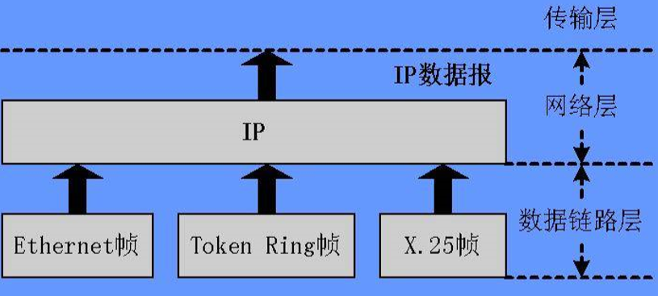
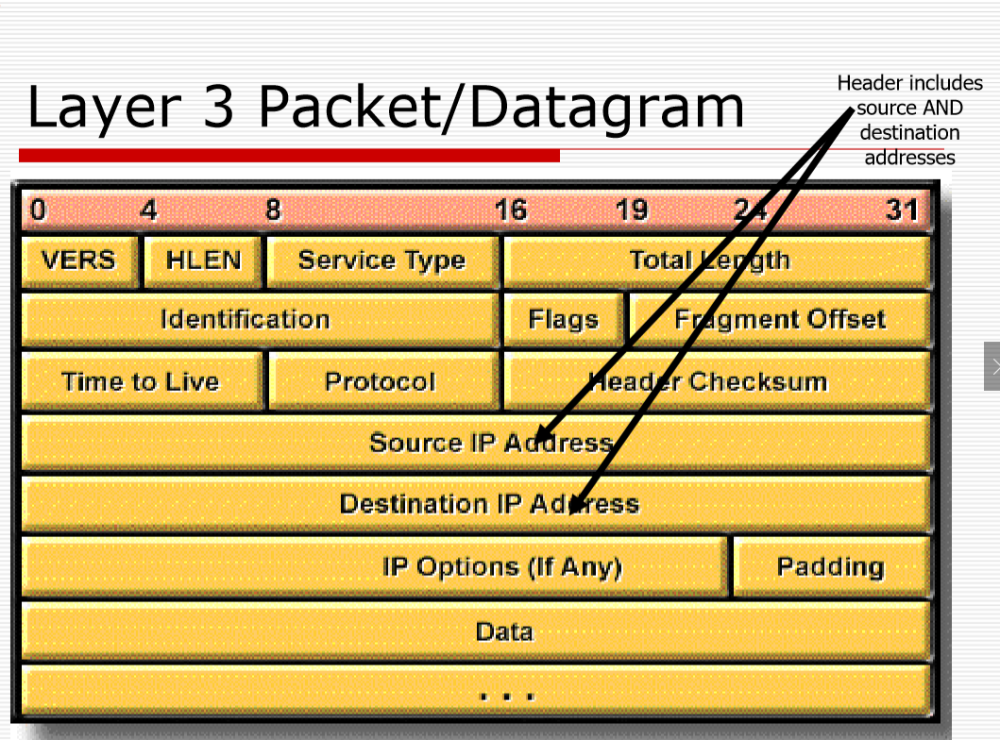
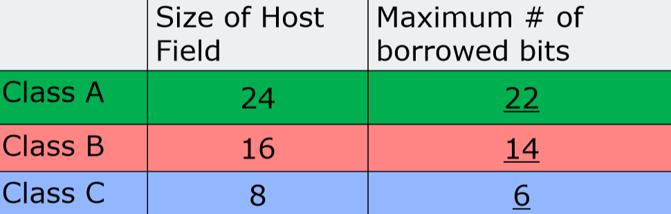

看到4.5，第三层设备

lecture04-网络层原理与技术
---

1. 为什么不用硬件地址（MAC地址）进行通信?
   1. (设备数量问题)因为设备比较多，供应商也比较多
   2. (规格问题)不同供应商的解决方案不同，所以使用硬件地址进行通信的通用性比较低。
   3. (寻址问题)全球设备太多，如果使用硬件设备，那么进行定位比较复杂
2. 因为如上情况我们选择使用IP地址(逻辑地址、软件地址)。
3. 本章比较重要，期末占比会比较大。

[TOC]

# 一 网络层概述
1. 对于不同帧使用同一的方案进行处理
2. 第三层希望通过**路由选择算法**进行路径的选择和转发，对第二层是透明的。
3. 第三层只能避免拥塞，但是要到第四层(运输层)才能完成流量控制(第三层不能完成流量控制)

## 1 第三层职责
1. 通过网络移动数据：不同网段之间的通信，不同的广播域，两个广播域之间的进行了划分，互不干扰，不是广播的通信以及对另一个网段的广播需要能传达给对方。
2. 使用分层寻址方案
   1. 与MAC寻址相反,MAC地址寻址是单层寻址，网络中信息太多了，单层寻址过于粗暴

3. 细分网络并控制流量(flow)：一步步进行细化，越近了解的越多:IP地址是一致的，也就是可以忽略物理层的不同。(具体原因在开头已经分析过了)
4. 减少交通拥堵，基于IP做分段和传达，用来减少拥塞
5. 与其他网络交谈

- 第三层向下能够屏蔽不同介质的差异，不同数据链路层由不同的帧，但是帧里面可以由相同的数据包，所以第三层就可以取出相同的packets，进行不同帧的通讯
- 第三层只负责将数据间进行连通和传达，数据的可靠性由上层保证

## 2 第三层设备
1. 路由器
   1. 互连网段或网络(不同网段的分割)
   2. 根据IP地址做出合理的决定
   3. 确定最佳路径，根据路由表。
   4. 将数据包从入站端口切换到出站端口
2. 如果A网段的设备向路由器发送了一个B网段的广播地址，那么路由器会进行转发，然而如果A网段设备发送的是本网段的广播地址，路由器则不会进行转发。(广播域划分)

# 二 IP地址和子网划分

## 1. 第三层数据报格式

1. IP地址在报文中占据一部分(32bit一个IP地址)

## 2. IPv4报文主要结构

报文分首部和数据部分

有时候报文太大应该进行分片（因为报文的总长度范围到65535，而数据帧最大才1500不到，所以在传输到第二层前需要分片，传输到接收方后再进行合成）而这就需要首部部分当中的标识，标志，片偏移三个数据，换句话来说，这三个就是来处理分片工作的

### 2.1 首部部分

- 版本号：4bit，由ipv4和ipv6两个版本，用4个bit表示4或者6，这里介绍的是ipv4报文的结构

- 首部长度：4bit，因为首部有可变部分，所以需要其来记录首部长度，首部长度的表示有4个bit，表示 0-15的数，但是固定部分就已经有4×5=20个byte超过15，因此首部长度的单位是4byte，即首部长度标识能够表示0-60byte，减去固定部分的20byte，可变部分最多能够有40byte。

- 服务类型 8bit

  - 过去：
  - 现在：区分服务：前6bit表示区分服务码，后2bit保留做其他用处，现在几乎没怎么用这8各bit，因为区分服务也需要一个很宽泛的标准，当下并没有

- 总长度：16bit，包括报文首部和数据部分的长度，最多可以表示65535 个byte，而一个帧的长度不超过1500个byte，所以绝对够用了

- 标识：和标志，片位移一起使用，其作用当数据帧收到时，进行一个确认，如果当前有数据帧未收到，则从当前数据帧的前一个帧进行重传；而第三层不要求可靠性，所以它实际上只起到一个计数器的作用，相同的标识号的报文是一个大报文，应该再接受后进行合并。

- 标志：3bit

  - DF0 ：不分片
  - DF1：分片
  - MF0：是最后一个分片
  - MF1：后面还有分片不是最后一个分片

- 片偏移：12bit，用于记录大报文当中的小报文的次序：大的片偏移的报文在后面小的在前面，因为它只有12个bit，所以它以8byte作为偏移单位

  

  - 每个子报文需要独立形成首部，并且三者的标识号需要相同
  - 设置标志位和片偏移的值

- 生存时间（TTL）：8bit，记录数据包在网络中能够通过的路由器的最大值，每通过一个路由器，TTL - 1，当通过一个路由器后TTL=0，则丢弃对应报文，并向发送报文方回报。能够有效解决回路问题：TTL置1能够传给相邻路由器
- 协议：8bit，指定packet中的数据交给哪一种协议进行处理，如下图，有的协议可能是上层的 如TCP，UDP；也可能是同层的如ICMP，协议就是指出数据的去向。
- 首部检验和（首部地址校验和）：16bit，和第二层的CRC不同，是通过反码算数运算求和来进行校验
  - 其只能校验首部是否正确，而无法判断数据部分正确与否，所以当下不常用
- 源地址、目的地址：各32bit

## 3. 网络层地址（IP地址）

### 3.1 IP地址组成

- IP地址是32bit,4byte为长度（ipv4）

- 一般写成四个字节分开的形式，用点分开，每个字节用十进制表示                   如：                                       133.14.17.0

- IP地址的组成部分

  

  - 网络ID（network）
    - network ID 是由 ARIN 统一分配的
    - 其标识了当前设备是属于哪一个网段的，可以区分这个网段里面的设备有哪些，以及哪些设备和自己同个网段
    - 需要1或2或3个byte
  - 主机ID（host）
    - Host ID 是由 网段的管理人员进行分配的
    - 用于标识当前网段内的特定设备
    - 需要1或2或3个byte，注意二者加起来应该为4个byte

### 3.2 IP地址类别

#### 分类标准

可以根据network ID所占位数来进行给IP地址进行分类

- A类地址中 Network ID占 1 byte，Host ID占 3 byte

- B，C地址如图同理

- 但是这样有个问题，没有额外信息，要如何判断收到的地址是哪一类地址

- 约定：A类地址第一个bit是0，B类地址以10开头，C类地址已110开头

  - 因为其起始位置的比特不相同，所以其第一个字节的取值范围也不相同，所以可以根据其第一个字节对应十进制数的取值范围来判断是哪一类地址
  - 0–127 Class A address A类地址
  - 128-191 Class B address B类地址
  - 192–223 Class C address C类地址

  > 注意，区分A，B，C三类地址的方式是看第一个字节的开头3bit，即第一个字节的取值范围，但是A，B，C三者的不同是三者网络位所占的字节数（byte）不同，分别是1，2，3**byte**

#### 不同类别下的主机数量

每个类别的同个网段下的最大主机数量各不相同

1. A类拥有16,777,214个可用主机（224 – 2）（Host ID可用字节数为3）
2.  B类具有65,534个可用主机（216 – 2）同上
3.  C类具有254个可用主机（28 –2）同上

为什么每一类地址中都要减去2，因为首尾两个地址

1. 每个网络中的第一个地址（即Host ID全0）都保留用于该网络地址
2. 最后一个地址（即Host ID全1）是为广播地址保留的。

#### 保留(Reserved)地址

即为在特定的某一个Network ID下种不分配给主机的Host ID

- 网络地址
  - 是以 全0结尾的IP地址
  - 例如：113.0.0.0
    - 113<127，所以其是A类地址，前1位Network ID，后三位为Host ID
    - 因为其后面全0，所以是网络地址，不能分配给主机
  - 作用：声明一个网段，如果多个主机确定了自己的网段地址都是113.0.0.0，则其都在同一个网段内部，能够进行相关通信
- 广播地址
  - 是 Host ID 全取1的IP地址
  - 例如：176.10.255.255
    - 因为128<176<182，所以它是B类地址，前两个是Network ID，后两个是Host ID
    - 其Host ID 全1，为广播地址
    - 如果是255.255.255.255则称作受限广播地址，它只能在发出广播地址的网段进行广播，而不能跨路由器即跨网段进行广播，而一般的广播地址则可以通过路由器转到对应网段进行广播
  - 作用：用于发送数据给对应网段的全部设备
- example：
  - Class A
    1. 99.0.0.0: a reserved network number
    2. 99.255.255.255: a broadcast number
  - Class B
    1. 156.1.0.0: a reserved network number
    2. 156.1.255.255: a broadcast number
  - Class C
    1. 203.1.17.0: a reserved network number
    2. 203.1.17.255:a broadcast number

#### 私有(Private)地址

先理解一些概念：某一个Network ID下能够有多个 Host ID 从而分配给多台主机，而我们的所有的Network组合起来是我们的**Internet**，其有且仅有一个，所以可以说 在 Internet 下分成了多个 Network ID 形成了不同网段

保留地址是某一个网段下，不分配给主机的特殊的Host ID，而与其类似
私有地址是在Internet下，不参与Internet中和其他网段交互的特殊网段，
意思就是说这个Network ID下的主机，都只能够在本网段当中进行通信，如果在Internet中出现了带有私有地址的报文，接收方会直接将其丢弃，因为Internet中不可能会有私有网段。

私有网段有三个

- A类网段：10.0.0.0 - 10.255.255.255 
  - 用于公司内部的内网，内网中的信息只在本网段中交流
- B类网段：172.16.0.0 - 172.31.255.255
- C类网段：192.168.0.0 - 192.168.255.255
  - 比如宿舍里面的无线路由器，不同宿舍中网段的地址

IP地址耗尽问题及解决方案

- NAT
- CIDR
- IPV6（最终方案）

发展历史

- 1981年提出标准分类，即ABC类
- 1991年ABC类中网段还是太大了，网段数目不够多，而一个网段中Host主机数目有太多基本用不完，会造成浪费，所以提出**划分子网**
- 1993年由于路由表危机提出超网
- 1996年由于ISP接入舒徐提出地址转换 NAT

## 4. 子网(subnet)划分

是为了处理IP地址的相关问题，严格来说应该分到IP地址的那一块去

由于A，B，C三类网络中，Host ID数目过多，可分配的主机数太多，会导致浪费（A类中可分配主机可达几十万）而子网划分目的就是将较大的网段划分成更小的子网

### 4.1 基本概念

- 网络管理员有时需要将网络划分为较小的网络，称为**子网**，以提供**额外的灵活性**.
- 从主机字段借来的位被指定为**子网字段**(Subnet Fields)
  - 问题是由Host ID太多导致主机位太多，网段位不够用导致的，就从它那里借几位来形成该网段下的子网

- 子网是网段的更小划分
  - 提供寻址灵活性
- 子网地址通常由对应网段的网络管理员在本地分配
- 子网能够减小广播域
  - 子网和网段是同级别的，网段能够实现广播域切分，那么subnet之间也能够实现

### 4.2 借位限制

- 可以借用的最小位数是2，Host ID 保留位数最少也为2位

- 借用位数最少为2位的原因
  - 如果我们只借一位，该位取0或1形成两个子网，如果该位取0，形成的子网的网段号和母网相同，如果该为取1，形成的子网的广播号和母网相同，会造成混淆
- Host ID 保留位数最少为2位的原因
  - 如果只保留1位，该位取0，其IP地址为当前的网段号（即上面讲的保留地址中的网络地址）无法分配给主机；该位取1，其IP地址为当前网段的广播地址，无法分配，所以是无效划分

### 4.3 子网划分副产物：地址浪费

划分子网之后，会导致地址浪费：

- 划分子网后，新的Host ID的全0，全1没法用
  - 这是因为host ID需要两个保留地址
- subnet 全0 全1也没法用
  - 这是因为如果subnet全0全1，其对应的Host ID的保留地址会和母网重复

下面是具体的使用率

- 借用2位，形成 2^2^ - 2 = 2个子网，每个子网当中有2^6^ - 2 = 62个Host ID，Host ID能使用的个数达到 124个，而原本8位能使用的有256个，使用率只有 124 / 256 = 49%;
- 经计算，类型B的IP地址，借用四位利用率最高，达到77%

### 4.4 子网掩码

借位之后区分子网母网的方式

子网掩码：

- 子网掩码就是将当前网段的IP地址的网络地址（Network ID）全部置为1，主机地址（Host ID）全部置为0得到的码串。

- 其作用是区分当前的IP地址的哪几位是网络地址，即标识主机所在的子网，哪几位是主机地址；

  - 如 A类地址（第1个byte是网络地址）中的IP地址的子网掩码是 255.0.0.0
  - B类地址中的IP地址的子网掩码是 255.255.0.0
  - C类地址中的IP地址的子网掩码是 255.255.255.0

- 子网掩码不能单独存在，其必须和IP地址结合使用

- 其能够判断当前IP地址所属的网络地址是什么！

  

#### 子网掩码配置例题

目标：为 网络地址为 223.14.17.0 网段分配子网，并计算其子网掩码

需求：分配13个子网；每个子网至少有10个Host ID

分析：

- 首先223.14.17.0  前三个byte是网络位，是C类网络，其子网掩码是255.255.255.0，其主机位只有8位
- 关键是需要从主机位（Host ID）借几位，经过验算得到需要借4位，可以得到 2^4^ -2 = 14个子网，剩下4位使得每一个子网当中有 2^4^ - 2 =  14 个主机位，满足条件
- 而子网的网络位是前面24bit + 新增的 4bit，主机位则只有最后4bit，
  每1个byte转化成十进制的数字，得到结果为 255.255.255.240

#### 通过 子网掩码 + 主机的IP地址 计算当前的 Network ID（网络地址）

- 将IP地址和子网掩码转化为二进制

- 二者按位做与运算，因为子网掩码网络位全1，主机位全0，所以IP地址中只保留网络位，而主机位清零，自然就得到网络地址

  

- 可以在发送方发送数据包的时候，通过计算目的IP地址的网络地址判断接收方是否和自己在同一个网段，如果是，则直接发送；如果不是，则发送给网关的MAC地址进行转发？

#### 路由器的工作

将得到的IP地址和其对应的子网掩码做按位与运算，得到应当转发的网络地址，再进行转发

## 5. 实践:IP寻址问题
- Given 195.137.92.0 and needing 8 usable subnets, find the subnetwork numbers, the ranges of host numbers, and subnetwork broadcast numbers. 给定195.137.92.0并且需要8个可用子网，请找到子网号，主机号范围和子网广播号。
  - 首先判断 网络地址 195.137.92.0 是C类地址，其中网络位为3byte，主机位为1byte=8bit
  - 需要8个可用子网。8+2 = 10 < 2^4^=16，所以至少需要4位subnet，又主机位至少留2位，所以subnet最多取6位

- 借用4-6位都可以，因为并没有规定子网中主机数量，而为什么是6位是因为一个子网中最少用2位给主机。

# 三 第三层设备—路由器
第三层设备主要是路由器，其功能主要有两个

- 路径选择：
- 报文转发

## 1. 路径选择

### 1.1 路径选择

- 报文从两条路径走都可以到达目的主机，需要路由器进行选择
- 路由器需要根据一定的标准，比如最少经过的路由器数目，最短时间等等进行选择

### 1.2 IP地址（路径选择的依据）

- IP地址是由软件实现的，是逻辑层面的地址，指代设备所在的网络
- 路由器连通不同的网段，路由器是通过不同网段的**网络地址**进行转发，而不是根据具体的IP地址

### 1.3 IP地址分配策略

静态地址分配

- 直接通过图形化界面等方式直接为主机分配IP地址
- 需要保留IP地址的分配记录，并在下一次分配的时候根据之前的分配情况（上下文）进行分配，不能够对不同的主机分配相同的IP地址

动态地址分配

- RARP: Reverse Address Resolution Protocol. RARP：反向地址解析协议。发起请求 根据MAC地址获得IP地址
- BOOTP: BOOTstrap Protocol. BOOTP：BOOTstrap协议。用于工作栈
- DHCP: Dynamic Host Configuration Protocol. (比较多用) DHCP：动态主机配置协议

## 2. 路由器转发

### 2.1 路由器接口

路由器的每个端口也是有一个网卡的，也为其分配一个IP地址，能够和与当前IP地址对应网段中所有设备通过IP协议进行通讯，如果需要转发给当前网段的数据，则直接转发到对应的端口即可，比如下图端口A1所在的网段就是 Network A，要转发到A网段的数据即从A端口出，并且由于其是总线传播，所以是广博的形式传输

因此每个端口需要配置一个IP地址，和其转发网段是同一个网段信息的

#### 路由器接口实例

- 路由器端口的地址要和网段的网络地址相匹配，如S1的网络地址就是：
  172.16.0.0，并且路由器端口一般来说都是作为当前网段的网关
- 路由器每个端口的网络地址应该是不同的，不然会产生歧义

### 2.2 路由器转发实例

A5 -> B5

- A5 形成报文，数据链路层中新城对应的帧，在 Network A当中进行传播
  - 注意A5形成的帧的源地址是 A5的MAC地址
  - 目的地址 是 A1的MAC地址，因为就数据链路层上的帧而言，B5的地址是没有意义的，因为其无法直接到达
- 路由器从A1端口接受到对应的报文，进行分析，得到其目的地址指向的是B5
- 路由器检查路由表，查询到 到B5的话应当从B1端口转发
- 转发的时候其会从B1端口形成一个**新的帧**
  - 这个帧的目的地址是B5的MAC地址
  - 源地址是 **B1 的MAC地址**
    - 因为对于B5而言，A5的MAC地址作为源地址是没有意义，因为其没有办法直接到达
- 相当于经过一次路由器的网络层的一次报文传输，在数据链路层被划分成两次数据帧的传输，其源地址和目的地址都不相同
- 路由器的作用就是寻找路径转发并进行报文交换

# 四  ARP Protocol ARP协议

## 1. ARP协议功能

根据IP地址信息来获得MAC地址（本网段的直接返回目的主机的MAC地址，跨网段的则得到网关的MAC地址，将帧发送到路由器后进行转发），协助实现报文的传输

- 为了实现设备间的通讯，需要知道通讯设别之间的IP地址和MAC地址（IP地址用于网络层识别， MAC地址则是数据链路层中帧的需要）
- 而有些机器只知道IP地址不知道IP地址，ARP协议则实现IP - MAC地址的转化

## 2. 实例及问题

- 上图当中源主机 1797.15.22.33 向目的主机 197.15.22.126发送报文，源主机只知道目的主机的IP地址，而**不知道MAC地址**

## 3. 问题解决方式：ARP Table

### 3.1 概念及特性

- 一般的上网主机与设备当中都有ARP Cache，也称ARP Table
- ARP Table中存储 IP地址MAC地址的对应情况，器是变化的存在于RAM当中。
- 也正是因为其是变化的，其中可能会缺失一些条目，比如源主机中的ARP Table就没有 IP地址中 197.15.22.126对应的MAC地址，因此需要ARP操作来完善当前的表
- 其具有时效性，类似于交换机表，如果长时间一条记录未更新，其会被丢弃，比如 IP地址197.15.22.126对应的条目可能就是被丢弃了的

### 3.2 ARP 操作

#### 本网段 ARP 请求

- 因为ARP 表当中缺少目的IP地址对应的目的MAC地址，所以形成数据帧时无法写出目的MAC地址

- 这种情况下请求方进行 ARP请求，即将MAC地址设为全1进行广播

- 所有机器都收到这个请求，如果当前主机的IP地址和被请求机器的IP地址（上图是10.0.2.9）相同，则接受这个请求

- 接受请求方将自己的MAC地址发送给请求方，并且刷新自己的ARP 表中对应请求方（10.0.2.1）的记录

- 请求方得到MAC地址，完善自己的ARP Table表，之后能够正常发送报文

  > 注意：ARP请求时在本网段进行的：因为其是通过**广播**得到目的方的MAC地址，<u>广播不能够跨网段传输</u>，所以通过广播这种方式只能够得到本网段内的目的主机的MAC地址，因此我们需要

#### 跨网段 ARP 请求

- 默认网关方式(就是在配置机器IP地址的时候把网关地址也写到)

  - 网关的作用就是实现网段的转发，就是路由器的端口，并且是配置在设备上的
  - 默认网关是一个**IP地址**，实际上就是当前网段连接的路由器端口的IP地址，报文只有从这个端口进去，经过路由器分析才能到达另一个网段
    - 所以数据链路层想要跨网段传输，
      - 如果不知道网关的MAC地址的话，需要先发送本网段的ARP请求得到网关的MAC地址
      - 之后使用网关的MAC地址将报文封装成帧，将其传输到网关（路由器端口）再形成新的帧进行转发。
  - 设备间的通信是需要网关进行转发与服务，所以配置设备IP地址默认会为其配置网关：
    - 如果是动态获取IP地址，THPCP Server会给用户一个指定的网关，对于用户透明；
    - 如果需要手动配置IP地址，需要手动配置网关
    - 网关未配置或者网关配置失败通讯会出错

- ARP 代理

  当早期的机器上面无法配置网关的时候，会启动ARP代理进程，一般在路由器上启动

  

  - 主机A发送跨网段的ARP请求
  - 路由器 ARP代理进程启动，并返回给请求方路由器自己的连接到主机A所在网段的端口的MAC地址

## 4. 实例问题解决，利用ARP发送帧的流程

- 需要发送一个报文到目的设备，已知目的设备的IP地址但MAC地址未知
- 查询原设备ARP表中对应IP地址的条目是否存在
  - 若存在，得到目的主机的MAC地址，将报文封装成帧，进行发送
  - 若不存在，则发送ARP请求，
    - 如果是在本网段则通过广播方式发送，得到目的主机的MAC地址，封装成帧进行发送。
    - 如果需要进行跨网段的ARP请求，则可以通过默认网关或者ARP代理等方式，得到当前网段对应的网关（即路由器对应端口）的MAC地址，利用该地址封装得到的帧将发送到路由器处，路由器将其还原成报文，解析其中的目的主机IP地址对应的网段，封装成新的帧进行转发，知道发送到目的主机位置

# 五 网络层服务

## 1.面向连接的网络服务

- 在任何发送数据的行为之前，需要先建立会话连接，不如打电话，先拨号发送请求，对方应答后建立连接，之后才进行传输数据
  - 能够保证所有数据有序传输
  - 接收数据如果出差错需要接收方进行处理能够保证其正确性
- 传输过程中需要保证连接距离，传送完成后才断开
- 传输数据代价较高，但是可靠

## 2. 虚电路交换

- 和面向连接通讯较为类似，但二者不相同
  - 二者都是先建立连接在发送数据
  - 但是技术实现层面有差距，虚电路连接强于直接建立连接
  - 面向连接服务能够通过虚电路交换来实现
- 概念：
  - 在发送数据之前，要在双方间建立一个虚电路关系发送数据时，只走特定的虚电路
- 优缺点
  - 不需要进行路径选择，保证报文先发先到达，可靠
  - 降低链路利用率，虚电路被占用时，其他设备无法使用

## 3. 无连接网络服务

- 不需要预先建立网络连接，可以直接发送数据
- 适用于突然需要发送数据的情况
- 效率高，可靠性较低
  - 和数据链路层类似，当可靠性能够通过其他方式保证后，无连接优于连接

## 4. 报文交换

- 报文交换类似于无连接服务，但是不同
  - 报文交换侧重于将原有数据分成小的传输单位，每个单位独立发送，走不同的路径，有独立的地址（这也就是其概念了）
  - 无连接服务侧重于不建立连接就进行通信，
  - 大部分的无连接服务都是基于报文交换实现，但是二者定义不完全相同
- 概念：将原始数据分为很多的子报文(单位)，每个子报文(单位)自己选择路径进行发送。
- 优点：报文交换当中每个报文基于一系列标准做路径选择，能够有效避免拥塞
- 缺点：可靠性低
  - 当报文在传输过程中出错时，不一定要全部重传，只需要重传部分出错的子报文即可

# 六 路由和路由协议

## 1. Route

路由转发操作

- X生成报文，封装成帧，以A的端口作为目的MAC地址发送，A接受帧，合成报文，分析目的IP地址，根据路由表分析目的IP地址应该从哪个端口出后形成新的帧，以B为目的MAC地址，发送帧，之后同理

## 2. Routed Protocol

 Routed Protocol：被动路由协议

和 Routing Protocol的关系：Routed Protocol需要利用Routing Protocol生成的路由表来实现自己的协议内容，后者是前者的基础

### 2.1 Routed protocol 和 Non -routable protocol

#### 二者对比

- Routed protocol — 路由协议、可路由协议
  - 路由协议是能够为第三层提供服务，使之能够进行路由操作
  - 比如IP协议就是一种路由协议
-  Non -routable protocol不可路由协议
  - 是不支持第3层的协议。
  - 这些不可路由协议中最常见的是NetBEUI。
    - 直接根据目的方的地址在局域网中进行生成定位
    - 这个协议不支持第三层，只在局域网内部可行，但是在整个internet上是不可行的（不能跨局域网）
    - NetBEUI是一种小型，快速且高效的协议，仅限于在一个网段上运行。

#### Routable protocol 实例 — 需使用routing table

- 需要到达 131.108.2.2 的IP地址的目的主机

- 计算器网络地址，查询 **routing table （路由表）**从对应的端口形成新的帧进行转发

  ​	

- 路由表是存放在内存当中，是路由器启动之后学习生成的

#### routing table 生成方式

- 静态路由
  - 概念：网络管理员输入路由信息直接生成路由表
  - 特点
    - 因为其是手动配置，能够实现部分路由信息的隐藏
    - 能够做到链路功能的测试
- 动态路由（涉及到下面第三点的主动路由协议 routing protocols）
  - 概念：在路由器上启动相关进程，通过进程使用的 routing protocol 生成路由表
  - 特点
    - 因为是通过协议进行路由表生成，所以能够时刻维护路由表并实时更新
    - 依赖routing protocol 进行路由表的维护
    - 路由表能够适应于网络条件的变化

## 3. Routing Protocol

其是动态网关协议（主动路由协议）（生成路由表的），分为

- IGP（RIP，IGRP，EIGRP，OSPF）：内部网关协议

  - 在一个自治系统内部的路由器协议应用
    - 一个大的单位或者管理方比如南京大学内部是有统一网络管理的规范，网络管理员会为当前单位的所有子网实施一个动态路由的标准，所以是内部网关协议

- EGP：外部网关协议

  - 在自治系统和自治系统之间的路由器协议
  - 通过EGP使不同

  

### 3.1 IGP分类：DVP、LSP

- Distance Vector Protocols DVP （代表有RIP，IGRP）
  - 从邻居网段的视角来看网络拓扑（只能看的到自己直连的网段）
  - 以路由器跳数作为评判标准：每经过一个路由器，跳数++
  - 按一定时间频率地将路由器之间信息进行交换
  - 交换的是路由表的复制，将更新的路由表传递给邻居的路由器们
- Link state routing LSP（OSPF）
  - 以全局的视角来看整个网络拓扑，可以看到全局的网段链路信息
  - 以路径代价作为评判依据：会计算处通往其他路由器的**最短路径**
    - 这个最短路径是有多个评判标准的，如带宽，，
  - 以事件触发的方式进行路由器信息的交换
  - 交换的是全局的链路信息，将全局链路信息更新，并传递给其他路由器

### 3.2 IGP：DVP 实现

DVP：距离矢量协议

- 三个路由器连通了四个网段
- 每个路由器初始学习到路由表中黑色的部分，因为黑色部分的网段是当前路由器直连的
- 经过一个时间单位，每个路由表都将自己的信息copy一份到隔壁的路由表，具体表现为B路由器向右直连Y网段，向左直连X网段，将这个信息复制给A路由器，又A路由器向右直连 X网段，可以得到，A路由器向右连通Y网段，跳数为1，从而更新路由表

#### DVP协议的代表1：RIP（Route Information Protocol）

- 当时最受欢迎（因为其简单，虽然效率低，但是好用）
- 是内部网关IGP协议
- 是DVP协议
- 路径选择的评判依据仅基于跳数
- 最大的跳数为15跳
- 每30s将路由表转发给邻居
- 不会选择最快的路径，而是选择跳数最短的路径
- 产生大量交通
- RIP v2是RIP v1的改进版本
  + RIP v1用地址广播
  + RIP v2用主播地址广播，支持身份认证、路由等，比较安全，常用

#### DVP协议的代表2：IGRP（Interior Gateway Route Protocol）

- Cisco 知识产权
- 是内部网关IGP协议
- 是DVP协议
- 路径选择的评判依据基于带宽，负载，延迟，可靠性
- 最远的跳数可以达到 255
- 每90s传递路由表
- 后期升级成 EIGRP，偏向杂合的协议，现在只能做EIGRP而不能做IGRP

### 3.3 IGP：LSP的实现

LSP： 链路状态协议

- 彼此交换连接情况，交换的是**Link state**而不是路由表，包含link的信息，以NetID作为主键(无相同网段)，包含的是link上的路由器邻接关系、链路类型(4种)、链路带宽，会指定谁连接了谁，这个条目就被称为Database(表)。这样子就不仅仅知道链路，还知道更多的全局信息。
- 四个链路的相关信息会在三个路由器之间相互交换，使得三个路由器都能学到链路的全部相关信息
- LSP操作过程
  - 相互交换彼此学到对应的Tpological Database(是全局的信息)
  - 之后使用SPF算法，以自己为根，通过最短路径优先算法，生成以自己为根的树
  - 根据这一个树再生成路由表(了解全局的信息)，逻辑是树的逻辑。
  - 相当于就是拿到全部的信息，在根据这些信息生成一个以自己为根的树，根据这个树生成路由表，在一开始就生成好了 
- 交换时间：LSP不是进行定时进行交换的，而是初始的时候进行交换，稳定之后，根据**事件触发**（比如链路信息发生变化）的时候才会更新数据。
  1. 更新后发送给所有的路由器，需要将Database发送给所有的路由器
  2. 收到的路由器的，根据database更新自己的树，然后再次生成路由表。

#### LSP协议的代表：OPSF

- Open Shortest Path First 最短路径优先
- 内部网关协议
- 链路状态协议
- 指标由**带宽**，速度，流量，可靠性和安全性组成，本科阶段只考虑带宽的。
- 事件触发的更新。

## 4. Routed protocol vs. Routing protocol

- Routed protocol：用于在路由器之间，利用路由表做转发时的判断，使得路由器间能够实现有效连通
- Routing protocol ：也是在路由器间进行判断，但是不适用于转发，而是用于各自路由表的生成：根据转发信息动态生成路由表，根据路由表实现转发
- 所以 Routing protocol 用于实现 Routed protocol 

# 七 VLSM(Variable Length Subnet Mask)

 VLSM(Variable Length Subnet Mask) ： 可变长度的子网掩码

## 1. 经典路由 VS 可变长子网掩码

- 经典路由：IP报文当中不携带子网掩码
  - 或者根据第一个字节区分网络类型（A，B，C类网）
  - 或者经典路由协议要求一个单一的网段使用相同的子网掩码，可以通过当前网段路由器端口的子网掩码来充当自己的掩码
    - 也就是说额米有给A、B、C类的网段是无法划分子网的
  - 例如 网络：192.168.187.0必须只能使用一个子网掩码：255.255.255.0
    - 判断方法有：
    - 第一个字节的值为192，是C类网，前三个byte是网络地址，可以得到子网掩码
    - 题目中说到“网络：”说明这本身就是一个网络地址，而它只有最后一个字节全0，所以最后一个字节是主机地址，前三个是网络地址，可以得到子网掩码
  - 这个会导致空间的浪费（就是无法划分子网所导致的缺点）
- VLSM—Variable Length Subnet Mask 可变长子网掩码
  - VLSM只是一项功能，它允许单个自治系统的网络具有不同的子网掩码。
  - 有效的解决网络号浪费的问题

## 2. VLSM 可变长子网掩码

VLSM能够实现划分子网的功能

- 如果能够使用 VLSM，网络管理员能够在所管理的网段上面划分子网，对于主机数目少的部分使用长掩码，主机数目多的部分使用短掩码
- 如果routing protocols（生成路由表的协议）支持 VLSM
  - 能够对网络连接（著需要两个路由器）使用30bit 的子网掩码，其中只有两个Host ID可用，刚好满足网络连接主机数量的需要，不浪费
  - 如果需要划分一个需要1000台主机的网段，能够给20bit的子网掩码，12位的Host ID能够提供给 2^12^ - 2台主机使用
  - VLSM使得子网划分得以灵活的实现

### 2.1 为什么使用 VLSM

使用VLSM 划分子网的好处

- VLSM允许组织在同一网络地址空间内使用多个子网掩码。
- 实施VLSM通常被称为"子网划分"，可用于最大化寻址效率，灵活分配地址，避免IP地址浪费，减缓IP地址用尽问题
- VLSM是有助于缩小IPv4和IPv6之间差距的修改(modifications)之一。

#### 优点

- 高效灵活利用IP地址
- 更好的路由聚集

#### 缺点

- 会导致地址空间的浪费:广播地址和网络号都无法被使用。

  - 过去，建议不要使用第一个和最后一个子网。

    - 因为subnet ID全0的子网的网络地址会和母网的重复
    - 因为subnet ID全1的子网的广播地址会和母网的重复

  - 从IOS ver12.0起，Cisco路由器默认使用零子网，因为子网母网可用通过子网掩码进行区分（subnet id全0的子网的网络地址虽然和母网一样，但是二者子网掩码不同，所以可用区分是子网的还是母网的）

    - 全1的子网可用于否自己去试

  - 如果想要禁止零子网，使用该指令:

    ​			`router(config)#no ip subnet-zero()`

#### 支持 VLSM 的Routing protocol

支持VLSM的协议就是支持报文中含可变长子网掩码的协议

- 开放式最短路径优先（OSPF）
- Integrated Intermediate System to Intermediate System (Integrated IS-IS) 集成中间系统到中间系统（集成IS-IS）
- 增强型内部网关路由协议（EIGRP）
- RIP v2
- 静态路由

### 2.2 实例

#### 使用VLSM带来的好处的实例

- 上图解释了不使用 VLSM所带来的弊端

- 需求：该公司分成一个主公司，三个子公司，它向IP供应商购买了一个192.168.187.0的网络地址作为公司网段，其中每个公司需要一个自己的主网网段，并且公司与公司之间的网段相连也需要一个连接网段，所以一共需要7个网段，并且每个公司需要的主机数是30

- 解决方法1：如果使用不可变长的子网掩码，由于主机数是 30，所以host ID需要5位（2^5^ - 2 = 30），原先购买网段可分配的Host ID值只有8bit，所以取出前3位作为subnet id，因为全0的subnet id已经可用了，所以可用分出 Subnet 0 - Subnet 7共8个子网，分给所需要的7个网段

- 缺点：但是实际上只有公司需要30个host ID，而连接部分的网段只需要两个Host ID（用于连接两边的路由器）而这就导致了浪费

- 解决方法2：因此可用按下图进行划分，连接部分使用30位的子网掩码，公司网段使用27位的子网掩码，使得网段利用率提高，而其他未使用的子网可用留存满足之后的其他需要

  

#### 根据需要生成对应的VLSM的实例

- 需求：分配至少7个网段，其中每个网段的主机数如图所示（连接部分只需要两个主机数）

- 解决思路

  - 先把网络分配给大的子网，在去分配小的子网，从大到小划分
  - 把大的子网划分成小的子网，只能分配还未使用的子网

- 解决方法：

  - step1： perth需要 60个主机数，所以 Host ID 至少为 6位
    (2^6^-2=62),得到其子网掩码为26位： 255.255.255.192(11000000)

    

  - step2：KL需要28个主机，所以需要5位Host ID

    即其子网掩码是27位 255.255.255. 224 （11100000）
    从第一步划分结果当中的三个未使用的26位子网掩码的子网再进行划分，得到6个子网掩码27位的子网，其中第一个分配给KL

  - step3：同理 Sidney 和 Singapore 需要12个主机，所以需要4位Host ID即其子网掩码是28位 255.255.255. 240 （11110000）
    从第一步划分结果当中的5个未使用的27位子网掩码的子网再进行划分，得到10个子网掩码28位的子网，其中第一个和第二个分配给Sidney 和 Singapore 

  - step4：同同理，连接公司的网段需要2个主机，所以需要2位Host ID即其子网掩码是28位 255.255.255. 252 （1111 1100）
    从第一步划分结果当中的8个未使用的28位子网掩码的子网再进行划分，得到32个子网掩码30位的子网，其中前三个分配给三个连接公司网段的网段

- 分配结果：

## 3 路由聚集

### 3.1 概念与例子

将多个路由条目聚集成数量较少的条目

- 
  - A路由器将 路由表中三个 24位子网掩码的条目聚集成一个 16位 子网掩码的题目发送给B路由器，存放在B路由表中，告诉B自己能够通向 172.16.0.0的网段以及其所有子网段
  - 优点：使得B中路由表的条目减少
- 
  - 多层聚集的例子

### 3.2 实现

- 将当前路由器路由表中的条目进行一个聚集：即将前面网络位前面相同的部分归结在一起，网络位后面必然会有差异的置为host 位，形成新的子网掩码，实现聚集，比如上图就将24位聚集到22位

### 3.3 优缺点

- 极大减少路由表的条目数
- 将网络拓扑变化在路由表和路由表之间隔离
  - 比如小的网段之间（大的子网掩码）发生，只需要更改针对这些网段的路由器，修改路由表，而不需要修改其他包含更大网段的条目的路由器，避免了大量冗余计算
- 可能会导致冲突，比如两个路由器A,B聚集了相同网段信息给同一个路由器C，当报文发送到C进行转发， 由于A,B聚集网段信息相同， 会发生冲突

# 八 ICMP 因特网控制报文协议

- ICMP作用：
  - 是IP数据报中数据部分的一部分
  - 为了提高IP数据包交付成功的机会
  - 允许主机和路由器报告差错情况和提供有关异常情况，让源主机来发现错误原因
- ICMP是IP层（第三层）的协议
- ICMP报文是 IP层数据包的数据（存在于数据部分），加上数据包的首部，组成IP数据包发送出去

## 1. ICMP报文格式

- 前四个byte固定
- 后面的根据类型决定
- 整个报文存在于IP数据报的数据部分

## 2. 两种 ICMP 报文

一般来说 差错报告报文使用的较多，

其中 差错报告报文中的目的站不可到达又可用细分为

1. **网络**不可到达（net unreachable）
2. **主机**不可到达（host unreachable）
3. **协议**不可到达（protocol unreachable）
4. **端口**不可到达（port unreachable）
5. **源路由选择**不能完成（source route failed）
6. 目的网络**不可知**（unknown destination network）
7. 目的主机**不可知**（unknown destination host）
8. 不可知是完全不可以解析，不可达是可以解析但是不可以到达

### 2.1 差错报告报文格式

1. 一般会把原始的IP数据报文的数据报首部 + 8字节(数据的，可能会包含端口信息)作为ICMP的**数据部分**
2. ICMP的**前8个字节**的是确定的(前4个字节是类型，校验位，后面四个字节是根据类型确定的)，**前8个字节 + 数据部分** 组成ICMP差错报告报文
3. 然后添加一个IP首部作为IP数据报进行发送，相当于这个IP数据报报文只传输ICMP差错的相关信息。

### 2.2 不应当使用 ICMP 差错报告报文的情况

- 对 ICMP 差错报告报文不再发送 ICMP 差错报告报文
- 对第一个分片的数据报片的所有后续数据报片都不发送 ICMP 差错报告报文
  - 只需要判断因为它只截取IP数据报数据部分的前8位，而前8位在第一个分片里面，所以只要发第一个就行了
- 对具有多播地址的数据报都不发送 ICMP 差错报告报文
- 对具有特殊地址（如127.0.0.0或0.0.0.0）的数据报不发送 ICMP 差错报告报文
  - 127.0.0.0:逻辑回路地址
  - 0.0.0.0:确认路由地址

### 2.3 ICMP 差错报文 使用场景：ping

- PING 是用ICMP的"Echo request"和"Echo reply"消息来实现的
- PING 用来测试两个主机之间的连通性，一般是用来检查局域网的连通性：PING不通，不仅仅是发送不过去，有可能是应答不回来。
- PING 使用了ICMP回送请求与回送回答报文
- PING 是应用层直接使用网络层ICMP的例子，它没有通过运输层的TCP或UDP