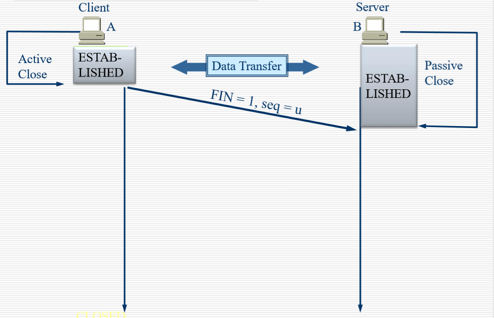
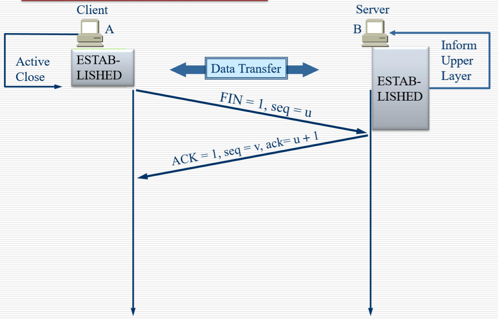
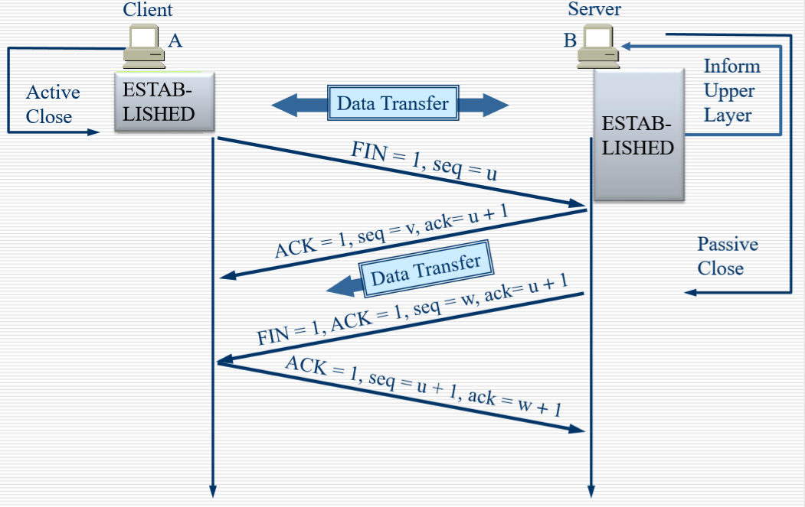

 05-Transport Layer
---
1. 第四层运输层主要是实现了主机之间的通信。
2. 数据通信是服务于主机上的一个个进程(Session)，所以要实现通讯是为了实现进程间的通讯，因为进程分布在机器上才需要主机间的通讯

[TOC]

# 一 第四层概述

## 1. 第四层功能(任务)

- 第四层具有的功能（承担的工作）：
  - 划分上层应用提供的数据，形成数据段（segment）
  - 建立本地进程 到 远端进程的通讯控制
  - 屏蔽了下层的具体实现，看起来像是直接进程和进程进行通讯
  - 流量控制和可靠性（下面三层是不负责数据可靠性的，第三层也只是负责首部的校验而不做数据的校验）
    - 流量控制：可能两个主机的网络处理能力不同，一方可能发送大量数据，另一方一次只能处理少量数据，这就需要平衡即流量控制，使双方速率差不多
    - 可靠性：如果接收方认为数据错误，其会在第四层要求发送方重传

## 2. 第四层协议

- 两个特别重要的第4层协议：
  - 传输控制协议（TCP, Transmission Control Protocol）
  - 用户数据报协议（UDP, User Datagram Protocol）
- 相同点
  - 而这都将上层提供的数据信息分成一个个数据段，以数据段作为单位进行发送（都会包装在packet即IP数据报中发送）
  - 接收方提取数据段并合成，得到数据回传给上层数据
- 不同点
  - TCP：可靠传输 reliable
    - 面向连接传输（需要通过三次握手来建立连接，并之后维持连接关系，结束时通过握手断开连接）
    - 通过软件校验方式来判断segment的正确性
    - 重新发送丢失或错误的任何内容
    - 提供流量控制，保证通讯有效
  - UDP：不可靠传输
    - 不面向连接
    - 不通过软件校验segment的正确性
    - 直接丢弃错误的报文，不做其他处理
    - 不提供流量控制

## 3. 服务模型

一些问题：

- 同一个主句怎么传输多个就进程间的数据呢？IP地址复用
- 主机怎么区分多个进程来复用IP呢？使用 Port — 端口

服务模型

- TCP和UDP都通过使用端口号（port）的方式，来追踪同时跨网络传输的不同进程的通讯
- 端口号约定只能有2个byte（同一个主机可同时有2^16^个京城），并且应用软件开发人员已同意使用RFC1700中定义的知名端口号
  - 比如这边 FTP会话对应的端口号就是21，想要传输也是通过这个端口号进行

端口使用规范

- 0-255 是 public端口，只能分配给公认的应用程序，保留给TCP和UDP协议对应的公共程序
- 0-1023 是 熟知端口，有自己分发规范
- 1024 -49151 的端口能够进行登记使用，如果想使用某个端口的可以去登记之后使用
- 49152 - 65515 的端口 可以给客户端
  - 启动一个浏览器和远方浏览器进行通讯，是需要启动一个端口号的，所有需要上网的应用程序都需要端口号。

## 4. 第四层通信单位

因为第四层通信单位不是主机而是进程，所以需要IP地址 + port，形成一个新的数据结构 ： socket (套接字)。所以第四层的单位（地址）是socket！

- socket 格式为 ：（IP_address, port）
- 每个连接都表示为（socket  source ，socket  destination），这是一个**点对点全双工通道**
- 通讯被认为是以一个socket和另一个socket之间的连接。(Socket API是一套规范，根据上下文有不同的含义)
- TCP不支持多播和广播（因为其需要建立连接且连接是点对点的嘛）

# 二 TCP(Transmission Control Protocol)

## 1. TCP 服务模型

- TCP需要处理的任务
  - 可靠传输
  - 流量控制
    - 通过窗口通讯
      - 即一次传输的数据存在上限的
      - 上限根据接收方的缓存，网络传输拥塞情况等因素决定
  - 连接实现
    - 建立连接：三次握手
    - 断开连接：四次握手

## 2. TCP 数据段 结构

- 这边介绍的是TCP的数据段的首部的数据结构，其同样也分为固定部分和可选部分。
- 端口（4byte）：端口是运输层和应用层的服务接口
  - 源端口（2byte）：发送方端口号
  - 目的端口（2byte）：接收方端口号
  - 运输层的复用和分用功能都需要通过端口才能实现
- 序号（4byte）：做可靠传输的主要逻辑
  - TCP传输的数据流中的每一个字节都会映射到一个序号，
  - 序号字段的值 指 本报文段所发送数据的第一个字节的序号
    - 比如数据一共100个byte，序号为301，那么数据中最后一个byte的序号就是400（之后应该也是根据这个来做校验的？）
  - 序号一共32bit，能够表示 2^32^即4G个字节，先从小到大用，如果用完了4G，那么就继续从头开始用
- 确认号（4byte）：
  - 和序号相对应，是期望收到对方的下一个报文段的数据的第一个字节的序号
    - 比如接收方上次接收到报文段的序号是301，一共有100个byte，即最一个byte序号为400
    - 那么它发送给发送方发报文段的确认确认号就是401
      即期望收到的下一个报文段的第一个数据对应的序号
    - 发送方收到接收方返回的报文，看到确认好为401，就知道了之前的数据发送成功，可以清除序号为301-400的缓存，继续发送序号为401的数据，实现数据正确性校验的功能
  - 其优势在于利用全双工通信的特点，将发送数据和校验数据合在了一步里去实现
- 数据偏移（4bit）
  - 数据偏移即是首部长度，取值范围为 0-15
  - 其以4个byte为单位，所以首部长度为 0-60 byte
  - 如果首部长度（算上可变部分）不是4的整数倍，那么就需要填充部分使之称为4的整数倍
- 保留（6bit）
  - 保留为今后可能添加的功能，目前置0
- 6个标记为（6bit）
  - 紧急位 URG
    -  URG = 1：表示后面紧急指针字段有效
    - 告诉系统系统此报文段中有紧急数据，应尽快传送（相当于高优先级的数据）；
    - 紧急指针用于区分紧急数据和一般数据
  - 确认位 ACK 
    - ACK = 1 ：确认号有效
    - ACK = 0 ：确认号无效
    - 一般ACK置1，只有当初始建立连接关系，序号尚未初始化时，ACK置0
  - 推送位 PSH
    - TCP面向字节，且要保证可靠性，所以其需要先将字节进行缓存，应用程序将数据发送给TCP后，TCP会根据网络条件进行传输的管理；
    - 另一方面，当接收方收到数据，它不会立刻给应用程序，它会先放到缓存内，当缓存满了后，再发送给应用程序
    - 而PSH = 1的作用就是，当接收方收到PSH=1的数据时，它不会等待缓存满，而是立刻将当前缓存发送到应用程序，实现优先响应的进程控制逻辑
  - 复位 RST
    - ReSeT = 1时，表明TCP连接中出现严重差错（如由于主机崩溃或其他原因），必须释放连接，然后再重新建立运输连接
    - ReSeT = 1还可以表示拒绝连接
  - 同步位 SYN
    - SYN = 1 表示这是一个连接请求或连接接受的报文
  - 终止位 FIN
    - FIN = 1 表明次报文段的发送端的数据已发送完毕，并要求释放运输链接
- 窗口（2byte）
  - 用于让对方设置发送窗口的依据，单位为字节
  - 是允许接收方下次最多能够发送的数据量，比如发送方确认号是401，窗口为1000，则表示接收方在发送数据时，最多只能发送序号为 401 - 1401的数据，实现流量控制
- 检验和（2byte）
  - 检验和字段检验的范围包括**首部和数据**这两部分
  - 也包括伪首部：IP报文中的地址等
- 紧急指针（2byte）
  - 指出本报文段当中紧急数据一共有多少个字节（紧急数据放在报文数据的起始位置） 范围为 0 -65535个byte
- 选项
  - TCP最初只有一种选项，即最大报文段长度 MSS
  - MSS 高速对方缓存所能接受的报文段的**数据字段**的最大长度是MSS个字节
    - 比如我发送给对方的MSS是536，而对方包括首部发送了一个556byte的报文是可行的，因为其数据部分最多为536byte
  - 数据字段加上 TCP 首部才等于 整个TCP报文段
- 填充部分
  - 使得报文是4byte的整数倍

## 3. TCP协议

协议内容概述

- 主机通过使用 数据段（TPDU）进行交换数据
- 每个数据段包括
  - 20个bytes的首部（可选部分除外）
  - 0或者更多的数据部分
- 数据段的大小必须和IP数据报匹配，也得满足底层的需要（比如帧）
  - 例如，以太网的MTU（最大传输单位）为1500字节
- 面向字节的传输，每个字节都有一个32位的序号
  - 传输过程中需要商定初始序号
  - TCP传输的数据块和上层传输数据块的大小可以不同
    - 上层给5个，TCP根据当前条件可以合成3个或者分成8个传，接收方也是根据条件返回给上层

### 3.1 建立连接

#### 背景：两军问题

- 红蓝两军开战问题
- 两军双方无论协商多少次，都无法得到一个完全可靠的时间发动攻击
  - army1 发送开战时间t1，需要等到 arm2关于t1的确认才敢开始，
  - arm2收到信息，发送t1的确认t2，但是它无法确定army1是否收到t2，要求army1发送t1的确认
  - 循环下去没法保证完全可靠

#### 建立连接：三次握手

- 在建立连接之前有server端和client端（上图的seq是序号）
- server：启动server相关进程（比如谷歌的web服务器端），其是passive open，处于Listen状态，即其不会主动连接客户端而是等待客户端请求
- client：client进程启动后，执行 CONNECT 原语(primitive)，生成一个 SYN=1，ACK=0的TCP报文给服务端，进行连接请求

- 服务端会检查是否自己存在处理相应客户端进程的端口
  - 如果没有，返回一个 RST = 1的TCP数据段
  - 如果存在，决定是否响应请求
    - 如果接受连接请求，则发送SYN = 1和ACK = 1的数据段

- 客户端收到后，会发送一个 SYN=0，ACK = 1的TCP数据段去确认连接
- 为什么是三次握手而不只是两次呢？
  - 如果只是两次的画，可能会产生大量无效请求
  - 因为有时候服务端到客户端数据传输效率较低，而客户端如果长时间未收到回复会反复请求，如果只有两次，在收到回复前客户端进行多次请求，服务端进行多次回复，建立多次连接，但是实际上是无效链接

#### 三次握手实例

- 首先是server启动,进入Listen状态

- client启动，进行第一次握手，发送连接请求报文，进入Syn_Sent状态

- Server接收报文，决定回复，进行第二次握手，进入Syn_RCVD状态

- Client接收报文，进行第三次握手，进入确认链接状态

- Server接收报文，进入确认链接状态

  > 注意二者的seq可以是不一样的，但是确认号是根据对方传输的数据段的 序号和数据长度来确定的

- 服务端启动并Listen
- 客户端发送 SYN=1，ACK=0，SEQ=100的用于第一次握手的数据段
  - SYN = 1表示该报文用于连接建立
  - ACK = 0（确认**位**置零）表示确认**号**无效
  - SEQ = 100（序号=100）表示数据部分第一个字节的序号是100
- 服务端发送 SYN=1，ACK=101，SEQ=300的用于第二次握手的数据段
  - SYN = 1表示该报文用于连接建立
  - “ACK = 101” 实际上是指 ACK(确认位)=1，确认号=101，这边视为一种简写。至于为什么是101，是因为其收到客户端的数据段的序号是100，数据部分的第一个字节的序号是100，又因为其实际上没有数据部分，那就直接要求它下一个序号从101开始，即自己的确认号是101
  - SEQ = 300（序号=300）表示数据部分第一个字节的序号是300
- 客户端发送 SYN=0，ACK=301，SEQ=101的用于第三次握手的数据段
  - SYN = 0，连接已经建立，就不需要再确认连接了
  - ACK = 301，同上
  - SEQ = 101，同上
  - 注意服务端收到这个数据之后不需要再次回复，也就意味着客户端可以接着发数据
- 客户端发送 SYN=0，ACK=301，SEQ=101的用于传输数据的数据段
  - 这一个数据段和上一个数据段是连着发的，有时候也会直接让第三次握手的数据段中带上数据

### 3.2 TCP的传输控制

传输重要点

- 传输的信道是稳定的
- 传输双方的发送与接收速率应当匹配

#### 请求 - 确认 模式的传输过程

请求 - 确认 的传输模式

- Internet中无法保证传输的可靠性，所以需要TCP进行保证
- 可靠性保证方式：发送数据前需要进行数据缓存
  - 当发送方收到接收方数据收到确认，删除缓存
  - 当发送方收到重发请求或者没有收到确认，进行重发。其中没有收到确认通过超时计时器机械能判断
  - 超时计时器：如果对方的应答超过一定时间后则直接进行重发(时间要比正常往返时间稍微长一点)
    - 超时计时器的时间比发送时间的两倍要多一些

未收到应答的两种情况

- 因为有超时计时器的存在，没有收到应答有两种情况:应答丢失 应答迟到
  - 应答丢失：可能数据没发过去，可能对方应答没能发回来
  - 应答迟到：接收方收到发送方的数据段，进行应答，但是应答迟了，发送方发现超时重发请求，接收方进行正常应答
    - 接收方收到两次相同应答，只处理第一次

#### ARQ(Automatic Repeat Request) 传输模式

- ARQ模式就是接收方不需要发送重发请求，而是发送正常数据段，
- 发送方当一段时间后没有收到接收方的数据段时，自动进行重发

##### Contiguous ARQ Protocol — 连续ARQ协议

- 多个数据同时发送过去(一次发送多个)
- 窗口大小是双方协商的，通过TCP报文中的窗口字段表示。

##### 例子

- 
- 当前任务：发送端需要发送 900bytes长的数据，划分成9个100byte的报文段，双方协商的窗口大小时500
  - 发送方只需要收到了接收方的确认，发送窗口就可以往前移
  - TCP维护一个指针，每发送一个报文段，该指针就向前移动一个报文段的距离，确认发送报文和未发送报文段边界
- 
  - 当发送端已经发送了400byte的数据，指针移动到401。
  - 接收方发来的报文中确认号时为 201，则代表序号0-200的数据已经发送到接收方处，则窗口右移，范围是 201 - 700
  - 此时发送端还可以发送 300 bytes
- 
  - 如果当发送端发送了 400byte数据时，其收到对方 确认位位401的报文，并要求窗口调整为400byte
  - 发送端窗口右移，范围是401 - 800
  - 发送端还可以发送400byte

- WIN:窗口的大小:双方动态协商，收到确认调整窗口
- ACK:是指可以继续发送的数据的位置。
- 为什么201在401后面发送？**超时重传(要超过两倍的平均传输时间后才进行重传)**

### 3.3 TCP 断开连接 — 四次握手

#### 四次握手过程

- 发起断开连接请求，此时A不再发送数据给B

- ACK位置1，表示**允许断开连接**。
- 序号seq无所谓，确认好ack = u+1
- 注意这边只是允许断开，A不在发送请求给B，但不代表 B没有数据给A，二者还会进行数据交换，不过只是单向的

- B传输完数据后，进行第三次握手，B发送FIN=1的报文给1，表示**正式确认连接断开**

- 进行第四次握手，A发送 收到B断开请求的确认报文，之后**断开连接**

#### 断开连接状态图

- TIME_WAIT状态> 2MSL(2×最大传输时间)
  - 当B没有收到最后确认报文时，其会重复第三次握手
  - 而等待状态就是为了处理这种情况，能够保证其重发之后，A仍然能够响应然后发送确认报文

### 3.4 TCP计时器

- 重传计时器（超时计时器）
  - 发送数据后开始计时，超时后未收到进行重传
- 坚持计时器：避免死锁情况
  - 死锁情况：
    - A向B发送一个WIN = 0的报文，B无法向A发送数据
    - A向B发送一个WIN ≠ 0的报文，但是B未收到，进入死锁状态（二者都在等待对方发送数据）
  - 坚持计时器的作用：当到时间了，A还没发送 WIN≠0的报文，B会发送询问报文进行确认窗口是否为0
- 保持计时器：协商是否保持连接
  - 当双方一段时间没有进行数据传输，会和对方协商连接是否终止
- 时间等待计时器
  - 就是断开连接第四次握手维持客户端状态的计时器

### 3.5 TCP 有限状态机

对建立连接断开连接的汇总

- 粗线:正常的服务器端
- 虚线:正常客户端
- 细线:异常状态的问题

# 三 UDP(User Datagram Protocol)

UDP 用户数据报协议

## 1. 为什么需要UDP

- 希望通过较小的开销来实现网络通讯提升传输效率
- UDP是一种无连接，避免连接延时
- 没有复杂的逻辑控制，(不做连接状态的变迁)，较为简单，因此其数据段头部较为简单
- 没有流量控制，因此UDP可以按照期望的速度进行传输

## 2. UDP协议概述

- 无连接传输
  - 所以在UDP协议的发送和接收方之间不存在握手（因为其不需要连接）
  - 每个UDP数据段可以独立运作，因为数据段里面存在有UDP双方进程的socket地址信息
- 经常用于流媒体应用
  - 能够容忍数据丢失：即使数据段丢失了，进程能够进行相应的模糊处理，能够接受
  - 对速率敏感：比如网络视屏，如果速率低下的话，视频会显得极为卡顿，不符合流媒体点播期望，因此不能用效率较低的TCP
- UDP也用于
  - RIP：其会定期发送**大量**路由信息，所以注重效率；并且其需要广播或者组播，TCP无法实现
  - DNS：UDP来实现能够保证效率，而TCP会导致延时
  - SNMP：其会做大量控制数据的传输，和TCP相比，UDP在特定环境下有其优势
  - TFTP、DHCP… …
- 必要时增加**应用层**的可靠性

## 3. UDP数据段结构

- 8个bytes
- 源端口号，目的端口阿红，长度，校验和
- 因为其追求简单，所以其不需要序号，确认号等用于数据校验的字节
- 其对上层下发的报文会直接转发，不会做拆分合并等操作
  - 所以基于UDP传输的应用会给一个合理大小的报文
  - 而TCP传输报文的大小受窗口大小限制
- 其收到报文后同样也是等待缓冲区满了之后再进行上交
- 二者校验和计算方式相同

# 四 应用：NAT和PAT

## 1. NAT

### 1.1 NAT concept

- NAT，是在IP数据包头中将一个地址交换为另一个地址的过程
  1. 网络地址转换
  2. 是网络地址即将用完的解决方案
- 实际上，NAT用于允许private address的主机访问Internet。
- IP地址耗尽的解决方案之一
  1. 保留注册（合法）地址
  2. 连接到Internet时增加灵活性
- 图解：
  - NAT需要由一个路由器实现
  - 左边是private address的局域网，右边是广域网
  - 当局域网发送私人网段的报文后，如果直接发送到internet上会被其他主机丢弃，因此需要NAT进行转换
  - NAT路由器在收到报文后，会根据其中的NAT table进行转换，将私人地址发送的报文中的地址字段映射成能够被其他主机接受的公共地址

### 1.2 NAT types

- 静态NAT：即启用NAT路由器后直接将
- 动态NAT：提供一个global地址池，当注册的私人地址想要访问internet，需要争抢地址池中的地址，先到先得，如果用完了其他就没法用了
- **PAT**：多个私人网段的主机公用一个“global adderss”？

### 1.3 NAT address types

- inside Local address (内部本地地址):内网IP地址，接收到的私有网段地址

- Inside Global address (内部全局地址): 注册IP地址, 对外部展示的内部地址，经过转化的地址

- Outside Global address (外部全局地址):由主机所有者分配的IP地址。通常是注册地址，是私有网段发送的报文段目的地址

  

  

### 1.4 NAT implements

- 静态NAT实现：
  - 直接写死一个转换表，不可更改
- 动态NAT实现：
  - 先来先被服务

### 1.5 动态NAT优点和缺点

- 优点：由于并非每个内部主机都需要同时进行外部访问，因此您可以使用少量的全局唯一地址池来服务相对大量的私有寻址主机。（只要不同时上网就能够处理）
- 缺点：一一映射，并没有从根本上解决地址短缺的问题。
- 也就是说，如果专用地址空间为/8，但公用地址为/ 24，则一次只能有254个主机可以访问Internet，主要内网不是同时有很多主机上网，就可以如上操作，进一步降低地址压力

### 1.6 PAT

由于NAT难以从根源解决地址短缺问题，所以引入PAT

- 通讯的单位不是主机的IP地址，而是主机上进程的sockets，所以可以通过进程的sockets进行转换，就能够实现复用同一个IP（使用上面不同进程的sockets即端口号）
- 
  - 三个来自私有网段的IP报文带端口号，经过PAT路由器，查询表格转化成的报文中的IP地址相同，但是带的端口号不同，实现复用
