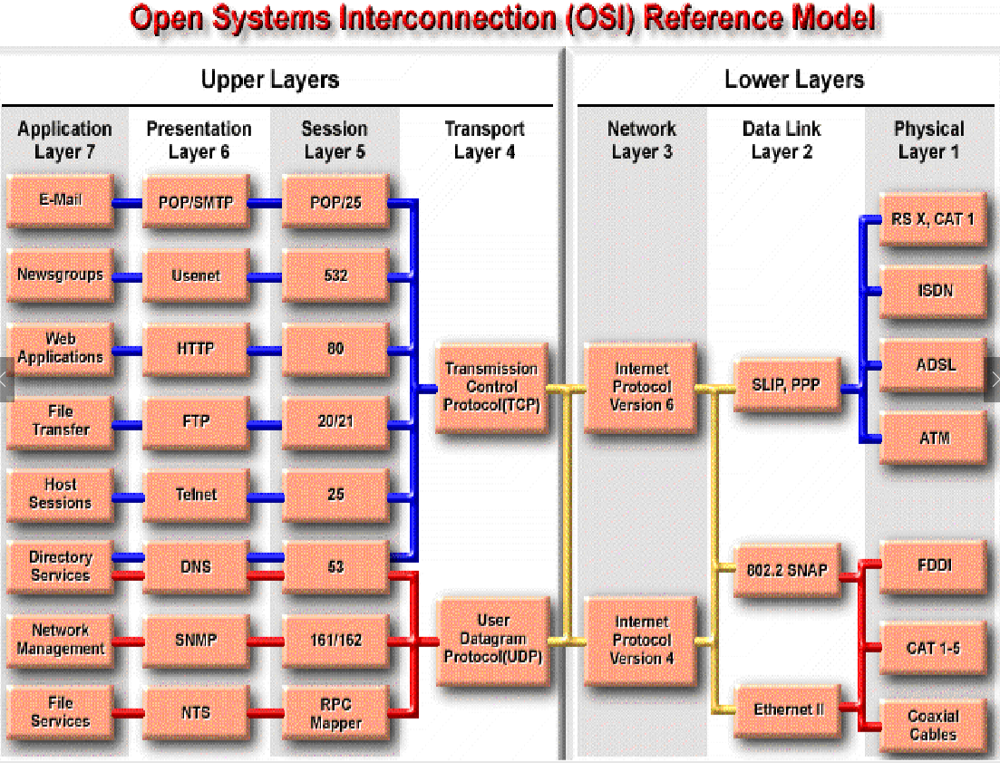
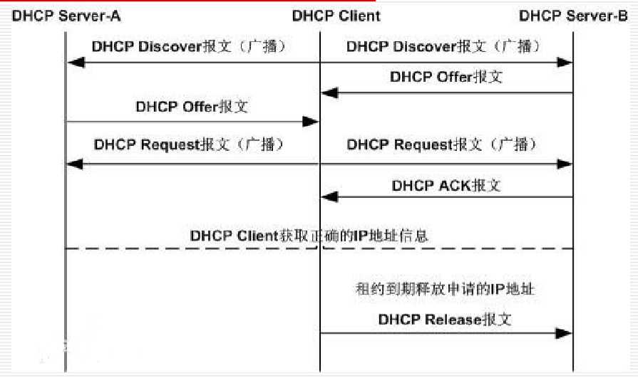

Lecture06-应用层
---
1. 本节PPT包含5-7三层:
   1. The Session Layer 会话层
   2. The Presentation Layer 展示层
   3. The Application Layer 应用层
2. 回顾
   1. 物理层决定介质传输形式
   2. 链路层决定介质传输是否存在相应控制，单位是帧，只能针对一段链路
   3. 网络层是基于Net、IP来做逻辑的搭建，能够实现跨网段传输
      1. 内网就是设置子网

   4. 传输层在IP的基础上细分到进程，能够实现对进程的定位，使用网络服务方是用户，用户能够在应用层面进行逻辑实现
   5. 应用层则是程序编程人员需要工作的地方，其是在第四层的基础之上，实现自己的**业务程序**
      1. 应用层进行再细分：会话层，展示层，应用层
      2. 能够划分是一回事，但是并不是所有应用都需要这些功能


<!-- TOC -->

- [1. 第五层：The Session Layer 会话层](#1-第五层the-session-layer-会话层)
  - [1.1. 第五层的职责](#11-第五层的职责)
  - [1.2. 第五层的服务](#12-第五层的服务)
  - [1.3. 第五层设备](#13-第五层设备)
- [2. Layer 6 - The Presentation Layer 第六层 表示层](#2-layer-6---the-presentation-layer-第六层-表示层)
  - [2.1. 数据格式](#21-数据格式)
    - [2.1.1. 图形文件格式](#211-图形文件格式)
    - [2.1.2. 多媒体文件格式](#212-多媒体文件格式)
  - [2.2. 数据加密与压缩](#22-数据加密与压缩)
- [3. Layer 7:The Application Layer 应用层](#3-layer-7the-application-layer-应用层)
  - [3.1. 应用层职责](#31-应用层职责)
  - [3.2. 超文本传输协议 (HTTP，HyperText Transfer Protocol)](#32-超文本传输协议-httphypertext-transfer-protocol)
    - [3.2.1. 统一资源定位符 URL(Uniform Resource Locator)](#321-统一资源定位符-urluniform-resource-locator)
    - [3.2.2. HTTP](#322-http)
    - [3.2.3. HTTP 的报文结构（请求报文）](#323-http-的报文结构请求报文)
    - [3.2.4. HTTP 请求报文的一些方法](#324-http-请求报文的一些方法)
  - [3.3. HTML(HyperText Markup Language)](#33-htmlhypertext-markup-language)
  - [3.4. FTP(File Transfer Protocol) and TFTP(Trivial File Transfer Protocol)](#34-ftpfile-transfer-protocol-and-tftptrivial-file-transfer-protocol)
    - [3.4.1. 主进程工作步骤](#341-主进程工作步骤)
    - [3.4.2. FTP 的屏幕信息举例](#342-ftp-的屏幕信息举例)
  - [3.5. Telnet 协议](#35-telnet-协议)
  - [3.6. SMTP(Simple Mail Transfer Protocol) and POP(Post Office Protocol)](#36-smtpsimple-mail-transfer-protocol-and-poppost-office-protocol)
    - [3.6.1. MIME(Multipurpose Internet Mail Extensions) 增加 5 个新的邮件首部](#361-mimemultipurpose-internet-mail-extensions-增加-5-个新的邮件首部)
    - [3.6.2. MIME(Multipurpose Internet Mail Extensions) 和 SMTP 的关系](#362-mimemultipurpose-internet-mail-extensions-和-smtp-的关系)
  - [3.7. SNMP(Simple Network Management Protocol) 简单网络管理协议](#37-snmpsimple-network-management-protocol-简单网络管理协议)
  - [3.8. 域名系统（DNS, Domain Name System）](#38-域名系统dns-domain-name-system)
    - [3.8.1. Domain Name 域名](#381-domain-name-域名)
    - [3.8.2. TLD (Top Level Domain) TLD（顶级域）](#382-tld-top-level-domain-tld顶级域)
    - [3.8.3. Domain Name Server 域名服务器](#383-domain-name-server-域名服务器)
    - [3.8.4. 结合域名服务器查找IP地址](#384-结合域名服务器查找ip地址)
  - [3.9. 应用层:沟通的方式](#39-应用层沟通的方式)
  - [3.10. DHCP(Dynamic Host Configuration Protocol，动态主机配置协议)](#310-dhcpdynamic-host-configuration-protocol动态主机配置协议)
    - [3.10.1. DHCP概述](#3101-dhcp概述)
    - [3.10.2. DHCP过程](#3102-dhcp过程)
      - [3.10.2.1. DHCP工作过程](#31021-dhcp工作过程)
      - [3.10.2.2. 发现阶段](#31022-发现阶段)
      - [3.10.2.3. 响应阶段](#31023-响应阶段)
      - [3.10.2.4. 选择阶段](#31024-选择阶段)
      - [3.10.2.5. 租约确认阶段](#31025-租约确认阶段)
      - [3.10.2.6. 租期续约](#31026-租期续约)
      - [3.10.2.7. 租期释放](#31027-租期释放)
      - [3.10.2.8. DHCP报文结构](#31028-dhcp报文结构)
    - [3.10.3. DHCP报文类型](#3103-dhcp报文类型)
    - [3.10.4. DHCP欺骗及防范](#3104-dhcp欺骗及防范)
      - [3.10.4.1. DHCP欺骗原理](#31041-dhcp欺骗原理)
      - [3.10.4.2. DHCP欺骗攻击](#31042-dhcp欺骗攻击)
      - [3.10.4.3. DHCP欺骗防范](#31043-dhcp欺骗防范)

<!-- /TOC -->

应用层：OSI中是5-7层，分为会话层，展示层，应用层；TCP已经保证了用户传输数据的可靠性，用户不能控制传输数据的过程（是有TCP保证的）如果用户想要对传输数据的过程做控制，就需要会话层

# 一 第五层：The Session Layer 会话层
1. TCP 控制传输，如果用户想要完成一定的数据控制，就会对应在会话层完成。

## 1. 会话层的职责

- 基于令牌流转进行交互发言，通过令牌活动和数据同步保证数据完整性(应用逻辑)

- 进行数据分段、拼接，保证传输可靠性。
- 同步技术，保证故障恢复。

## 2. 会话层的服务

- 通讯方式：
  - 单工？
  - 半双工？
  - 全双工？
- 通过的过程中可以实现控制，其有12个模块，包括活动链接，传输开始，数据校验，继续下一块，令牌转换等，如果发现故障，会进行重新连接，恢复到上一次同步点等
- 示意图
  - 首先建立会话连接，通知对方会话开始
  - 进行文件传输（作为一个活动），通知接收方活动开始
  - 每发出一个文件，设置一个同步点，保证接收方同步，方便接收方检验文件接受正确性
    - 主同步点：发完相对完整的数据后做主同步点的同步，接收方收到主同步数据信息后给予确认，说明这一块数据同步了是ok的，继续下一块；如果接收方不给予确认，说明这块数据有问题，需要恢复到上一次的同步点
      - 就是文件分成几块进行传输，传送失败只需要重传对应块即可
  - 文件传输完成/
- 
  - 一般来说网络应用在会话层都是有所体现的，是采用 C-S 模式，需要有一个会话模式


# 二 展示层

主要是解决不同底层的OS系统可能采用不同信息编码的问题

## 1. 表示层的功能与服务

- 屏蔽不同计算机在信息表示方面的差异
- 功能包括
  - 传送语法的协商
  - 传送语法和本地语法的转换
- 三个功能
  - 数据格式化
  - 数据压缩（压缩后传输提高效率）
  - 数据加密（因为网络是不安全的）

## 2. 数据格式

- 不同系统编码不一样，需要一个统一的标准
- 传输之前需要会话层进行协商，系统1和系统2进行协商，挑选出大家都能支持的编码进行传输，传输完成后连接删除
- 想象两个不同(dissimilar)的系统。
  1. 一种使用扩展二进制编码的十进制交换码（EBCDIC,Extended Binary Coded Decimal Interchange Code）格式化文本
  2. 另一种使用**美国信息交换标准码（ASCII）**格式化文本
  3. 选择大家都能识别的编码形式传输，保证大家都能理解
- 第6层提供了这两种不同类型的代码之间的转换
  - 可能是挑选出公用编码传输后，在通过第六层将公用编码转化为各自的常用编码？？

### 2.1 图形文件格式

1. 互联网通常使用两种二进制文件格式来显示图像：
   1. 图形交换格式（GIF，Graphic Interchange Format）
   2. 联合图像专家组（JPEG，Joint Photographic Experts Group）。
2. 任何具有读取器的GIF和JPEG文件格式的计算机都可以读取这些文件类型，而与计算机的类型无关。

### 2.2 多媒体文件格式

1. 多媒体文件格式是另一种二进制文件，它存储声音，音乐和视频。
   1. 这些文件可以完全下载，然后播放，也可以在播放时下载。
   2. 后一种方法称为流音频。

## 2.2. 数据加密与压缩

1. 第6层负责数据加密：数据加密可在信息传输过程中保护信息。
2. 表示层还负责文件的压缩。

# 3. 第七层：The Application Layer 应用层


1. 从物理层的介质和编码开始，其对应到不同的关于网或局域网
2. ipv4，ipv6
3. TCP，UDP
4. 会话层是对端口的通讯进行相关管理
5. 表示层对应到不同协议，说明不同协议有不同标准
6. 应用层则是不同应用界面（最接近用户）

## 1. 应用层职责
1. 确定并确定预期的通信合作伙伴的可用性
2. 同步合作的应用程序
3. 同步协作的应用
4. 建立有关错误恢复程序的协议
5. 控制数据完整性
6. 通过网络应用(network applications)为OSI模型的其余部分提供一个直接接口，或是通过独立应用提供非直接接口，如文字处理，电子表格，演示管理器(presentation managers)，网络重定向器
7. 不同应用不同情况

## 2. 超文本传输协议 (HTTP，HyperText Transfer Protocol) 


1. 和电视机类似，其都是和远端的设备连接，或的内容得以展示，
2. HTTP通过浏览器这个框架去，在这里面切换不同的显示内容，其中通过URL实现切换
3. 一个超文本有多个信息源点组成，内容规范，客户程序向服务器发出请求，服务器传回HTML文档。
4. 如何实现www上各种链接的通讯？通过超文本传输协议
5. 如何将不同风格的万维网文档在浏览器客户端中显示？基于一种标准：HTML语言来实现
6. 如何去关联浏览机制和我们需要获得的信息？通过搜索引擎

### 3.1 统一资源定位符 URL(Uniform Resource Locator)

- 统一资源定位符 URL 是对可以从因特网上得到的资源的位置和访问方法的一种简洁的表示。
- URL 给资源的位置提供一种抽象的识别方法，并用这种方法给资源定位。
- 只要能够对资源定位，系统就可以对资源进行各种操作，如存取、更新、替换和查找其属性。
- URL 相当于一个文件名在网络范围的扩展。因此 URL 是与因特网相连的机器上的任何可访问对象的一个**指针**。 
- `<URL的访问方式>://<主机>:<端口>/<路径>`
  - 访问方式：一般是协议标准，如HTTP，GTP等
  - 主机：网络层是IP地址，应用层可以看作域名（会有底层将其翻译成IP地址）
  - 端口：对应的进程
  - 路径：通过路径指定到进程中特定的一个对象

### 3.2 HTTP概述

- HTTP是**面向事务的客户服务器协议**
- HTTP1.0协议是**无状态**的
  - 发送的请求是独立的，不相关的，服务端不会记录收到请求的上下文，无法根据上一次请求的相关信息来处理当前请求
- HTTP协议本身是**无连接的**，但是它使用的传输层协议是面向连接的TCP（在传输层保证数据的可靠性）
- 万维网浏览器就是一个HTTP客户，而在万维网服务器等待HTTP请求的进程叫做 HTTP daemon，或简写为 HTTPD
- HTTP daemon 在收到 HTTP 客户的请求后，把所需的文件返回给 HTTP 客户。

### 3.3 HTTP报文结构

分为请求报文和应答报文，结构都类似于下图


- 报文由三个部分组成，即开始行，首部行，实体主体
  - 其是字符编码，通过CTRL+F作为换行符；
  - 如果是请求报文，开始行就是请求行
  - 首部和实体也是通过一行CTRL+F来作为分割
- 首部行：是首部字段，包含响应请求等各类首部，如connection等
- 实体主体：不一定要有
- 应答报文，由应答的版本号和不同的应答状态码
  - 2xx:成功
  - 3xx:重定向
  - 4xx:错误
  - 5xx:服务器内部错误

### 3.4 HTTP请求报文

| 方法（操作） | 意义                            |
| ------------ | ------------------------------- |
| OPTION       | 请求一些选项的信息              |
| GET          | 请求读取由URL所标志的信息       |
| HEAD         | 请求读取由URL所标志的信息的首部 |
| POST         | 给服务器添加信息（例如，注释）  |
| PUT          | 在指明的URL下存储一个文档       |
| DELETE       | 删除指明的URL所标志的资源       |
| TRACE        | 用来进行环回测试的请求报文      |
| CONNECT      | 用于代理服务器                  |

## 3. HTML(HyperText Markup Language)
1. 定义了许多用于排版的命令（标签）。
2. HTML 文档是一种可以用任何文本编辑器创建的 ASCII 码文件。
3. 仅当HTML文档是以.html或.htm为后缀时，浏览器才对此文档的各种标签进行解释。
4. 当浏览器从服务器读取HTML文档，针对HTML文档中的各种标签，根据浏览器所使用的显示器的尺寸和分辨率大小，重新进行排版并恢复出所读取的页面。
5. HTML用一对标签（一个开始标签和一个结束标签）或几对标签来标识一个元素。

## 4. FTP(File Transfer Protocol) and TFTP(Trivial File Transfer Protocol)

- FTP是一种可靠的，面向连接的文件传输的服务，它使用TCP传输
  - 因特网早期的传输主要是文件传输，FTP传输占1/2
  - 能够做到跨不同网络系统，文件系统实现文件传输
  - FTP首先在服务器的21端口和客户端建立**控制连接**
  - 控制连接建立后，需要传输数据，需要建立第二个连接（端口20）
- TFTP是无连接服务，使用UDP传输(简化的FTP)
  - 小且实现简单，容易部署，特定网络条件下效率较高
  - 没有完备的命令集合，不支持交互，没有目录浏览功能
  - 例如： TFTP在路由器上用于传输配置文件和Cisco IOS映像

### 4.1. FTP工作步骤

1. 服务器打开熟知端口（端口号为 21），使客户进程能够连接上。(可以修改熟知端口)
2. 等待客户进程发出连接请求。(控制连接)
3. 启动从属进程来处理客户进程发来的请求(数据连接)（服务器可以处理其他客户端发来的请求）。从属进程对客户进程的请求处理完毕后即终止，但从属进程在运行期间根据需要还可能创建其他一些子进程。
   1. 控制连接
   2. 数据连接:数据通信
   3. 需要建立上面两个连接才能进行传输

4. 回到等待状态，继续接受其他客户进程发来的请求。主进程与从属进程的处理是并发地进行。（所以可以处理多个请求，实现多链接响应）

### 4.2. FTP 的屏幕信息举例
```
用户要用FTP和远地主机(网络信息中心NIC上的主机)建立连接。
域名:nic.ddn.mil
[01] ftp nic.ddn.mil
本地FTP发送的连接成功信息
[02] connected to nic.ddn.mil
从远地服务器返回的信息，220表示“服务就绪”
[03] 220 nic FTP server (Sunos 4.1)ready.
本地FTP提示用户键入名字。用户键入的名字表示“匿名”。用户只需键入anonymous即可(匿名)
[04] Name: anonymous
数字331表示“用户名正确”，需要口令
[05] 331 Guest login ok, send ident as password.
本地FTP提示用户键入口令。用户这时可键入guest作为匿名的口令，也可以键入自己的电子邮件地址，即耶鲁大学数学系名为xyz的主机上的abd(匿名密码是随意输入的)
[06] Password: abc@xyz.math.yale.edu
数字230表示用户已经注册完毕
[07] 230 Guest login ok, access restrictions apply.
“ftp>"是FTP的提示信息。用户键入的是将目录改变为包含RFC文件的目录
[08] ftp> cd rfc
字符“CWD"是FTP的标准命令，表示Change Working Directory
[09] 250 CWD command successful.
用户要求将名为rfc1261.txt的文件复制到本地主机上，并改名为nicinfo(get 获取到本地)
[10] ftp> get rfc1261.txt nicinfo
字符PORT是FTP的标准命令，表示要建立数据连接。200表示“命令正确”
[11] 200 PORT command successful.
数字150表示“文件状态正确，即将建立数据连接”
[12] 150 ASCII data connection for rfc1261.txt (128.36.12.27,1401) (4318 bytes).
数字226是“释放数据连接”，现在一个新的本地文件已经生成。
[13] 226 ASCII Transfer complete. local: nicinfo remote: rfc1261.txt 4488 bytes received in 15 seconds (0.3 Kbytes/s).
用户键入退出命令。
[14] ftp> quit
表示FTP工作结束
[15] 221 Goodbye. 
```

## 5. Telnet 协议
- 通过TCP，将本地连接到远端的另一个主机，Telnet是远端的域名或IP，要输入参数使得本地进程与远端服务器一致，结果是本地进程好像泡在服务器一样，本地作为远端服务器的一个超级终端，进行相关操作
- Telnet客户端软件提供了登录到运行Telnet服务器应用程序的远程Internet主机，然后从命令行执行命令的功能。


- 因为键盘的快捷键或指令是有差异的，所以需要将键盘输入翻译成标准输入，到服务器再翻译成其能接受的信息

## 6. SMTP and POP 邮件发收相关协议

SMTP(Simple Mail Transfer Protocol) and POP(Post Office Protocol)

- 用于Email发邮件的相关协议
  - SMTP用于邮件发送，规定两个相互同行的SMTP进程怎么交互，
  - POP3 用于邮件接受，邮件到达目的地，客户端和服务端联系将邮件收上来的过程
- 
  - 邮件通过SMTP协议，从发送方发送到发送方服务器，通过互联网到达收件方服务器
  - 通过POP3协议，从收件方服务器到达收件方PC

### 6.1. MIME 因特网邮件扩充

MIME：(Multipurpose Internet Mail Extensions)

1. MIME-Version: 标志 MIME 的版本。现在的版本号是 1.0。若无此行，则为英文文本。
2. Content-Description: 这是可读字符串，说明此邮件主体是否是图像、音频或视频。
3. Content-Id: 邮件的惟一标识符。
4. Content-Transfer-Encoding: 在传送时邮件的主体是如何编码的。
5. Content-Type:说明邮件主体的数据类型和子类型。

### 6.2. MIME(Multipurpose Internet Mail Extensions) 和 SMTP 的关系


- MIME标准扩充了SMTP标准
- SMTP和HTTP一样，只能传输ASCII码内容，用户输出的文件可能并非ASCII码文件，所以需要MIME协议进行扩充成ASCII码内容
- 再用户接受文件时，再通过MIME将收到的ASCII码对应文件转化成用户能够接受的格式

## 7. SNMP 简单网络管理协议

SNMP(Simple Network Management Protocol)

- 这个协议用于网络管理，对网络厘米那的主机做网络管理相关标准
- 简单网络管理协议（SNMP）是一种应用程序层协议，可简化网络设备之间的管理信息交换。


- NMS(Network Management System)：管理者或者说是用于监控的主机对于其他主机进行管理
- 其他主机运行Agent，和管理者通过管理信息库Management database进行交流
- NMS能够向被管理者发送请求获取信息，如带宽…，从而对整个网络的情况进行管理
- 使用UDP通过广播进行实现。

## 8. 域名系统（DNS, Domain Name System）

- 在Alpha Net的时代，主机并不多，只需要知道主机的IP地址即可解决通信问题，或者直接把主机的地址信息写入本地的Host文件中
- 由于主机的数量不断增大，再写入本地或者交给使用者去记忆就不现实了
- 因此需要DNS机制，能够将我们知道的域名翻译成IP地址

- 域名系统（DNS）是网络上的服务，该服务管理域名并响应客户端将域名转换为关联IP地址的请求。


- 上图左边是IP地址，右边是域名

  

### 8.1. Domain Name 域名结构


- 使用`.`将一段字符串分开,点之间的字符串可以比较长（63个bytes都是合法的），但是一般不会太长
- 越后面的域名级别越高，
  - TLD(顶级域名)：比如com表示所有的公司都会用com域名
  - 2LD(二级域名)：sina表示公司是sina这一家
  - 3LD(三级域名)：www指示sina公司下的某一个主机或主机群，


#### TLD 顶级域名

TLD (Top Level Domain)

- TLD是由国际internet组织进行规范的，目前已有的有247个国家顶级域名，17个通用顶级域名(还在扩充，现在可能不止)
- 国家TLD（nTLD）
  1. .cn(CHINA) 中国
  2. .us (United States) 美国
  3. .uk (United kingdom), etc. 英国等等
- 通用TLD（gTLD），最早的域包括：
  1. .com   Enterprises and companies 企业和公司
  2. .net    Network services providers 网络服务提供者
  3. .org    Nonprofit organizations 非盈利组织
  4. .edu   Educational facilities 教育机构
  5. .gov   Governments (only for U.S.A) 政府(美国)
  6. .mil   Military facilities (only for U.S.A) 军方(美军)
  7. .int    International organizations 国际组织
- Infrastructure domain 基础设施领域
  1. Only one: arpa, for resolving domain names reversely 仅一个：arpa，用于反向解析域名，即将IP解析成域名
- Recently, new TLD domain added:
  1. .aero  （航空运输企业）
  2. .biz    （公司和企业）
  3. .cat    （加泰隆人的语言和文化团体）
  4. .coop （合作团体）
  5. .info  （各种资讯）
  6. .jobs  （人力资源管理者）
  7. .mobi（移动产品与服务的用户和提供者）
  8. .museum （博物馆）
  9. .name   （个人）
  10. .pro （经过认证的专业人员）
  11. .travel  （旅游业）

### 8.2 Domain Name Server 域名服务器


- 所有顶级域下面都有二级域名，有的二级域名下面可能会有三级域名
- 同一个域名可能有不同的等级，比如edu可以是从属于顶级域名层cn的二级域名，也可以单独作为顶级域名，二者对应IP的指向主机的内容可能会有重叠
- 同一个域名可能也有不同的名称，比如顶级域名jp下的edu叫做ac，com叫做co，这个是由语言规范决定的
- 上层域名呢能够对下层域名做管理
- 为了对顶级域名做管理，如果想要知道顶级域名对应的服务器在哪，只需要去访问根域名服务器去里面查找顶级域名服务器对应的IP，再到对应顶级域名服务器种查找对应二级域名的IP地址，逐级往下找

### 8.3 结合域名服务器查找IP地址

- 配地址：配IP地址，子网掩码（为了确认网段），网关（为了出网段），DNS server（本地域名服务器，为域名解析提供服务）、
- DNS系统以层次(hierarchy)结构设置，该层次结构创建不同级别的DNS服务器。
- 向本地域名服务器请求解析域名得到IP地址
  - 如果可以，将其返回个给客户端
  - 如果不行，将它发送到更高级别的DNS server


- 请求分为两种:
  - 能够应答
  - 不能够应答
- 递归地进行查找:具体过程在上图
  - 就先找根服务器，找顶级域名com对应服务器的IP电子hi
  - 到顶级域名com的服务器，找二级域名163对应服务器的地址
  - 到级域名163对应服务器，找www对应主机的IP地址
  - 最后会存入本地服务器缓存，以待备用
- 下面递归，上面迭代？？

## 9. 应用层通讯方式的分类
1. 通信处理发生的一种方式：无上下文，一次请求完成后就断开
   1. 当浏览器打开时，它将连接到默认页面，并且该页面的文件将传输到客户端。
   2. 处理完成后，连接断开
2. 第二种方式：有上下文，直到整个任务完成后才断开
   1. 作为Telnet和FTP，建立与服务器的连接并保持该连接，直到执行所有处理。
   2. 当用户确定他/她已完成时，客户端将终止连接。
3. 所有的交流活动都属于这两类之一。

## 10. DHCP 动态主机配置协议

DHCP (Dynamic Host Configuration Protocol)

### 10.1. DHCP概述
1. 一个协议软件在使用之前先作正确协议配置，具体配置内容取决于协议。
   1. 

2. 接到因特网的计算机的协议软件需要配置的项目包括：
   1. IP 地址
   2. 子网掩码
   3. 默认路由器的 IP 地址(网关)
   4. 域名服务器的 IP 地址
3. Dynamic Host Configuration Protocol 可以高效动态地分配IP地址
   1. 局域网的网络协议
   2. 使用UDP来实现
4. 目前一般都是自动获取IP地址，而不需要手动去获取IP地址等信息

### 10.2 DHCP过程



- 一共有一个客户端client，两个服务端serverA、B
- 首先client发DHCP Discover关闭报文
- server 端收到广播后，会回复DHCP Offer报文
- client会根据报文到达的时序，选择优先到达的server，继续发送一个DHCP request 广播报文，告诉A自己需要的server不是他，告诉B自己需要的是他
- Bs erver收到广播请求后，再给client发送一个 DHCP ACK的确认报文，client身份获得认可，可以正常使用
- DHCP地址获取是有租期的，到期或续租或者释放都可以
- 
- 问题：AB的信息不对称不同步
  - 问题描述：局域网的某个地址已经被B分配了但是A不知道，A继续分配就会出现问题，
  - 解决方法：DHCP Request的广播里面会携带B分配给client的地址信息，告知A进行标记与同步


#### 发现阶段


- DHCP Client开始并不知道DHCP Server的 ip 地址,因此以广播的方式发出DHCP Discover报文
- 广播携带地址是自己的MAC地址
- server种记录的是地址分配情况：哪些地址还未分配，哪些地址分配给谁了

#### 响应阶段


- DHCP Server在IP地址池中查找合法的IP地址通过DHCP Offer报文提供给DHCP Client

#### 选择阶段


- DHCP Client选择一个DHCP Offer报文（一般 选择最先收到的DHCP Offer报文），向网络发送一个DHCP Request广播数据包，所有的Server进行同步（即所有server都确认哪个iP地址一斤被分配）

#### 租约确认阶段


- DHCP Server接收到DHCP Request消息后，以DHCP ACK消息向DHCP Client广播成功的确认；出错则广播否定确认消息DHCP NAK

#### 租期续约


- 在租期中，DHCP Client直接向为其提供IP地址的DHCP Server发送DHCP Request消息，收到回应的DHCP ACK消息后，DHCP Client根据所提供的新的租期以及其它更新的 TCP/IP 参数更新自己的配置，IP租用更新完成

#### 租期释放


- 当DHCP Client不再需要使用分配IP地址时，就会主动向 DHCP Server发送Release报文，告知不再需要分配IP地址，DHCP Server会释放被绑定的租约
- 实际上很少使用release，一般都是不用了直接关机走人，而租期到时间后，Server会主动询问，如果没有应答会自动释放

### 10.3 DHCP报文结构


1. OP:报文类型，1表示请求，2表示应答
2. HTYPE:硬件地址类型，1表示范围为10M以太网地址
3. HLEN:以太网地址长度，10M为6
4. Hops:是否使用代理服务器进行处理
   1. 使用代理服务器后会出现跳数


### 10.4 DHCP报文类型
1. DHCP Discover：发现
2. DHCP Offer：提供
3. DHCP Request：告知决定
4. DHCP ACK：租约确认
5. DHCP NAK：租约不确认
6. DHCP Release：释放租约
7. DHCP Decline:收到Ack后，Client告诉服务器不接受
8. DHCP Inform:客户端向服务器端请求详细信息

### 10.5 DHCP欺骗及防范

#### DHCP欺骗原理
1. 客户端以广播的方式来寻找服务器，并且只接收第一个到达的服务器提供的网络配置参数。
2. 非授权的DHCP服务器先应答，客户端最后获得的网络参数即是非授权的，客户端即被欺骗。
   1. (恶意服务器把自己作为默认网关，客户端需要出网段都需要经过默认网关，因此报文信息会被其截获)

3. 在实际应用DHCP的网络中，基本上都会采用DHCP中继，因此本网络的非授权DHCP服务器一般都会先于其余网络的授权DHCP服务器的应答（由于网络传输的延迟），在这样的应用中，DHCP欺骗更容易完成。

#### DHCP欺骗例子


1. 首先PC发出DHCP请求，进行广播
3. 伪装者收到后，DHCP伪装者给出应答


- DHCP Server也会给出应答，但是可能比伪装者慢
- 这样子A收到的就是伪装者的报文


- B告诉A它默认网关是B自己，所以A上网(需要跨网段)的请求就发送给B，B转发给默认网关上网，然后返回信息给B，自己再返回给A
- 这样就实现了帮助A上网同时能够获取A的相关信息
- 解决方法：除了服务器不应该启动DHCP进程，但是很难保证

#### DHCP欺骗防范
1. 在交换机上启用DHCP Snooping功能 DHCP Snooping技术通过建立和维护DHCP Snooping绑定表过滤不可信任的DHCP信息：
   1. 比如B的DHCP进程不能通过认证，交换机拒绝进行转发
   2. 具体配置
      1. 在交换机的全局配置模式中启用DHCP Snooping:`switch (config)# ip dncp snooping`
      2. 在交换机的全局配置模式中开启需要启用DHCP Snooping 的VLAN":`switch (config)# ip dhcp snooping vlan vlan号`
      3. 在端口配置子模式中将授权DHCP服务器所连的端口设为信任端口（缺省都是非信任的端口）:就是连接到DHCP Server的端口:`switch (config-if)# ip dhcp snooping trust`