到7.4 LSP协议！

lecture07-Routing and Routers 路由器和网络
---

<!-- TOC -->

[TOC]

<!-- /TOC -->

# 一 路由器基础

## 1. 路由器的内部组件

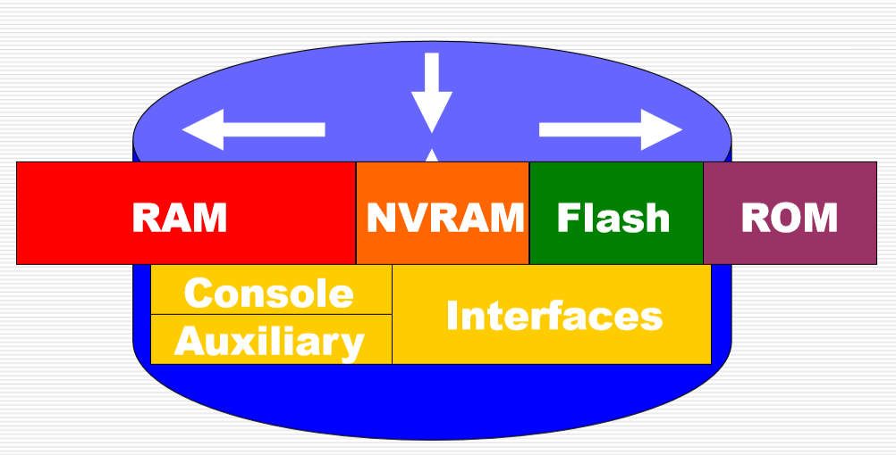

- 是有特殊组件的计算机
- 控制口(console):进行具体的调试
- 辅助口(Auxiliary):一般不用，但是可能会用到

### 1.1 随机存取存储器(RAM, Random Access Memory)
- 局限：必须带电才能保证内容的存储

  1. 因为其需要电压差来存储01，如果没电了就无法记录
  2. 断电或重新启动时RAM内容丢失

- 优点：访问速度快：直接根据地址位就可以读到内容，而不用像文件系统需要逐步深入（分区，具体文件）

  - 路由器**配置文件的临时存储**，一般做为**内存**使用

- 存储对象：开机之后才学习到的，且使用、更新频率高，

  - 路由表
    - 使用、更新频率高，

  - ARP缓存
  - 快速切换缓存
  - 报文缓存:可能前面有正在处理的，需要等待
  - 数据包保留队列

  

### 1.2 非易失随机存取存储器(NVRAM, Non-volatile RAM)
- 特点：能够快速存取且非容易失去，但存储空间有限
  - 实际上是在RAM基础上放电池来供电，保证其不会断电
  - 因此路由器掉电或重启时内容不会丢失。

- 存储对象
  - 存放**启动配置文件或者备份文件**

### 1.3 Flash (相当于台式机硬盘)
- 电子可擦可编程只读存储器(EEPROM, Electronically Erasable Programmable Read-Only Memory)

- 特点：

  - 断电保持
  - 允许更新软件而无需更换闪存芯片

- 存储对象

  - **存储**了Cisco IOS（**互联网操作系统**）
  - 可以存储多个版本的IOS

  

### 1.4 (ROM, Read-Only Memory)

- 特点
  - 包含POST：开机自检的时候，读取硬件参数，和卸写在ROM里的参数进行对比，如果相同，则代表自建正常
- 存储对象
  - **引导程序（加载Cisco IOS）**
  - 也可以直接存储 精简版的 IOS备份
    - 因为路由器比较小，所以他可能没有完整的操作系统，又因为其不需要很复杂的服务，所以可以安放一个很小的操作系统到ROM中

### 1.5. 接口

路由器特有的,

- 主要是为了通讯，大部分都是网口
- 实现多个网络连接，插口上有多个模块，每个模块有多个口
  - 比如0/0，就是第一个模块的第一个口
- 串口接口可能还分多个，比如存在0/0/0。

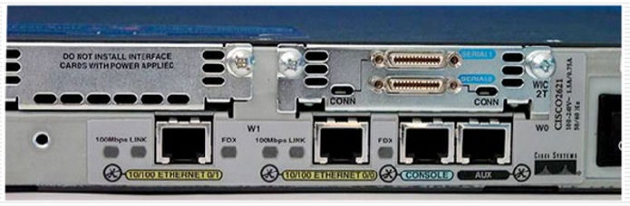

## 2. 路由器启动(startup)步骤

### 2.1 系统启动程序
1. 执行开机自检（POST）：在此自检期间，路由器从所有硬件模块上的ROM执行诊断（硬件参数和ROM中的参数进行）：如果有问题（内存错误等）导致操作系统无法重启，那么我们就需要对硬件进行检查
2. 硬件没问题，则需要对基本参数做校验：如验证CPU，内存和网络接口端口的基本操作。
3. 最后定位操作系统，将参数载入操作系统，更新配置文件，进行软件初始化

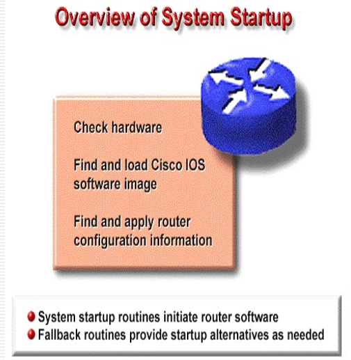

### 2.2. 软件启动程序
1. 步骤1:ROM中的通用引导加载程序(bootstrap)在CPU卡上执行。
2. 步骤2:可以在以下几个位置之一找到操作系统（Cisco IOS）。该位置在配置寄存器的引导字段中公开。
3. 步骤3:加载操作系统映像。
   1. 先从Flash找，也就只有一个image文件，将image导入内存
   2. 如果image找不到，则到TFTP Server，如果能找到则下载下拉一个image
   3. 如果TFTP也没有配置，则去ROM中导出IOS
4. 步骤4:将保存在NVRAM中的**配置文件**加载到主存储器中，并一次执行一行。
   1. 先看NVRAM中有没有配置(start.config)
   2. 然后看TFTP Server有没有配置，如果有则下载一个
   3. 如果都没有，用console进行配置
5. 步骤5-如果NVRAM中**没有**有效的配置文件，则执行问题驱动(question-driven)的初始配置例程，该例程称为系统配置对话框，也称为**设置模式**。

### 2.3. 图示展示初始化过程（系统+软件初始化）
1. 设置不用作在路由器中输入复杂协议功能的模式。
2. 对于大多数路由器配置任务，应使用安装程序提出最少的配置，然后使用各种configuration mode命令而非安装程序

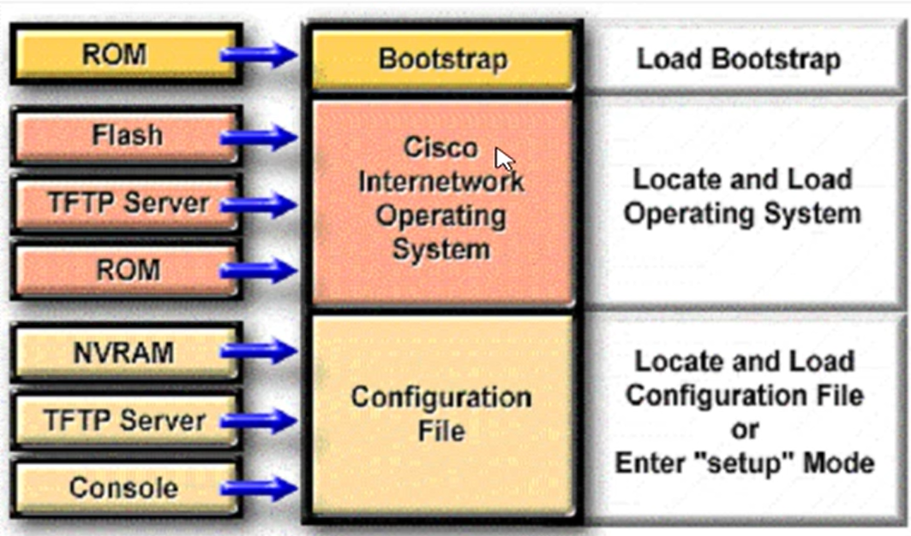

- 首先开机自检 POST
- 其次载入IOS
  - 优先级是Flash > TFTP Server > ROM
- 进行相关配置
  - 配置获取的优先级是 NVRAM > TFTP Server > Console
    - Console：命令行交互方式进行获取
- 启动过程命令图示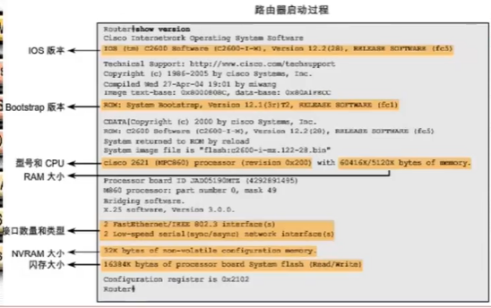

### 2.4. 查看和修改基本的路由器配置
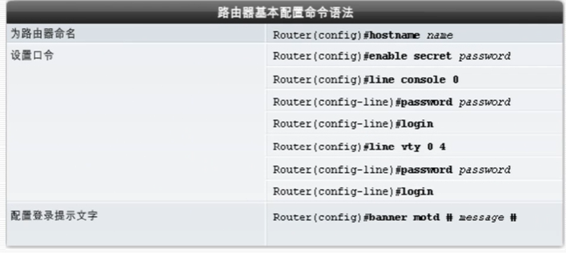

- enable进入特权模式，conf -t 进入全局配置模式，之后就可以进行上述命令配置
- 
- 其他更加具体命令内容，可以在命令行下使用`?`来看
- `config`模式是全局配置。
- banner:配置登录提示文字:一般会写路由器是谁用的，干什么用的，谁登录是非法的。
- `show version`命令可以查看到路由器的配置信息。

### 2.5. 执行基本的编址方案
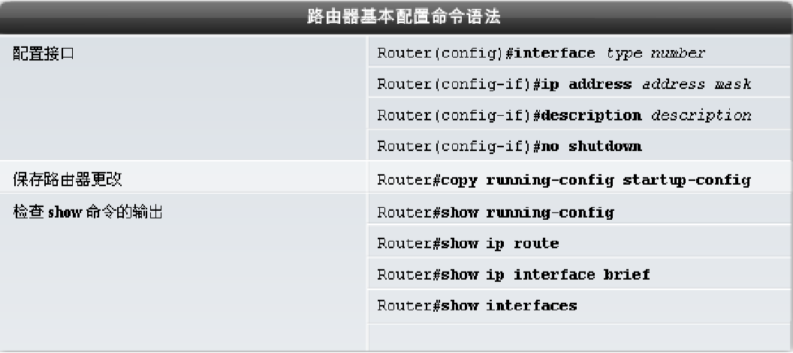

1. 配置接口，每一个接口可以配置一个描述
3. no shutdown:启动端口
4. 可以拷贝配置情况进入startup中

# 三. 路由和配置

## 3.1. 使用网络寻址进行路由 

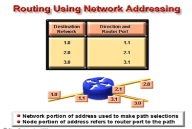

1. 路由器通常使用两个基本功能（路径确定功能和交换功能）将数据包从一条数据链路中继(relay)到另一条数据链路。
   1. **交换功能**允许路由器在一个接口上**接受数据包**并**通过第二个接口转发。**
   2. **路径确定**功能使路由器能够选择**最合适的接口**来**转发数据包**。
2. 路由器使用**地址的网络部分**进行路径选择，以将数据包传递到下一个路由器
3. **地址的节点部分**由直接连接到目标网络的路由器使用，以将数据包传递到正确的主机。

## 3.2. 静态和动态路由
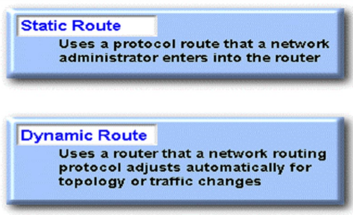

### 3.2.1. 静态路由

#### 概念

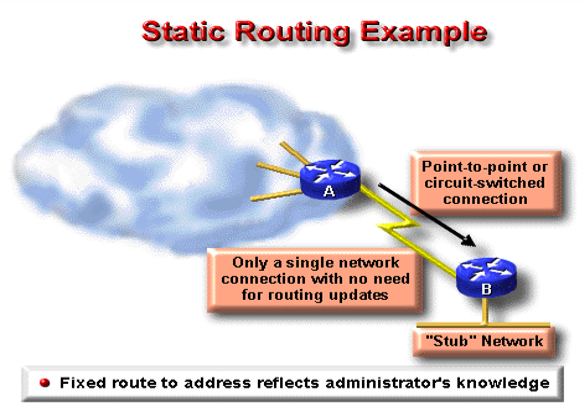

1. 尽管(whereas)动态路由倾向于显示(reveal)有关互联网络的所有已知信息，但是出于安全原因，您可能希望隐藏互联网络的某些部分。
   1. 静态路由不需要每个路由掌握整个网段的信息，能够实现信息隐藏，比如B只知道A路由的位置，而不知道A到达的其他路由的位置

2. 当只有一条路径可访问网络时，到网络的静态路由就足够了。
3. 这种分区称为末节网络(Stub Network)（B只知道A，其他地方对B隐藏，由A转发）

#### 静态路由配置
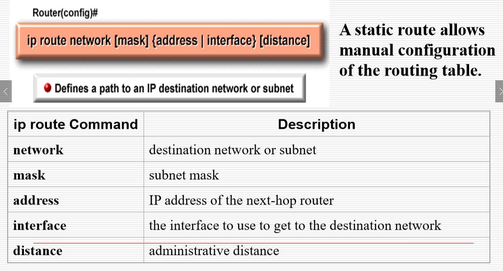

1. network:包含掩码
2. address:要确定下一跳地址
3. Distance:管理距离
   1. **管理距离(administrative distance)**是路由信息源的可信赖性的等级，表示为从0到255的数值。(管理距离)
   2. 数字越大，可信度(trustworthiness)越低。
   3. 因此静态路由的管理距离通常很短（默认值为1）
   4. 管理距离是0的路由是什么情况?直连网段是最可信的，比静态路由还高

### 3.2.3 动态路由
1. 动态路由协议还可以重定向网络中不同路径之间的流量（或负载分担(loadshare)）
2. 往往网络是冗余的，保证连通性（比如A->C有两条路径可以走）
   1. 静态路由的问题:如果指定的路径中出现故障就会出问题，而动态路由通过冗余避免了这个问题。

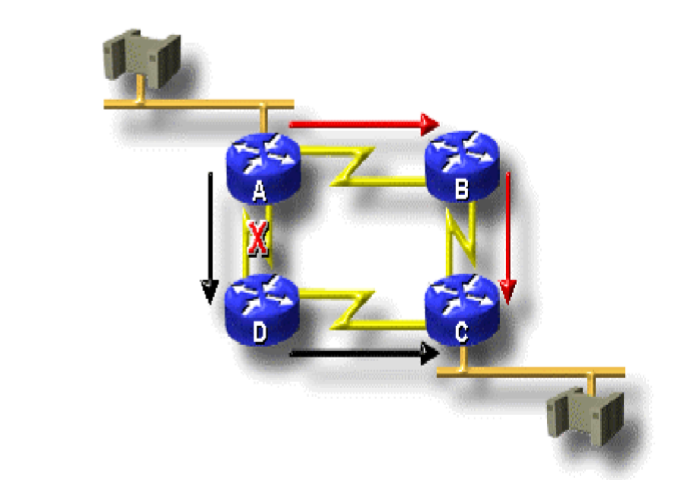

1. 动态路由依赖于路由协议在路由器之间共享知识。
2. 动态路由取决于两个基本路由器功能：
   1. 维护(maintance)路由表(动态维持的)
   2. 向其他路由器分发(distribution)路由信息

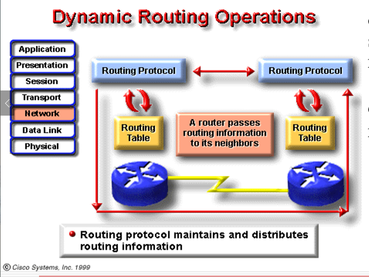

3. 彼此基于协议交换信息

#### 收敛时间 — 动态路由协议评判标准
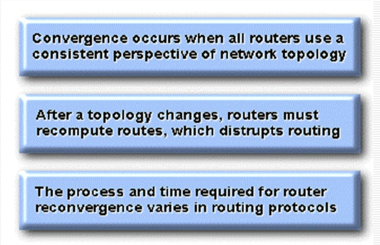

1. 收敛状态：网络稳定的状态
1. 收敛时间:
   1. 从刚启动到收敛状态的时间
   2. 从发生变化到收敛状态的时间
2. 收敛时间越短，路由协议越强，需要路由器的基本硬件支持。

### 3.2.4 动态路由协议分类
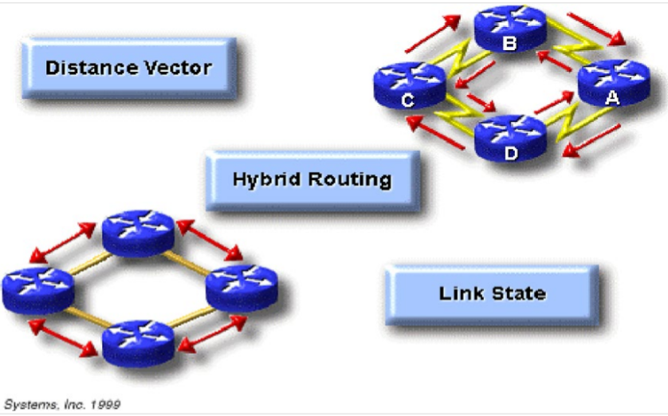

1. 大致分为以下三类:
   1. 距离矢量(DV,Distance Vector)
   2. 链路状态(LS,Link State)
   3. 混合路由(HR,Hybird Routing)
2. 其中Hybrid Routing是在两种之间

#### 距离矢量协议

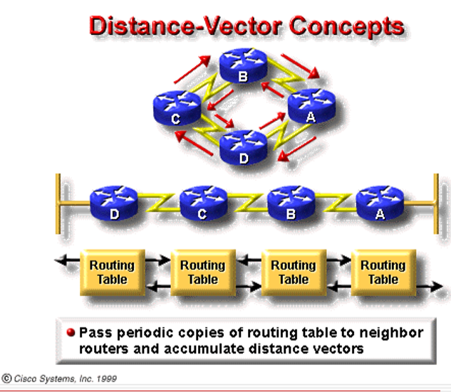

1. 距离矢量算法不允许路由器知道互联网络的**确切拓扑**
2. 基于距离矢量的路由算法（也称为Bellman-Ford算法）在路由器之间传递路由表的周期性副本。
   1. 大家交换Routing Table
   2. 只知道可达，但是不知道怎么可达(知道where,但是不知道how)，不知道整个网路的具体拓扑

##### DB缺陷：路由环路问题

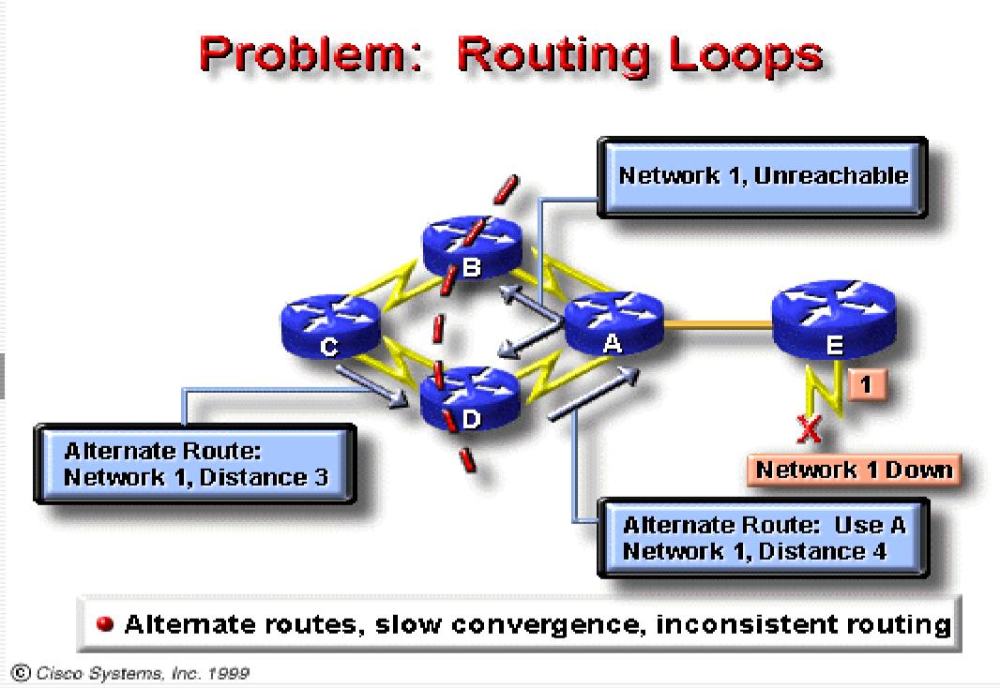

- **稳定之后**,如果NetWork1不可到达
- B和D通过两跳，同步了A不可达Network1的路由
- 但是在B，D将路由表同步给C前，C如果将network可达的路由表同步给D，会导致环路问题
  - D同步了A，知道A不可达，但是C的路由表显示自己4跳可达，那么D认为通过C经过5跳可达，A认为通过D 6跳可达，循环往复，代价不断增大（因为他们只知道能否到达，而不知道怎么到达）

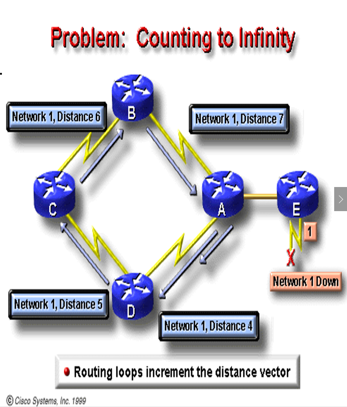

1. 网络1的无效更新将继续循环，直到其他进程停止循环为止。
2. 尽管有一个基本事实，即目标网络（网络1）已关闭，但这种称为计数到无穷大的条件却使**数据包在网络中连续循环**。
3. 当路由器计数到无穷远时，无效信息将允许存在路由环路。

##### 路由环路解决方案一：定义最大值(Maximum)
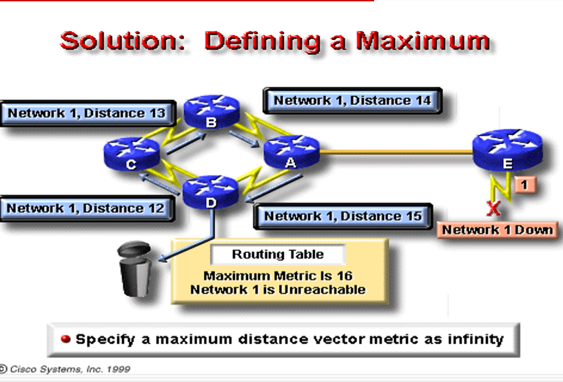

1. 设置最大跳数，比如最多转发15跳，16跳以上为不可达

##### 路由环路解决方案二：路由毒化(Route Poisoning)

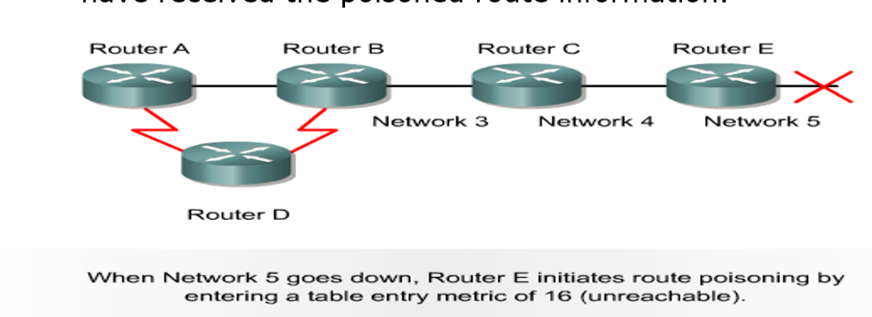

1. 当网络5发生故障时，路由器E通过将网络5的表条目设置为**16或不可访问**来启动路由中毒。(而不是删除条目)

2. 、当路由器C从路由器E接收到路由中毒时，它会将更新（称为毒性逆转，poison reverse）发送回路由器E。这确保网段上的所有路由器都已接收到中毒的路由信息。

3. 最终所有的路由器都知道不可达

4. 路由毒害，由信息在路由表中失效的时候，把该表项的的度量值（metric）设为无穷大16，而不是马上从路由表中删掉这条路由信息，再将其信息发布出去，这样相邻的路由器就得知这条路由已无效了

   > 就是将跳数设置为超过最大值，根据最大值规则告知不可达

##### 路由环路解决方案三：水平分隔(Split Horizon)

1. 从某个端口发送路由信息，不能再从相同端口接受报文接收方返回的跳数更多的信息
2. 比如A发送给B和D，之后B和D又把相同报文(跳数+1)还给A，这时候就不接受B和D的，A只接受通向E的端口收到的数据
   1. 但是如果B和D接收到其他的到达目的网段1更短的路径，将路由表同步给A，A是会接受的

##### 路由环路解决方案四：计时器(Hold-Down Timers)
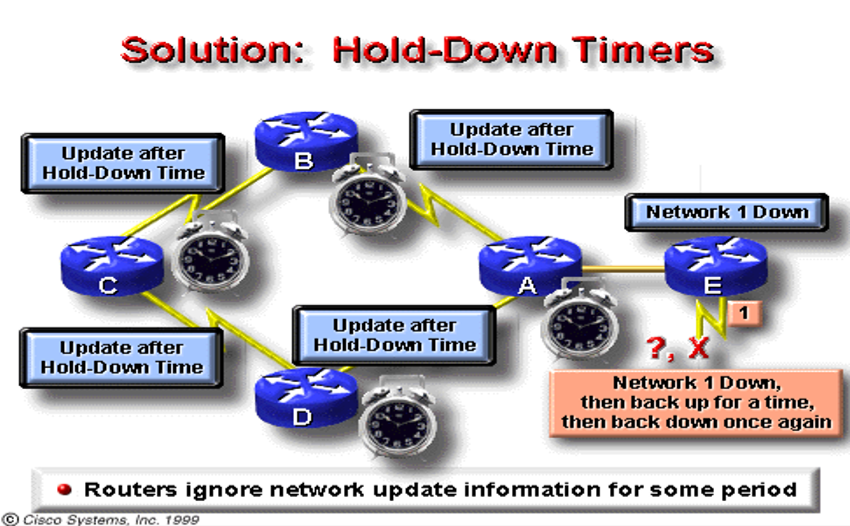

1. 我收到网络信息不可以到达的信息的时候，启动计时器，开始计时(这个信息包含请计时信息)
2. 如果有任何一个计时的设备收到了能够达到路径，则会修改对应记录并停止计时，但是如果更差不会修改
2. 计时器结束后，删除掉对应的条目，避免出现问题
4. 每一条路由表的记录都有**有效时间**

##### 路由环路解决方案五：直接阻止某个路由发送更新路由
1. 为了防止接口发出任何路由更新信息，请使用以下命令：`Router(config-router)#Passive-interface f0/0`
2. 它仅在使用距离矢量路由协议时才有效，因为链接状态路由协议不会直接从其邻居的路由表中获取拓扑信息
3. **接受路由表的更新，但是不发送报文出去**

#### 链接状态协议(LSP, Link-state Protocol)

##### 概念

1. 基于链接状态的路由算法也称为SPF（最短路径优先）算法，维护复杂的拓扑信息数据库:对树处理路由表，没有环路问题(知道能不能到也知道怎么到)
2. LSP使用：
   1. 链接状态广播(LSAs):告诉你我有这个链路(每一个网段都是相同性质链路，链路上有唯一的NetID、带宽、连接拓扑关系、网段、链路类型等属性，我们优化属性后，进行LSA，告知对方主Key，如果再需要的话，再给具体信息)
   2. 拓扑数据库(有LSA组成，包括收到的所有的LSA，每个结点都持有)
   3. 形成数据库后，根据最短路径算法–SPF(shortest path first)算法生成的SPF树(Tree会不一样，因为每一个路由都是以自己为根的)，可以得到到其他网段从哪个端口走代价最小
3. RFC 1583包含对OSPF链路状态概念和操作的描述。

##### 例子

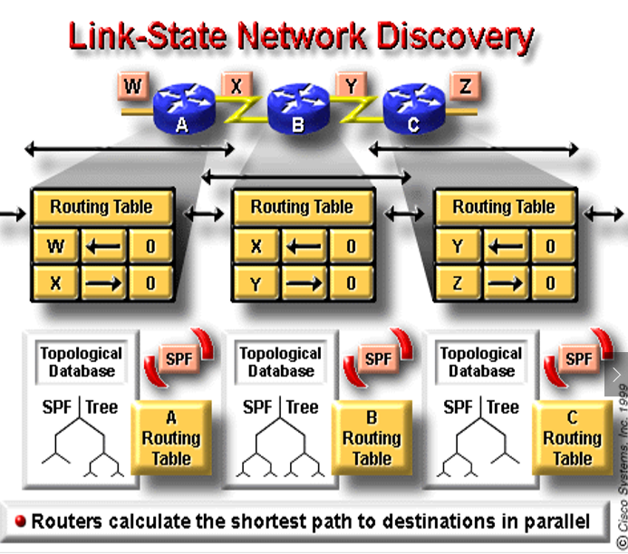

1. 路由器之间**交换LSA**，每个路由器都以直接连接的网络开头
2. 每个路由表与其他路由表并行**构建一个拓扑数据库**，该拓扑数据库包含来自网络的所有LSA。
3. **SPF算法计算网络可达性**:路由器将此逻辑拓扑构建为一棵树，以其自身为根，由链路状态协议互联网络中每个网络的所有可能路径组成。然后，对这些路径进行最短路径优先（SPF）排序。
4. **路由器在路由表中列出其最佳路径以及这些目标网络的端口**。它还维护拓扑元素和状态详细信息的其他数据库。

##### 问题
- **处理和存储要求**
   - 在大多数情况下，运行链路状态路由协议要求路由器比距离矢量路由协议**使用更多的内存**并**执行更多的处理**：**需要CPU进行计算**
     - DB中所需要的内存只有路由表，也不需要复杂计算
     - LSP中则需要根据SPF生成树
- **带宽要求**
   1. 在初始链路状态数据包泛洪(flooding)期间，所有使用链路状态路由协议的路由器会将LSA数据包发送到所有其他路由器。 随着路由器对带宽的需求增加，此操作将淹没互联网，并暂时减少可用于承载用户数据的路由流量的带宽。
      1. 稳定之后就不会了，稳定之后会根据事务触发更新
   2. 一开始的时候报文会比较频繁多(所以告知LSA而不是LS，减小压力)
   3. 注：初期消耗大，之后消耗小，稳定之后是根据事务触发更新

- **链接状态更新资源消耗大**

  - 链路状态路由必须确保所有路由器都获得所有必要的LSA数据包。

  - 具有不同LSA集的路由器根据不同的拓扑数据计算路由。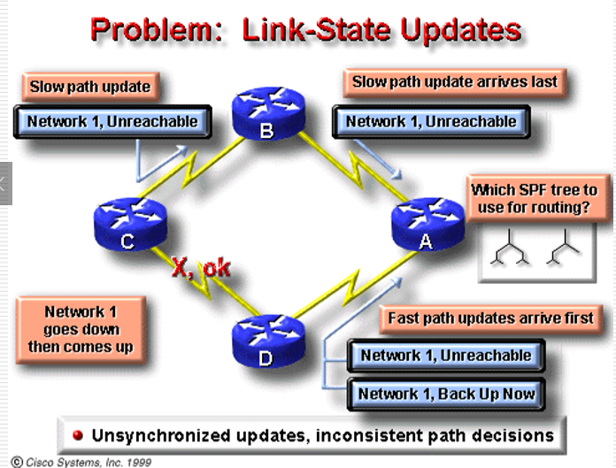

  - 如果有一个链路的状态发生变化(恢复或者被破坏)，必须将修改通知给全部路由器，并且重新生成树，消耗代价比较大(SPF算法)。

#### DB VS LSP

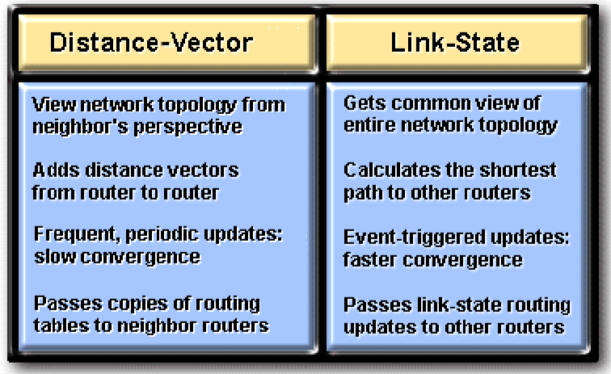

1. DV:距离矢量
   1. 视野窄，代价小
   2. 基于跳数来选择最短路径
   3. 定期交换路由表，收敛时间长
   4. 交换路由表
2. LS:链路状态
   1. 视野宽，有一定代价
   2. 基于带宽选择最小路径
   3. 初期充分交换，收敛时间短（因为是事务触发交换，没事就不交换了）
   4. 交换Linked State的数据库（包括网段主键啥的）

#### 混合协议(Hybrid Protocols)
1. 混合协议的示例
   1. **基于负载和带宽评判，定时交换路由表**，融合了LSP和DB协议

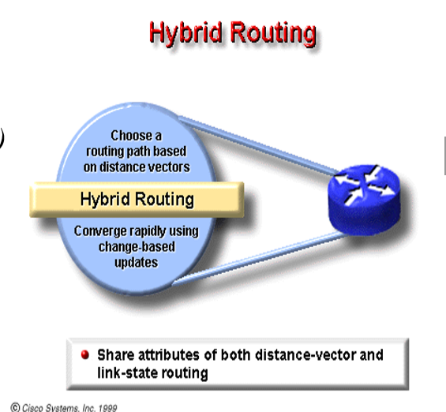

- 上面是思科的一个视角

### 3.2.5. Routing Protocols 具体的动态路由协议

#### 分类

1. IP主动路由协议的示例包括：

| 英文缩写 | 英文解释 | 中文解释 | 备注 |
|--|--|--|--|
| RIP | a distance-vector routing protocol | 距离矢量协议 | DV |
| IGRP | Cisco’s distance-vector routing protocol IGRP | 思科的距离矢量路由协议 | DV，基本启用 |
| OSPF | Open Shortest Path First | 开放式最短路径优先 | LSP |
| EIGRP | - | 平衡的混合路由协议 | 杂合 |

1. 工作在第三层

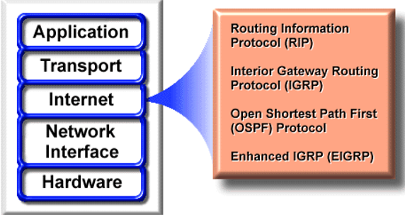

#### 主要目标

- 最佳(Optimal)路线:选择最佳路线
- 效率(Efficiency):最少消耗带宽和路由器处理器资源
- 快速收敛(Rapid Convergence):越快越好。
- 灵活性(Flexibility):可以处理各种情况，例如高使用率和失败的路由

#### 如何启用
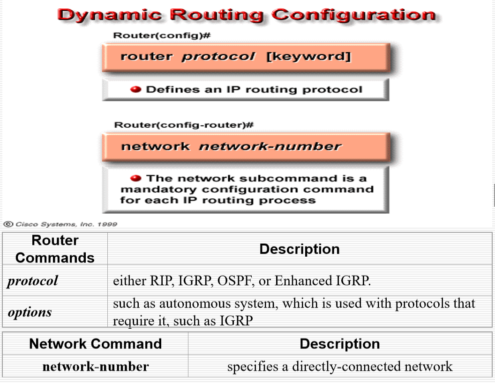

- 如何启动protocol:`router protocol [RIP...]`
- 公告端口`network network-number`:要求是直连的网口

## 3.3 定义默认路由

1. 目的：默认路由使路由表更短。(很多路由被省略)
2. 如果路由表中没有目标网络的条目，则将数据包发送到默认路由。

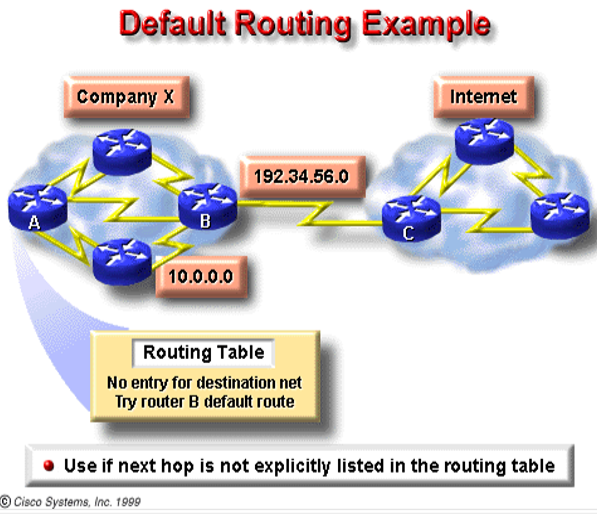

>- 在B上设置，除了左侧五个网段的信息，都默认从192.34.56.0转发，B就是默认路由
>- 对于左边的网络可以被认为是一个末节网络(Stub NetWork)，因为它只有一个出口

3. 使用动态路由协议定义默认路由:`Router(config)# ip default-network [network-number]`

1. 将默认路由定义为静态路由：`Router(config)# ip route 0.0.0.0 0.0.0.0 [next-hop-ipaddress| exit-interface]`
2. 配置默认路由后，使用show ip route将显示：（172.16.1.2是默认的下一跳地址）
   1. 网关是到网络0.0.0.0的172.16.1.2
   2. 当前网段中所有的路由器，遇到不认识的目的地址的报文都转发给172.16.1.2