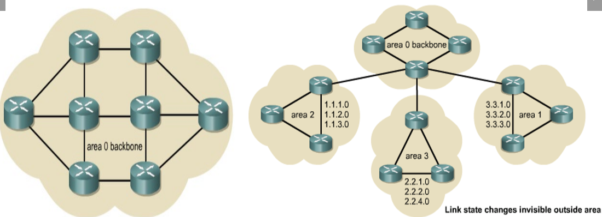
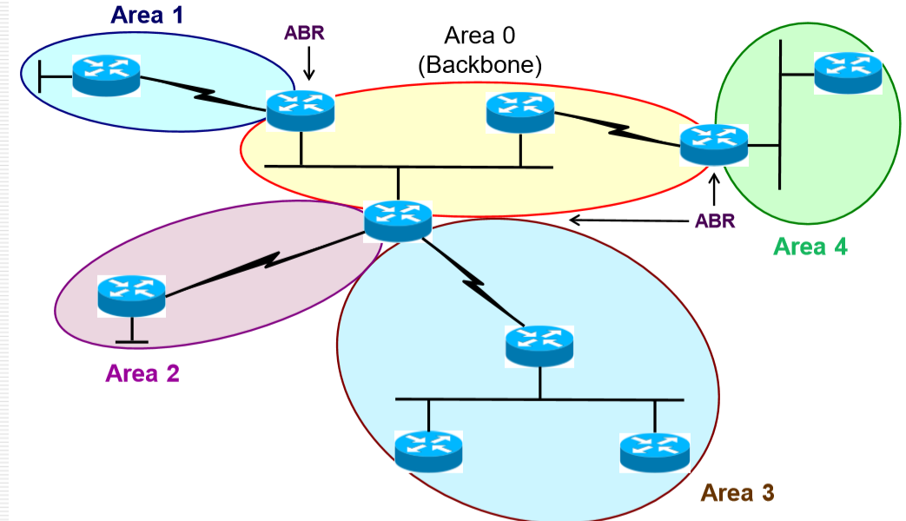
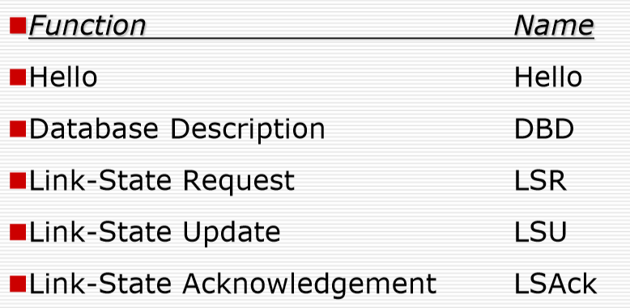

Lecture 08-Routing Protocols(RIP and OSPF)
---

<!-- TOC -->

[TOC]


<!-- /TOC -->

# 一 RIPv1/RIPv2

## 1. RIP v1
1. RIP v1被认为是一种**内部网关协议**。
   1. RIP v1是一种距离向量协议，它以预定间隔将其整个路由表广播到每个邻居路由器。默认间隔为**30秒**。
   2. RIP使用**跳数**作为度量标准，最大跳数为**15**，达到16跳的报文自动抛弃。
2. RIP v1能够在多达六个等价路径上进行**负载平衡(Load Balancing)**，默认情况下为四个路径，最多6个，跳数相同才能完成负载均衡，跳数不同就不存在负载均衡。
3. RIP最初是在RFC 1058中指定的
4. RIP v1具有以下限制/问题：
   1. 它不会在其更新中发送子网掩码信息:意味着必须用同样的子网掩码，不支持VLSM或无类域间路由（CIDR，Classless Interdomain Routing）。
   2. 它以255.255.255.255的广播形式发送更新:只能发给邻居，不能通过路由器转发。
   3. 它不支持身份验证(authentication):
      1. 只要启动RIP就可以接受到报文，也就意味着只要接入网络并且启动RIP进程，就可以了解到整个网络拓扑

### 1.1 RIP配置
1. `router rip`命令选择RIP作为路由协议。
2. network 命令分配基于NIC的网络地址，路由器将直接连接到该网络地址。


```
router rip # 选择RIP路由协议
network 1.0.0.0
network 2.0.0.0
凡是属于上面的网段的端口都运行RIP协议
```


>上图中，A启动RIP进程，A有4个端口，RIP在1000和2000网段生效，所以四个端口都服从RIP协议

## 2. RIP v2
1. RIP v2是RIP v1的改进版本，并且新增了以下的功能：
   1. 这是一种使用**跳数指标**的距离矢量协议。
   2. 路由循环的处理
      1. 它使用**抑制计时器方法**来防止路由循环-默认值为**180秒**,6倍于交换时间
      2. 它使用水平分割(Split Horizon)来防止路由循环(Routing Loops)。
      3. 它使用16跳作为**无限距离的度量**。(15跳及以内可达)

### 2.1 RIP v2的配置
1. network命令导致实现以下三个功能：
   1. 路由更新从接口多播。
   2. 如果路由更新进入相同的界面，则将对其进行处理。
   3. 广播直接连接到该接口的子网。
2. `version 2`:表示启动RIP v2，直接使用`router rip`默认为v1，一定要输入这个命令才能启动RIP v2


- network 10.0.0.0 表示的是10.0.0.0网段的端口使用RIP协议，即和其他使用RIP协议的端口共享路由

### 2.2  RIP相关命令

1. 验证 RIP v2
   1. `Router# show ip protocols`:Verifying the RIP Configuration 验证RIP配置
   2. `Router# show ip route`:Displaying the IP Routing Table 显示IP路由表
2. 故障排除 RIP v2
   1. `Router# debug ip rip`:display RIP routing updates sent and received. 显示更新路由表的时候的更新
   2. `Router# undebug all (/no debug all)`:停止debug

#### `show ip protocols`


####   `debug IP RIP`


1. The debug ip ripcommand displays RIP routing updates as they are sent and received. In this example, the update is sent by 183.8.128.130. debug ip rip命令显示RIP路由更新的发送和接收。 在本示例中，更新是通过183.8.128.130发送的。
2. It reported on three routers, one of which is inaccessible because its hop count is greater than 15. Updates were then broadcast through 183.8.128.2. 它报告了三台路由器，其中一台无法访问，因为其跳数大于15。然后通过183.8.128.2广播了更新。

#### `show ip route`


- 上图是查看路由表:Codes:表示对于路由协议类型的描述
- R 表示通过RIP协议学习到的路由信息
  - 120/1：表示1跳到达，120/2：表示2跳到达
  - 比如一跳可以到达 10.2.2.0网段，两跳可到达192.168.1.90网段


## 3. RIP v1和RIP v2之间的区别


1. V2和V1不同的特点:
   1. 支持有类路由:可以携带子网掩码
   2. 使用主播地址进行发送广播:启用了RIP进程的主机才接受，避免了没有启动RIP进程的主机接受后发现没用而导致低效
   3. 需要身份认证才确定是否继续进行接收。
      1. 需要输入用户名密码，才能正常接受与发送RIP相关信息

# 二 OSPF(single area)

## 1. OSPF简介

### 1.1 概述

1. 开放最短路径优先（OSPF，Open Shortest Path First）是基于开放标准的链路状态路由协议。
2. It is described in several standards of the Internet Engineering Task Force (IETF) Internet 网络工程任务组（IETF，Internet Engineering Task Force）的多个标准中对此进行了描述:The most recent description is RFC 2328. 最新的描述是RFC 2328。(已经不是最新的了)
3. 与RIP v1和RIP v2相比，OSPF正在成为首选的IGP协议，因为它具有可伸缩性。
4. 和RIP相比优势比较大，很多网络公司在研究OSPF的优化。

### 1.2 路由信息

每个路由器中存储信息

1. 链接的状态是对接口及其与其相邻路由器的关系的描述。
2. 链接状态的集合形成一个**链接状态数据库**，有时也称为**拓扑数据库**。
3. 其先充分交换数据库，直到每个节点获取到所有节点的数据为止，之后路由器应用**Dijkstra最短路径优先**（SPF）算法来构建以自己为根的SPF树。
4. 路由器通过SPF树计算最佳路径，然后选择最佳路径并将其放置在**路由表**中。

### 1.3 OSPF vs. RIP

#### 差别概述：


- OSPF基于带宽作为选择路径标准，RIP基于跳数
- OSPF适用于大型网络，RIP因为15跳的局限只能书用于小型网络
- OSPF有两层，RIP只有一层（本科阶段不强求）
- OSPF收敛更快（只要在开始一次性交换所有路由信息），RIP收敛较慢（30s和相邻路由器同步一遍自己的表，一开始比较慢）
- OSPF支持多路负载均衡（要求相同代价），RIP2也支持

#### 路径选择例子


- 上面带宽大（T3标准，大概几十M），2跳达到，下面带宽小，1跳到达。
- OSPF依据带宽从上面走，RIP依据跳数从下面走，但是上面会快一些，所以OSPF选择的路径更为合理

### 1.4 OSPF 特征
1. OSPF的特征克服了这些限制
   1. 更健壮
      1. 存在冗余，能偶应对出错
      2. 树状结构，不存在回路
   2. 更具可扩展性
      1. 具有两层，满足更多的网络
2. 大型OSPF网络使用分层设计。
   1. 将大的网络分成多个area，每一个area只和area 0相连，保证在area层次上没有回路
   2. 层次最多只有2个，只有一个area的话，它就是area 0。
   3. 层次维持树的关系



### 1.5 OSPF术语

- Link：两个设备间的物理链路
- Neighbors:相邻的路由器
  - Neighbours必须在一个Area中才算是，Neighbour之间交换**Topology Databases**(链路状态)
  - 一个Area中所有节点都获得全部LS(Link State)后计算Tree，生成表
- Link-State:物理链路的信息:路由器连接关系、通过什么接口、链路带宽、网络类型(点对点、多路复用)等
  - 不同网络类型在生成tree的处理代价不同
- Cost:不同网络链路处理的时候的代价，和链路带宽相关，成反比关系，一般是固定值除以带宽
- Area:一个有很多路由器的端口都属于的区域(相同)
- Autonomous System:多个Area组成一个自治系统
- DR:指定路由器，只有在多路复用的情况下使用
  - 大家只和指定路由器交换信息，等其存满信息后再交给大家
- BDR:如果DR坏了，再次选举会出现问题，如果DR损坏，BDR立即成为DR


- Link:两个设备之间的物理链路


- Neighbors:相邻的路由器
- Link-State:物理链路的信息:路由器连接关系、通过什么接口、链路带宽、网络类型(点对点、多路复用)等
  - 不同网络类型在生成tree的处理代价不同


- Cost:不同网络链路处理的时候的代价，和链路带宽相关，成反比关系，一般是固定值除以带宽


- Area:一个有很多路由器的端口都属于的区域(相同)


- Autonomous System:多个Area形成一个自治系统


- Neighbours必须在一个Area中才算是，Neighbour之间交换**Topology Databases**(链路状态)
- 一个Area中所有节点都获得全部LS(Link State)后计算Tree，生成表


- DR:指定路由器，只有在多路复用的情况下使用
  - 大家只和指定路由器交换信息，等其存满信息后再交给大家

- BDR:如果DR坏了，再次选举会出现问题，如果DR损坏，BDR立即成为DR

### 1.6 OSPF Area 

是一个逻辑职称

1. 其参考IP地址格式，区域用32位数字标识
   1. 可以是IP格式，也可以是一个十进制值
   2. 区域0.0.0.0 或 区域0
2. 区域0：区域编号为0的单个区域
3. OSPF使用2级分层模型：逻辑上必须是2层结构，而物理实现上可能有一定的差异，如果更多需要进行逻辑配置。
   1. 第一层是Area，第二层则是Area内部的结构

4. 在多区域OSPF网络中，要求所有区域都连接到区域0（Area0是DR）

Example:Area是和端口相关(注意端口)



- ABR(Area Border Router):区域边界路由器，有一定的约束(一个路由器最多不连接超过3个以上的路由器)
- 一个Area中不能有超过**50**台路由器，否则会导致SPF算法产生的计算量和内存过大

## 2. OSPF 单域

单域，即介绍一个Area内部的相关知识

### 2.1 OSPF 执行步骤概述
1. OSPF使用邻居的邻接关系(Adjacencies)来全面了解网络。
2. OSPF操作包括五个**步骤**：
   1. 步骤1：建立邻接关系
   2. 步骤2：选择DR和BDR（如果需要）:多路复用的时候才需要
   3. 步骤3：发现路线
   4. 步骤4：选择适当的路线
   5. 步骤5：维护路线信息
3. OSPF具有七个状态。简而言之，它们是：
   1. Init, 2Way, Ex Start, Exchange, Loading, Full
   2. 初始化，双向操作，预先启动，交换，加载，完成


### 2.2 最短路径算法 — SPF
1. 最短路径算法(shortest path algorithm)使用该节点作为起点并依次检查它具有的有关相邻节点的信息来计算无环拓扑。
2. SPF:有权图->树


- 7个路由器都能获得所有链路信息，都可以生成自己为根的树，以B为例
  - B -> D如果按照跳数是 B->C->D，但按照权重则是B->C->E->D
  - 不根据跳数来进行选择，而是根据最小权和来寻找


### 2.3. DR和BDR

#### OSPF适用的网络类型

1. OSPF适用的网络类型
   1. 广播多路复用网络，例如以太网
   2. 点对点网络
   3. 非广播多路复用网络(NBMA, Nonbroadcasr multi-access)


#### DR & BDR 介绍

##### 注意点


1. 为什么要选择DR和BDR？
   1. 如上图，如果不选择DR和BDR会导致每一个路由器都和其他所有路由器交流(每个有10个连接)
   2. 每一个都要建立**10**(5 * 4/2)个链接，对于链路的复杂比较高，如果有了DR就只需要**4**(n-1)个连接
   3. 即能够简化连接

2. BDR是DR的备份，其他路由器之间就不用通信了
3. 如果有DR则需要至少4条连接，DR和BDR之间必然有连接
4. DR和BDR归属于区域
   1. 几个Area有几个DR和BDR(是在不同Area上)


##### 工作流程


>**只有多路复用的实现方式需要DR和BDR**

1. 每个路由器与DR和BDR形成邻接关系

2. 对于所有OSPF路由器，DR使用224.0.0.5(自己的IP)的**主播地址**向该网段上的所有其他路由器发送链接状态信息。

3. 为确保DR/BDR看到所有路由器在网段上发送的链接状态，使用了所有DR/BDR的多播地址224.0.0.6。(DR和BDR之间)

   > 意思就是 DR 用自己的IP发主播报文，但是其他路由器为了让BDRhe DR都能看到自己的信息，专门给这两键了个多播地址224.0.0.6，用这个发报文

4. 整个的流程大概就是其他路由器多播自己的路由表给DR和BDR，DR收到后整理完再主播给其他路由器

##### 多路复用中的OSPF
1. Giga/Fast/Ethernet, FDDI, Token Ring


2. DR和BDR归属于区域
   1. 几个Area有几个DR和BDR(是在不同Area上)

##### DR BDR选举标准

1. 优先级+路由器ID，最大的是DR，第二大的是BDR。
2. 优先级：1-255，默认值:1，可人为配置
3. 路由器ID
   1. 环回IP地址(逻辑端口)，避免端口宕机出现问题，需要手动配置
      1. 如果没有环回IP地址，则接口IP为最高值地址(Active的端口上的IP作为参考)
      2. 如果接口出现故障，则路由器必须重新建立邻接关系并重新转换(readvertising)LSA，就很麻烦就是了

### 2.4 OSPF报文
1. OSPF只有5个类型的报文



- DBD:发送自己当前的Link state的概述,如果和其他相比没有发现没有发送请求LSR
- 由于传输要求比较高，所以设计了LSAck

#### OSPF Hello协议
1. 路由器在接口上启动OSPF路由过程时，将发送hello数据包，并继续以固定的时间间隔(intervals)发送hello。
2. 控制(govern)OSPF hello数据包交换的规则称为Hello协议。
3. Hello数据包的地址为224.0.0.5。
4. 默认情况下，广播多路访问和点对点网络上**每10秒**发送一次Hello报文。
5. 在连接到NBMA网络的接口（例如帧中继）上，默认时间是30秒。
6. 保持心跳，确定还活着。Hello几乎是空报文，给所有跑OSPF的路由器发送

#### OSPF报文头部
>Hello报文的Type字段设置为1


### 2.5. OSPF操作步骤概述强化版


- 一开始的所有路由器的状态都是Down State
- A启动OSPF进程后，发送Hello报文(Init State)
- B收到A的报文(收到报文一定是邻居):Hello报文的TTL是1，所以不会跨路由器传播，B收到即丢弃。
- 收到后，B也会发送自己的Hello，然后A收到报文后，发现B“看到”了自己，然后进入Two Way状态


- 准备交换数据库(Exstart Starts)
- 首先确认主方(发送方)、从方(接受方)，保证数据有序，是谁的Router ID高谁是主方，谁优先发
- Router ID高的(主方)发送自己DBD报文，从方对主方发送的DBD**接受处理**并发送


- 交换完成后，各自检查自己是不是有全部的信息
  - 如果有完整的信息，则发送LSAck
  - 如果发现有没有的，则发送LSR，等待LSU(整个链路的详细信息，不是LSA)来进行学习，之后收到完成后发送LSAck

### 2.6 OSPF操作步骤终版
1. Step1: Set up the adjacency relationships
2. Step2: Elect DR and BDR (if needed)
3. Step3: Discover the routes
4. Step4: Choose appropriate routes
5. Step5: Maintain the route information 

#### 建立路由器邻接
1. 路由器每隔一段时间发送一次hello数据包,Hello报文的TTL是1，表明不会跨路由传播。
2. 如果邻居被发现了：将邻居添加到邻居数据库
3. 发现网络类型
   1. 如果是多路复用网络，进入DR/BDR选举过程，然后进入步骤2。
   2. 如果是点对点或点对多点网络，则不会举行DR/BDR选举过程，并跳过步骤2。
   3. 如果hello数据包标头中的DR/BDR字段已被占用（即DR / BDR对已经存在），则不会进行DR/BDR选举，并跳过步骤2。
4. 如果对方的DR/BDR优于我的DR/BDR，则接受对方的。


>Hello Interval:如果不同不能建立关系,Hello报文包含了DR信息在内的必要的参数

#### 选举DR和BDR
1. 如果没有其他路由器联机，则该路由器将成为DR。下一个要“启动”的路由器将是BDR。
2. 如果多个路由器（两个或更多）同时联机，则
   1. 优先级最高的路由器成为DR：优先级为零表示“从不DR”
   2. 如果存在平局，则具有最高路由器ID的路由器将成为DR：路由器ID是最高的环回或接口IP地址
   3. 具有第二高优先级或路由器ID的路由器成为BDR
3. 如果DR无效，则BDR变为DR。
4. 然而
   1. 如果新的OSPF路由器以更高的优先级或路由器ID加入网络，则**当前的DR和BDR不会更改。**
   2. 仅当当前DR失败时，它才成为新的BDR；或者仅当当前DR和BDR失败时，才成为新的DR。

#### 发现路线
1. 这一步从Ex Start状态转换到完整状态
2. 路由器确定“主/从(master/slave)”关系
3. 多路复用网络中的DR/BDR交换LSA，并且所有其他DR将其Type 2 DBD发送给DR/BDR。
4. 如有必要，路由器可以通过发送请求更多信息的LSR进入负载状态:所有路由器必须在“加载状态”中等待，直到完全更新请求的路由器。
5. 路由器现在进入完整状态

#### 生成最合适的路线
1. 现在，将与网络上的所有其他路由器并行地计算SPF算法。
   1. 切记：在发生这种情况之前，所有路由器必须具有相同的链接状态数据库。
   2. SPF使用Cost作为指标
   3. SPF将从其自身到目的地的每条路径的成本相加，并以路由器为根来构建树
   4. OSPF然后在路由表中安装成本最低的路径：最多将安装4条等价路径以进行负载均衡

#### 维护路由信息

通过hello报文交换实现

1. 常规的Hello交换是OSPF用于检测新邻居或故障(downed)邻居的机制。
2. 根据网络的类型，Hello数据包以不同的默认间隔发送。(确定对方是不是还好)
   1. 对于速度为T1（1.544 Mbps）或更高的链接，每10秒：广播多路访问和点对点链接
   2. 对于小于T1的链接，每30秒：非广播多路访问链接
   3. “死间隔”是问候间隔的四倍。(如果在这样子对方还没有成功则对方死了)(比如问候间隔是10s，如果经过40s没有收到邻居的问候，则认为邻居故障了)

### 2.7 OSPF中路由表更新操作

在一开始的OSPF操作完成后，网络进入稳定状态，路由器基本上不再交换信息
当链路状态发生变化之后，OSPF会重新工作，重新获取路由信息，进行更新

下面是A连接的网段出问题后，各个路由器的工作过程


- Router A tells all OSPF DRs on 224.0.0.6
- Event触发交换:比如A连接的网段断掉了
  - A使用LSU告知**DR**


- DR tells others on 224.0.0.5 
- DR 通过LSU告知所有的路由器


- 如果B连接了别的Area，则继续进行交换


- 所有的路由信息交换完毕后，执行SPF算法，生成新的路由表

### 2.8 OSPF配置

#### 基本配置

1. 在路由器上启动OSPF
   1. `Router (config)# router ospf process-id`
   2. 进程号:process-id
      1. 取值: 1 ~ 65535
      2. 在一台路由器上识别多个OSPF进程
      3. 通常在整个AS(自治系统)中保持相同的进程ID
2. 在路由器上识别IP网络
   1. `Router (config-router) # network address wildcardmask area area-id`
      1. 一个路由器可以有多个端口，每个端口可以对应不同area，可以通过这个进行配置
      2. network address：网络地址，可以是整个网络，子网或接口的地址。
      3. wildcardmask：和子网掩码相反


- 只有一个Area，则为0
- **Wild-card Mask和子网掩码相反**:子网掩码是255.255.255.0，则Wild-card Address就是0.0.0.255
- 写IP和写网段最后都是一样的

#### 配置回路(Loop)地址
```
Router (config) # interface loopback number 
Router (config-if) # ip address address subnet-mask
```
1. 为OSPF路由器ID添加稳定性（路由器ID可能会因为路由器宕机而失效，但是回路地址是逻辑地址，所以稳定生效）
   1. 必须在OSPF进程开始之**前**配置回环地址loopback number: 会涉及到主从关系确定和DR的选举
      1. 主从关系和DR选举可能都会用到这个地址
   2. 配置环回地址时，请使用/32掩码以避免潜在的路由问题
   3. I建议您在基于OSPF的网络中的所有关键路由器上使用环回地址（专用或公用地址）。
   4. 一旦配置立刻生效（因为它是一个逻辑地址而非实际地址），不需要no shutdown的命令。


>配置回路地址的方式如上图，删除只需要在前面添加no

#### 修改OSPF接口优先级
1. 改变路由器端口的OSPF优先级
   1. `Router (config-if) # ip ospf priority number`
      （config-if就表示它已经是在路由器某个特定的端口中了）
   2. 优先级:越大越高
      1. 值：0-255,默认为1
      2. 优先级0表示接口不能被选为DR或BDR
2. 显示OSPF的端口的优先级：`Router # show ip ospf [interface type number]`
3. Example:


#### OSPF成本 = 指标
1. Cost适用于所有路由器连接路径
2. 16位数字（1 – 65,535）
3. 较低的Cost->更理想
4. 路径决定是基于路径的总成本。
5. 指标受到带宽的影响，带宽越高，cost越小
6. 用一个很大的数字去除以当前的带宽得到代价，计算方法如下


##### 配置COST
1. 连接到同一Link的所有接口必须就该链接的成本达成一致。否则，该Link将被视为关闭
   1. 可以配置COST，意味着可以手动调整优先级，但是一般情况下是根据客观条件决定的
   2. 串行链路的Cisco路由器默认成本为1784（56Kbps带宽）:`Router (config-if) # ip ospf cost number(1-65536)`
   3. 如果链路是更低速的，你必须为其确定真实的链路速度。
   4. If the line is a slower speed, you must specify the real link speed: `Router (config-if) # bandwidth number(Kbps)`
2. 需要配置COST的例子：
   1. 需要更改成本的常见情况是在多供应商(multi-vendor)路由环境中。成本更改将确保一个供应商的成本值与另一供应商的成本值匹配。
   2. 另一种情况是使用千兆以太网。默认成本将最低成本值1分配给100 Mbps链路。


>现在的被除数已经比这个要大了

#### 配置OSPF问候时间
1. OSPF区域中的所有路由器必须在相同的hello间隔和相同的死亡间隔上达成一致，默认情况下：
   1. T1或更高链接（广播）为10秒
   2. 慢于T1的链接为30秒（非广播）
   3. 死亡间隔= 4 *问候间隔
2. 更改问候间隔的命令

```
Router(config-if)# ip ospf hello-interval seconds
Router(config-if)# ip ospf dead-interval seconds
```

3. 注意：停顿间隔将自动调整为新的hello间隔的四倍。(只配置问候时间的情况下)

