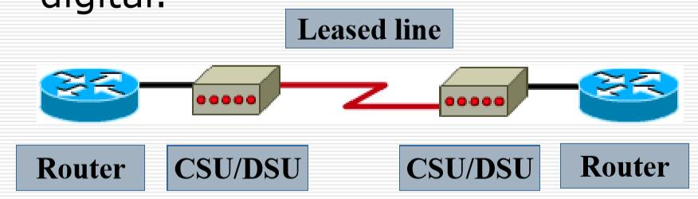

lecture10-WANS
---

<!-- TOC -->

- [1. 广域网技术和设备](#1-广域网技术和设备)
  - [1.1. WAN Services 广域网服务](#11-wan-services-广域网服务)
  - [1.2. 公司的发展](#12-公司的发展)
  - [1.3. 广域网物理结构](#13-广域网物理结构)
  - [1.4. 广域网虚拟电路](#14-广域网虚拟电路)
    - [1.4.1. 广域网虚拟电路的三个阶段(phases)](#141-广域网虚拟电路的三个阶段phases)
    - [1.4.2. 广域网虚拟电路的用途和特点](#142-广域网虚拟电路的用途和特点)
    - [1.4.3. 广域网永久虚拟电路](#143-广域网永久虚拟电路)
  - [1.5. 链接类型和带宽](#15-链接类型和带宽)
  - [1.6. 交换电路连接](#16-交换电路连接)
  - [1.7. 网络连接](#17-网络连接)
  - [1.8. 广域网设备](#18-广域网设备)
    - [1.8.1. Modems 调制解调器](#181-modems-调制解调器)
- [2. 广域网和OSI模型](#2-广域网和osi模型)
  - [2.1. 广域网标准](#21-广域网标准)
  - [2.2. WAN 物理层](#22-wan-物理层)
  - [2.3. WAN 数据链路层](#23-wan-数据链路层)
  - [2.4. 数据链路层的帧封装](#24-数据链路层的帧封装)
- [3. 广域网访问方法](#3-广域网访问方法)
  - [3.1. PPP/HDLC PPP重要考试考](#31-ppphdlc-ppp重要考试考)
    - [3.1.1. 串行线框字段](#311-串行线框字段)
    - [3.1.2. PPP and HDLC](#312-ppp-and-hdlc)
  - [3.2. PPP 点对点协议](#32-ppp-点对点协议)
    - [3.2.1. PPP 组件](#321-ppp-组件)
    - [3.2.2. PPP帧格式](#322-ppp帧格式)
    - [3.2.3. PPP会话建立/终止](#323-ppp会话建立终止)
      - [3.2.3.1. 阶段1：链接建立](#3231-阶段1链接建立)
      - [3.2.3.2. 阶段2：链路质量确定](#3232-阶段2链路质量确定)
      - [3.2.3.3. 阶段3：网络层协议配置](#3233-阶段3网络层协议配置)
      - [3.2.3.4. 阶段4：链接终止](#3234-阶段4链接终止)
    - [3.2.4. PAP 安全认证协议:PPP中一个可选择方法](#324-pap-安全认证协议ppp中一个可选择方法)
      - [3.2.4.1. 远程路由器的配置(Client)](#3241-远程路由器的配置client)
      - [3.2.4.2. 服务提供商路由器的配置(Server)](#3242-服务提供商路由器的配置server)
    - [3.2.5. CHAP(Challenge Handshake Authentication Protocol)](#325-chapchallenge-handshake-authentication-protocol)
      - [3.2.5.1. CHAP: Challenging 挑战](#3251-chap-challenging-挑战)
      - [3.2.5.2. CHAP: Acknowledgement 告知](#3252-chap-acknowledgement-告知)
      - [3.2.5.3. CHAP: Verifying Acknowledgement 验证确认](#3253-chap-verifying-acknowledgement-验证确认)
    - [3.2.6. CHAP的实现](#326-chap的实现)
  - [3.3. 综合数字服务网络(ISDN, Integrated Services Digital Networks)](#33-综合数字服务网络isdn-integrated-services-digital-networks)
    - [3.3.1. BRI(Basic Rate Interface) and PRI(Primary Rate Interface)](#331-bribasic-rate-interface-and-priprimary-rate-interface)
    - [3.3.2. 标准](#332-标准)
  - [3.4. 非对称数字用户线路(ADSL,Asymmetric Digital Subscriber Line)](#34-非对称数字用户线路adslasymmetric-digital-subscriber-line)
    - [3.4.1. xDSL技术](#341-xdsl技术)
    - [3.4.2. xDSL 的几种类型](#342-xdsl-的几种类型)
    - [3.4.3. ADSL 的极限传输距离](#343-adsl-的极限传输距离)
    - [3.4.4. ADSL 的特点](#344-adsl-的特点)
      - [3.4.4.1. DMT 技术](#3441-dmt-技术)
    - [3.4.5. DMT 技术的频谱分布](#345-dmt-技术的频谱分布)
    - [3.4.6. ADSL的数据率](#346-adsl的数据率)
    - [3.4.7. 第二代 ADSL](#347-第二代-adsl)
  - [3.5. SONET](#35-sonet)
    - [3.5.1. 同步光纤网SONET和同步数字系列SDH](#351-同步光纤网sonet和同步数字系列sdh)
    - [3.5.2. 同步光纤网 SONET](#352-同步光纤网-sonet)
    - [3.5.3. 同步数字系列 SDH](#353-同步数字系列-sdh)
    - [3.5.4. SONET 的 OC 级/STS 级与 SDH 的 STM 级的对应关系](#354-sonet-的-oc-级sts-级与-sdh-的-stm-级的对应关系)
    - [3.5.5. SONET 的体系结构](#355-sonet-的体系结构)
    - [3.5.6. 同步光纤网 SONET](#356-同步光纤网-sonet)
    - [3.5.7. SONET 标准的四个光接口层](#357-sonet-标准的四个光接口层)
  - [3.6. HFC(Hybrid Fiber Coax)](#36-hfchybrid-fiber-coax)
    - [3.6.1. 光纤同轴混合网 HFC (Hybrid Fiber Coax)](#361-光纤同轴混合网-hfc-hybrid-fiber-coax)
    - [3.6.2. HFC 的主要特点](#362-hfc-的主要特点)
    - [3.6.3. 用户接口盒UIB (User Interface Box)](#363-用户接口盒uib-user-interface-box)
    - [3.6.4. 电缆调制解调器(Cable Modem)](#364-电缆调制解调器cable-modem)
    - [3.6.5. HFC 网的最大优点](#365-hfc-网的最大优点)
    - [3.6.6. FTTx 技术](#366-fttx-技术)
- [4. 考试要求](#4-考试要求)

<!-- /TOC -->

# 1. 广域网技术和设备

## 1. WAN Services 广域网服务

### 1.1 基本概念

1. 定义:WAN是通过WAN服务提供商连接LAN的通信网络。
2. 一般不是一个单位来做，而是由运营商完成，而在运营商之间沟通好相互的接入问题。
3. WAN在OSI的前三层运行，但**主要集中在物理和数据链路层**。
4. 广域网和局域网相比相对低效，因为其提供大范围服务，效率一般不会太高
5. 广域网位于物理层和数据链路层

### 1.2. 公司的发展


- 广域网的最小单位是公司
- 随着公司逐渐的发展才发展(公司的发展是需求)
- 左上角:公司刚成立的时候，小的局域网就可以搞定了(几台主机)，对外提供服务少，局域网协同办公。
- 右上角:随着公司的发展，一家发展到几十家，需要将不同的项目分开，每一个项目都有对应的项目经理和开发人员，多个局域网组成一个AS(自治系统)。对外还是一个出口，AS要求高，内部需要实现VLAN隔离和防火墙
- 左下角:再次发展，有多个分支机构，区域办事处等，物理上隔离的很远，这时候建立一个数据中心(存放全部业务数据)，保证团队可以在任何位置访问，公司向ISP请求租用一个广域网链路，实现远程办公与协同，访问中心的服务。
- 右下角:最后进一步发展，覆盖全球:公司规模足够大，考虑成本(降低协作成本)，需要部署站点到站点之间的VPN，保证效率更高(不需要实时维护专线)。

### 1.3. 广域网物理结构


- 涉及到具体一个公司的接入
- 通过NetWork远程接入，通过WSP提供的CO Swtich来连接到中心局
- CPE:位于公司本地的设备(主要是接入设备)，可以向ISP购买或者租用，购买上网服务(猫)
  - CPE和远端通过Local loop连接(最后一公里)，ISP做解决方案。

- Demarcation(分界点)：分界点一侧是ISP做解决方案，而另一侧是本地进行管理。
  - 如上图左侧的Local Loop是ISP解决；右侧则是本地进行管理

### 1.4. 广域网虚拟电路


广域网中需要实现拥塞控制存在难度，需要在大范围内是西安报文交换难以实现，所以会采用虚电路交换，虚电路有两类：SVC和PVC

#### 1.4.1 SVC & PVC

- PVC 永久虚电路：用户和供应商经过商讨，建立一个点对点之间的永久连接
  - 优点：传输的时候不需要建立连接即可传输，效率较高
  - 缺点：如果不是有持久大量数据传输需求，其实用性会降低，因为虚电路是一致在开着的，成本也会比较高
- SVC 交换虚电路：仍然是使用虚电路，根据电路的连接的具体情况按需分配虚电路
  - 虚电路是在通讯双方建立一条逻辑连接，物理含义是通讯双方按照虚电路的指示的路径进行，SVC不像PVC独占路径带宽，每个报文在交换机中需要缓存， 链路上需要排队输出。实现的需要三个步骤
    - 电路建立–创建虚拟电路(逻辑确定)
    - 数据传输–所有分组按照虚电路顺序传输，分组不必带目的地址和源地址信息，只需要携带虚电路号，到达节点不会出现丢失重复乱序等问题
    - 断开连接–可以让别的虚电路方案复用我占据的物理链路，实现他们的虚电路
  - 优点：降低成本：物理链路可以被多个通讯连接同时使用（毕竟是交换虚电路嘛，交换应该指的是通讯之间的交换）

### 1.5 广域网链路连接方案

#### 1.5.1 分类


- 广域网链路连接方案分两大类：私有 公有
  - 私有又分为：专用 和 交换
    - 专用：只用于自己使用，独占带宽，一个组织或者团体自行建立的网络，或者也可以照ISP租借
    - 交换：可以多个单位同时使用，共享带宽
      - 电路交换：比如电话网，PStN ISDN
      - 分组交换：比如帧中继，x.25，ATM
  - 公有：存在安全问题（尤其是对公司来讲），信息可能会泄漏，现在可以通过VPN解决，例子有DSL，电缆，无线宽带等

#### 1.5.2 不同方案的优缺点


#### 1.5.3 链接类型和带宽


1. T：美国标准
2. E：欧洲标准


#### 1.5.4 交换电路连接例子


> PSTN：需要调制解调器，慢


> ISDN:多个B信道和P信道组合

- BRI:2个B和一个D
- PRI:T1:23B + D 和 E1:30B + D

#### 1.5.5 网络连接例子


- 直接连接到运营商，DSL接入(以太网转换成DSL信号)


- 永久在线连接，用于有线电视传输等，共享电缆开关等


- 无线
  - 地面无线信道
  - 无线信道

### 1.6. 广域网设备

- 接入广域网需要特定设备
- 为了连接到专线(leased line)，设备必须具备以下条件：
  - 访问服务提供商的电路
  - 可用的适当路由器端口
  - CSU/DSU，调制解调器，ISDN终端适配器等。

#### 1.8.1. Modems 调制解调器
- 左边的router是用户的网关路由器，称为CPE(用户私有设备)，作为终端数据单元，也叫DTE，DTE连接本地网络设备，如果网络中只有一个机器，其可直接作为DTE，接入的Modem叫做DCE(就是下图的CSU/DSU)，其将DTE的型号转化成运营商规定的信号格式，转发给远端的DCE，远端DCE在转换成远端本地所能接受的信号格式



1. CPE(左边的用户网关路由器，作为终端数据单元(DTE)):往往是路由器
2. DCE:将信号转换成运营商可以接受的信号发送给远端。

# 二 广域网和OSI模型

## 1. 广域网中的OSI

广域网实现功能是按照OSI中规范的，主要是一二层

- 物理层：主要是描述通信服务提供商提供的链路电器操作功能等类型

- 数据链路层：如何封装传向远端的数据，以及数据帧的传输机制

  

### 1.1 物理层

- 描述电器和机械操作方面的连接特性和标准

- 运营商提供，电信电报都是可以的

- 描述DTE和DCE之间的接口标准

  - DCE是服务提供商提供的设别，DTE是和其连接的用户设备的网关

    

    - 初始信号通过DCE进行转换，可能是光信号也可以是电信号

- 存在不同DTE和DCE的连接方案，一般是串口连接

  - EIA/TIA-232 (RS-232):计算机常用
  - EIA/TIA-449
  - V.24
  - V.35
  - X.21
  - G.703
  - EIA-530

  

  1. EIA/TIA-232 (RS-232):计算机常用
  2. EIA/TIA-449
  3. V.24
  4. V.35
  5. X.21
  6. G.703
  7. EIA-530

### 1.2 数据链路层

- 描述帧的组装以及链路传输帧的管理
  - 和以太网不一样，其可靠性要求不高，所以帧的格式也不一样
  - 链路传输方式可以是点对点，点对多点，多链路交换机切换
- 为了确保使用正确的封装协议，必须为每个路由器的串口配置使用帧的封装说明
- WAN 标准由许多公认的机构定义和管理，包括以下机构：ITU-T，ISO，IETF和EIA

#### 数据链路层经典协议

- WAN数据链路层定义了如何封装数据以传输到远程站点

  - **点对点协议（PPP,Point-to-Point Protocol）**:由IETF开发。PPP包含用于识别网络层协议的协议字段
    - (包含一个协议单元，指定网络协议
    - 会根据不同的网络协议对网络性能做检查
  - **高级数据链路控制（HDLC, High-Level Data Link Control）**:ISO标准，不同供应商之间不兼容的HDLC，因为每个供应商都选择了实现方式。HDLC支持点对点/多点配置
    - 抽象规范和约束，各个厂商可以选择各自的方案，可能不兼容
    - 开放的，所有厂商都可以进行实现
    - 支持点对点，点对多点
  - **帧中继(Frame Relay)**：使用简化的封装，对高质量的数字设备不进行纠错。
    - 比较高速，因为在封装的时候不做出错校验，假设在比较高性能的链路上传输
  - **ISDN**：通过现有电话线传输语音和数据的一组数字服务。
    - 既可以传输语音又可以传输数据
    - 传输时建立在电话线上
  - **平衡的链路访问程序（LAPB, Link Access Procedure, Balanced）**：用于在X.25堆栈的第2层封装数据包的数据包交换网络。 
    - 提供点对点的可靠性和流量控制。

  

  - 不同交换使用的链路协议不同


# 3. 广域网访问方法

PPP和HDLC是最常用的点对点广域网访问方法，前者是标准协议v，后者是思科官方。如果是同一个厂商(思科)，可以用HDLC；如果不同，用PPP

## 1. PPP和HDLC

是第二层的协议

### 1.1. 串行线框字段

1. 两种最常见的点对点WAN封装是HDLC(High-level Data Protocol)和PPP(Point to Poing Protocol)
2. 所有串行线封装共享一个通用的帧格式，该格式具有以下字段


>封装协议的选择取决于WAN技术和通信设备。

### 1.2. PPP and HDLC

- PPP是一个标准的封装方案
  - 用于替代SLIP，有IETF组织发展
  - 包含一个字段来指示上层网络协议
  - 建立连接会提供质量check，为上层协议提供支持
  - 提供身份认证
    - PAP：密码认证协议
    - CHAP：质询握手认证协议
- HDLC是思科默认的封装方案
  - 不做window控制和流控制
  - 不是思科的设备不能理解HDLC帧封装

## 2. PPP

- 最广泛的二层帧封装协议
- 从SLIP发展而来，SLIP
  - 只支持IP协议
  - 不支持动态地址分配
  - 不支持身份认证
  - 不支持压缩，错误检测
- PPP支持
  - 多种网络协议
  - 支持动态地址分配
  - 支持身份认证：PAP，CHAP
  - 支持压缩，出错检测

### 2.1 PPP组件

- 使用HDLC(ISO HDLC，而非Cisco HDLC)作为封装第3层数据报的基础
- 实现LCP（链接控制协议）以：
  1. 建立连接
  2. 连接配置选项
  3. 链接质量测试
- 实施NCP（网络控制协议，Network Control Protocol）以选择和配置第3层协议。

### 2.2 PPP帧格式


- flag(1 byte) ：表示开始和结束的字节（前一个的结束后一个的开始），通常为 01111110
- address(1 byte)：点对点连接，所以就不需要显示指示对方具体地址，只需要使用11111111的广播地址即可
- control：00000011，用户数据作为无序帧传输，写死的，前三个字节都是固定的
- protocol：数据报协议的指定，比如0X21表示上层网络层使用IP协议
- data：数据部分，最大不超过1500byte
- FCS：校验位

### 2.2 PPP会话建立和终止

- 配置LCP：**链接建立**和配置协商(negotiation)
- 连接质量测试
- 配置NCP：网络层协议配置
- 连接终止


#### 2.2.1 连接建立

- 每个PPP的设备会发送LCP帧打开连接
  - LCP帧包含配置信息
    - 包括压缩，身份认证标准
    - 如果没有，则使用默认标准
- 当接受到对方的确认帧，连接建立完成

#### 2.2.2 链路质量校验

- 双方发送LCP帧来确认链路质量是否满足要求
- 进行身份认证
- 在质量检测完成前，网络层报文无法传输

#### 2.2.3. 网络层协议配置

- 在此阶段，PPP设备发送NCP数据包以选择和配置一个或多个网络层协议（例如IP）。
  - 因为PPP需要满足多种网络层协议才需要进行协议的配置
- 配置了每个选定的网络层协议后，可以通过链接发送来自每个网络层协议的数据报。

#### 2.2.4.  链接终止

1. LCP可以随时终止链接：
   1. 应用户要求；(一方请求终止)
   2. 链接质量不达到要求
   3. 超时
2. 当LCP关闭链接时，它将通知网络层协议，以便它们可以采取适当的措施。

### 2.3 PAP and CHAP

#### 2.3.1 PAP

##### PAP过程

- 两阶段握手过程
  - 一方向另一方发起认证信息，另一方进行验证，传回是否同意的信号
  - 两方具有相同的用户名和密码
- 具体过程：
  - 发起方将认证信息发出，确认用户是否有管理者权限
    - 发起方可以反复尝试
      - 风险：发起方可以枚举密码进行不断试错进行破解，并且对于接收方也是一个负担
    - 密码以明文的方式发送
      - 安全问题：信息可能被第三方监听
  - 接收方验证认证信息，通过两次握手方式给应答
- 问题：两次握手可能不够强壮

##### PAP配置

远程路由器的配置(Client)

```
1 Router(config)#hostname RTA
2 RTA(config)#int s0
3 RTA(config)#ip address 192.168.2.1 255.255.255.0
//使用PPP协议
4 RTA(config)#encapsulation ppp 
//使用PPP中的PAP身份认证
5 RTA(config)#ppp pap sent-username RTA password ciscoA
6 RTA(config)#no shut 
```

服务提供商路由器的配置(Server)

1. 认证和RouteA相同的用户名密码

```
1 Router(config)#hostname RTB
// 用户名密码需要和远端路由器相同
2 RTB(config)#username RTA password CiscoA
3 RTB(config)#int s0
4 RTB(config)#ip address 192.168.2.2 255.255.255.0
5 RTB(config)#clock rate 56000 // 服务器需要
6 RTB(config)#encapsulation ppp
7 RTB(config)#ppp authentication pap
8 RTB(config)#no shut 
```

#### 2.3.2 CHAP

##### CHAP过程

为了解决PPP的问题，引入三阶段握手


- 三阶段握手
  - 服务方为发起方定期发起的一个challenge	
    - 
  - 请求方接收到后，给出应答 response
    - response是密文
  - 服务方根据应答进行验证，给出是否同意的回复
    - 如果和自己的账号密码相同，则同意
    - 反之拒绝

##### 具体过程

CHAP: Challenging 挑战


- RTB请求连接RTA
- 他们都存储一个用户名密码，但是用户名不同，密码相同
  - 比较的是：挑战中的用户名和路由器的hostname是否相同

- RTB发送一个连接请求（PPP协议建立连接）
- RTA找一个时间来发起挑战
- 挑战中内容:
  - 编号
  - id是第几次挑战
  - random:生成的随机数
  - RTA:谁发起的挑战

CHAP: Acknowledgement 告知


- RTB收到挑战，进行应答
- RTB操作:pass + random 使用 MD5 算法 -> 哈希值

CHAP: Verifying Acknowledgement 验证确认


- RTA收到RTB的回复，进行校验
  - 首先判断response的用户名和自己存储的用户名是否相同
  - 再根据自己的密码和发送的rendom生成Hash值，和response中的哈希值进行比较，判断是否相同
  - 如果都相同，则同意
  - 注意MD5生成的hash值是不可逆的，所以实现了密文传输

##### CHAP配置

1. 远端路由器的配置

```
1 Router(config)#hostname RTA
2 RTA(config)#username RTB password CiscoA
3 RTA(config)#int s0
4 RTA(config)#ip address 192.168.2.1 255.255.255.0
5 RTA(config)#encapsulation ppp
6 RTA(config)#no shut 
```

1. 服务提供者服务器的配置

```
1 Configuration of service provider router
2 Router(config)#hostname RTB
3 RTB(config)#username RTA password CiscoA
4 RTB(config)#int s0
5 RTB(config)#ip address 192.168.2.2 255.255.255.0
6 RTB(config)#clock rate 56000
7 RTB(config)#encapsulation ppp
8 RTB(config)#ppp authentication chap
9 RTB(config)#no shut 
```

## 

## 3. ISDN

ISDN, Integrated Services Digital Networks 综合数字服务网络

- 通过电话线的方式进行传输，

  - 能够传输语音，数据，视频
  - 建立：使用带外D（或Delta）信道比调制解调器（有时<1s）**更快**的呼叫建立
  - 传输：使用B（或屏障）通道以64kps提供**更快**的数据传输

- 两类ISDN模式

  - BRI：基本速率接口, Basic Rate Interface

    - 两个B信道，一个D信道

    - 提供2B+D = 144kbps带宽

      - B信道：64kbps，用于数据量较大的数据和语音等传输
      - D信道：16kbps，进行管理配置以及协调两个B信道的使用

      

  - PRI：主速率接口,Primary Rate Interface

    - 带宽
      - 美标 23B+D 
      - 欧标 30B+D

    

### 3.2 ISDN标准

- ISDN利用一套(suit)ITU-T标准套件，涵盖OSI参考模型的物理，数据链路和网络层。
- 有几种封装选择。两种最常见的封装是PPP和HDLC。
- ISDN默认为HDLC。但是，PPP更为健壮，因为它为兼容链接和协议配置的身份验证和协商提供了出色的机制。
- ISDN接口仅允许使用一种封装类型,不允许混合使用封装

### 3.3 xDSL技术

- xDSL 技术就是用数字技术对现有的模拟电话用户线进行改造，使它能够承载宽带业务
- 虽然标准模拟电话信号的频带限制在 300~3400kHz 范围内，但用户线本身实际可通过的信号频率仍超过 1 MHz
- xDSL 技术把 0~4 kHz 低端频谱留给传统电话使用，而把原来没有被利用的高端频谱留给用户上网使用
  - 因为人声的频率较低，只需要使用低端部分，可以将高端部分用于数据传输
- DSL:数字用户线(Digital Subscriber Line)
- DSL的前缀 x 表示在数字用户线上实现的不同宽带方案

#### 3.3.1 xDSL的不同类型

- ADSL (Asymmetric Digital Subscriber Line)：非对称数字用户线
2. HDSL (High speed DSL)：高速数字用户线
3. SDSL (Single-line DSL)：1 对线的数字用户线
4. VDSL (Very high speed DSL)：甚高速数字用户线
5. IDSL:ISDN 用户线
6. RADSL (Rate-Adaptive DSL)：速率自适应 DSL，是 ADSL 的一个子集，可自动调节线路速率

### 3.4 xDLS：ADSL

#### 3.4.1. ADSL的极限传输距离

- 极限传输距离和 数据传输率成反比，和线径成正比
  - 例如，0.5 毫米线径的用户线，传输速率为 1.5 ~ 2.0 Mb/s 时可传送 5.5 公里，但当传输速率提高到 6.1 Mb/s 时，传输距离就缩短为 3.7 公里。
  - 如果把用户线的线径减小到0.4毫米，那么在6.1 Mb/s的传输速率下就只能传送2.7公里

#### 3.4.2 特点

- 上行和下行的带宽不对成

  - 上行：用户 → ISP
  - 下行：ISP → 用户

- ADSL 在用户线（铜线）的两端各安装一个 ADSL 调制解调器。

- 我国目前采用的方案是离散多音调 DMT (Discrete Multi-Tone)调制技术。这里的“多音调”就是“多载波” 或“多子信道”的意思。

  - DMT 调制技术采用频分复用的方法，把 40 kHz 以上一直到 1.1 MHz 的高端频谱划分为许多的子信道，其中 25 个子信道用于上行信道，而 249 个子信道用于下行信道。

    - 下行信道数目远多于上行信道的原因在于：
      用户下载的需求远高于上传的需求

  - 每个子信道占据 4 kHz 带宽（严格讲是 4.3125 kHz），并使用不同的载波（即不同的音调）进行数字调制。这种做法相当于在一对用户线上使用许多小的调制解调器并行地传送数据。

    - 从4KHz开始是为了避免人声部分。

    

    

    >示意图，每一个信道之间是有隔离的，也是每一个信道之间并不是紧挨的

#### 3.4.3 数据率

- 由于用户线的具体条件往往相差很大（距离、线径、受到相邻用户线的干扰程度等都不同），因此ADSL采用自适应调制技术使用户线能够传送尽可能高的数据率。
- 当ADSL启动时，用户线两端的ADSL调制解调器就测试可用的频率、各子信道受到的干扰情况，以及在每一个频率上测试信号的传输质量。
- ADSL不能保证固定的数据率。对于质量很差的用户线甚至无法开通ADSL。
- 通常下行数据率在 32 kb/s 到 6.4 Mb/s 之间，而上行数据率在 32 kb/s 到 640 kb/s 之间。

#### 3.4.4. 例子


- PS 电话分离器：可以把一部分用户线给电话一部分给数据
- ATU-R：Remote端的调制解调器
- ATU-C：端局的调制解调器

#### 3.4.5 二代ADSL

- ADSL2（G.992.3 和 G.992.4） ADSL2+（G.992.5）
- **通过提高调制效率得到了更高的数据率**。例如，ADSL2 要求至少应支持下行 8 Mb/s、上行 800 kb/s的速率。而 ADSL2+ 则将频谱范围从 1.1 MHz 扩展至2.2 MHz，下行速率可达 16 Mb/s（最大传输速率可达25 Mb/s），而上行速率可达 800 kb/s。
- 采用了**无缝速率自适应技术 SRA** (Seamless Rate Adaptation)，可在运营中不中断通信和不产生误码的情况下，自适应地调整数据率。
- 改善了线路质量评测和故障定位功能，这对提高网络的运行维护水平具有非常重要的意义。

## 4. SONET

SONET 同步光纤网

- 旧的数字传输系统存在许多缺点，最主要的是以下两方面
  - 速率标准不统一
  - 不是同步传输
    - 为了节约经费，各国采用的是准同步传输

### 4.1 SONET and SDH

SONET 同步光纤网 是美国标准

- 同步光纤网的各级时钟都来自于一个非常精准的主时钟(铯原子钟 ,10^-11^)

- 第 1 级**同步传送信号** STS-1 (Synchronous Transport Signal)的传输速率是 51.84 Mb/s。

  - SONET 第 1 级同步传送信号 STS-1  ( Synchronous Transport Signal) 的传输速率为 51.84 Mb/s，第 3 级同步传送信号 STS-3 传输速率是 STS-1 的3倍，为155.52 Mb/s， …，等等，依此类推。

- 光信号则称为第 1 级**光载波** OC-1，OC 表示 Optical Carrier。

  - STS-1对应的光信号则称为第 1 级光载波 OC-1 (OC表示 Optical Carrier)，第 3 级光载波 OC-3， …，等

- STS帧为时分复用幀，8000帧/秒，每帧125 μS

  

SDH 同步数字系列 是国际标准

- ITU-T 以美国标准 SONET 为基础，制订出国际标准**同步数字系列** SDH (Synchronous Digital Hierarchy)。
- 一般可认为 SDH 与 SONET 是同义词。
- SDH 的基本速率为 155.52 Mb/s，称为第 1 级**同步传递模块** (Synchronous Transfer Module)，即 STM-1，相当于 SONET 体系中的 OC-3 速率。

SONET 的 OC 级/STS 级与 SDH 的 STM 级的对应关系


### 4.2 SONET的体系结构


- SDH也是光传输
- 线路中复用器和复用器之间分成段，使用转发器
- 光子层(Photonic Layer)：处理跨越光缆的比特传送。
- 段层(Section Layer)：在光缆上传送 STS-N 帧。
- 线路层(Line Layer)：负责路径层的同步和复用
- 路径层(Path Layer)：处理路径端接设备 PTE (Path Terminating Element)之间的业务的传输。

## 5. HFC 

HFC(Hybrid Fiber Coax) 光纤同轴混合网 主要链路用光纤，到户用同轴电缆

### 5.1. 光纤同轴混合网 HFC (Hybrid Fiber Coax)

1. HFC 网是在目前覆盖面很广的有线电视网 CATV 的基础上开发的一种居民宽带接入网。
2. HFC 网除可传送 CATV 外，还提供电话、数据和 其他宽带交互型业务。
3. 现有的 CATV 网是树形拓扑结构的同轴电缆网络， 它采用模拟技术的频分复用对电视节目进行单向传 输。而 HFC 网则需要对 CATV 网进行改造，

### 5.2. HFC 的主要特点

1. HFC网的**主干线**路采用光纤
2. HFC 网将原 CATV 网中的同轴电缆主干部分改换为光纤，并使用模拟光纤技术。
3. 在模拟光纤中采用光的振幅调制 AM，这比使用数字 光纤更为经济。
4. 模拟光纤从头端连接到**光纤结点(fiber node)**，即光分配结点 ODN (Optical Distribution Node)。在光纤结点光信号被转换为电信号。在光纤结点以下就是同轴电缆。(光信号转换成点信号)


>到小区前是光传输，之后是电传输

1. 具有比 CATV 网更宽的频谱，且具有双向传输功能


### 5.3. 用户接口盒UIB (User Interface Box)

1. 每个家庭要安装一个用户接口盒
2. 用户接口盒要提供三种连接，即：
   1. 使用同轴电缆连接到机顶盒(set-top box)，然后再连接到用户的电视机。
   2. 使用双绞线连接到用户的电话机。
   3. 使用电缆调制解调器连接到用户的计算机。

### 5.4. 电缆调制解调器(Cable Modem) 

1. 电缆调制解调器是为 HFC 网而使用的调制解调器。
2. 电缆调制解调器最大的特点就是**传输速率高**。其下行速率一般在 3∼10  Mb/s之间，最高可达 30 Mb/s，而上行速率一般为 0.2∼2 Mb/s，最高可达 10 Mb/s。
3. 电缆调制解调器比在普通电话线上使用的调制解调器要复杂得多，并且不是成对使用，而是只安装在**用户端**。(远端是光，不是电)

### 5.5. HFC 网的最大优点

1. 具有很宽的频带，并且能够利用已经有相当大的覆盖面的有线电视网。
2. 要将现有的 450 MHz 单向传输的有线电视网络改造为 750 MHz 双向传输的 HFC 网（还要将所有的用户服务区互连起来而不是一个个 HFC 网的孤岛）， 也需要相当的资金和时间。
3. 在电信政策方面也有一些需要协调解决的问题。
   1. HFC网相当于是从电视跨界到电信，所以需要和电信协调
   2. 电信也在跨界到视频

### 5.6. FTTx 技术

1. FTTx（光纤到……）也是一种实现宽带居民接入网的方案。这里字母 x 可代表不同意思。
   1. 光纤到家 FTTH (Fiber To The Home)：光纤一直铺设到用户家庭可能是居民接入网最后的解决方法。
   2. 光纤到大楼 FTTB (Fiber To The Building)：光纤进入大楼后就转换为电信号，然后用电缆或双绞线分配到各用户。
   3. 光纤到路边 FTTC (Fiber To The Curb)：从路边到各用户可使用星形结构双绞线作为传输媒体。


#  考试要求

1. 名词解释
2. ADSL意义、实现和B和D信道的带宽使用等