# 00 课程概要

## 课程组织

- 堂讲
- 遵循教材课后学习
- 作业
- 习题课

## 评分

- 作业占课程成绩 30-40%
- 考试占课程成绩 60-70%
- 考情对课程成绩进行正负加成

# 01 

- 什么是计算
  - 计算 = 算法 + 数据
- 算法 vs 数据
  - 以二叉树为例

## 2 数据管理

### 人工管理

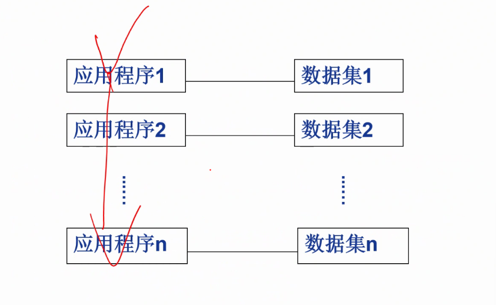

#### 特点

- 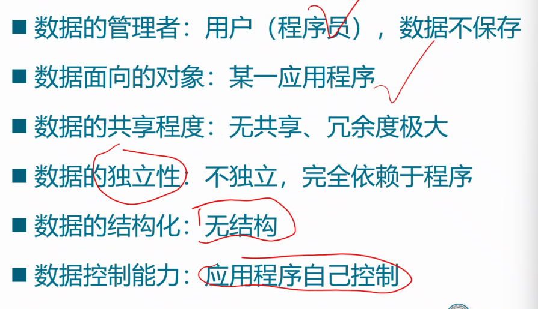
- 

### 我们已有的基础

#### 讨论计算中常见的数据模型

- 数据结构（数组，链表，堆）
- 积于这些数据结构的基本操作
- 用于低层级的描述计算

#### 描述现实世界

- 对象（状态 + 改变状态的操作）
  - 可以理解成是对低等级的数据结构的一种组合，封装，形成一种更为复杂的结构，目的在于使其更接近现实世界，更加能够描述现实世界
- 用于“高层级”的描述计算
  - 对象代表着现实世界中的某一个事物之类的

#### 能够胜任“挥发性”计算

- 挥发性计算：数据，程序处理完后就“消失”了，下次想要的话就得冲头开始
- 持久性计算？

### 文件系统

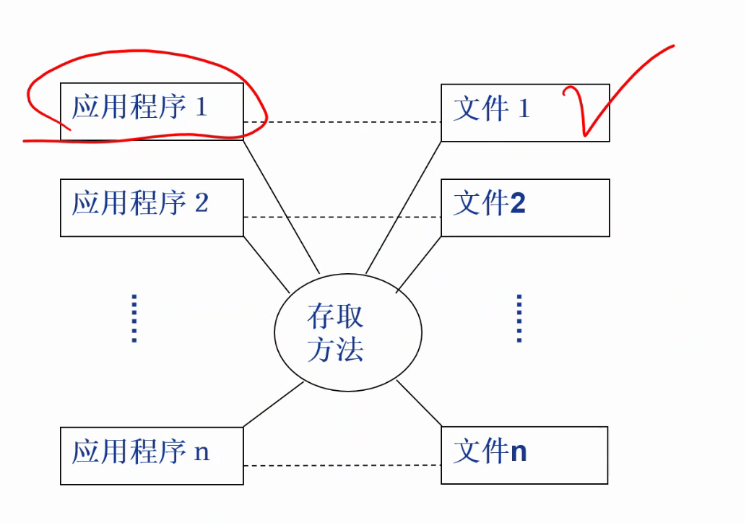

#### 特点

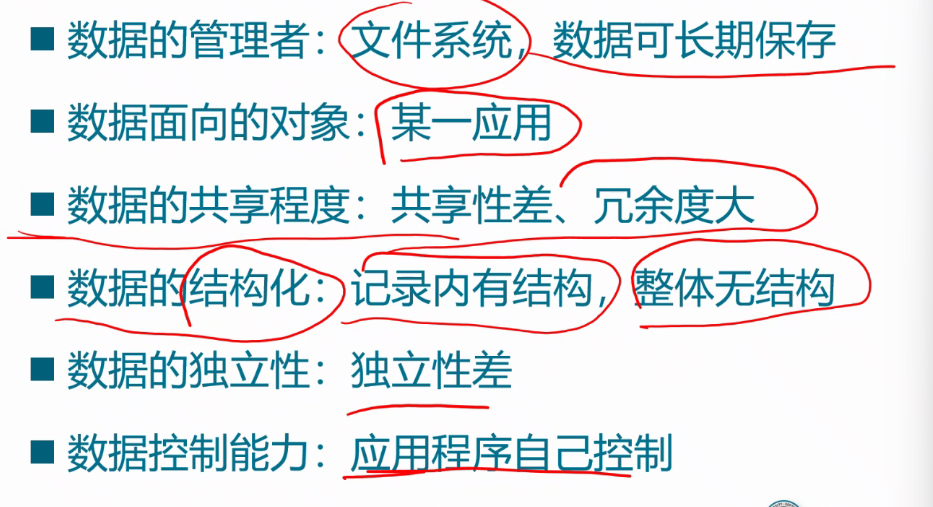

#### 例子与问题

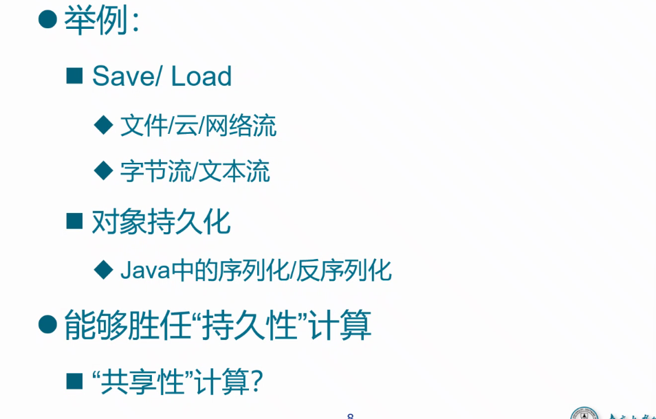

### 共享数据

#### 方式

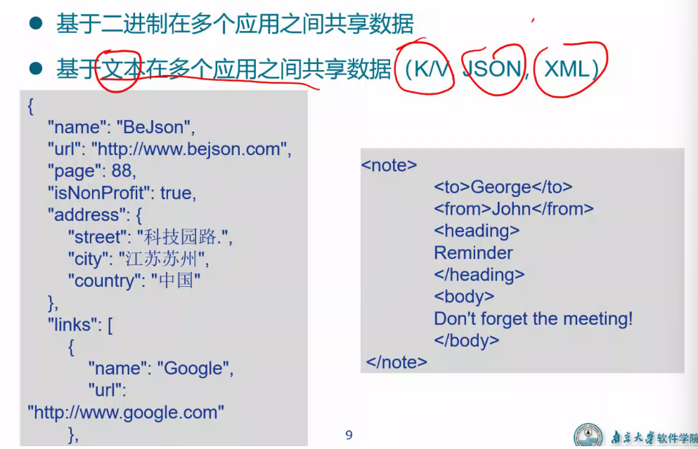

- 基于二进制在多个应用之间共享数据
  - 不好，因为不同应用之间的二进制规范可能不同，规范的转化是个大问题
- 基于文本在多个应用之间共享数据
  - 较好，文本相对于中立（要求可读），其规范较为明确，具体的有通过json（上图左），xml（上图右），K/V（键值对）

#### 问题

在多个应用使用数据的前提下

- 如何确保数据结构和存储机制对于所有应用来说都是可接受的
  - 比如A应用只能用数据结构a，B应用只能使用b，那么共享数据后数据机构会发生冲突
- 如何确保数据安全性，完整性
- 如何解决数据并发
- 如何在动态条件下解决上述问题

上述问题归结于

- 谁负责管理这些数据 — — 数据库管理系统！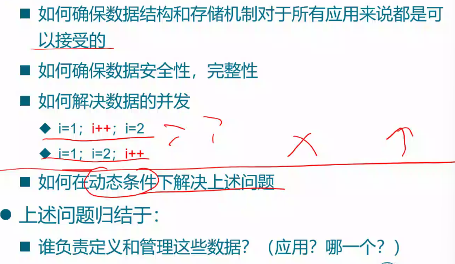

### 数据库管理系统

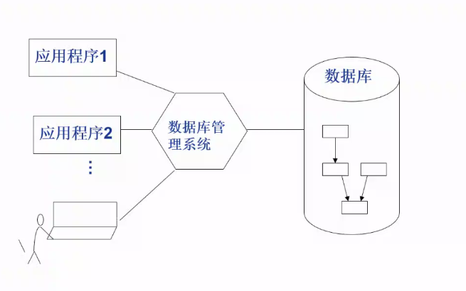

- 数据的管理，操作，收集，维护权限归于数据库所有
- 

# ch02 几个基本概念

## 1. 数据

- 所有能够进行信息化的对象
- 是数据库存储的基本对象

### 数据的含义

- 数据的含义称为数据的语义，数据和其语义密不可分

  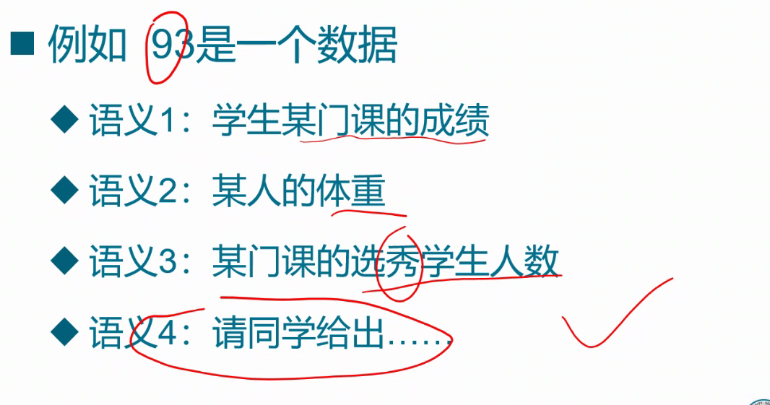

  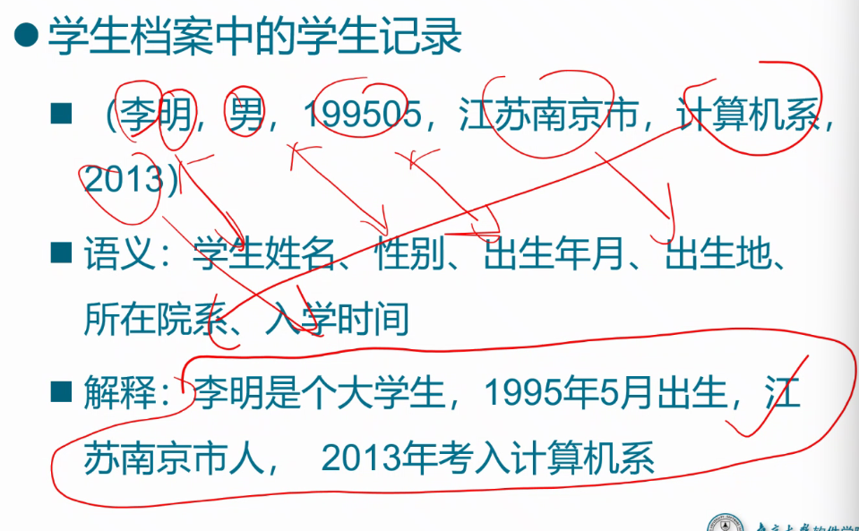

## 2. 数据库的定义

- 数据库是**长期**储存在计算机内，**有组织的**，**可共享的**的**大量数据**的集合

### 数据库的基本特征

- 数据按照一定**数据模型**组织，描述，存储
- 可为各种用户所共享
- 冗余度较小
  - 各个应用对应的相同数据在数据库只有一份
- 数据独立性较高
  - 数据不依赖于应用，当应用更改，只要数据完备，数据即不需要再度变更
- 易扩展
  - 因为数据独立性高，所以当新增应用时，数据基本不需要再变

## 3. 数据库管理系统（DBMS）

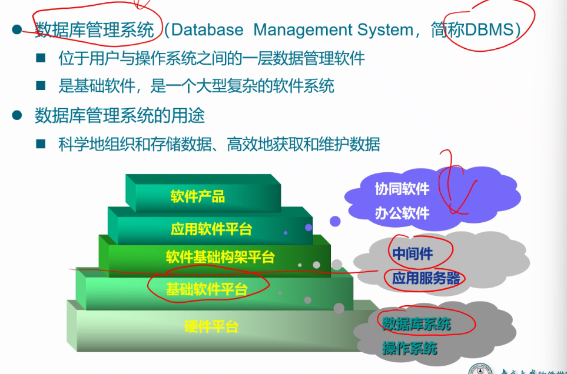

### 主要功能

#### 数据定义功能

- 提供数据定义语言（DDL）
  - 独立于其他应用，和编程开发语言截然不同
- 定义数据库中的数据对象

#### 数据组织、存储和管理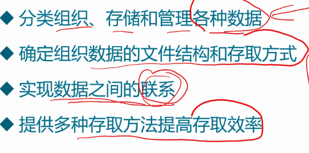

- 分类组织、存储、管理各种数据
- 确定组织数据的文件结构和存取方式

#### 数据操纵功能

- 提供数据操纵语言（DML）
- 实现对数据库的基本操作（增删改查0

#### 数据库的事务管理和运行管理

事务管理：两件事物要么同时做，要么都不做（订机票）

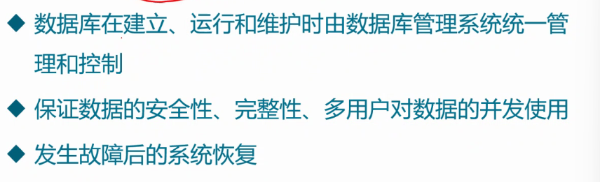

#### 数据库的建立和维护

- 数据库的初始数据的装载和转换
- 数据库转储和恢复功能
- 数据库的重组织（类似于整理磁盘碎片）
- 性能监视，分析等
  - 判断哪些资源紧张，哪些宽松等等
  - 分析用于数据库的调优，优化等等

#### 其他功能

- 数据管理系统与网络中其他软件系统的通信
- 数据库管理系统 系统之间的数据转换
- 异构数据库之间的互访和互操作😘

## 数据库系统（DBS）

在计算机系统中引入数据库后的系统构成

但是实际上现在几乎所有计算机系统都有数据库，所以这个概念很少被这样提及

### 构成

- 数据库
- 数据库管理系统（及其应用开发工具）
  - 用于管理数据，实现一系列功能
  - 应用开发工具：DDL，DML，ide，自动化（ORM，自动将应用程序）
- 应用程序
- 数据库管理员（DBA）

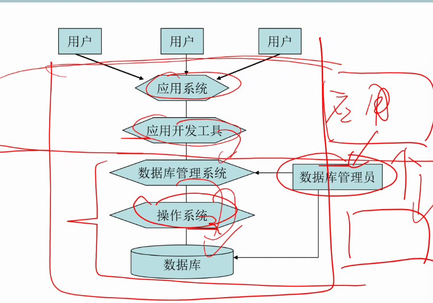

### 数据库的特点 

#### 数据结构化

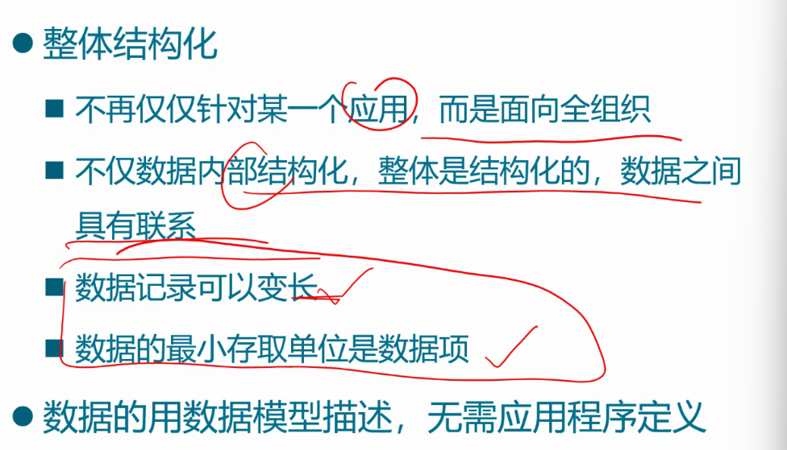

#### 数据的共享性高，冗余度低且易扩充

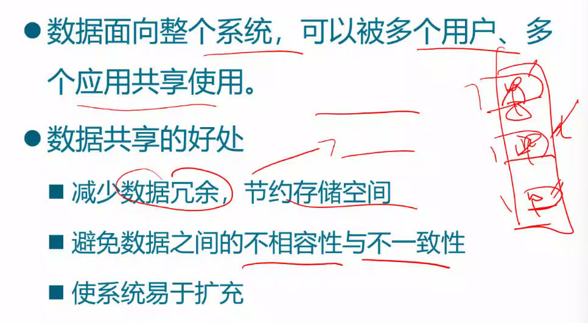

- 不一致性：应用A中甲身高180，B中为175
- 不相容性：

#### 数据独立性高

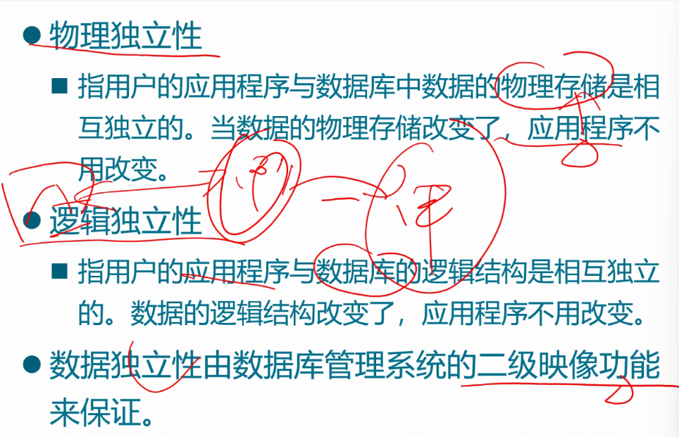

#### 数据由数据管理系统统一管理和控制

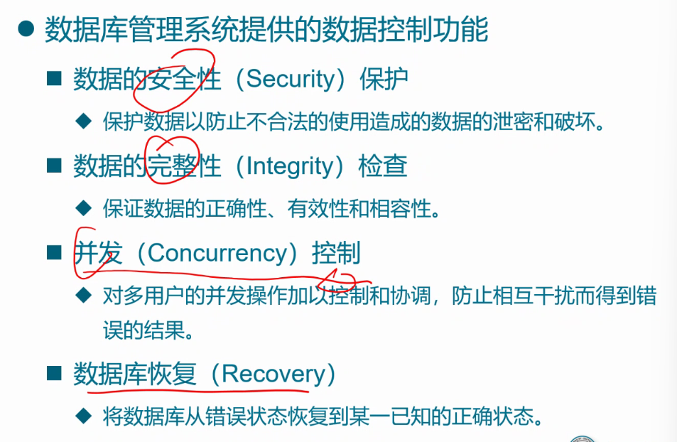

# ch05 逻辑模型

## 如何多块好省地将信息世界转化为机器世界？

- 基本问题：如何在机器世界中表达低层数据结构和高层数据机构
- 方案1：尽量独立于应用层，采用“中立”的方式表达概念模型
  - 关系数据模型
- 方案2：在应用层中，使用特定的数据结构，并在逻辑模型中高效支持这一数据结构。
  - 非关系数据模型
- 方案*：通用数据采用方案1，关键性数据采用方案2

## 常用数据模型

### 格式化模型（落伍）

- 层次模型
- 网状模型

### 关系模型！！

### 对象模型（不常用）

- 面向对象数据模型
- 对象关系数据模型

## 关系模型的数据结构

### 是什么

元组是一个实体，属性是一个

在用户观点下，关系模型中数据的逻辑结构是一张二维表，它由行和列组成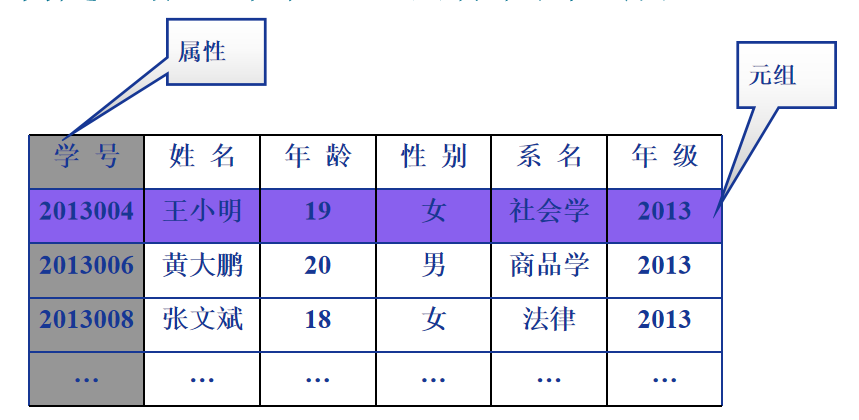

- 关系（relation）：一个关系对应一张二维表
- 元组：一行一元组
- 属性：一列是一个属性

### 规范化

关系必须是规范化的，满足一定的规范性

- 最基本的规划条件，关系中的每一个分量必须是不可分的（不能表中套表）

### 操作与完整性约束

- 数据操作（查询、插入、删除、更新）是集合操作，操作对象（输入）和操作结果（输出）都是关系
- 存取路径对用户隐蔽，用户只需要指出“干什么”，不必详细说“怎么干”
- 完整性约束
  - 实体完整性
  - 参照完整性
  - 用户定义的完整性
  - 由数据库来检查

### 优缺点

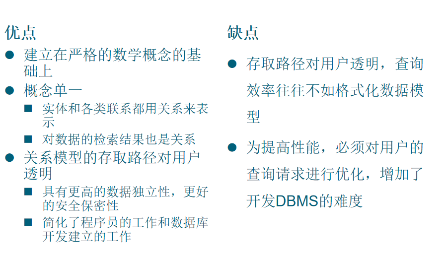

## 非关系数据模型的数据结构（NoSQL）

侧重于提高速度，但是不方便于共享。当应用层数据结构和逻辑层数据结构相同时 ，其速度自然更快

- 基于Key-Value的存储模型
- BigTable模型
  - 相当于关系模型再加上一个时间轴
- 基于文档模型
- 基于图模型
  - 记为G (V, E)，V为结点(node) 集合，每个结点具有若干属性，E为边(edge) 集合，也可以具有若干属性。

# ch06 数据库系统的结构

## 数据库系统的结构

- 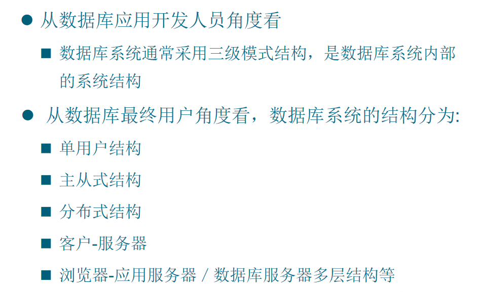

## 模式和实例

模式就是class，实例就是特定的对象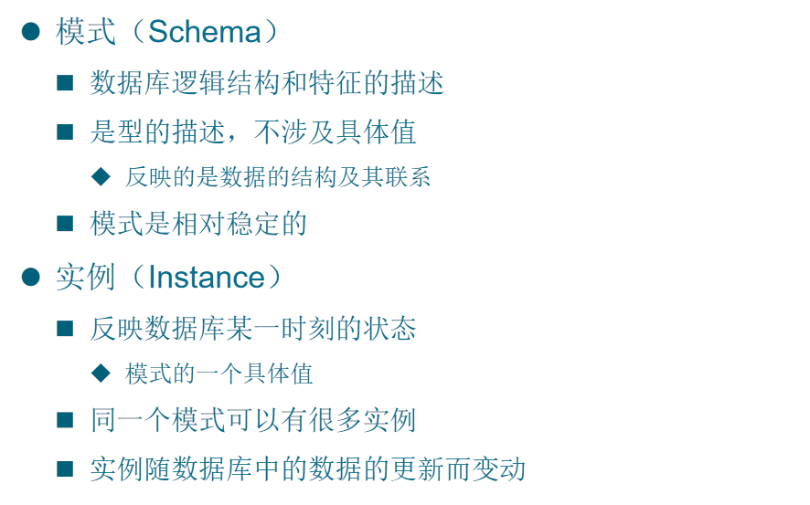

## 数据库系统的三级模式结构

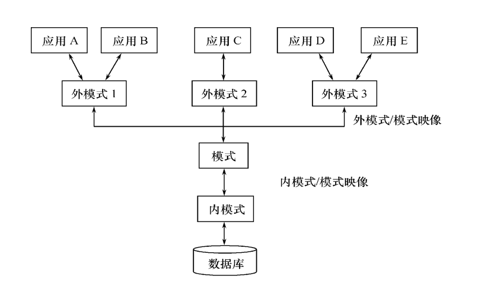

### 模式

#### 特点

- 也称逻辑模式
- 数据库中全体数据的逻辑结构和特征的描述
- 所有用户的公共数据视图
- 一个数据库只有一个模式

#### 地位

- 是数据库系统模式结构的中间层（把外模式和内模式分隔开，使二者相对独立，修改互不影响）
- 与数据的物理存储细节和硬件环境无关
  - 这个是内模式负责的
- 与具体的应用程序，开发工具，高级程序设计语言无关
  - 这个是外模式负责的

#### 定义

（包括些什么东西）

- 数据的逻辑结构：数据项的名字，类型，取值范围（关系模型等）
- 数据之间的联系
- 数据有关的安全性，完整性要求等

### 外模式

#### 定义

- 也称子模式或者用户模式
- 数据库用户（包括应用程序员与最终用户）使用的**局部数据**的逻辑结构和特征描述
- 数据库用户的数据视图，是和某一特定应用有关的数据的逻辑表示

#### 地位

- 介于模式和应用之间

##### 模式和外模式的关系：一对多

- 外模式通常是模式的**<u>子集</u>**
  - 只有模式中的部分数据，数据结构等，只为了满足对应应用的需要
- 一个数据库可以有多个外模式，反映了不用用户的应用需求，看待数据的方式，对数据保密的要求
- 对模式中同一数据，在外模式中的结构、类型、长度、保密级别等都可以不同

##### 外模式与应用的关系：一对多

- 同一外模式也可以为某一用户的多个应用系统所使用
- 但一个应用程序只能使用一个外模式

#### 优势与用途

- 安全性：保证数据库安全性的一个有力措施
  - 应用数据的修改只可能影响到外模式的数据，而不会改变模式中的初始数据，安全
- 隐私性：每个用户只能看见和访问所对应的外模式中的数据
  - 看不懂模式中的其他数据，只看到需要用长度数据，更具有隐私性

### 内模式

#### 定义

- 也称存储模式
- 是数据物理结构和存储方式的描述
- 是数据在数据库内部的表示方式
  - 记录的存储方式（例如，顺序存储，堆存储，hash存储等）
  - 索引的组织方式
  - 数据是否压缩存储
  - 数据是否加密
  - 数据存储记录结构的规定
- 一个数据库只有一个内模式

## 数据的二级映像与数据独立性

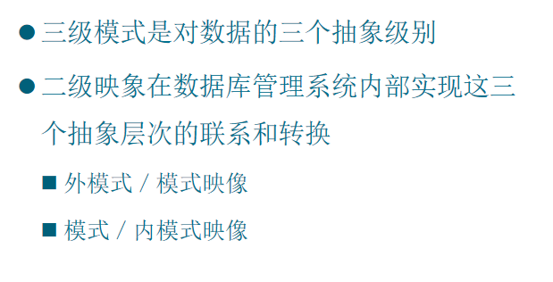

### 外模式/模式映像

- 模式：描述的是数据的**全局**逻辑结构
- 外模式：描述的是数据的**局部**逻辑结构 
- 同一个模式可以有任意多个外模式 
- 每一个外模式，数据库系统都有一个<u>外模式／模式映象</u>，定义外模式与模式之间的对应关系
- 映象定义通常包含在各自外模式的描述中
- 优点：保证数据的逻辑独立性
  - 当模式改变时，数据库管理员对外模式／模式映象作相应改变，使外模式保持不变
  - 应用程序是依据数据的外模式编写的，应用程序不必修改，保证了数据与程序的逻辑独立性，简称数据的逻辑独立性

# ch07 数据库系统的组成

# ch08 关系、关系模式和关系数据库

## 1. 笛卡尔积

### 域

- 使一组具有相同数据类型的值的集合，例如
  - 整数
  - 实数
  - 介于某个取值范围的实数

### 笛卡尔积定义

- 给定一组域D1，D2，…，Dn ，允许其中某些域是相同的。
- D1，D2，…，Dn的笛卡尔积为：
  D1×D2×…×Dn＝｛（d1，d2，…，dn）｜di∈Di，i＝1，2，…，n｝
- 所有域的所有取值的一个组合
- 不能重复

### 元素

## 2. 关系

### 关系定义

- D1×D2×…×Dn的子集叫作在域D1，D2，…，Dn上的关系，表示为R（D1，D2，…，Dn）
- R ：关系名
- n ：关系的目或度（Degree）
  - 当n=1时，称该关系为单元关系（Unary relation）或一元关系                         
  - 当n=2时，称该关系为二元关系（Binary relation）

#### 元组

- 关系中的每个元素是关系中的元组，通常用t表示。

#### 关系的表示

- 关系也是一个二维表，表的每行对应一个元组，表的每列对应一个域

#### 属性

- 关系中不同列可以对应相同的域
- 为了加以区分，必须对每列起一个名字，称为属性（Attribute）
- n目关系必有n个属性

### 码

#### 候选码

- 若关系中的某一属性组的值能唯一地标识一个元组，而其子集不能，则称该属性组为候选码

  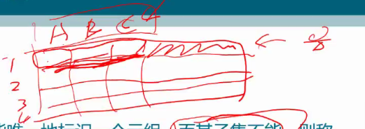

  > 如上图，当属性A，B，C确定后，其后面的内容也跟着确定了，表示确定了这个元组，但是只当AB确定时，后面的数值会有多种情况，表示子集不能确定

- 简单的情况：候选码只包含一个属性

  - 例如学号，身份证号（属性）

- 最极端的情况：关系模式的所有属性组是这个关系模式的候选码，称为全码（All-key）

#### 主码

- 若一个关系有多个候选码，则选定其中一个为主码（Primary key）

#### 主属性

- 候选码的各个属性称为主属性（Prime attribute）
- 不包含在任何候选码中的属性称为非主属性（Non-Prime attribute）或非码属性（Non-key attribute） 

### 和笛卡尔积的关系

- 笛卡尔积是型（class），它包括了给出的所有的域所有的可能组合情况；关系是具体的值（实例），它给出了现实世界中或者我们需要的具体的值

### 关系的类别

- 基本关系（基本表或基表）
- 实际存在的表，是实际存储数据的逻辑表示
- 查询表
- 查询结果对应的表
- 视图表
- 由基本表或其他视图表导出的表，是虚表，不对应实际存储的数据

### 基本关系的性质

- 列是同质的
  - 每一列中的分量是同一类型的数据，来自同于一个域
- 不同的列可出自于同一个域
  - 其中的每一列称为一个属性
  - 不同的属性要给予不同的属性名
  - 比如“年龄”属性，“获得最后学位的年龄”属性
- 行与列的顺序无所谓
- 任意两个元组的候选码不能相同
  - 如果候选码相同，则元组相同，违反了“关系是集合”的定义

## 3. 关系模式

### 定义与表示

- 关系模式（Relation Schema）是型，关系是值
- 关系模式是对关系的描述
  - 元组集合的结构
    - 属性构成
    - 属性来自的域           
    - 属性与域之间的映象关系
  - 完整性约束条件

- 关系模式可以形式化地**表示**为：R（U，D，DOM，F）
  - R：关系名	
  - U：组成该关系的属性名集合
  - D：U中属性所来自的域
    - U，D大小不一定相同
  - DOM ：属性向域的映象集合
  - F ：属性间数据的依赖关系的集合

### 关系模式与关系

- 关系模式
  - 对关系的描述
  - 静态的，稳定的
  - 是所有可能的情况的描述概括
- 关系
  - 关系模式在某一个时刻的状态或内容
  - 动态的，随时间不断变化的
- 关系模式和关系往往笼统称为关系
  - 通过上下文呢加以区别

## 4. 关系数据库

- 在一个给定的应用领域中，所有关系的集合构成了一个关系数据库

- 关系数据库的型与值
  - 关系数据库的型: 关系数据库模式，是对关系数据库的描述
  - 关系数据库的值: 关系模式在某一时刻对应的关系的集合，通常称为关系数据库

# ch09 关系完整性

## 1. 实体完整性

### 概念

- 若属性A是基本关系R的主属性，则属性A不能取空值

### 说明

1. 实体完整性规则是针对基本关系而言的。一个基本表通常对应现实世界的一个实体集。
2. 现实世界中的实体是可区分的，即它们具有某种唯一性标识。
3. 关系模型中以主码作为唯一性标识。
4. 主码中的属性即主属性不能取空值。
   1. 主属性取空值，就说明存在某个不可标识的实体，即存在不可区分的实体，这与第2点相矛盾，因此这个规则称为实体完整性

## 2. 参照完整性

### 参照完整性规则

- 若属性（或属性组）F是基本关系R的外码,它与基本关系S的主码Ks相对应（基本关系R和S不一定是不同的关系），则对于R中每个元组在F上的值必须为：
  - 或者**取空值**（F的每个属性值均为空值）
  - 或者**等于S中某个元组的主码值**
  - 简单来说，外码要么是空，要么就得在其对应关系中能够找到对应的元组
  - 是对外码有约束，对主码没有约束

#### 例子

## 3. 用户定义的完整性

- 针对某一具体关系数据库的约束条件，反映某一具体应用所涉及的数据必须满足的语义要求
  - 是对所有应用都生效的
- 关系模型应提供定义和检验这类完整性的机制，以便用统一的系统的方法处理它们，而**不需由应用程序承担这一功能**
  - 当所有应用都有这个需求时，就直接通过管理员在数据库层面进行定义，统一，避免出错
- 例：课程（课程号，课程名，学分）
  - “课程号”属性必须取唯一值
  - 非主属性“课程名”也不能取空值
  - “学分”属性只能取值{1，2，3，4}

# ch10 关系操作与关系代数

## 1. 基本的关系操作

### 常用操作

#### 查询操作

- 选择、投影、连接、除、并、差、交、笛卡尔积
- 选择、投影、并、差、笛卡尔积是5种基本操作

#### 更新操作

​	

### 操作特点

- 集合操作方式：操作的对象和结果都是集合，依次一集合的方式
  - 输入输出相对封闭，能够形成流水线，方便运算后实时查看

## 2. 关系代数

- 关系代数是一种抽象的查询语言，它用对关系的运算来表达查询
  - 运算对象是关系
  - 运算结果亦为关系
  - 关系代数的运算符有两类：集合运算符和专门的关系运算符
    - 传统的集合运算是从关系的“水平”方向，即行的角度进行
    - 专门的关系运算不仅涉及行而且涉及列

### 一些记号

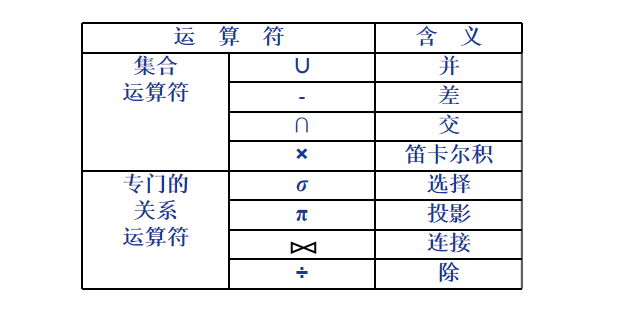

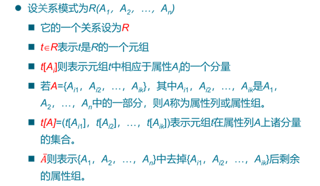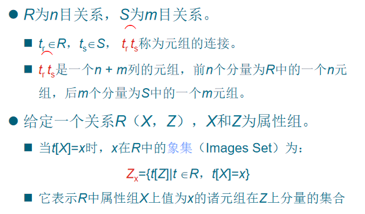

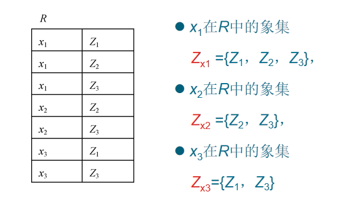

### 并

两个同目的关系，并的结果就是把两个关系的元组相加，去掉其中重复的部分

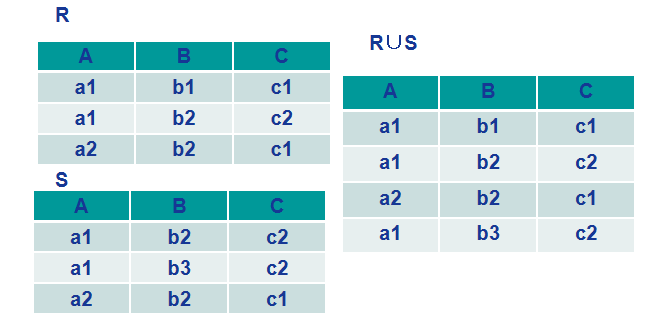

### 差

两个同目的关系，R-S就是把R中有的S中的元组给去掉，得到结果

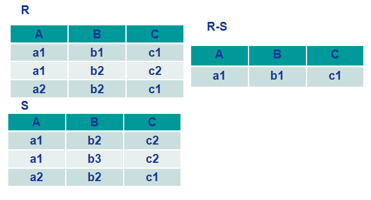

### 交

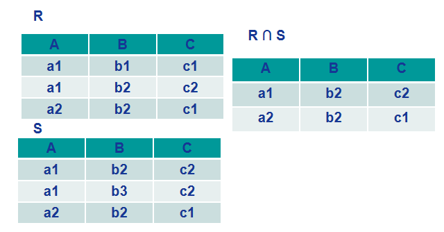

### 笛卡尔积

其实应该叫做广义的笛卡尔积，因为笛卡尔积本来是针对不同的域来说的，这边用在了域的子集——关系

笛卡尔积的结果就是把两个关系（不要求同目）的所有元组进行所有可能的组合，得到结果

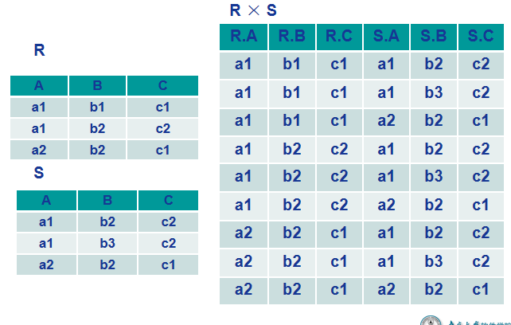

### 基本关系（例子）

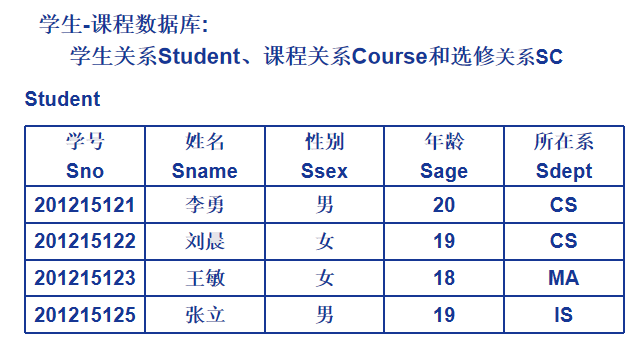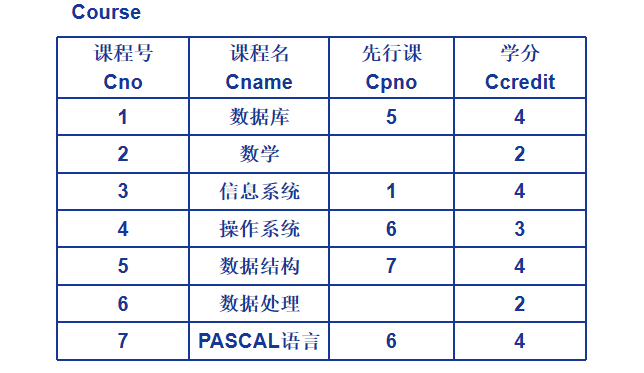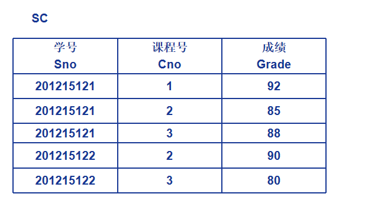

### 选择

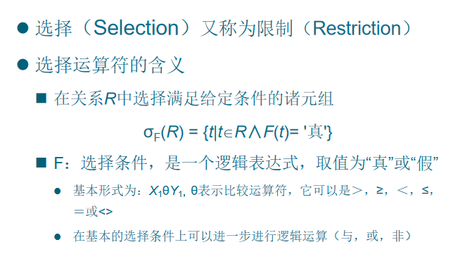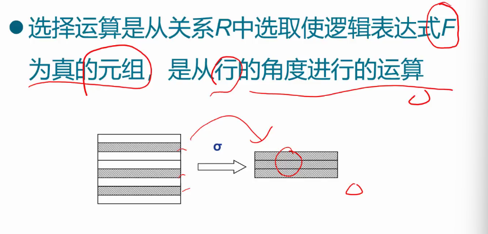

> 选择是按照特定条件选择符合要求的元组

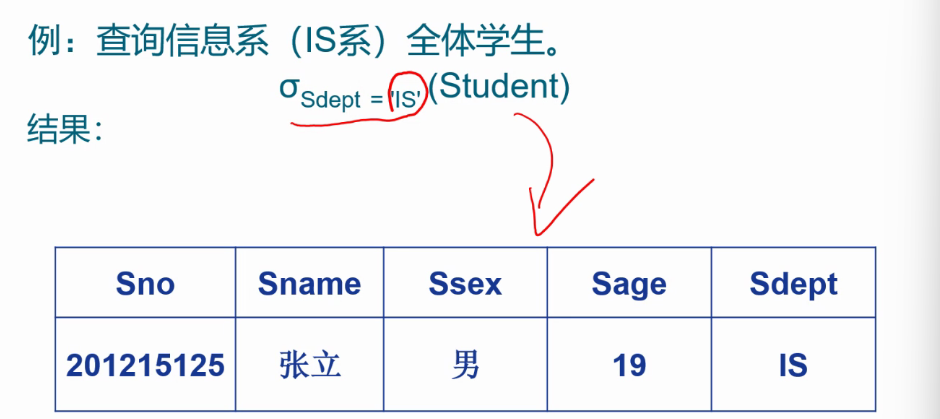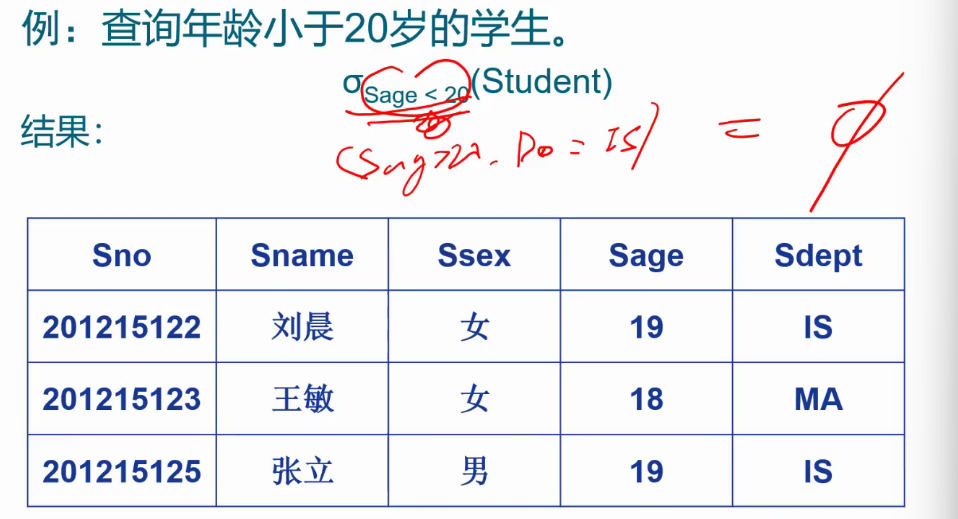

### 投影

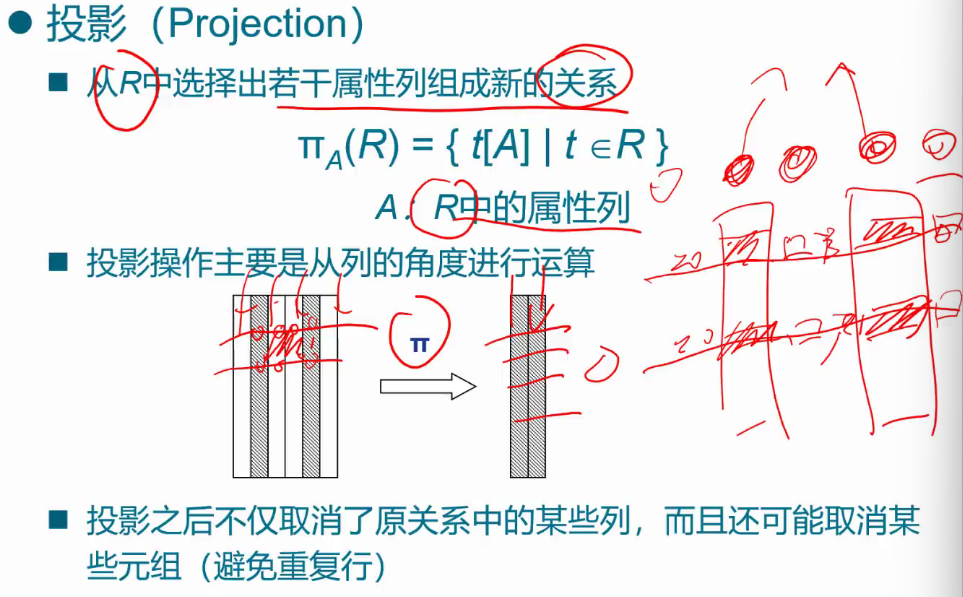

> 投影是对列起作用的，但是可能对行也有影响

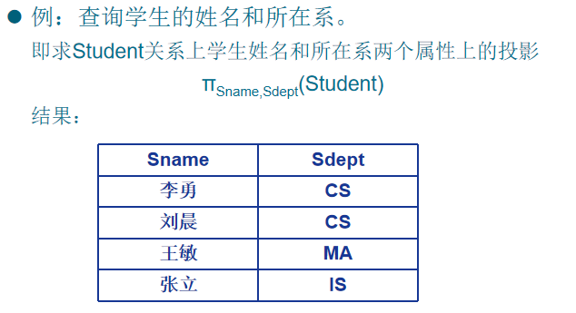

> 选择两个

### 连接

如果把笛卡尔积比作为型，那么连接得到的结果就是其的值

### 外连接

### 除法

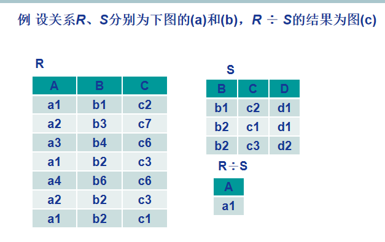

- R，S中都含有B，C属性，R中比S中多了又给A属性，那么结果的属性为A；
- 在R中，A属性下，只有值a1对应的属性B，C下的值分别为b1，c2；b2，c3；b2，c1  与S中B，C属性值相同
- 所以结果属性A有值：a1

### 综合举例

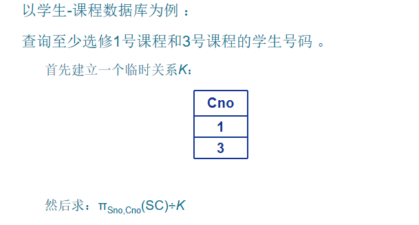

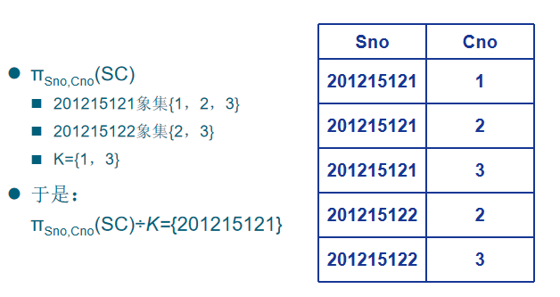

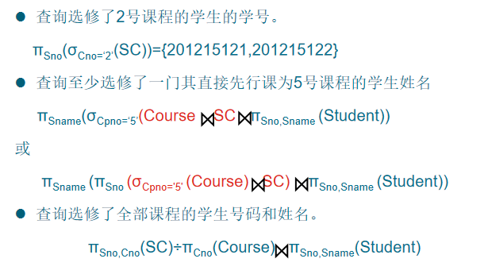

# 

## 
