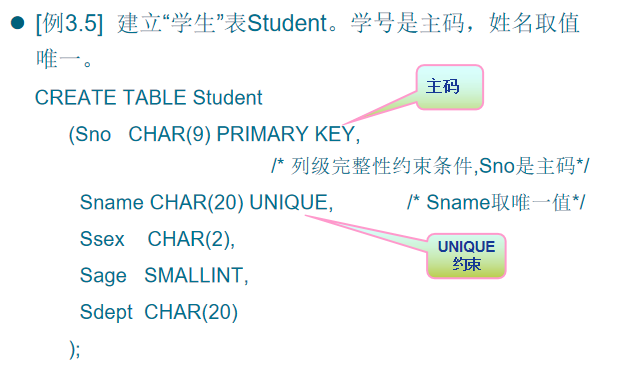
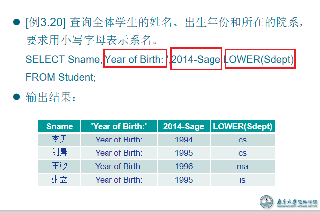
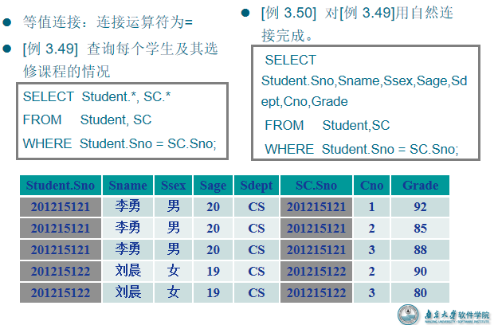
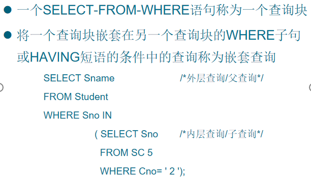
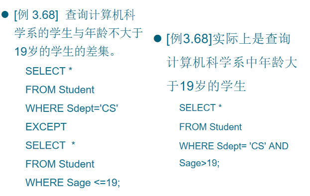

# ch11 SQL概述

## 1. 特点

- 高度非过程化
  - 过程化的意思就是语言需要对每个操作的过程清楚并执行，非过程化就是只需要给出一个任务，具体怎么实现不在考虑范围之内
  - 非关系数据模型的数据操纵语言“面向过程”，必须指定存取路径。
  - SQL只要提出“做什么”，无须了解存取路径。
  - 存取路径的选择以及SQL的操作过程由系统自动完成。
- 面向集合的操作方式
  - 非关系数据模型采用面向记录的操作方式，操作对象是一条记录
  - SQL采用集合操作方式
    -  操作对象、查找结果可以是元组的集合
    -  一次插入、删除、更新操作的对象可以是元组的集合
- 以同一种语法结构提供多种使用方式
  - SQL是独立的语言，能够独立地用于联机交互的使用方式
  - SQL又是嵌入式语言，能够嵌入到高级语言（例如C，C++，Java）程序中，供程序员设计程序时使用
- 语言简洁，易学易用
  - SQL功能极强，完成核心功能只用了9个动词:
    - 数据定义：CREATE，DROP，ALTER
    - 数据查询：SELECT
    - 数据操作：INSERT，UPDATE，DELETE
    - 数据控制：GRANT，REVOKE

## 2. SQL与关系数据库的三级模式


# ch12 SQL数据定义

## 1. 层次化的数据库对象命名机制

- 一个关系数据库管理系统的实例可以建立多个数据库
- 一个数据库中可以建立多个模式
  - 但通常是一个数据库对应一个模式
  - 一个模式对应一个独立的命名空间
- 模式下可以又多个表，试图，索引等数据库对象


## 2. 数据定义

- SQL的数据定义功能: 
  - 模式定义
  - 表定义
  - 视图和索引的定义 


### 模式操作

#### 定义模式

- 定义模式实际上定义了一个命名空间。
  - 在这个空间中可以定义该模式包含的数据库对象，例如基本表、视图、索引等。
- 在CREATE SCHEMA中可以接受CREATE TABLE，CREATE VIEW和GRANT子句。
  - CREATE SCHEMA <模式名> AUTHORIZATION <用户名>  [<表定义子句>| <视图定义子句>|<授权定义子句>]
- 例子：

#### 删除模式

- DROP SCHEMA <模式名> <CASCADE|RESTRICT>
  - CASCADE（级联）
    - 删除模式的同时把该模式中所有的数据库对象全部删除
  - RESTRICT（限制）
    - 如果该模式中定义了下属的数据库对象（如表、视图等），则拒绝该删除语句的执行。
    - 仅当该模式中没有任何下属的对象时才能执行。
- [例3.4]  DROP SCHEMA ZHANG CASCADE;
  - 删除模式ZHANG
  - 同时该模式中定义的表TAB1也被删除

### 基本表操作

#### 建立基本表

- CREATE TABLE <表名>

  ​      (<列名> <数据类型>[ <列级完整性约束条件> ]

  ​      [,<列名> <数据类型>[ <列级完整性约束条件>] ] 

  ​	   …

  ​      [,<表级完整性约束条件> ] );

  - <表名>：所要定义的基本表的名字
  - <列名>：组成该表的各个属性（列）
  - <列级完整性约束条件>：涉及相应属性列的完整性约束条件
  - <表级完整性约束条件>：涉及一个或多个属性列的完整性约束条件 
  - 如果完整性约束条件涉及到该表的多个属性列，则必须定义在表级上，否则既可以定义在列级也可以定义在表级。 

- 例：

  

  

##### 数据类型

- SQL中域的概念用数据类型来实现
- 定义表的属性时需要指明其数据类型及长度 
- 选用哪种数据类型 
  - 取值范围 
    - 可以决定数据类型以及其长度
  - 要做哪些运算 
    - 可以决定选用那中类型的数据
    - 比如性别的数据类型，如果要判断男生和女生数量的差距，可以用1，-1；如果只是需要判断男女生，那么只需要使用布尔值


#### 修改基本表

- ALTER TABLE <表名>

  [ ADD[COLUMN] <新列名> <数据类型> [ 完整性约束 ] ]

  [ ADD <表级完整性约束>]

  [ DROP [ COLUMN ] <列名> [CASCADE| RESTRICT] ]

  [ DROP CONSTRAINT<完整性约束名>[ RESTRICT | CASCADE ] ]

  [ALTER COLUMN <列名><数据类型> ] ;

  ****

#### 删除基本表


### 索引操作

- 建立索引的目的：**加快查询速度**
  - 由数据库管理员或表的拥有者建立
  - 由关系数据库管理系统自动完成维护
  - 关系数据库管理系统自动使用合适的索引作为存取路径，用户不必也不能显式地选择索引
  - **但是在进行增删改的时候，索引需要同步更新，会导致其效率降低**
- 关系数据库管理系统中常见索引：
  - 顺序文件上的索引
  - B+树索引
  - 散列（hash）索引
  - 位图索引

#### 建立索引


#### 修改删除索引


# ch13 SQL数据查询(单表)


## 1. select … from …

### 选择若干列


### 查询经过计算的值





## 2. where （条件）


## 3.  order by

即按一定的顺序排列

## 4. group by(聚集函数)

类似于计算属性，相当于从表中得到对应的列后再进行一次 计算，返回结果


# ch14 SQL数据查询（连接）

- **连接查询**：同时设计两个以上的表的查询、
- **连接条件或连接谓词**：用来连接两个表的条件
- 一般格式：
  - [<表名1>.]<列名1>  <比较运算符>  [<表名2>.]<列名2>
  - [<表名1>.]<列名1> BETWEEN [<表名2>.]<列名2> AND [<表名2>.]<列名3>
- **连接字段**：连接谓词中的列名称
  - 连接条件中的各连接字段类型必须是可比的，但名字不必相同

## 1. 等值连接与自然连接



### 连接操作的执行过程

#### 嵌套循环法


> 表1取一行，表2比一遍，比完为止

#### 排序合并法

- 常用于=连接
- 首先按连接属性对表1和表2排序
- 对表1的第一个元组，从头开始扫描表2，顺序查找满足连接条件的元组，找到后就将表1中的第一个元组与该元组拼接起来，形成结果表中一个元组。当遇到表2中第一条大于表1连接字段值的元组时，对表2的查询不再继续


#### 索引连接

- 对表2按连接字段建立索引
- 对表1中的每个元组，依次根据其连接字段值查询表2的索引，从中找到满足条件的元组，找到后就将表1中的第一个元组与该元组拼接起来，形成结果表中一个元组

## 2. 自身连接

- 自身连接：一个表与其自己进行连接

- 需要给表起别名以示区别

- 由于所有属性名都是同名属性，因此必须使用别名前缀

- [例 3.52]查询每一门课的间接先修课（即先修课的先修课）

  ```sql
  SELECT  FIRST.Cno, SECOND.Cpno
  // 给course取了first和second的别名
  FROM  Course  FIRST, Course  SECOND 
  WHERE FIRST.Cpno = SECOND.Cno;
  ```

  

## 3. 外连接


## 4. 多表连接


# ch15 SQL数据查询（嵌套）



- 上层的查询块称为外层查询或父查询
- 下层查询块称为内层查询或子查询
- SQL语言允许多层嵌套查询
  - 即一个子查询中还可以嵌套其他子查询
- 子查询的限制
  - 不能使用ORDER BY子句
- 有些嵌套查询可以用连接运算替代
  - 谨慎使用嵌套查询

### Exist

-  EXISTS谓词
   - 存在量词  
   - 带有EXISTS谓词的子查询不返回任何数据，只产生逻辑真值“true”或逻辑假值“false”。
     - 若内层查询结果非空，则外层的WHERE子句返回真值
     - 若内层查询结果为空，则外层的WHERE子句返回假值
   - 由EXISTS引出的子查询，其目标列表达式通常都用 * ，因为带EXISTS的子查询只返回真值或假值，给出列名无实际意义。
-  NOT EXISTS谓词
   - 若内层查询结果非空，则外层的WHERE子句返回假值
   - 若内层查询结果为空，则外层的WHERE子句返回真值


> 这个是相关子查询，即子查询中需要用到外层的内容，从外层的student中取出一个元组，其中的Sno和子查询中的Sno比较，且满足Cno = ‘1’，就说明有查询结果，那么exist就返回true，那么就可以挑选处这个 元组当中的Sname作为一个结果

- 用EXISTS/NOT EXISTS实现全称量词

  - SQL语言中没有全称量词（For all）
  - 可以把带有全称量词的谓词转换为等价的带有存在量词的谓词：

  ​        （x）P ≡  （ x（ P））


# ch 16 SQL数据查询（集合）

集合操作不常用，其操作资源消耗大，除非进行大量重复操作，系统内部存有缓存，可能会采用集合操作

- 集合操作的种类
  - 并操作UNION
  - 交操作INTERSECT
  - 差操作EXCEPT
- 参加集合操作的**各查询结果的列数必须相同**；对应项的**数据类型**也必须相同 

## 并操作 UNION


## 交操作 INTERSECT


## 差操作EXCEPT



# ch 17 SQL数据查询（基于派生表）

- 子查询不仅可以出现在WHERE子句中，还可以出现在FROM子句中，这时子查询生成的临时派生表（Derived Table）成为主查询的查询对象


# ch18 SQL数据更新-插入

## 1. 插入元组

- 将新元组插入指定表中，语句格式

  ​	

  ```
  INSERT
  
  INTO <表名> [(<属性列1>[,<属性列2 >…)]
  
  VALUES (<常量1> [,<常量2>]… );
  ```

- INTO子句

  - 指定要插入数据的表名及属性列
  - 属性列的顺序可与表定义中的顺序不一致
  - 没有指定属性列：表示要插入的是一条完整的元组，且属性列属性与表定义中的顺序一致
  - 指定部分属性列：插入的元组在其余属性列上取空值(NULL)

- VALUES子句

  -  提供的值必须与INTO子句匹配
     - 值的个数
     - 值的类型


## 2. 插入子查询结果

- 语句格式

  ```
  INSERT 
  INTO <表名>  [(<属性列1> [,<属性列2>…  )]
  子查询;
  ```

- INTO子句

- 子查询

  - SELECT子句目标列必须与INTO子句匹配
    - 值的个数
    - 值的类型


# ch19 SQL数据更新-修改

- 语句格式

  ​    

  ```
  UPDATE  <表名>
  SET  <列名>=<表达式>[,<列名>=<表达式>]…
  [WHERE <条件>];
  ```

- 功能

  - 修改指定表中满足WHERE子句条件的元组
  - SET子句给出<表达式>的值用于取代相应的属性列
  - 如果省略WHERE子句，表示要修改表中的所有元组

- [例3.73]  将学生201215121的年龄改为22岁
      UPDATE  Student
      SET Sage=22
      WHERE  Sno=' 201215121 '; 

- [例3.74]  将所有学生的年龄增加1岁。
   UPDATE Student
     	SET Sage= Sage+1;

- [例3.75]  将计算机科学系全体学生的成绩置零。
      UPDATE SC
      SET     Grade=0
      WHERE Sno  IN
             (SELETE Sno
              FROM     Student
              WHERE  Sdept= 'CS' );

- 关系数据库管理系统在执行修改语句时会检查修改操作是否破坏表上已定义的完整性规则

  - 实体完整性
  - 参照完整性
  - 用户定义的完整性
    -  NOT NULL约束
    -  UNIQUE约束
    -  值域约束


# ch20 SQL数据更新-删除

- 语句格式

```
DELETE
FROM     <表名>
[WHERE <条件>];
```

- 功能
  - 删除指定表中满足WHERE子句条件的元组
- WHERE子句
  - 指定要删除的元组
  - 缺省表示要删除表中的全部元组，表的定义仍在字典中

[例3.76]  删除学号为201215128的学生记录。
         DELETE
         FROM Student
         WHERE Sno= 201215128 ';

[例3.77]  删除所有的学生选课记录。
        DELETE
        FROM SC;

[例3.78]  删除计算机科学系所有学生的选课记录。
		DELETE
		FROM  SC
		WHERE  Sno  IN
			(SELETE  Sno
		            FROM   Student
		            WHERE  Sdept= 'CS') ;

# ch21 SQL中的空值

## 1. 空值的产生与处理

- 空值就是“不知道”或“不存在”或“无意义”的值。

- 一般有以下几种情况：

  - 该属性应该有一个值，但目前不知道它的具体值

    - 例如考完试不知道分数

  - 该属性不应该有值

    - 例如缺考，分数栏不应该填

  - 由于某种原因不便于填写

  - [例 3.79]向SC表中插入一个元组，学生号是”201215126”，课程号是”1”，成绩为空。

    ```
    INSERT INTO SC(Sno,Cno,Grade)
     VALUES('201215126 ','1',NULL);   /*该学生还没有考试成绩，取空值*/
    ```

    或

    ```
     INSERT INTO SC(Sno,Cno)
     VALUES(' 201215126 ','1');             /*没有赋值的属性，其值为空值*
    ```

- 空值的产生：

  - [例3.80]  将Student表中学生号为”201215200”的学生所属的系改为空值。
    	UPDATE Student
    	SET Sdept = NULL
    	WHERE Sno='201215200';

## 2. 空值的判断

- 判断一个属性的值是否为空值，用IS NULL或IS NOT NULL来表示。
- [例 3.81]  从Student表中找出漏填了数据的学生信息
  	SELECT  *
  	FROM Student
  	WHERE Sname IS NULL OR Ssex IS NULL OR Sage IS NULL OR Sdept IS NULL;
- 属性定义（或者域定义）中
- 有NOT NULL约束条件的不能取空值
- 加了UNIQUE限制的属性不能取空值
- 码属性不能取空值

## 3. 空值的运算

# ch22 视图

实际上，基本表能做的操作，视图都可以做，视图实际上就是基本表的逻辑表示，视图相当于是基本表盖上模板，然后开几个洞，可以对这个洞里面的内容进行操作

- 视图的特点
  - 虚表，是从一个或几个基本表（或视图）导出的表
  - 只存放视图的定义，不存放视图对应的数据
  - 基表中的数据发生变化，从视图中查询出的数据也随之改变

## 1. 建立视图

### 语句格式

```
       CREATE  VIEW 
             <视图名>  [(<列名>  [,<列名>]…)]
       AS  <子查询>
       [WITH  CHECK  OPTION];
```

- WITH CHECK OPTION
  - 对视图进行UPDATE，INSERT和DELETE操作时要保证更新、插入或删除的行满足视图定义中的谓词条件（即子查询中的条件表达式）

- 子查询可以是任意的SELECT语句，是否可以含有ORDER BY子句和DISTINCT短语，则决定具体系统的实现。

- 组成视图的属性列名：全部省略或全部指定
  - 全部省略: 
    - 由子查询中SELECT目标列中的诸字段组成
  - 明确指定视图的所有列名:
    - 某个目标列是聚集函数或列表达式
    - 多表连接时选出了几个同名列作为视图的字段
    - 需要在视图中为某个列启用新的更合适的名字

### 例子

 [例3.84]  建立信息系学生的视图。
        CREATE VIEW IS_Student
        AS 
        SELECT Sno,Sname,Sage
        FROM     Student
        WHERE  Sdept= 'IS';

[例3.85]建立信息系学生的视图，并要求进行修改和插入操作时仍需保证该视图只有信息系的学生 。
  CREATE VIEW IS_Student
  AS 
  SELECT Sno,Sname,Sage
  FROM  Student
  WHERE  Sdept= 'IS'
  WITH CHECK OPTION;

- 定义IS_Student视图时加上了WITH CHECK OPTION子句，对该视图进行插入、修改和删除操作时，RDBMS会自动加上Sdept='IS'的条件。
- 若一个视图是从单个基本表导出的，并且只是去掉了基本表的某些行和某些列，但保留了主码，我们称这类视图为行列子集视图。
- IS_Student视图就是一个<u>**行列子集视图**</u>。

### 不同类型的视图

上面的是基于一个表的视图

#### 基于多个基表的视图

[例3.86]  建立信息系选修了1号课程的学生的视图（包括学号、姓名、成绩）。
        CREATE VIEW IS_S1(Sno,Sname,Grade)
        AS 
        SELECT Student.Sno,Sname,Grade
        FROM  Student,SC
        WHERE  Sdept= 'IS' AND
                       Student.Sno=SC.Sno AND
                       SC.Cno= '1';

#### 基于视图的视图

[例3.87]  建立信息系选修了1号课程且成绩在90分以上的学生的视图。
        CREATE VIEW IS_S2
        AS
        SELECT Sno,Sname,Grade
        FROM  IS_S1
        WHERE  Grade>=90;

#### 带表达式的视图

[例3.88]  定义一个反映学生出生年份的视图。
        CREATE  VIEW BT_S(Sno,Sname,Sbirth)
        AS 
        SELECT Sno,Sname,2014-Sage
        FROM  Student;

#### 分组视图（带聚集函数的视图）

[例3.89]  将学生的学号及平均成绩定义为一个视图
   CREAT  VIEW     S_G(Sno,Gavg)
   AS  
   SELECT Sno,AVG(Grade)
   FROM  SC
   GROUP BY Sno;

> 注意：视图的属性列是表达式或者聚集函数情况下，其无法进行增删改，是不可更新的

## 2. 删除视图

## 3. 查询视图

- 用户角度：查询视图与查询基本表相同
- 系统角度：关系数据库管理系统实现视图查询的方法
  - 视图消解法（View Resolution）
    - 进行有效性检查
    - 转换成等价的对基本表的查询
    - 执行修正后的查询

[例3.92]  在信息系学生的视图中找出年龄小于20岁的学生。
       SELECT   Sno,Sage
       FROM      IS_Student
       WHERE   Sage<20;
	视图消解转换后的查询语句为：
 		SELECT  Sno,Sage       
 		FROM  Student
		 WHERE  Sdept= 'IS'  AND  Sage<20;

[例3.93]  查询选修了1号课程的信息系学生
SELECT  IS_Student.Sno,Sname
FROM     IS_Student,SC
WHERE  IS_Student.Sno =SC.Sno AND SC.Cno= '1'; // 

实际上，基本表能做的操作，视图都可以做，视图实际上就是基本表的逻辑表示，视图相当于是基本表盖上模板，然后开几个洞，可以对这个洞里面的内容进行操作

## 4. 更新视图

### 修改、删除、插入

- 修改

  [例3.95]  将信息系学生视图IS_Student中学号”201215122”的学生姓名改为”刘辰”。
  UPDATE  IS_Student
  SET  Sname= '刘辰'
  WHERE  Sno= ' 201215122 ';
  转换后的语句：
  UPDATE  Student
  SET Sname= '刘辰'
  WHERE Sno= ' 201215122 ' AND Sdept= 'IS';

- 插入

  [例3.96]  向信息系学生视图IS_S中插入一个新的学生记录，其中学号为”201215129”，姓名为”赵新”，年龄为20岁
  INSERT
  INTO IS_Student
  VALUES(‘201215129’,’赵新’,20);
  转换为对基本表的更新：
  INSERT
  INTO   Student(Sno,Sname,Sage,Sdept)
  VALUES(‘200215129 ','赵新',20,'IS' );

- 删除

  [例3.97]删除信息系学生视图IS_Student中学号为”201215129”的记录 
  DELETE
  FROM IS_Student
  WHERE Sno= ' 201215129 ';
  转换为对基本表的更新：
  DELETE
  FROM Student
  WHERE Sno= ' 201215129 ' AND Sdept= 'IS';

### 更新限制

- 允许对行列子集视图进行更新

- 对其他类型视图的更新不同系统有不同限制

  - 更新视图的限制：一些视图是不可更新的，因为对这些视图的更新不能唯一地有意义地转换成对相应基本表的更新

  - 例：例3.89定义的视图S_G为不可更新视图。

    ​			UPDATE  S_G

    ​			SET     Gavg=90

    ​			WHERE  Sno= '201215121';

    - 这个对视图的更新无法转换成对基本表SC的更新

## 5. 视图作用

- 当视图中的数据不是直接来自于基本表时，定义视图能够简化用户操作
  - 基于多张表连接形成的视图
  - 基于复杂嵌套查询的视图
  - 含导出属性的视图
- 视图机制能使不同用户以不同方式看待同一数据
  - 视图和基本表的关系 = 外模式和模式的关系
  - 适应数据库共享的需要
- 视图对重构数据库提供了一定程度的逻辑独立性
  - 例：学生关系Student(Sno,Sname,Ssex,Sage,Sdept) 
    “垂直”地分成两个基本表：
    	SX(Sno,Sname,Sage)        
    	SY(Sno,Ssex,Sdept)
  - 通过建立一个视图Student：
    	CREATE VIEW  Student(Sno,Sname,Ssex,Sage,Sdept)
    	AS  
        	SELECT  SX.Sno,SX.Sname,SY.Ssex,SX.Sage,SY.Sdept
       	FROM  SX,SY
      	WHERE  SX.Sno=SY.Sno;
  - 使用户的外模式保持不变，用户的应用程序通过视图仍然能够查找数据
  - 由于对视图的更新是有条件的，因此应用程序中修改数据的语句可能仍会因基本表结构的改变而改变。
- 视图能够对机密数据提供安全保护
  - 对不同用户定义不同视图，使每个用户只能看到他有权看到的数据
- 适当的利用视图可以更清晰的表达查询
  - 经常需要执行这样的查询“对每个同学找出他获得最高成绩的课程号”。
  - 可以先定义一个视图，求出每个同学获得的最高成绩 
    	 CREATE VIEW VMGRADE
              AS
              SELECT Sno, MAX(Grade)  Mgrade
              FROM  SC
              GROUP BY Sno;
  - 然后用如下的查询语句完成查询：
         SELECT SC.Sno,Cno
         FROM SC,VMGRADE 
         WHERE SC.Sno=VMGRADE.Sno AND       
         SC.Grade=VMGRADE .Mgrade; 

