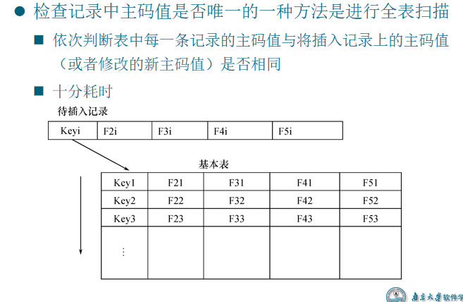
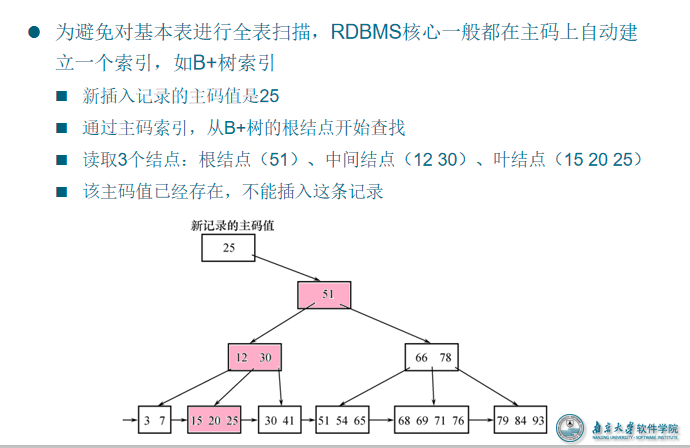
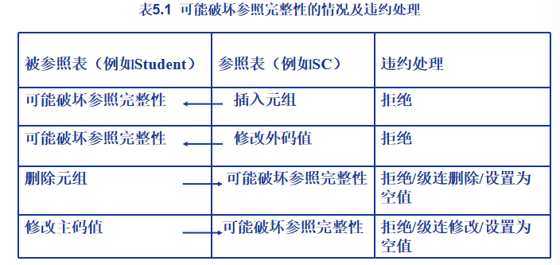

# 一 数据库完整性

## 1. 数据库的完整性

- 数据的正确性
  - 是指数据是符合现实世界语义，反映了当前实际状况的
- 数据的相容性
  - 是指数据库同一对象在不同关系表中的数据**是符合逻辑**的
- 例如，
  - 学生的学号必须唯一
  - 性别只能是男或女
  - 本科学生年龄的取值范围为14~50的整数
  - 学生所选的课程必须是学校开设的课程，学生所在的院系必须是学校已成立的院系
  - ……

## 2. 完整性VS安全性

- 数据的完整性和安全性是两个不同概念
  - 数据的完整性
    - 防止数据库中存在不符合语义的数据，也就是防止数据库中存在不正确的数据
    - 防范对象：不合语义的、不正确的数据
  - 数据的安全性
    - 保护数据库，防止恶意的破坏和非法的存取
    - 防范对象：非法用户和非法操作

## 3. 完整性机制

- 提供定义完整性约束条件的机制
  - 完整性约束条件也称为完整性规则，是数据库中的数据必须满足的语义约束条件
  - SQL标准使用了一系列概念来描述完整性，包括关系模型的实体完整性、参照完整性和用户定义完整性
  - 这些完整性一般由SQL的数据定义语言语句来实现 
- 提供完整性检查的方法
  - 数据库管理系统中检查数据是否满足完整性约束条件的机制称为完整性检查。
  - 一般在INSERT、UPDATE、DELETE语句执行后开始检查，也可以在事务提交时检查 
- 违约处理 
  - 数据库管理系统若发现用户的操作违背了完整性约束条件，就采取一定的动作
    - 拒绝（NO ACTION）执行该操作
    - 级连（CASCADE）执行其他操作

# 二 实体完整性

## 1. 实体完整性定义

就是主体得要能够有唯一标识

- 关系模型的实体完整性
  - CREATE  TABLE中用PRIMARY KEY定义
- 单属性构成的主码有两种说明方法 
  - 定义为列级约束条件
  - 定义为表级约束条件
- 对多个属性构成的主码只有一种说明方法
  - 定义为表级约束条件 

- [例5.1] 将Student表中的Sno属性定义为码
  - 在列级定义主码              
    CREATE TABLE Student
       (  Sno  CHAR(9)  **PRIMARY KEY**,
          Sname  CHAR(20) NOT NULL,     
          Ssex  CHAR(2),
          Sage  SMALLINT,
          Sdept  CHAR(20)
       );
  - 在表级定义主码
    CREATE TABLE Student
            (  Sno  CHAR(9),  
               Sname  CHAR(20) 			NOT NULL,
               Ssex  CHAR(2),
               Sage  SMALLINT,
               Sdept  CHAR(20),
               **PRIMARY KEY (Sno)**
             ); 

- [例5.2] 将SC表中的Sno，Cno属性组定义为码
        CREATE TABLE SC
             (  Sno   CHAR(9)  NOT NULL, 
                Cno  CHAR(4)  NOT NULL,  
                Grade    SMALLINT,
                PRIMARY KEY (Sno,Cno)    /*只能在表级定义主码*/
             ); 

## 2. 实体完整性检查与违约处理

- 插入或对主码列进行**更新操作**时，关系数据库管理系统按照实体完整性规则自动进行检查。包括：
  - 检查主码值是否唯一，如果**不唯一则拒绝插入或修改**
  - 检查主码的各个属性是否为空，只要有一个为空就拒绝插入或修改

> 一般用于不常用的表或着较小的表格

> 用于活跃的表格

# 三 参照完整性

## 1. 参照完整性定义

- 关系模型的参照完整性定义
  - 在CREATE  TABLE中用FOREIGN KEY短语定义哪些列为外码
  - 用REFERENCES短语指明这些外码参照哪些表的主码 
- [例5.3]定义SC中的参照完整性
           CREATE TABLE SC
           (  Sno    CHAR(9)  NOT NULL, 
              Cno     CHAR(4)  NOT NULL,  
              Grade    SMALLINT,
              **PRIMARY KEY (Sno, Cno),   /*在表级定义实体完整性*/**
              **FOREIGN KEY (Sno) REFERENCES Student(Sno),**  
                    /*在表级定义参照完整性*/
              **FOREIGN KEY (Cno) REFERENCES Course(Cno)**    
                    /*在表级定义参照完整性*/
               );
  - 表SC是参照表，Sno，Cno则是被参照表
  - 

## 2. 参照完整性检查

- 一个参照完整性将两个表中的相应元组联系起来

- 对被参照表和参照表进行增删改操作时有可能破坏参照完整性，必须进行检查

- 例如，对表SC和Student有四种可能破坏参照完整性的情况 :

  - SC表中增加一个元组，该元组的Sno属性的值在表Student中找不到一个元组，其Sno属性的值与之相等。
  - 修改SC表中的一个元组，修改后该元组的Sno属性的值在表Student中找不到一个元组，其Sno属性的值与之相等。
  - 从Student表中删除一个元组，造成SC表中某些元组的Sno属性的值在表Student中找不到一个元组，其Sno属性的值与之相等。
  - 修改Student表中一个元组的Sno属性，造成SC表中某些元组的Sno属性的值在表Student中找不到一个元组，其Sno属性的值与之相等 。

  

## 3. 参照完整性违约处理

### 处理方法

- 拒绝（NO ACTION）执行
  - 不允许该操作执行。该策略一般设置为默认策略
- 级联（CASCADE）操作
  - 当删除或修改**被参照表**（Student）的一个元组造成了与参照表（SC）的不一致，则删除或修改参照表中的所有造成不一致的元组
- 设置为空值（SET-NULL）
  - 当删除或修改**被参照表**的一个元组时造成了不一致，则将参照表中的所有造成不一致的元组的对应属性设置为空值。
  - 对于参照完整性，除了应该定义外码，还应定义外码列是否允许空值 

### 例子

- 例如，有下面2个关系
  - ​    学生（学号，姓名，性别，专业号，年龄）
  - ​    专业（专业号，专业名）
  - 假设专业表中某个元组被删除，专业号为12
  - 按照设置为空值的策略，就要把学生表中专业号=12的所有元组的专业号设置为空值
  - 对应语义：某个专业删除了，该专业的所有学生专业未定，等待重新分配专业 

- [例5.4]  显式说明参照完整性的违约处理示例
         CREATE TABLE SC
          (  Sno   CHAR(9)  NOT NULL，
             Cno   CHAR(4)  NOT NULL，
             Grade  SMALLINT,
             PRIMARY KEY(Sno,Cno)， 			
             FOREIGN KEY (Sno) REFERENCES Student(Sno) 
        	       ON DELETE CASCADE        /*级联删除SC表中相应的元组*/
             ON UPDATE CASCADE,      /*级联更新SC表中相应的元组*/
             FOREIGN KEY (Cno) REFERENCES Course(Cno)	                    
               	ON DELETE NO ACTION 	
                   /*当删除course 表中的元组造成了与SC表不一致时拒绝删除*/
               	ON UPDATE CASCADE   
                	  /*当更新course表中的cno时，级联更新SC表中相应的元组*/
             );

# 四 用户定义的完整性

## 1. 完整性约束

- 用户定义的完整性是：针对**某一具体应用的数据**必须满足的语义要求 
  - <u>属性上的约束条件</u>
  - <u>元组上的约束条件</u>
    - 同属性值限制相比，*元组级的限制可以设置不同属性之间的取值的相互约束条件* 
- 关系数据库管理系统提供了定义和检验用户定义完整性的机制，不必由应用程序承担
  - 插入元组或修改属性的值时，关系数据库管理系统检查约束条件是否被满足
  - 如果不满足则操作被**拒绝执行** 
    - 也只能拒绝执行，无法向参照完整性那样能够有补偿机制（set null等）

> 数据库这边数据的完整性是所有应用的共性，如果每个应用有自己的完整性需求，可以自行定义

### 属性上约束条件的定义（列级）

#### 列值非空

 [例5.5]  在定义SC表时，说明Sno、Cno、Grade属性不允许取空值。
        CREATE TABLE SC
        (  Sno CHAR(9)  **NOT NULL**,	
           Cno CHAR(4)  NOT NULL,	
           Grade  SMALLINT NOT NULL,	
           PRIMARY KEY (Sno, Cno),  
             … 
/* 如果在表级定义实体完整性，隐含了Sno，Cno不允许取空值，则在  
             列级不允许取空值的定义 可以不写 * /
         ); 

#### 列值唯一

[例5.6]建立部门表DEPT，要求部门名称Dname列取值唯一，部门编号Deptno列为主码
    CREATE TABLE DEPT
        (   Deptno  NUMERIC(2),
            Dname  CHAR(9)  **UNIQUE NOT NULL，**
            /*要求Dname列值唯一, 并且不能取空值*/
            Location  CHAR(10),
            PRIMARY KEY (Deptno)
         );

#### 列值满足条件表达式

用CHECK短语指定列值应该满足的条件
[例5.7]  Student表的Ssex只允许取“男”或“女”。
     CREATE TABLE Student
          ( Sno  CHAR(9) PRIMARY KEY,
            Sname CHAR(8) NOT NULL,                     
            Ssex  CHAR(2)  **CHECK** （Ssex IN （‘男’,’女’）），           
                                                     /*性别属性Ssex只允许取'男'或'女' */
            Sage  SMALLINT,
            Sdept  CHAR(20)
          );

[例5.8]  SC表的Grade的值应该在0和100之间。
   CREATE TABLE  SC
         (  Sno     CHAR(9) ,
            Cno    CHAR(4),
	Grade   SMALLINT CHECK (Grade>=0 AND Grade <=100)，			      /*Grade取值范围是0到100*/
            PRIMARY KEY (Sno,Cno),
            FOREIGN KEY (Sno) REFERENCES Student(Sno),
            FOREIGN KEY (Cno) REFERENCES Course(Cno)
           );

### 元组上的约束条件的定义（表级）

- [例5.9]当学生的性别是男时，其名字不能以Ms.打头。
      CREATE TABLE Student
           (  Sno    CHAR(9), 
              Sname  CHAR(8) NOT NULL，
              Ssex    CHAR(2),
              Sage   SMALLINT,
              Sdept  CHAR(20),
              PRIMARY KEY (Sno),
              CHECK (Ssex='女' OR Sname NOT LIKE 'Ms.%')
                     /*定义了元组中Sname和 Ssex两个属性值之间的约束条件*/
            );
- 性别是女性的元组都能通过该项检查，因为Ssex=‘女’成立;
- 当性别是男性时，要通过检查则名字一定不能以Ms.打头

## 2. 完整性约束命名子句

- 创建完整性约束
  - 完整性约束命名子句
  - CONSTRAINT <完整性约束条件名><完整性约束条件>
  - <完整性约束条件>包括NOT NULL、UNIQUE、PRIMARY KEY短语、FOREIGN KEY短语、CHECK短语等
- 修改完整性约束
  - 使用ALTER TABLE语句修改表中的完整性限制

- [例5.10]建立学生登记表Student，要求学号在90000~99999之间，姓名不能取空值，年龄小于30，性别只能是“男”或“女”。
      CREATE TABLE Student
        (   Sno  NUMERIC(6)
            CONSTRAINT C1 CHECK (Sno BETWEEN 90000 AND 99999),
            Sname  CHAR(20)  
            CONSTRAINT C2 NOT NULL,
            Sage  NUMERIC(3)
            CONSTRAINT C3 CHECK (Sage < 30),
            Ssex  CHAR(2)
            CONSTRAINT C4 CHECK (Ssex IN ( ‘男’,'女')),
            CONSTRAINT StudentKey PRIMARY KEY(Sno)
          );
- 在Student表上建立了5个约束条件，包括主码约束（命名为StudentKey）以及C1、C2、C3、C4四个列级约束。
- [例5.11]建立教师表TEACHER，要求每个教师的应发工资不低于3000元。应发工资是工资列Sal与扣除项Deduct之和。
        CREATE TABLE TEACHER
                (   Eno    NUMERIC(4)  PRIMARY KEY    /*在列级定义主码*/
                    Ename  CHAR(10),
                    Job     CHAR(8),
      		      Sal     NUMERIC(7,2),
      		      Deduct  NUMERIC(7,2),
      		      Deptno  NUMERIC(2),
        		      CONSTRAINT TEACHERFKey FOREIGN KEY (Deptno) 		  REFERENCES DEPT(Deptno),
        		      CONSTRAINT C1 CHECK (Sal + Deduct >= 3000) 
                  );
- [例5.12]去掉例5.10 Student表中对性别的限制。
          ALTER TABLE Student 
          DROP CONSTRAINT C4;
-  [例5.13]  修改表Student中的约束条件，要求学号改为在900000~999999之间，年龄由小于30改为小于40
  可以先删除原来的约束条件，再增加新的约束条件
          ALTER TABLE Student
          DROP CONSTRAINT C1;
          ALTER TABLE Student
          ADD CONSTRAINT C1 CHECK (Sno BETWEEN 900000 AND 999999),
          ALTER TABLE Student
          DROP CONSTRAINT C3;
          ALTER TABLE Student
          ADD CONSTRAINT C3 CHECK(Sage < 40);

# 五 断言

## 1. 定义

上面的三个完整性语句都是针对一张表的，而断言则是针对多张表的，但是这样也合理，因为一个对象可能存在多个表当中，自然需要断言

- SQL中，可以使用 CREATE ASSERTION语句，通过声明性断言来指定更具一般性的约束。
- 可以定义涉及多个表的或聚集操作的比较复杂的完整性约束。
- 断言创建以后，任何对断言中所涉及的关系的操作都会触发关系数据库管理系统对断言的检查，任何使断言不为真值的操作都会被拒绝执行

## 2. 语句格式

- 创建断言的语句格式

  - CREATE ASSERTION<断言名><CHECK 子句>
  - 每个断言都被赋予一个名字，<CHECK 子句>中的约束条件与WHERE子句的条件表达式类似。

- 删除断言的语句格式为

  - DROP ASSERTION <断言名>;
  - 如果断言很复杂，则系统在检测和维护断言的开销较高，这是在使用断言时应该注意的

- [例5.18] 限制数据库课程最多60名学生选修
  	CREATE ASSERTION ASSE_SC_DB_NUM
  	CHECK (60 >= (select count(*)
  /\*此断言的谓词涉及聚集操作count的SQL语句\*/
   	From Course,SC
      	Where SC.Cno=Course.Cno and  Course.Cname ='数据库')
  	);

- [例5.19]限制每一门课程最多60名学生选修
  	CREATE ASSERTION ASSE_SC_CNUM1
  	CHECK(60 >= ALL (SELECT count(*) 					          FROM	 SC 
  				          GROUP by cno)
          		  );
   /*此断言的谓词，涉及聚集操作count 和分组函数group by的SQL语句*/

- [例5.20]限制每个学期每一门课程最多60名学生选修。首先需要修改SC表的模式，增加一个“学期（TERM）”属性
  	 ALTER TABLE SC ADD TERM DATE;
  然后，定义断言：
      	 CREATE ASSERTION ASSE_SC_CNUM2
   	 CHECK(60 >= ALL (SELECT count(*)  

  ​					                         		FROM SC
  ​													 GROUP by cno,TERM)
  ​				);

# 六 触发器

触发器针对的是更新的过程，不像断言：无论增删改都会进行断言进行判断，而触发器能够实现专门的对于增，删，改操作的分别判断

## 1. 定义

- 触发器（Trigger）是用户定义在关系表上的一类由事件驱动的特殊过程
  -  触发器保存在数据库服务器中
  - 任何用户对表的增、删、改操作均由服务器自动激活相应的触发器
  - 触发器可以实施更为复杂的检查和操作，具有更精细和更强大的数据控制能力 
- 不同的RDBMS产品触发器语法各不相同

### 语法格式

- CREATE TRIGGER语法格式
  	CREATE TRIGGER <触发器名>  
         {BEFORE | AFTER} <触发事件> ON <表名>
         REFERENCING NEW|OLD ROW AS<变量>
         FOR EACH  {ROW | STATEMENT}
         [WHEN <触发条件>]<触发动作体>
- 触发器又叫做**事件-条件-动作**（event-condition-action）规则。
- <u>当特定的系统事件发生时，对规则的条件进行检查，如果条件成立则执行规则中的动作，否则不执行该动作</u>。规则中的动作体可以很复杂，通常是一段SQL存储过程。
- 表的拥有者才可以在表上创建触发器

- 触发器名
  - 触发器名可以包含模式名，也可以不包含模式名
  - 同一模式下，触发器名必须是唯一的
  - 触发器名和表名必须在同一模式下
- 表名
  - 触发器只能定义在基本表上，不能定义在视图上
  - 当基本表的数据发生变化时，将激活定义在该表上相应触发事件的触发器
- 触发事件
  - 触发事件可以是INSERT、DELETE或UPDATE，也可以是这几个事件的组合
  - 还可以UPDATE OF<触发列，...>，即进一步指明修改哪些列时激活触发器
  - AFTER/BEFORE是触发的时机
    - AFTER表示在触发事件的操作执行之后激活触发器
    - BEFORE表示在触发事件的操作执行之前激活触发器
- REFERENCING NEW|OLD ROW AS<变量>
  - 这条语句的意思将在触发事件之前的语句赋予一个变量名，触发事件之后的语句赋予一个新的变量名，一遍用于之后的触发器动作
- 触发器类型
  - 行级触发器（FOR EACH ROW）
  - 语句级触发器（FOR EACH STATEMENT） 
  - 例如,在例5.11的TEACHER表上创建一个AFTER UPDATE触发器，触发事件是UPDATE语句：
    UPDATE TEACHER SET Deptno=5;
    假设表TEACHER有1000行  
     如果是语句级触发器，那么执行完该语句后，触发动作只发生一次
    如果是行级触发器，触发动作将执行1000次
- 触发条件
  - 触发器被激活时，只有当触发条件为真时触发动作体才执行;否则触发动作体不执行。
  - 如果省略WHEN触发条件，则触发动作体在触发器激活后立即执行
- 触发动作体
  - 触发动作体可以是一个匿名PL/SQL过程块，也可以是对已创建存储过程的调用
  - 如果是行级触发器，用户都可以在过程体中使用NEW和OLD引用事件之后的新值和事件之前的旧值
  - 如果是语句级触发器，则不能在触发动作体中使用NEW或OLD进行引用
  - *如果触发动作体执行失败，激活触发器的事件就会终止执行，触发器的目标表或触发器可能影响的其他对象不发生任何变化*
    - 即使触发事件已经发生了，它也会回退到未发生的情况

### 示例

[例5.21]当对表SC的Grade属性进行修改时，若分数增加了10%则将此次操作记录到下面表中：SC_U（Sno,Cno,Oldgrade,Newgrade）其中Oldgrade是修改前的分数，Newgrade是修改后的分数。
	CREATE TRIGGER  SC_T		                      //创建触发器 SC_T
	AFTER UPDATE OF Grade ON SC              //定义**事件**update以及触发时间after
     	REFERENCING
	      OLD row  AS  OldTuple,                         //将update之前的元组叫做 OldTuple
	      NEW row AS  NewTuple                        //将update之后的元组叫做 NewTuple
	FOR EACH ROW 	                                       //行级触发器，更新一行触发一次
	WHEN (NewTuple.Grade >= 1.1*OldTuple.Grade) // 触发**条件**
	    INSERT INTO SC_U(Sno,Cno,OldGrade,NewGrade)  //触发**动作**
VALUES(OldTuple.Sno,OldTuple.Cno,OldTuple.Grade,NewTuple.Grade)

**事件 — 条件 — 动作**

[例5.22] 将每次对表Student的插入操作所增加的学生个数记录到表StudentInsertLog中。
	CREATE TRIGGER Student_Count
	AFTER INSERT ON Student  
	        /*指明触发器激活的时间是在执行INSERT后*/     
	REFERENCING
     	NEW TABLE AS DELTA
	FOR EACH STATEMENT  
/*语句级触发器, 即执行完INSERT语句后下面的触发动作体才执行一次*/
		INSERT INTO StudentInsertLog (Numbers)
   		SELECT COUNT(*) FROM DELTA

[例5.23] 定义一个BEFORE行级触发器，为教师表Teacher定义完整性规则“教授的工资不得低于4000元，如果低于4000元，自动改为4000元”。
        CREATE TRIGGER Insert_Or_Update_Sal 
         BEFORE INSERT OR UPDATE ON Teacher  
         			             /*触发事件是插入或更新操作*/
          FOR EACH ROW        /*行级触发器*/
          BEGIN                             /*定义触发动作体，是PL/SQL过程块*/
             		 IF (new.Job='教授') AND (new.Sal < 4000) 
             	 THEN  new.Sal :=4000;                
           	 END IF;
        END;                               

## 2. 激活与删除触发器

### 激活

- 触发器的执行，是由触发事件激活的，并由数据库服务器自动执行
- 一个数据表上可能定义了多个触发器，遵循如下的执行顺序:
  - 执行该表上的BEFORE触发器;
  - 激活触发器的SQL语句;
  - 执行该表上的AFTER触发器。

### 删除

- 删除触发器的SQL语法：

  ​     DROP TRIGGER <触发器名> ON <表名>;

- 触发器必须是一个已经创建的触发器，并且只能由具有相应权限的用户删除。