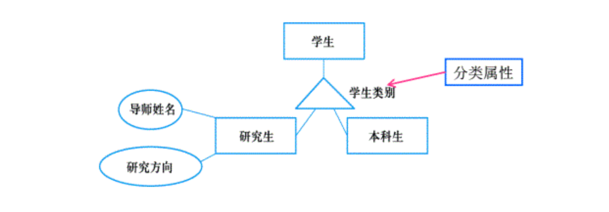
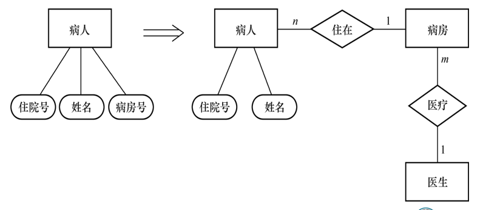

# 一 数据库设计概述

- 数据库设计是指对于一个给定的应用环境，构造（设计）优化的数据库逻辑模式和物理结构，并据此建立数据库及其应用系统，使之能够有效地存储和管理数据，满足各种用户的应用需求，包括信息管理要求和数据操作要求。
  - 信息管理要求：在数据库中应该存储和管理哪些数据对象。
  - 数据操作要求：对数据对象需要进行哪些操作，如查询、增、删、改、统计等操作。 

## 1. 数据库设计目标

- 数据库设计的目标是为用户和各种应用系统提供一个信息基础设施和高效率的运行环境 。
  - 高效率的运行环境
    - 数据库数据的存取效率高
    - 数据库存储空间的利用率高
    - 数据库系统运行管理的效率高

## 2. 数据库设计特点

### 基本规律

- 数据库建设的基本规律：三分技术，七分管理，十二分基础数据 
  - 管理 
    - 数据库建设项目管理 
    - 企业（即应用部门）的业务管理 
      - 比如不同的人应该有不同的权限之类
  - 基础数据  
    - 数据的收集、整理、组织和不断更新

### 结构与行为设计

- 结构（数据）设计和行为（处理）设计相结合 
  - 将数据库结构设计和数据处理设计密切结合
  - 结构和行为分离的设计
    - 传统的软件工程：重行为设计
      - 忽视对应用中数据语义的分析和抽象，只要有可能就尽量推迟数据结构设计的决策
    - 早期的数据库设计：重结构设计
      - 致力于数据模型和数据库建模方法研究，忽视了行为设计对结构设计的影响
    - 
      - 二者是并发执行的

> 实际上结构与行为设计的结合和分离各有利弊：
>
> 二者结合会导致耦合度上升，导致其共享程度降低但是能够正对特定的数据结构进行相关行为操作从而进一步提高系统效率；
>
> 二者分离意思是行为向数据库要求一个接口（比如链表）而不在乎其具体实现（比如数组实现），数据库以特定的结构提供接口，也只提供接口，所以多个应用之间能够实现共享，但是因为其隐藏内部实现，不方便优化

## 3. 数据库设计方法

- 大型数据库设计是涉及多学科的综合性技术，又是一项庞大的工程项目。
- 它要求多方面的知识和技术。主要包括：
  - 计算机的基础知识
  - 软件工程的原理和方法
  - 程序设计的方法和技巧
  - 数据库的基本知识
  - 数据库设计技术
  - 应用领域的知识

- 手工试凑法
- 规范设计法
  - 新奥尔良（New Orleans）方法
  - 基于E-R模型的数据库设计方法
  - 3NF（第三范式）的设计方法
  - 面向对象的数据库设计方法
  - 统一建模语言（UML）方法

## 4. 数据库设计的基本步骤

- 数据库设计分6个阶段

  - 需求分析
  - 概念结构设计
  - 逻辑结构设计
    - 这时候决定采用那种数据模型
    - 全部采用关系数据模型？还是实现异构（关系+其他）
  - 物理结构设计
  - 数据库实施
  - 数据库运行和维护 

  

  > 需求分析和概念设计独立于任何数据库管理系统 

  > 逻辑设计和物理设计与选用的数据库管理系统密切相关

各阶段的描述：

- 参加数据库设计的人员
  - 系统分析人员和数据库设计人员
    - 自始至终参与数据库设计，其水平决定了数据库系统的质量
  - 数据库管理员和用户代表
    - 主要参加需求分析与数据库的运行和维护
  - 应用开发人员
    - 包括程序员和操作员
    - 在实施阶段参与进来，分别负责编制程序和准备软硬件环境

# 二 需求分析

## 1. 数据字典

- 数据字典是关于数据库中数据的描述，即元数据，不是数据本身
- 数据字典在需求分析阶段建立，在数据库设计过程中不断修改、充实、完善
- 数据字典是进行详细的数据收集和数据分析所获得的主要结果
  - *注意：和关系数据库管理系统中数据字典的区别和联系*

### 数据字典的内容

- 数据字典的内容
  - 数据项
  - 数据结构
  - 数据流
  - 数据存储
  - 处理过程
-  数据项是数据的最小组成单位
-  若干个数据项可以组成一个数据结构
-  数据字典通过对数据项和数据结构的定义来描述数据流、数据存储的逻辑内容

### 数据项

- 数据项是<u>不可再分的数据单位</u>

-  对数据项的描述

  ​	**数据项描述={数据项名,数据项含义说明,别名,**

  ​                          **数据类型,长度,取值范围,取值含义,**

  ​                          **与其他数据项的逻辑关系,**

  ​                          **数据项之间的联系}**

- “取值范围”、“与其他数据项的逻辑关系”定义了数据的完整性约束条件，是设计数据检验功能的依据

- 可以用关系规范化理论为指导，用数据依赖的概念分析和表示数据项之间的联系 

### 数据结构

- 数据结构反映了数据之间的组合关系。
-  一个数据结构可以<u>由若干个数据项</u>组成，也可以由若干个数据结构组成，或由若干个数据项和数据结构混合组成。
-  对数据结构的描述
  **数据结构描述=**
  **{数据结构名，含义说明，组成:{数据项或数据结构}}**

### 数据流

- 数据流是数据结构在系统内传输的路径。
-  对数据流的描述
    　 **数据流描述={数据流名,说明,数据流来源,**
                             **数据流去向,组成:{数据结构},**
                             **平均流量,高峰期流量}**
  - 数据流来源：说明该数据流来自哪个过程
  - 数据流去向：说明该数据流将到哪个过程去
  - 平均流量：在单位时间（每天、每周、每月等）里的传输次数
  - 高峰期流量：在高峰时期的数据流量

### 数据存储

- 数据存储是数据结构停留或保存的地方，也是数据流的来源和去向之一。
- 对数据存储的描述
  　**数据存储描述={数据存储名,说明,编号,输的数据流 ,**
         **输出的数据流, 组成:{数据结构},数据量, 存取频度,存取方式}**
  - 存取频度：每小时、每天或每周存取次数，每次存取的数据量等信息 
  - 存取方法：
    - 批处理 / 联机处理；
      - 批处理就是一次放一批数据进来
      - 联机处理就是从多个数据来源拿数据过来对比处理，比如评选奖学金需要比较不同同学的信息
    - 检索 / 更新；
    - 顺序检索 / 随机检索
      - 顺序检索即雨露均沾，全部检索一遍
      - “随即”检索则是挑出符合要求的数据
  - 输入的数据流：数据来源
  - 输出的数据流：数据去向

### 处理过程

- 处理过程的具体处理逻辑一般用判定表或判定树来描述。数据字典中只需要描述处理过程的说明性信息
- 处理过程说明性信息的描述
      **处理过程描述={处理过程名,说明,输入:{数据流},   
                                输出:{数据流},处理:{简要说明}}**
  - 简要说明：说明该处理过程的功能及处理要求
    - 功能：该处理过程用来做什么
    - 处理要求：处理频度要求，如单位时间里处理多少事务，多少数据量、响应时间要求等
    - 处理要求是后面物理设计的输入及性能评价的标准

## 2. 需求分析小结

- 把需求收集和分析作为数据库设计的第一阶段是十分重要的。
- 第一阶段收集的基础数据（用数据字典来表达）是下一步进行概念设计的基础。
- 强调两点 　
  - 设计人员应充分考虑到可能的扩充和改变，使设计易于更改，系统易于扩充 
  - 必须强调用户的参与

# 三 概念模型和E-R模型

## 概念模型

- 将需求分析得到的用户需求抽象为信息结构（即概念模型）的过程就是概念结构设计
- 概念模型的特点
  - 能真实、充分地反映现实世界，是现实世界的一个真实模型。
  - 易于理解，从而可以用它和不熟悉计算机的用户交换意见。
  - 易于更改，当应用环境和应用要求改变时，容易对概念模型修改和扩充。
  - 易于向关系、网状、层次等各种数据模型转换
- 描述概念模型的工具
  - **E-R模型**

## E-R模型

实体—联系模型

### 实体间的联系

#### 两个实体间的联系

方框代表一个实体集，多个根据某个实体型形成的实体实例的集合

- 一对一联系（1∶1）
  - 如果对于实体集A中的每一个实体，实体集B中至多有一个（也可以没有）实体与之联系，反之亦然，则称实体集A与实体集B具有一对一联系，记为1∶1。
- 一对多联系（1∶n）
  - 如果对于实体集A中的每一个实体，实体集B中有n个实体（n≥0）与之联系，反之，对于实体集B中的每一个实体，实体集A中至多只有一个实体与之联系，则称实体集A与实体集B有一对多联系，记为1∶n。
- 多对多联系（m∶n）
  - 如果对于实体集A中的每一个实体，实体集B中有n个实体（n≥0）与之联系，反之，对于实体集B中的每一个实体，实体集A中也有m个实体（m≥0）与之联系，则称实体集A与实体集B具有多对多联系，记为m∶n。

#### 多个实体间的联系

- 一般地，两个以上的实体型之间也存在着一对一、一对多、多对多联系。
- 对于课程、教师与参考书3个实体型，如果一门课程可以有若干个教师讲授，使用若干本参考书，而每一个教师只讲授一门课程，每一本参考书只供一门课程使用，则课程与教师、参考书之间的联系是一对多的，如图7.7(a)所示。
- 

#### 单个实体内部的联系

- 同一个实体集内的各实体之间也可以存在一对一、一对多、多对多的联系。
- 例如，职工实体型内部具有领导与被领导的联系，即某一职工（干部）“领导”若干名职工，而一个职工仅被另外一个职工直接领导，因此这是一对多的联系，如图7.8所示。
- 

### E-R模型示例

- 某个工厂物资管理的概念模型。物资管理涉及的实体有：
  - 仓库：属性有仓库号、面积、电话号码
  - 零件：属性有零件号、名称、规格、单价、描述
  - 供应商：属性有供应商号、姓名、地址、电话号码、账号
  - 项目：属性有项目号、预算、开工日期
  - 职工：属性有职工号、姓名、年龄、职称
- 这些实体之间的联系如下： 
  - 一个仓库可以存放多种零件，一种零件可以存放在多个 仓库中，因此仓库和零件具有多对多的联系。用库存量来表示某种零件在某个仓库中的数量。
  - 一个仓库有多个职工当仓库保管员，一个职工只能在一个仓库工作，因此仓库和职工之间是一对多的联系。
  - 职工之间具有领导与被领导关系。即仓库主任领导若干保管员，因此职工实体型中具有一对多的联系。
  - 供应商、项目和零件三者之间具有多对多的联系。即一个供应商可以供给若干项目多种零件，每个项目可以使用不同供应商供应的零件，每种零件可由不同供应商供给。

#### 写出实体以及对应的属性

#### 画出联系

#### 二者结合

### 联系拓展

#### ISA联系

- 有的实体型是某个实体型的子类型，这种父类-子类联系称为ISA联系，表示“is a”语义。用△表示。
- ISA联系的性质: 子类继承了父类的所有属性，子类也可以有自己的属性。
- 

##### 分类属性

- 分类属性是父实体型的一个属性

- 分类属性的值把父实体型中的实体分派到子实体型中

  

##### 不相交约束与可重叠约束

- 不相交约束：描述父类中的一个实体不能同时属于多个子类中的实体集。即-一个父类中的实体最多属于一个子类实体集。

- 用ISA联系符号三角形的-一个叉号“X"来表示。

- 可重叠约束:父类中的一个实体能同时属于多个子类中的实体集。子类符号中没有叉号表示是可重叠的。

  

##### 完备性约束

- 描述父类中的一个实体是否必须是某一个子类中的实体。

  - 如果是，则叫做完全特化( total specialization ) 
  - 否则叫做部分特化( partial specialization)

- 完全特化用父类到子类的双线连接来表示

- 部分特化用父类到子类的单线连接来表示

  

#### 基数约束

- 说明实体型中的任何一个实体可以在联系中出现的最少次数和最多次数。

- 对实体之间一对一、 一对多、多对多联系的**细化。**

- 约束用一个数对 min..max表示，0≤min ≤ max。例如，0..1， 1..3， 1..*，, 其中*代表无穷大。

  

  > 在实现层面可以使用触发器，如果不满足基数约束应返回报错信息

- min=1的约束叫做强制参与约束，即被施加基数约束的实体型中的每个实体都要参与联系;

- min=0的约束叫做非强制参与约束，被施加基数约束的实体型中的实体可以出现在联系中，也可以不出现在联系

  

#### part-of联系

- 描述某个实体型是另外一个实体型的一部分。

- Part-of 联系可以分为两种情况:

  - 非独占的Part-of联系，简称非独占联系
    - 整体实体如果被破坏，另一部分实体仍然可以独立存在
  - 独占的Part-of联系， 简称独占联系
    - 整体实体如果被破坏，部分实体不能存在

- Part-of联系如何表示?

  - 用**非强制参与联系**表示非独占的Part-of联系

    

  - 用**弱实体类型和识别联系**来表示独占联系编号编号

##### 弱实体型和识别联系

- 如果一个实体型的存在**依赖于其它实体型的存在**，则这个实体型叫做弱实体型,否则叫做强实体型。

  - 其他实体型不存在，这个实体型也消失

- 用弱实体类型和识别联系来表示独占联系双矩形表示弱实体型，用双菱型表示识别联系。

  

  > 还款依赖于贷款而存在，不同的还款表单中是没有唯一标识，比如张三和李四的还款表单可以完全一样，二者就不存在唯一标识，所以还款时弱实体型，当贷款实体删除，还款实体型也需要级联删除

# 四 概念结构设计

## 1. 概念结构设计方法

### 自顶向下

首先定义全局概念结构的框架，然后逐步细化

### 自底向上

首先定义各局部应用的概念结构，然后将它们集成起来，得到全局概念结构

- 首先根据子需求（如校医院数据管理）形成对应的概念模型（E-R关系）
- 再将概念模型之间进行两两连接，最后形成全局概念模型
- 概念模型实际上就是外模式。全局概念模型实际上就是模式

### 逐步扩张

首先定义最重要的核心概念结构，然后向外扩充，以滚雪球的方式逐步生成其他概念结构，直至总体概念结构

### 混合策略

- 自顶向下和自底向上相结合，用自顶向下策略设计一个全局概念结构的框架，以它为骨架集成由自底向上策略中设计的各局部概念结构。
- 常用策略
  - 自顶向下地进行需求分析
  - 自底向上地设计概念结构

## 2. 概念结构的设计步骤（采用自底向上方法）

- 自底向上设计概念结构的步骤

  - 第1步：抽象数据并设计局部视图
  - 第2步：集成局部视图，得到全局概念结构

  

### 设计局部视图 — 实体和属性的划分

在根据需求形成概念模型即关系模型，画E-R图时，需求注意实体和属性的划分

#### 划分原则

- 为了简化E-R图的处置，现实世界的事物能作为属性对待的，尽量作为属性对待。
- 两条准则：
  - 作为属性，不能再具有需要描述的性质。属性必须是**不可分的数据项**，不能包含其他属性。
  - 属性**不能与其他实体具有联系**，即E-R图中所表示的联系是实体之间的联系。

#### 划分示例

- [例1] 职工是一个实体，职工号、姓名、年龄是职工的属性。

  - 职称如果没有与工资、福利挂钩，根据准则（1）可以作为职工实体的属性
  - 如果不同的职称有不同的工资、住房标准和不同的附加福利，则职称作为一个实体更恰当

  

- [例2] 在医院中，一个病人只能住在一个病房，病房号可以作为病人实体的一个属性；如果病房还要与医生实体发生联系，即一个医生负责几个病房的病人的医疗工作，则根据准则（2） 病房应作为一个实体。

  

- [例3] 如果一种货物只存放在一个仓库，那么就可以把存放货物的仓库的仓库号作为描述货物存放地点的属性。如果一种货物可以存放在多个仓库中，或者仓库本身又用面积作为属性，或者仓库与职工发生管理上的联系，那么就应把仓库作为一个实体。

  

- [例7.1]  销售管理子系统E-R图的设计。

  - 该子系统的主要功能是：
    - 处理顾客和销售员送来的订单
    - 工厂是根据订货安排生产的
    - 交出货物同时开出发票
    - 收到顾客付款后，根据发票存根和信贷情况进行应收款处理

  

### 集成局部视图 — E-R图集成

- E-R图集成分两步
  - 合并：解决各分E-R图之间的冲突，将分E-R图合并起来生成初步E-R图
  - 修改和重构：消除不必要的冗余，生成基本的E-R图

#### 合并 E-R 图：解决冲突

- 合并E-R图，生成初步E-R图
  - 各个局部应用所面向的问题不同，各个子系统的E-R图之间必定会存在许多不一致的地方，称之为冲突。
  - 子系统E-R图之间的冲突主要有三类：
    - ①属性冲突
    - ②命名冲突
    - ③结构冲突

##### E-R图冲突 — 属性冲突

- 属性域冲突，即属性值的**类型**、**取值范围**或**取值集合**不同。
  - 例如零件号，有的部门把它定义为整数，有的部门把它定义为字符型。
    - 比如零件生产商可能会用数字编号，但是零件使用方可能会使用不同地方生产的零件，零件号可能会使用字符编号
  - 年龄，某些部门以出生日期形式表示职工的年龄，而另一些部门用整数表示职工的年龄。
- 属性取值单位冲突。
  - 例如，零件的重量有的以公斤为单位，有的以斤为单位，有的以克为单位。
- 通过行政手段或者协商进行解决

##### E-R图冲突 — 命名冲突

- 同名异义，即不同意义的对象在不同的局部应用中具有相同的名字。
  - 比如研究生的概念视图和本科生中的概念视图都用到了学生，但是这两个具有不同的意义。
- 异名同义（一义多名），即同一意义的对象在不同的局部应用中具有不同的名字。
  - 如对科研项目，财务科称为项目，科研处称为课题，生产管理处称为工程。
- 命名冲突
  - 可能发生在实体、联系一级上
    - 同名异议：比如上面的两个学生
    - 异名同意：多个项目
  - 也可能发生在属性一级上
    - 
  - 通过讨论、协商等行政手段加以解决

##### E-R图冲突 — 结构冲突

- 同一对象在不同应用中**具有不同的抽象**。

  - 例如，职工在某一局部应用中被当作实体，而在另一局部应用中则被当作属性。
  - 解决方法：把<u>属性变换为实体</u>或把实体变换为属性，使同一对象具有相同的抽象。
    - 大多数都是属性变实体

- 同一实体在不同子系统的E-R图中所包含的**属性个数**和**属性排列次序**不完全相同。

  - 解决方法：使该实体的属性取各子系统的E-R图中属性的<u>并</u><u>集</u>，再适当<u>调整属性的次序</u>。

- 实体间的**联系在不同的E-R图中为不同的类型**。

  - 实体E1与E2在一个E-R图中是多对多联系，在另一个E-R图中是一对多联系
  - 解决方法：根据应用的语义对实体联系的类型进行综合或调整。

  

#### 修改和重构 ： 消除冗余

- 消除不必要的冗余，设计基本E-R图
  - 所谓冗余的数据是指可由基本数据导出的数据，冗余的联系是指可由其他联系导出的联系。
  - 消除冗余主要采用分析方法，即以数据字典和数据流图为依据，根据数据字典中关于数据项之间逻辑关系的说明来消除冗余。

- Q4可以通过Q5计算出来，如果不去掉Q4的话，Q5每次发生修改，Q4都得改，而且如果二者不对应，那么就是数据库出问题了，会增大出错的概率
  - 冗余的缺点：
  - 需要额外空间存放，浪费空间
  - 需要保证冗余信息一致，浪费时间，增大出错概率
- Q3去掉，“使用”这个联系中只有两个外键用以连接“产品”和“材料”即为冗余，因为二者的连接可以通过 “产品”  “构成”  “零件”  “消耗” “材料” 等五张表实现
  - 冗余的必要性：**并不是所有的冗余数据与冗余联系都必须加以消除，有时为了提高效率，不得不以冗余信息作为代价。**

#### E-R图集成案例

- 命名冲突解决：异名同义，项目和产品含义相同。某个项目实质上是指某个产品的生产。统一用产品作实体名。
- 冗余处理：库存管理中职工与仓库的工作关系已包含在劳动人事管理的部门与职工之间的联系之中，所以可以取消。职工之间领导与被领导关系可由部门与职工（经理）之间的领导关系、部门与职工之间的从属关系两者导出，所以也可以取消。

# 五 逻辑结构设计

## 1. 逻辑结构设计的任务

- 把概念结构设计阶段设计好的基本E-R图转换为与选用数据库管理系统产品所支持的数据模型相符合的逻辑结构
- 转换内容
  - E-R图由实体型、实体的属性和实体型之间的联系三个要素组	成
  - 关系模型的逻辑结构是一组关系模式的集合
  - 将E-R图转换为关系模型：将实体型、实体的属性和实体型之间的联系转化为关系模式

### 实体型转化成关系模式

- 一个实体型转换为一个关系模式（粗糙理解：关系模式就时一个表的名字+属性）。
- 关系的属性：实体的属性
- 关系的码：实体的码

### 实体之间的联系转化成关系模式

#### 1:1联系转化

- 一个1:1联系可以转换为一个独立的关系模式，也可以与任意一端对应的关系模式合并。

  - 转换为一个独立的关系模式

    - 关系的属性：与该联系相连的各实体的码以及联系本身的属性

    - 关系的候选码：每个实体的码均是该关系的候选码

  - 与某一端实体对应的关系模式合并

    - 合并后关系的属性：加入对应关系的码和联系本身的属性
    - 合并后关系的码：不变

#### 1:n联系转化

- 一个1:n联系可以转换为一个独立的关系模式，也可以与n端对应的关系模式合并。

  - 转换为一个独立的关系模式

    - 关系的属性：与该联系相连的各实体的码以及联系本身的属性

    - 关系的码：n端实体的码

  - 与n端对应的关系模式合并

    - 合并后关系的属性：在n端关系中加入1端关系的码和联系本身的属性

    - 合并后关系的码：不变

    - 可以减少系统中的关系个数

#### m:n联系转化

- 一个m:n联系转换为一个关系模式
  - 关系的属性：与该联系相连的各实体的码以及联系本身的属性
  - 关系的码：各实体码的组合
- [例]“选修”联系是一个m:n联系，可以将它转换为如下关系模式，其中学号与课程号为关系的组合码：
  - 选修（学号，课程号，成绩）

#### 多元联系转化

- 三个或三个以上实体间的一个多元联系转换为一个关系模式。
  - 关系的属性：与该多元联系相连的各实体的码以及联系本身的属性	
  - 关系的码：各实体码的组合

### 关系模式的合并

- 具有相同码的关系模式可合并
  - 目的：减少系统中的关系个数
  - 合并方法：
    -  将其中一个关系模式的全部属性加入到另一个关系模式中
    -  然后去掉其中的同义属性（可能同名也可能不同名）
    -  适当调整属性的次序

## 2. E-R图向关系模型的转换

## 3. 数据模型的优化

- 数据库逻辑设计的结果不是唯一的。
- 得到初步数据模型后，还应该适当地修改、调整数据模型的结构，以进一步提高数据库应用系统的性能，这就是数据模型的优化。
- <u>关系数据模型的优化通常以规范化理论为指导</u>。

### 关系数据模型优化

- 确定数据依赖

  - 按需求分析阶段所得到的语义，分别写出每个关系模式内部各属性之间的数据依赖以及不同关系模式属性之间数据依赖。

- 对于各个关系模式之间的数据依赖进行极小化处理，消除冗余的联系。

- 按照数据依赖的理论对关系模式进行分析，考察是否存在部分函数依赖、传递函数依赖、多值依赖等，确定各关系模式分别属于第几范式。

- 按照需求分析阶段得到的各种应用对数据处理的要求，分析对于这样的应用环境这些模式是否合适，确定是否要对它们进行合并或分解。

- 并不是规范化程度越高的关系就越优

  - 当查询经常涉及两个或多个关系模式的属性时，系统必须经常地进行连接运算

  - 连接运算的代价是相当高的

  - 因此在这种情况下，第二范式甚至第一范式也许是适合的。

  - 非BCNF的关系模式虽然会存在不同程度的更新异常，但如果在实际应用中对此关系模式只是查询，并不执行更新操作，就不会产生实际影响。

  - 对于一个具体应用来说，到底规范化进行到什么程度，需要权衡响应时间和潜在问题两者的利弊才能决定

  - > 尽量不要把一个实体分成两个表格，即使规范化了，但是后面连接的代价会很高

### 关系模式的分解

- 对关系模式进行必要分解，提高数据操作效率和存储空间的利用率。
  - 常用分解方法
    - 水平分解
      - 实际上类似于建立索引
    - 垂直分解
      - 类似于提高范市

#### 水平分解

- 把(基本)关系的元组分为若干子集合，定义每个子集合为一个子关系，以提高系统的效率。
- 如何分解
  - 对符合“80/20原则”的，把经常被使用的数据（约20%）水平分解出来，形成一个子关系。
  - 水平分解为若干子关系，使每个事务存取的数据对应一个子关系。（建立缩影）

#### 垂直分解

- 把关系模式R的属性分解为若干子集合，形成若干子关系模式。
- 垂直分解的原则：经常在一起使用的属性从R中分解出来形成一个子关系模式
- 垂直分解的优点
  - 可以提高某些事务的效率
  - 适合大量增删改操作的表
- 垂直分解的缺点
  - 可能使另一些事务不得不执行连接操作，降低了效率
  - 执行大量查询操作的数据表不适合垂直分解
- 垂直分解的适用范围
  - 取决于分解后R上的所有事务的总效率是否得到了提高
- 进行垂直分解的方法
  - 简单情况：直观分解
  - 复杂情况：用模式分解算法
    - 垂直分解必须不损失关系模式的语义（保持无损连接性和保持函数依赖）

### 设计用户子模式

外模式

- 定义数据库模式主要是从系统的时间效率、空间效率、易维护等角度出发。
- 定义用户外模式时应该更注重考虑用户的习惯与方便。包括三个方面：
  - 使用更符合用户习惯的别名
  - 针对不同级别的用户定义不同的视图，以保证系统的安全性
  - 简化用户对系统的使用

## 4. 数据库管理系统适应性转换

- 一般的数据模型还需要向特定数据库管理系统规定的模型进行转换。
- 转换的主要依据是所选用的数据库管理系统的功能及限制。没有通用规则。
- 对于关系模型来说，这种转换通常都比较简单。

# 六 物理结构设计

- **数据库的物理结构概念**：数据库在物理设备上的存储结构与存取方法称为数据库的物理结构，它依赖于选定的数据库管理系统。
- **数据库的物理设计概念：**为一个给定的逻辑数据模型选取一个最适合应用要求的物理结构的过程，就是数据库的物理设计。
- **数据库物理设计的步骤：**
  - 确定数据库的物理结构，在关系数据库中主要指存取方法和存储结构;
  -  对物理结构进行评价，评价的重点是时间和空间效率
  -  若评价结果满足原设计要求，则可进入到物理实施阶段。否则，就需要重新设计或修改物理结构，有时甚至要返回逻辑设计阶段修改数据模型。

## 1. 数据库物理设计的内容和方法

- 设计物理数据库结构的准备工作
  - 充分了解应用环境，详细分析要运行的事务，以获得选择物理数据库设计所需参数。
  - 充分了解所用关系型数据库管理系统的内部特征，特别是系统提供的存取方法和存储结构。
- 关系数据库物理设计的内容
  - **为关系模式选择存取方法**
  - **设计关系、索引等数据库文件的物理存储结构**

- 物理数据库设计所需参数
  -  数据库查询事务
    - 查询的关系
    - 查询条件所涉及的属性
    - 连接条件所涉及的属性
    - 查询的投影属性
  - 数据更新事务
    - 被更新的关系
    - 每个关系上的更新操作条件所涉及的属性
    - 修改操作要改变的属性值
  - 每个事务在各关系上运行的频率和性能要求

## 2. 关系模式的存取方法

- 数据库系统是多用户共享的系统，对同一个关系要建立多条存取路径才能满足多用户的多种应用要求。
- 物理结构设计的任务之一是根据关系数据库管理系统支持的存取方法确定选择哪些存取方法。
- 数据库管理系统常用存取方法
  - B+树索引存取方法
  - Hash索引存取方法
  - 聚簇存取方法

### B+树索引存取方法

### Hash索引存取方法

### 聚簇存取方法

- 为了提高某个属性（或属性组）的查询速度，把这个或这些属性（称为聚簇码）上具有相同值的元组集中存放在连续的物理块中称为聚簇。
- 该属性（或属性组）称为聚簇码（cluster key）
- 聚簇的用途：大大提高按聚簇属性进行查询的效率
  - **[例]** 假设学生关系按所在系建有索引，现在要查询信息系的所有学生名单。
  - 计算机系的500名学生分布在500个不同的物理块上时，至少要执行500次I/O操作。
  - 如果将同一系的学生元组集中存放，则每读一个物理块可得到多个满足查询条件的元组，从而显著地减少了访问磁盘的次数。

#### 聚簇存储方法的选择

- 聚簇的使用方法

  - 既适用于单个关系独立聚簇

  - 也适用于经常进行连接操作的多个关系

    - 把多个连接的元组按连接属性值聚集存放

    - 从而实现多个关系的“**预连接”**，提高连接操作的效率。

      > 即从物理层面实现关系的连接，这个关系连接的关系就在它的下一个，就不用再做连接操作了

- 选择聚簇存储方法，即确定需要建立多少个聚簇，每个聚簇中包含哪些关系

  - 一个数据库可以建立多个聚簇，**一个关系只能加入一个聚簇**。
    - 避免关系冗余

- 设计候选聚簇

  - 常在一起进行连接操作的关系可以建立组合聚簇
  - 如果一个关系的一组属性经常出现在相等比较条件中，则该单个关系可建立聚簇；
  - 如果一个关系的一个（或一组）属性上的值重复率很高，则此单个关系可建立聚簇。

- 检查候选聚簇中的关系，取消其中不必要的关系

  - 从聚簇中删除经常进行全表扫描的关系
  - 从聚簇中删除更新操作远多于连接操作的关系
  - 从聚簇中删除重复出现的关系
    - 当一个关系同时加入多个聚簇时，必须从这多个聚簇方案（包括不建立聚簇）中选择一个较优的，即在这个聚簇上运行各种事务的总代价最小。

- 聚簇的局限性
  -  聚簇只能提高某些特定应用的性能
  -  建立与维护聚簇的开销相当大
    - 对已有关系建立聚簇，将导致关系中元组的物理存储位置移动，并使此关系上原有的所有索引无效，必须重建。
    - 当一个元组的聚簇码改变时，该元组的存储位置也要做相应改变。
- 当通过聚簇码进行访问或连接是该关系的主要应用，与聚簇码无关的其他访问很少或者是次要的时，可以使用聚簇
  - 尤其当SQL语句中包含有与聚簇码有关的ORDER BY, GROUP BY, UNION, DISTINCT等子句或短语时，使用聚簇特别有利，可以省去或减化对结果集的排序操作

## 3. 确定数据库的存储结构

- 确定数据库物理结构主要指确定数据的存放位置和存储结构，包括：确定关系、索引、聚簇、日志、备份等的存储安排和存储结构，确定系统配置等。

- 影响数据存放位置和存储结构的因素

  - 硬件环境

  - 应用需求

    - 存取时间
    - 存储空间利用率
    - 维护代价

    > 这三个方面常常是相互矛盾的
    > 必须进行权衡，选择一个折中方案

## 4. 评价物理结构

# 七 数据库的实施和维护

## 1. 数据库的实施

### 数据载入

数据库结构建立好后，就可以向数据库中装载数据了。组织数据入库是数据库实施阶段最主要的工作。
数据装载方法
人工方法
计算机辅助数据入库

### 应用程序的调试

数据库应用程序的设计应该与数据设计并行进行
在组织数据入库的同时还要调试应用程序 
应用程序的设计、编码和调试的方法、步骤在软件工程等课程中有详细讲解，这里就不赘述了 

### 数据库的试运行

应用程序调试完成，并且已有一小部分数据入库后，就可以开始对数据库系统进行联合调试，也称数据库的试运行。
主要工作包括：
功能测试：实际运行应用程序，执行对数据库的各种操作，测试应用程序的各种功能。
性能测试：测量系统的性能指标，分析是否符合设计目标。
数据库性能指标的测量
数据库物理设计阶段在评价数据库结构估算时间、空间指标时，作了许多简化和假设，忽略了许多次要因素，因此结果必然很粗糙。
数据库试运行则是要实际测量系统的各种性能指标（不仅是时间、空间指标），如果结果不符合设计目标，则需要返回物理设计阶段，调整物理结构，修改参数；有时甚至需要返回逻辑设计阶段，调整逻辑结构。

数据库的试运行的注意事项：
数据的分期入库
重新设计物理结构甚至逻辑结构，会导致数据重新入库
由于数据入库工作量实在太大，所以可以采用分期输入数据的方法
先输入小批量数据供先期联合调试使用
待试运行基本合格后再输入大批量数据
逐步增加数据量，逐步完成运行评价
数据库的转储和恢复
在数据库试运行阶段，系统还不稳定，硬、软件故障随时都可能发生
系统的操作人员对新系统还不熟悉，误操作也不可避免
因此必须做好数据库的转储和恢复工作，尽量减少对数据库的破坏

## 2. 数据库的运行和维护

在数据库运行阶段，对数据库经常性的维护工作主要是由数据库管理员完成的，包括：
数据库的转储和恢复
数据库的安全性、完整性控制
数据库性能的监督、分析和改进
数据库的重组织与重构造

### 数据库的转储和恢复

数据库管理员要针对不同的应用要求制定不同的转储计划，定期对数据库和日志文件进行备份。
 一旦发生介质故障，即利用数据库备份及日志文件备份，尽快将数据库恢复到某种一致性状态。

### 数据库的安全性、完整性控制

初始定义
数据库管理员根据用户的实际需要授予不同的操作权限
根据应用环境定义不同的完整性约束条件
修改定义
当应用环境发生变化，对安全性的要求也会发生变化，数据库管理员需要根据实际情况修改原有的安全性控制
由于应用环境发生变化，数据库的完整性约束条件也会变化，也需要数据库管理员不断修正，以满足用户要求

### 数据库性能的监督、分析和改进

在数据库运行过程中，数据库管理员必须监督系统运行，对监测数据进行分析，找出改进系统性能的方法。
利用监测工具获取系统运行过程中一系列性能参数的值
通过仔细分析这些数据，判断当前系统是否处于最佳运行状态
如果不是，则需要通过调整某些参数来进一步改进数据库性能

### 数据库的重组织

为什么要重组织数据库
数据库运行一段时间后，由于记录的不断增、删、改，会使数据库的物理存储变坏，从而降低数据库存储空间的利用率和数据的存取效率，使数据库的性能下降。
重组织的形式
全部重组织
部分重组织
只对频繁增、删的表进行重组织
重组织的目标
提高系统性能
重组织的工作
按原设计要求
重新安排存储位置
回收垃圾
减少指针链
数据库的重组织不会改变原设计的数据逻辑结构和物理结构
数据库管理系统一般都提供了供重组织数据库使用的实用程序，帮助数据库管理员重新组织数据库。

### 数据库的重构造

为什么要进行数据库的重构造
数据库应用环境发生变化，会导致实体及实体间的联系也发生相应的变化，使原有的数据库设计不能很好地满足新的需求
增加新的应用或新的实体
取消某些已有应用
改变某些已有应用
重构造的主要工作
根据新环境调整数据库的模式和内模式
增加或删除某些数据项
改变数据项的类型
增加或删除某个表
改变数据库的容量
增加或删除某些索引

重构造数据库的程度是有限的
若应用变化太大，已无法通过重构数据库来满足新的需求，或重构数据库的代价太大，则表明现有数据库应用系统的生命周期已经结束，应该重新设计新的数据库应用系统了。

### 
