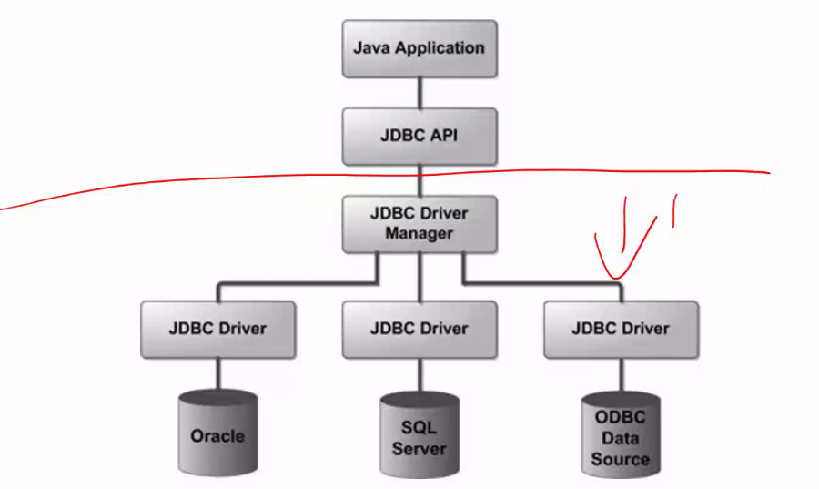

# 一 面向驱动的数据库编程

给数据库装一个驱动，把数据库中的对象当成当前语言中的一个对象，类，实例等，用当前语言直接操作数据库？

java通过JDBC对不同类型的数据库进行访问，红线往下是数据，对用户透明
用JDBC API将下面数据库操作进行封装

即java通过JDBC驱动进行数据库的操作，实现数据库编程

照教程走一遍，至少执行一遍select，或者用JDBC连接之前创建 的数据库

# 二 过程化SQL

- 过程化SQL 
  - SQL的扩展 
    - 相当于是SQL自己能够实现业务价值，能够给SQL赋予新方法功能，应用端直接调用即可，减少交互加快速率，并且写在数据库中的数据块能够实现复用
  - 增加了过程化语句功能 
    - 过程化合解释性相对立，前者就是要自己实现操作过程，后者是将操作封装成接口直接使用
  - 基本结构是块
    - 块之间可以互相嵌套 
    - 每个块完成一个逻辑操作  
- 其操作和一般编程语言没有太多区别，具体可见ch46

# 三 存储过程和函数

- 同样是过程化SQL的一部分，具体内容就是过程化编程中的封装和函数

## 1. 存储过程

### 1.1 概述

- 过程化SQL块类型
  - 命名块
    - 编译后保存在数据库中，可以被反复调用，运行速度较快，过程和函数是命名块  
  - 匿名块
    - 每次执行时都要进行编译，它不能被存储到数据库中，也不能在其他过程化SQL块中调用  
- 存储过程：由过程化SQL语句书写的过程，经编译和优化后存储在数据库服务器中，使用时只要调用即可。

### 1.2 优缺点

- 存储过程的优点
  - 运行效率高
    - 相当于通过存储过程，SQL自己能够实现业务价值，能够给SQL赋予新方法功能，应用端直接调用即可，减少交互，加快速率，并且写在数据库中的数据块能够实现复用
  - 降低了客户机和服务器之间的通信量	
  - 方便实施企业规则
    - 因为数据库中的过程化SQL的存储过程是多个应用公用，是统一的，所以方便企业制定统一标准
- 存储过程的缺点
  - 移植难度增加
  - 安全隐患
    - app拥有修改存储过程的权限，不仅会修改当前APP存储过程对应数据，也会影响使用该存储过程的其他APP的数据
- 当下许多企业是禁用存储过程的，实际上存储过程就是节约资源和其带来的副作用的权衡

### 1.3 创建存储过程

### 1.4 调用存储过程

### 1.5 修改删除存储过程

## 2. 函数

和存储过程的唯一区别就是有无 **返回参数(RETURNS)**

- 函数的定义语句格式
  - CREATE OR REPLACE FUNCTION 函数名 ([参数1,参数2,…]) RETURNS <类型>  AS <过程化SQL块>;
- 函数的执行语句格式
  - CALL/SELECT 函数名 ([参数1,参数2,…]);
-  修改函数
  - 重命名
    - ALTER FUNCTION 过程名1 RENAME TO 过程名2;
  - 重新编译
    - ALTER FUNCTION 过程名 COMPILE;