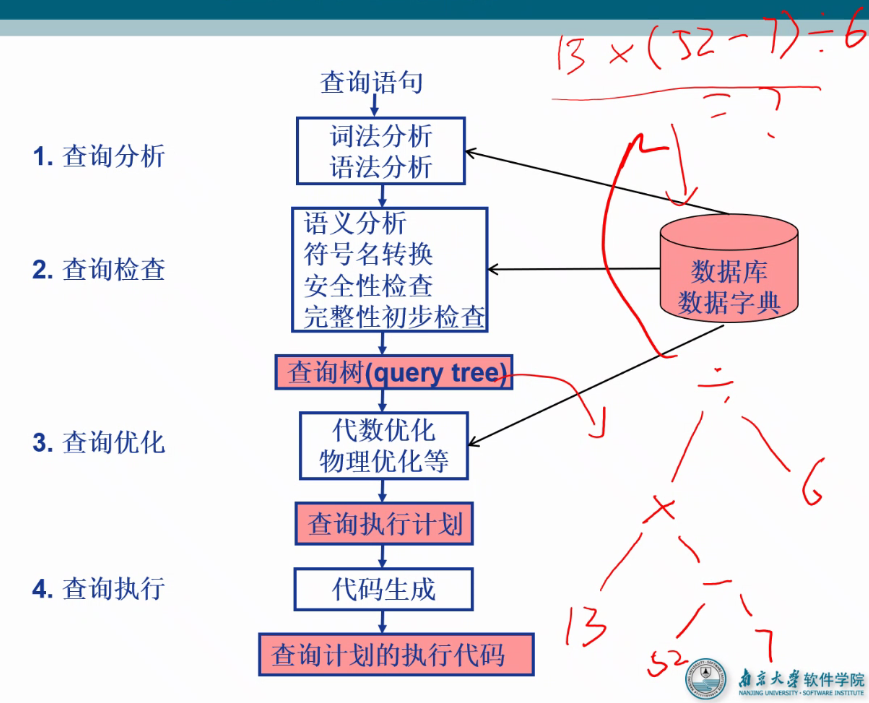

这章只考虑查询优化问题，不考虑增删改优化问题（因为前者的频率较低）

# 一 查询处理

## 1. 查询处理步骤

- 查询分析和查询检查之前讲的就是
- 查询树是查询结果的中间形态
  - 相同的查询查询树可以不同，只需要保证最后结果相同即可
- 查询优化
  - 代数优化：可以对查询树进行优化，使得查询树的查询过程消耗更少的资源
  - 物理优化
- 查询执行计划：将上述过程整理，在代码生成中生成代码，最后执行查询任务
- 某一类查询优化适用于需要多次进行该类查询任务的情况
- 也可以“人工优化”，即在SQL语句编写时尽量采用高效的说明语句

### 查询优化

- 查询优化的选择依据
  - 基于规则
    - 能知道两个查询方案是等价的，基于查询的规则进行优化
    - 基于规则生成多个方案
  - 基于代价
    - 预估多个查询方案所需要的代价，选择代价较低的方案
    - 基于代价在多个方案中进行筛选
  - 基于语义
    - 语义一样的方案才能选择？

## 2. 查询优化 — 选择操作的实现

- 选择操作典型实现方法：
  - 全表扫描方法 (Table Scan)
    - 对查询的基本表顺序扫描，逐一检查每个元组是否满足选择条件，把满足条件的元组作为结果输出 
    - 适合小表，不适合大表
  - 索引扫描方法 (Index Scan)
    - 适合于选择条件中的属性上有索引(例如B+树索引或Hash索引) 
    - 通过索引先找到满足条件的元组主码或元组指针，再通过元组指针直接在查询的基本表中找到元组 
- [例9.1] SELECT * 
                  FROM Student
                  WHERE <条件表达式>
     考虑<条件表达式>的几种情况：
      	C1：无条件；
        	C2：Sno＝'201215121’；
        	C3：Sage>20；
        	C4：Sdept＝'CS' AND Sage>20； 

### 2.1 全表扫描法例子

### 2.2 索引扫描法例子

- [例9.1-C2] SELECT * 

  ​                     FROM Student

  ​                     WHERE    Sno='201215121'

  - 假设Sno上有索引(或Sno是散列码)
  - 算法：
    - 使用索引(或散列)得到Sno为‘201215121’ 元组的指针
    - 通过元组指针在Student表中检索到该学生

- [例9.1-C3] SELECT *

  ​                      FROM Student

  ​                      WHERE    Sage>20

  - 假设Sage 上有B+树索引
  - 算法：
    - 使用B+树索引找到Sage=20的索引项，以此为入口点在B+树的顺序集上得到Sage>20的所有元组指针
    - 通过这些元组指针到student表中检索到所有年龄大于20的学生。 

### 2.3 二者结合与对比

- 例9.1-C4] SELECT *

  ​                      FROM Student

  ​                      WHERE Sdept='CS' AND Sage>20;

  - 假设Sdept和Sage上都有索引

- 算法一：分别用Index Scan找到Sdept＝’CS’的一组元组指针和Sage>20的另一组元组指针

  - 求这两组指针的交集
  - 到Student表中检索
  - 得到计算机系年龄大于20的学生

- 算法二：找到Sdept=’CS’的一组元组指针，

  - 通过这些元组指针到Student表中检索
  - 并对得到的元组检查另一些选择条件(如Sage>20)是否满足
  - 把满足条件的元组作为结果输出。  

## 3. 查询优化 — 连接操作

- 连接操作是查询处理中最耗时的操作之一 

- 本节只讨论等值连接(或自然连接)最常用的实现算法 

  - 嵌套循环算法(nested loop join) 
  - 排序-合并算法(sort-merge join 或merge join)
  - 索引连接(index join)算法 
  - Hash Join算法 

- [例9.2]   SELECT * 

  ​                  FROM    Student, SC 		      

  ​                  WHERE Student.Sno=SC.Sno; 

### 3.1 嵌套循环算法

### 3.2 排序 - 合并算法

- 排序-合并算法(sort-merge join 或merge join) 
  - 如果连接的表没有排好序，先对Student表和SC表按连接属性Sno排序 
  - 取Student表中第一个Sno，依次扫描SC表中具有相同Sno的元组 
  - 当扫描到Sno不相同的第一个SC元组时，返回Student表扫描它的下一个元组，再扫描SC表中具有相同Sno的元组，把它们连接起来 
  - 重复上述步骤直到Student 表扫描完
- Student表和SC表都只要扫描一遍
- 如果两个表原来无序，执行时间要加上对两个表的排序时间
- 对于**大表**，先排序后使用排序-合并连接算法执行连接，总的时间一般仍会减少 
  - 小表则难说
- 图形示例：

### 3.3 索引连接法

- 步骤：
  - 在SC表上已经建立属性Sno的索引。
  - 对Student中每一个元组，由Sno值通过SC的索引查找相应的SC元组。 
  - 把这些SC元组和Student元组连接起来   
  - 循环执行②③，直到Student表中的元组处理完为止 

### 3.4 Hash Join算法 

- 把连接属性作为hash码，用同一个hash函数把Student表和SC表中的元组散列到hash表中。
- 划分阶段(building phase, 也称为partitioning phase)
  - 对包含较少元组的表(如Student表)进行一遍处理
  - 把它的元组按hash函数分散到hash表的桶中
- 试探阶段(probing phase,也称为连接阶段join phase) 
  - 对另一个表(SC表)进行一遍处理
  - 把SC表的元组也按同一个hash函数（hash码是连接属性）进行散列
  - 把SC元组与桶中来自Student表并与之相匹配的元组连接起来
- **hash join算法前提**：假设两个表中较小的表在第一阶段后可以完全放入内存的hash桶中 

# 二 查询优化

## 1. 查询优化概述

### 1.1 关系系统的查询优化

- 关系系统的查询优化
  - 是关系数据库管理系统实现的关键技术又是关系系统的优点所在
  - 减轻了用户选择存取路径的负担 
- 关系查询优化是影响关系数据库管理系统性能的关键因素 
- 由于关系表达式的语义级别很高，使关系系统可以从关系表达式中分析查询语义，提供了执行查询优化的可能性  

### 1.2 非关系系统的查询优化

- 用户使用过程化的语言表达查询要求，执行何种记录级的操作，以及操作的序列是由用户来决定的 
- 用户必须了解存取路径，系统要提供用户选择存取路径的手段，查询效率由用户的存取策略决定
- 如果用户做了不当的选择，系统是无法对此加以改进的

### 1.3 查询优化的优点

- 用户不必考虑如何最好地表达查询以获得较好的效率
- **系统可以比用户程序的“优化”做得更好** 
  - 优化器可以从数据字典中获取许多统计信息，而用户程序则难以获得这些信息。
  - 如果数据库的物理统计信息改变了，系统可以自动对查询重新优化以选择相适应的执行计划。在非关系系统中必须重写程序，而重写程序在实际应用中往往是不太可能的。
  - 优化器可以考虑**数百种不同**的执行计划，程序员一般只能考虑有限的几种可能性。
  - 优化器中包括了**很多复杂的优化技术**，这些优化技术往往只有最好的程序员才能掌握。系统的自动优化相当于使得所有人都拥有这些优化技术。

### 1.4 查询优化的总目标

- 关系数据库管理系统通过某种代价模型计算出**各种查询执行策略的执行代价**，然后选取**代价最小**的执行方案
  - 集中式数据库
    - 执行开销主要包括：磁盘存取块数(**I/O代价**)+处理机时间(CPU代价)+查询的内存开销 
    - I/O代价是最主要的 	
  - 分布式数据库
    - 总代价=I/O代价+CPU代价+内存代价＋通信代价 
- 查询优化的总目标
  - 选择有效的策略
  - 求得给定关系表达式的值
  - **使得查询代价最小** 
    - 实际上是较小，因为我们无法找到所有查询方案
- 一个关系查询可以对应不同的执行方案，其效率可能相差非常大。

## 2. 查询优化的实例

- [例9.3] 求选修了2号课程的学生姓名。

- 用SQL表达：

  ​      	SELECT  Student.Sname

  ​	FROM     Student, SC

  ​	WHERE   Student.Sno=SC.Sno AND SC.Cno=’2’ 

- 假定学生-课程数据库中有1000个学生记录，10000个选课记录；选修2号课程的选课记录为50个 

  - 这个是从数据字典中知道的，前提条件

- 可以用多种等价的关系代数表达式来完成这一查询

- 先做选择后做连接实际上是一种基于规则的代数优化，因为我们发现按照这个规则IO代价小，效率较高

## 3. 代数优化

- 代数优化策略：通过对关系代数表达式的等价变换来提高查询效率 
- 关系代数表达式的等价：指用相同的关系代替两个表达式中相应的关系所得到的结果是相同的
- 两个关系表达式E1和E2是等价的，可记为E1≡E2  

### 3.1 常用的等价变换规则

### 3.2 典型的启发式规则

1. **选择运算**应尽可能先做
   1. 在优化策略中这是**最重要、最基本的一条**。
2. 把**投影运算和选择运算同时进行**
   1. 如有若干投影和选择运算，并且它们都**对同一个关系操作**，则可以在扫描此关系的同时完成所有的这些运算以**避免重复扫描关系。**
3. 把投影同其前或其后的双目运算结合起来
   1. 没有必要为了去掉某些字段而扫描一遍关系。
   2. 2，3是同一个想法，相当于是扫一遍能做的事情就一起做掉了
4. 把某些选择同在它前面要执行的笛卡尔积结合起来成为一个连接运算
   1. 笛卡尔积是无脑直接组合起来，连接运算则是有选择组合，后者效率远高于前者 
5. 找出公共子表达式
   1. 如果这种重复出现的子表达式的结果不是很大的关系，并且从外存中读入这个关系比计算该子表达式的时间少得多，则先计算一次公共子表达式并把结果写入中间文件是合算的。
      1. 相当于存一个缓存，之后直接用就是了
   2. 当查询的是视图时，定义视图的表达式就是公共子表达式的情况

### 3.3 查询数的启发式优化

遵循这些启发式规则，应用等价变换公式来优化关系表达式的算法。

​	算法：关系表达式的优化

​	输入：一个关系表达式的查询树

​	输出：优化的查询树

​	方法：

1. 利用等价变换规则4把形如σF1∧F2∧…∧Fn(E)变换为 σF1(σF2(…(σFn(E))…))。
   1. 目的是将操作打散，方便2，3两部中将选择和投影操作往叶节点处放
2. 对每一个**选择**，利用等价变换规则4～9尽可能把它移到树的叶端。
3. 对每一个**投影**利用等价变换规则3，5，10，11中的一般形式尽可能把它移向树的叶端。
   1. 注意： 
      1. 等价变换规则3使一些投影消失或使一些投影出现
      2. 规则5把一个投影分裂为两个，其中一个有可能被移向树的叶端 
   2. 优先让选择往叶节点走，再让投影往叶节点走，目的是减少关系的大小
4. 利用等价变换规则3～5，把**选择和投影的串接合并成单个选择、单个投影或一个选择后跟一个投影**，使多个选择或投影能同时执行，或在**一次扫描中全部完成**
   1. 这边和第一步相反，是将操作合并，即再选择投影尽量下放之后，如果还能有合并的操作就合并
5. 把上述得到的语法树的内节点分组。
   1. 每一双目运算(×，  ，∪，-)和它所有的直接祖先为一组(这些直接祖先是(σ，π运算)。
   2. 如果其后代直到叶子全是单目运算，则也将它们并入该组
   3. 但当双目运算是笛卡尔积(×)，而且后面不是与它组成等值连接的选择时，则不能把选择与这个双目运算组成同一组 

#### 一个例子

##### 查询请求

##### 选择条件的分解：

- 根据规则4，将选择操作分解

##### 选择操作下移

##### 投影操作下移

##### 操作合并

##### 内节点分组

- 给节点进行分组，最上的 笛卡尔积运算符的左子树中有双目运算符，则左子树作为一个整体，右子树中只有单目运算符，则其归入笛卡尔积所在的整体，二者可以同时计算
- 并且整体可以复用

## 4. 物理优化

- 代数优化改变查询语句中操作的次序和组合，不涉及底层的存取路径
- 对于一个查询语句**有许多存取方案**，它们的**执行效率不同**， 仅仅进行代数优化是不够的 
- 物理优化就是要**选择高效合理的操作算法或存取路径**，求得优化的查询计划 

### 4.1 物理优化方法概述

- 物理优化方法
  - 基于规则的启发式优化
    - 启发式规则是指那些在大多数情况下都适用，但不是在每种情况下都是最好的规则。
    - 什么情况下做什么按照一定的规则来选择执行策略，规则的原因不探究，但是按照规则得到的执行策略不一定会是当前情况下的最好选择
  - 基于代价估算的优化
    - 优化器估算不同执行策略的代价，并选出具有最小代价的执行计划。
    - 给出当前情况下所有可以执行策略，计算其中代价最小的代价
    - 代价的估算需要代价：
      - 需要对数据库的情况有一定的认知，得知道这种执行策略会有产生多大代价
      - 需要进行代价估算的执行策略可能会很多，导致估算的代价很大，因此没必要估算所有执行策略
  - 两者结合的优化方法：
    - 常常先使用启发式规则，选取若干较优的候选方案，减少代价估算的工作量
    - 然后分别计算这些候选方案的执行代价，较快地选出最终的优化方案  

### 4.2 基于规则的启发式优化

#### 选择操作的启发式规则

对于小关系，使用全表顺序扫描，即使选择列上有索引 

对于大关系，启发式规则有：

1. 对于选择条件是“主码＝值”的查询
   - 查询结果最多是一个元组，可以选择主码索引
   - 一般的关系数据库管理系统会自动建立主码索引
2. 对于选择条件是“非主属性＝值”的查询，并且选择列上有索引
   - 和主码=值的情况相比，其可能会得到多个元组
   - 要估算查询结果的元组数目
     - 如果比例较小(<10%)可以使用索引扫描方法
     - 否则还是使用全表顺序扫描
3. 对于选择条件是属性上的非等值查询或者范围查询，并且选择列上有索引
   - 要估算查询结果的元组数目
     - 如果比例较小(<10%)可以使用索引扫描方法
     - 否则还是使用全表顺序扫描
4. 对于用AND连接的合取选择条件
   1. 如果有涉及这些属性的组合索引
      1. 优先采用组合索引扫描方法
   2. 如果某些属性上有一般的索引，可以用索引扫描方法
      1. 通过分别查找满足每个条件的指针，求指针的交集
      2. 通过索引查找满足部分条件的元组，然后在扫描这些元组时判断是否满足剩余条件
   3. 其他情况：使用全表顺序扫描
5. 对于用OR连接的析取选择条件，一般使用全表顺序扫描

#### 连接操作的启发式规则

1. 如果2个表都已经按照连接属性排序
   - 选用排序-合并算法
2. 如果一个表在连接属性上有索引
   - 选用索引连接算法
3. 如果上面2个规则都不适用，其中一个表较小
   - 选用hash join算法
4. 可以选用嵌套循环方法，并选择其中较小的表，确切地讲是占用的块数(B)较少的表，作为外表(外循环的表) 。
   - 理由：
     - 设连接表R与S分别占用的块数为Br与Bs，连接操作使用的内存缓冲区块数为K，分配K-1块给外表，如果R为外表，则嵌套循环法存取的块数为Br+BrBs/(K-1)
     - 显然应该选块数小的表作为外表  

### 4.3 基于代价估算的优化

- **启发式规则优化**是定性的选择，适合解释执行的系统
  - 解释执行相当于是执行SQL代码会反复修改，每一次执行都需要优化，优化开销包含在查询总开销之中 
- 编译执行的系统中查询优化和查询执行是分开的
  - 可以采用精细复杂一些的**基于代价的优化方法**  
  - 相当于是先给固定的SQL语句进行一遍优化，之后反复用就是了

#### 统计信息

基于代价的优化方法要计算查询的各种不同执行方案的执行代价，它与数据库的状态密切相关 

****

#### 扫描算法代价估算

- 全表扫描算法的代价估算公式
  - 如果基本表大小为B块，全表扫描算法的代价 cost＝B
  - 如果选择条件是“码＝值”，那么平均搜索代价 cost＝B/2
- 索引扫描算法的代价估算公式
  - 如果选择条件是“码＝值”
    - 则采用该表的主索引
    - 若为B+树，层数为L，需要存取B+树中从根结点到叶结点L块，再加上基本表中该元组所在的那一块，所以cost=L+1
- 如果选择条件涉及非码属性
  - 若为B+树索引，选择条件是相等比较，S是索引的选择基数(有S个元组满足条件)
  - 满足条件的元组可能会保存在不同的块上，所以(最坏的情况)cost=L+S
- 如果比较条件是＞，＞＝，＜，＜＝操作
  - 假设有一半的元组满足条件，就要存取一半的叶结点，通过索引访问一半的表存储块，cost=L+Y/2+B/2
  - 如果可以获得更准确的选择基数，可以进一步修正Y/2与B/2

#### 连接算法代价估算

