# 一 关系 模式及范式概述

## 1. 关系模式及第一范式

- 关系模式由五部分组成，是一个五元组：

  ​           R(U, D, DOM, F)

  - 关系名R是符号化的元组语义
  - U为一组属性
  - D为属性组U中的属性所来自的域
  - DOM为属性到域的映射
  - F为属性组U上的一组**数据依赖**

- 由于D、DOM与模式设计关系不大，因此可以把关系模式看作一个三元组：R<U,F>

  - 当且仅当U上的一个关系r满足F时，r称为关系模式R<U,F>的一个关系
  - 作为二维表，关系要符合一个最基本的条件：**每个分量必须是不可分开的数据项**。满足了这个条件的关系模式就属于**第一范式（1NF）**

### 1.1 数据依赖

- 数据依赖
  - 是一个关系内部属性与属性之间的一种约束关系
    - 通过属性间值的相等与否体现出来的数据间相关联系
  - 是现实世界属性间相互联系的抽象
  - 是数据内在的性质
  - 是语义的体现
- 数据依赖的主要类型
  - 函数依赖（Functional Dependency，简记为FD）
  - 多值依赖（Multi-Valued Dependency，简记为MVD）

#### 1.1.1 函数依赖

- 函数依赖普遍存在于现实生活中
  - 描述一个学生关系，可以有学号、姓名、系名等属性。
    - 一个学号只对应一个学生，一个学生只在一个系中学习
    - “学号”值确定后，学生的姓名及所在系的值就被唯一确定。
    - Sname=f(Sno)，Sdept=f(Sno)
      - 即Sno函数决定Sname，Sno函数决定Sdept
      - 记作Sno→Sname，Sno→Sdept

### 1.2 第一范式(1NF)实例

- [例6.1] 建立一个描述学校教务的数据库。涉及的对象包括：
  - 学生的学号（Sno）
  - 所在系（Sdept）
  - 系主任姓名（Mname）
  - 课程号（Cno）
  - 成绩（Grade）
- 假设学校教务的数据库模式用一个单一的关系模式Student来表示，则该关系模式的属性集合为：
  - U ＝{Sno, Sdept, Mname, Cno, Grade}  
- 现实世界的已知事实（语义）：
  - 一个系有若干学生， 但一个学生只属于一个系；
  - 一个系只有一名（正职）负责人；
  - 一个学生可以选修多门课程，每门课程有若干学生选修；
  - 每个学生学习每一门课程有一个成绩。   
- 由此可得到属性组U上的一组函数依赖F：
  - F={Sno→Sdept, Sdept→ Mname, (Sno, Cno)→ Grade}

- 

#### 1.2.1 1NF的问题

#### 1.2.2 问题本题

关系模式Student<U, F>中存在的问题：

- 数据冗余
  - 浪费大量的存储空间：
    - 每一个系主任的姓名重复出现，重复次数与该系所有学生的所有课程成绩出现次数相同。
- 更新异常（Update Anomalies）
  - 数据冗余 ，更新数据时，维护数据完整性代价大。
    - 某系更换系主任后，必须修改与该系学生有关的每一个元组。
- 插入异常（Insertion Anomalies）
  - 如果一个系刚成立，尚无学生，则无法把这个系及其系主任的信息存入数据库。
- 删除异常（Deletion Anomalies）
  - 如果某个系的学生全部毕业了， 则在删除该系学生信息的同时，把这个系及其系主任的信息也丢掉了。

结论

- Student关系模式不是一个好的模式。
- 一个“好”的模式应当不会发生插入异常、删除异常和更新异常，数据冗余应尽可能少。

##### 1.2.2.1 其原因及解决办法

原因

- 由存在于模式中的某些**数据依赖**引起的。

解决方法

- 用规范化理论改造关系模式来**消除其中不合适的数据依赖**
- 把这个单一的模式分成三个关系模式：
  - S(Sno,Sdept,Sno → Sdept);
  - SC(Sno,Cno,Grade,(Sno,Cno) → Grade);
  - DEPT(Sdept,Mname,Sdept → Mname);
- 这三个模式都不会发生插入异常、删除异常的问题，数据的冗余也得到了控制。

## 2. 范式

- 范式是符合某一种级别的关系模式的集合。

- 关系数据库中的关系必须满足一定的要求。满足不同程度要求的为不同范式。

- 范式的种类

  - 第一范式(1NF)

  - 第二范式(2NF)

  - 第三范式(3NF)

  - BC范式(BCNF)

  - 第四范式(4NF)

  - 第五范式(5NF)

    > 其中第一，五都较少使用，提升范式级别的目的是解决上述中提到的1NF中的相关问题

- 范式间的联系

  

  - 某一关系模式R为第n范式，可简记为R∈nNF。

  - 一个低一级范式的关系模式，通过**模式分解**（schema decomposition）可以**转换为若干个高一级范式的关系模式的集合**，这种过程就叫**规范化**（normalization）。

    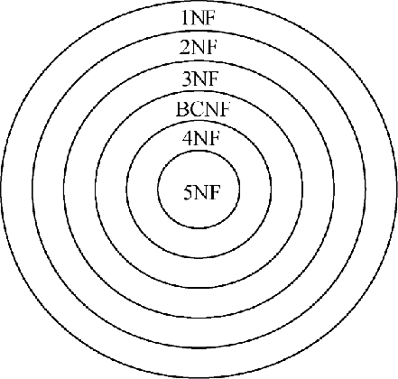

# 二 函数依赖与码

## 1. 函数依赖

### 1.1 定义

​	设R(U)是一个属性集U上的关系模式，X和Y是U的子集。若对于R(U)的任意一个可能的关系r，r 中不可能存在两个元组在X上的属性值相等， 而在Y上的属性值不等， 则称“X函数确定Y”或“Y函数依赖于X”，记作X→Y，X称为这个函数依赖的决定因素（Determinant）。

- 如果X→Y则只能1对1或者多对1
- 如果X→Y，并且Y→X, 则记为X←→Y。
- 若Y不函数依赖于X, 则记为X↛Y。

​	例：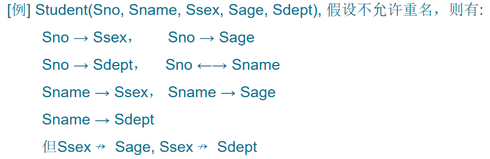

- Sno实际上是学生实体的一个码，当一个元组的Sno决定了，这个元组其他属性也就决定了，所以“Sno 函数确定其他属性”，这就是其他属性函数依赖于Sno
- 如果满足不能重名这个条件的话，Sname也是一个码

### 1.2 定义辨析

- 函数依赖不是指关系模式R的某个或某些关系实例满足的约束条件，而是指R的所有关系实例均要满足的约束条件。
  - 关系模式类似于类，关系实例类似于
- 函数依赖是语义范畴的概念。只能根据数据的语义来确定函数依赖。
  - 例如“姓名→年龄”这个函数依赖只有在不允许有同名人的条件下成立
- 数据库设计者可以对现实世界作强制的规定。
  - 例如规定不允许同名人出现，函数依赖“姓名→年龄”成立。
  - 那么所插入的元组必须满足规定的函数依赖，若发现有同名人存在， 则拒绝装入该元组。

### 1.3 函数依赖分类

#### 平凡和非平凡函数依赖

- 在关系模式R(U)中，对于U的子集X和Y，

  - 如果X→Y，但Y ⊈ X，则称X→Y是非平凡的函数依赖
  - 若X→Y，但Y  X,   则称X→Y是平凡的函数依赖

- 例：在关系SC(Sno, Cno, Grade)中，

  ​      非平凡函数依赖： (Sno, Cno) → Grade

  ​      平凡函数依赖：     (Sno, Cno) → Sno 

  ​                                        (Sno, Cno) → Cno

- 对于任一关系模式，平凡函数依赖都是必然成立的，它不反映新的语义，因此若不特别声明， 我们总是讨论非平凡函数依赖。

#### 完全与部分函数依赖

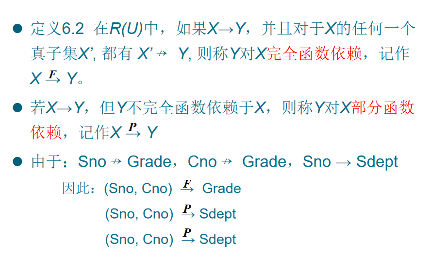

#### 传递函数依赖

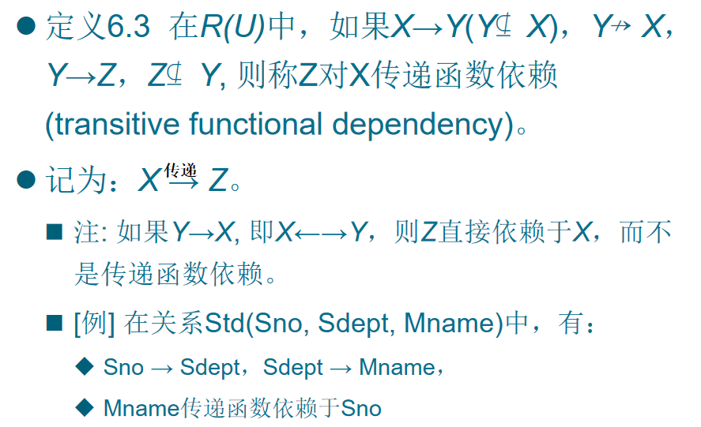

- 事实上直接依赖和传递依赖的结果都是相同，二者的区别在语义上。

## 2. 码

### 候选码和主码

- 定义6.4  设K为R<U,F>中的属性或属性组合。若K → U，则K称为R的一个候选码(Candidate Key)。
  - 如果U部分函数依赖于K，即K → U,则K称为超码    （Surpkey）。候选码是最小的超码，即K的任意一个真子集都不是候选码。
- 若关系模式R有多个候选码，则选定其中的一个做为主码(Primary key)。

- 主属性
  - 包含在任何一个候选码中的属性，称为注释行
  - 不包含在任何码中的属性称为非主属性
- 全码：整个属性组是码，称为全码（All-key） 

- [例6.2]S(Sno, Sdept, Sage)，单个属性Sno是码，SC(Sno, Cno, Grade)中，(Sno, Cno)是码
- [例6.3] R(P,W,A)  P：演奏者     W：作品    A：听众
  - 一个演奏者可以演奏多个作品
  - 某一作品可被多个演奏者演奏
  - 听众可以欣赏不同演奏者的不同作品 
  - 码为(P,W,A)，即All-Key 

### 外码

- 定义6.5  关系模式 R中属性或属性组X 并非 R的码，但 X 是另一个关系模式的码，则称 X 是R 的外部码（Foreign key）也称外码。
- SC(Sno,Cno,Grade)中，Sno不是码，Sno是 S(Sno,Sdept,Sage)的码，则Sno是SC的外码 
- 主码与外部码一起提供了表示关系间联系的手段

# 三 1NF,2NF,3NF,BCNF

- 1NF  关系模式R中属性不可再分
- 2NF 1NF的基础上，消除非主属性对主属性的部分依赖情况，使得非主属性对于主属性是完全依赖
- 3NF 2NF的基础上，消除传递依赖的情况
- BCNF 3NF的基础上，消除主属性间的部份依赖与传递依赖的情况

## 1. 1NF

- 定义：如果一个关系模式R的所有属性都是不可分的基本数据项，则R∈1NF。
- 第一范式是对关系模式的最起码的要求。不满足第一范式的数据库模式不能称为关系数据库。
- 但是满足第一范式的关系模式并不一定是一个好的关系模式。

## 2. 2NF

- 定义6.6  若关系模式R∈1NF，并且每一个非主属性都**完全函数依赖于**任何一个候选码，则R∈2NF

- [例6.4]  S-L-C(Sno,Sdept,Sloc,Cno,Grade)， Sloc为学生的住处，并且每个系的学生住在同一个地方。S-L-C的码为(Sno,Cno)。

  - 函数依赖有

    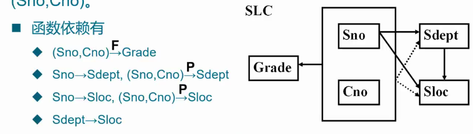

  - 非主属性Sdept和Sloc部分函数依赖于码(Sno, Cno)

  - 关系模式S-L-C不属于2NF

### 不属于 2NF导致的问题

- 数据冗余
  - 即连续存放相同的值
  - 如上例，10个学生10门课程，以Sno和Cno作为主码一共有100条记录，但是 Sdept是由Sno决定的，其知会有10个值，导致了每十条元组中的Sdept都是相同的值
- 插入异常
  - 如果插入一个新学生，但该生未选课，即该生无Cno，由于插入元组时，必须给定码值，因此插入失败。
- 删除异常
  - 如果S4只选了一门课C3，现在他不再选这门课，则删除C3后，整个元组的其他信息也被删除了。
- 修改复杂
  - 如果一个学生选了多门课，则Sdept，Sloc被存储了多次。如果该生转系，则需要修改所有相关的Sdept和Sloc，造成修改的复杂化。

### 出现问题的原因及解决方法

- 出现这种问题的原因

  - 例子中有两类非主属性：
    - 一类如Grade，它对码**完全函数依赖**
    - 另一类如Sdept、Sloc，它们对码**不是完全函数依赖**

- 解决方法：

  - 用投影分解把关系模式S-L-C分解成两个关系模式
    - SC(Sno,Cno,Grade)
    - S-L(Sno,Sdept,Sloc)

  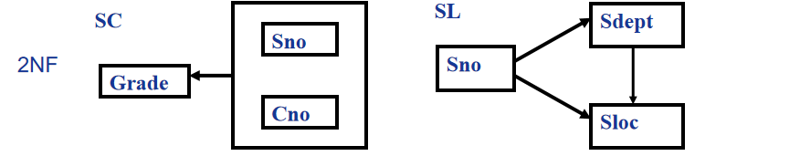

### 问题解决情况

## 3. 3NF

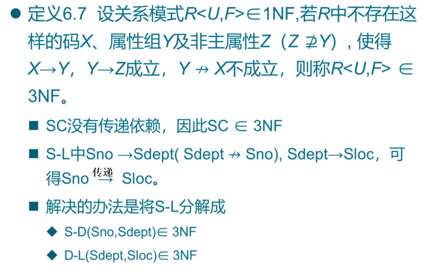

- 相当于是把传递依赖给消除了，继续消除冗余

## 4. BCNF

### 3NF存在的问题

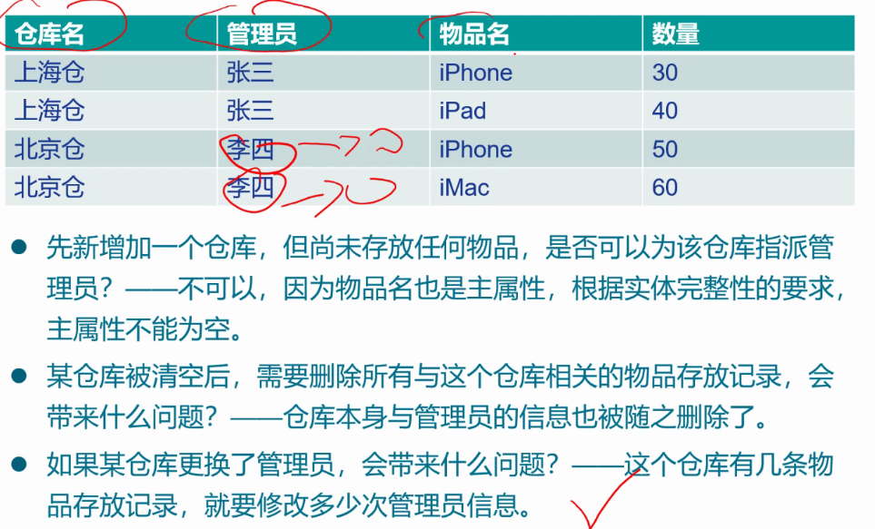

- 其不彻底性表现在可能存在主属性对码的部分依赖和传递依赖

### BCNF定义

- BCNF（Boyce Codd Normal Form）由Boyce和Codd提出，比3NF更进了一步。通常认为BCNF是修正的第三范式，有时也称为扩充的第三范式。
- 定义6.8  设关系模式R<U,F>∈1NF，若X →Y且Y ⊈ X时X必含有码，则R<U,F>∈BCNF。
- 换言之，在关系模式R<U,F>中，**如果每一个决定属性集都包含候选码**，则R∈BCNF。

- BCNF的关系模式所具有的性质
  - 所有非主属性都完全函数依赖于每个候选码
  - 所有主属性都完全函数依赖于每个不包含它的候选码
  - 没有任何属性完全函数依赖于非码的任何一组属性
- 如果一个关系数据库中的所有关系模式都属于BCNF，那么在函数依赖范畴内，它已实现了模式的彻底分解，达到了最高的规范化程度，消除了插入异常和删除异常。

- [例6.5]考察关系模式C(Cno,Cname,Pcno)
  - 它只有一个码Cno，没有任何属性对Cno部分依赖或传递依赖，所以C∈3NF。
  - 同时C中Cno是唯一的决定因素，所以C∈BCNF。
  - 对于关系模式SC(Sno,Cno,Grade)可作同样分析。

- [例6.6] 关系模式S(Sno,Sname,Sdept,Sage)，
  - 假定Sname也具有唯一性，那么S就有两个码，这两个码都由单个属性组成，彼此不相交。
  - 其他属性不存在对码的传递依赖与部分依赖，所以S∈3NF。
  - 同时S中除Sno，Sname外没有其他决定因素，所以S也属于BCNF。

- [例6.7] 关系模式SJP(S,J,P)中，S是学生，J表示 课程，P表示名次。每一个学生选修每门课程的成绩有一定的名次，每门课程中每一名次只有一个学生（即没有并列名次）。
  -   由语义可得到函数依赖： (S,J)→P；(J,P)→S
  -   (S,J)与(J,P)都可以作为候选码。
  -   关系模式中没有属性对码传递依赖或部分依赖，所以SJP∈3NF。
  -   除(S,J)与(J,P)以外没有其他决定因素，所以SJP∈BCNF。
- 非BCNF的例子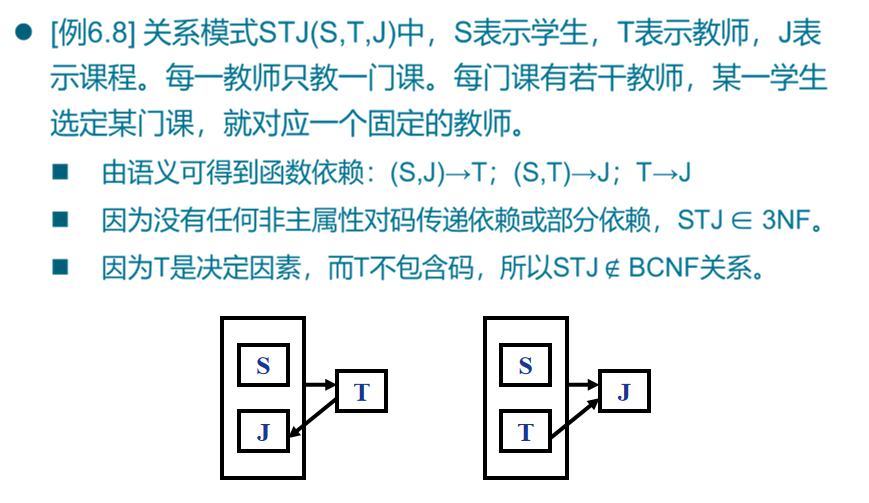

# 四 多值依赖和4NF

## 1.多值依赖

### 多值依赖的具体实例

- 例[6.9]设学校中某一门课程由多个教师讲授，他们使用相同的一套参考书。每个教员可以讲授多门课程，每种参考书可以供多门课程使用

  - 用关系模式Teaching(C,T,B)来表示课程C、教师T和参考书B之间的关系。
  - Teaching具有唯一候选码(C,T,B)， 即全码。
  - Teaching∈BCNF

  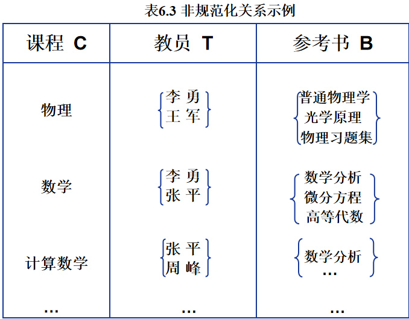

- 将其转化成规范化的二维表：

  | **课程** **C** | **教员** **T** | **参考书** **B** |
  | -------------- | -------------- | ---------------- |
  | **物 理**      | **李 勇**      | **普通物理学**   |
  | **物 理**      | **李 勇**      | **光学原理**     |
  | **物 理**      | **李 勇**      | **物理习题集**   |
  | **物 理**      | **王 军**      | **普通物理学**   |
  | **物 理**      | **王 军**      | **光学原理**     |
  | **物 理**      | **王 军**      | **物理习题集**   |
  | **数 学**      | **李 勇**      | **普通物理学**   |
  | **数 学**      | **李 勇**      | **光学原理**     |
  | **数 学**      | **李 勇**      | **物理习题集**   |
  | **数 学**      | **张 平**      | **普通物理学**   |
  | **数 学**      | **张 平**      | **光学原理**     |
  | **数 学**      | **张 平**      | **物理习题集**   |
  | **…**          | …              | …                |

  - 存在的问题：
    - 数据冗余度大：有多少名任课教师，参考书就要存储多少次
    - 增加操作复杂：当某一课程增加一名教师时，有几本的参考书就得增加几条元组
    - 删除操作复杂：当某一课程删除一本参考书，有几个教员就得删除几个元组
    - 修改操作复杂：某一门课要修改一本参考书，该课程有多少名教师，就必须修改多少个元组
  - 产生原因：存在多值依赖！

### 多值依赖概念

- 定义6.9    设R(U)是属性集U上的一个关系模式。X,Y,Z是U的子集，并且Z=U-X-Y。关系模式R(U)中多值依赖X→→Y成立，当且仅当对R(U)的任一关系r，给定的一对(x,z)值，有一组Y的值，这组值仅仅决定于x值而与z值无关。
- 比如上面的二维表：当课程属性C确定为物理，无论参考书属性B选择普通物理学还是光学原理，任课教师T始终是{李勇，王军}这个集合，其只由课程属性C决定而与参考书属性B'无关，则说明 C→→T
- 例  Teaching（C, T, B）
  - 对于C的每一个值，T有一组值与之对应，而不论B取何值。因此T多值依赖于C，即C→→T。 

- 多值依赖的另一个等价的定义
  - 在R(U)的任一关系r中，如果存在元组t，s使得t[X]=s[X]，那么就必然存在元组w，v∈r，（w，v可以与s，t相同）, 使得w[X]=v[X]=t[X]，而w[Y]=t[Y]，w[Z]=s[Z]，v[Y]=s[Y]，v[Z]=t[Z]（即交换s，t元组的Y值所得的两个新元组必在r中则Y多值依赖于X，记为X→→Y。这里X，Y是U的子集，Z=U-X-Y。
- 平凡多值依赖和非平凡的多值依赖
  - 若X→→Y，而Z＝Ф，即Z为空，则称X→→Y为平凡的多值依赖。
  - 否则称X→→Y为非平凡的多值依赖。

### 多值依赖实例

[例6.10]关系模式WSC(W,S,C)中，W表示仓库，S 表示保管员，C 表示商品。假设每个仓库有若干个保管员，有若干种商品。每个保管员保管所在仓库的所有商品，每种商品被所有保管员保管。

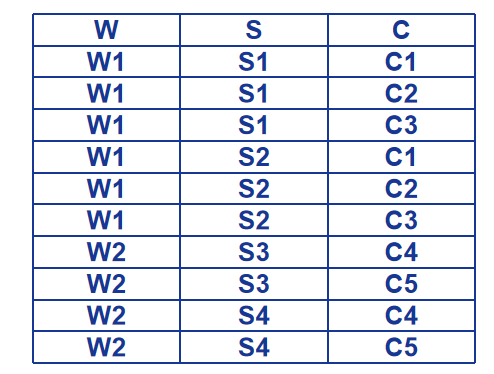

- 按照语义对于W的每一个值Wi，S有一个完整的集合与之对应而不问C取何值。所以W→→S。
- 如图6.7所示
  - 对应W的某一个值Wi的全部S值记作{S}Wi（表示此仓库工作的全部保管员）
  - 全部C值记作{C}Wi（表示在此仓库中存放的所有商品）
  - 应当有{S}Wi中的每一个值和{C}Wi中的每一个C值对应
  - 于是{S}Wi与{C}Wi之间正好形成一个完全二分图，因而W→→S。
- 由于C与S的完全对称性，必然有W→→C成立。
- 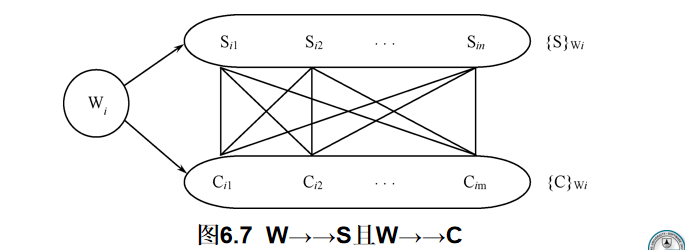

### 多值依赖性质

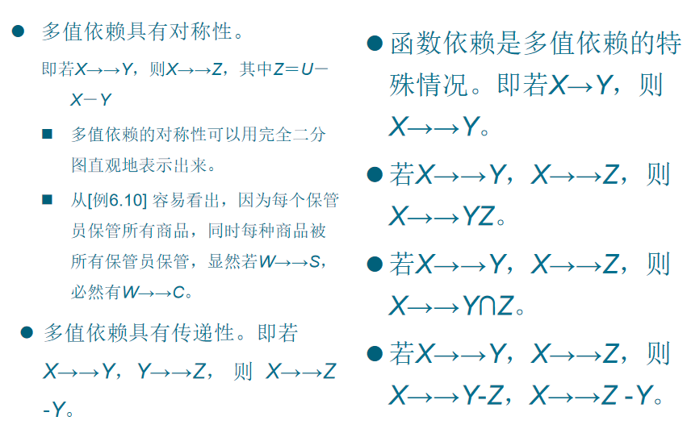

### 多值依赖与函数依赖的区别

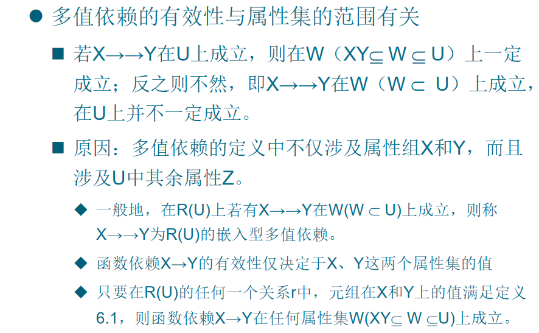

- 多值依赖在U上成立，那么多值依赖在U的子集上必然成立，但是在U的超集上不一定成立

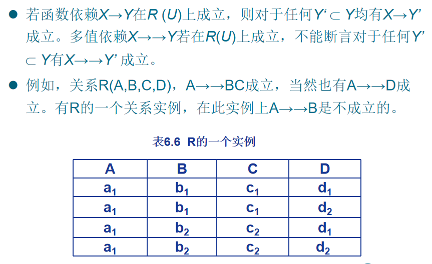

- 函数依赖是一种特殊的多值依赖（集合中元素只有一的多值依赖）

## 4NF

就是消除多值依赖

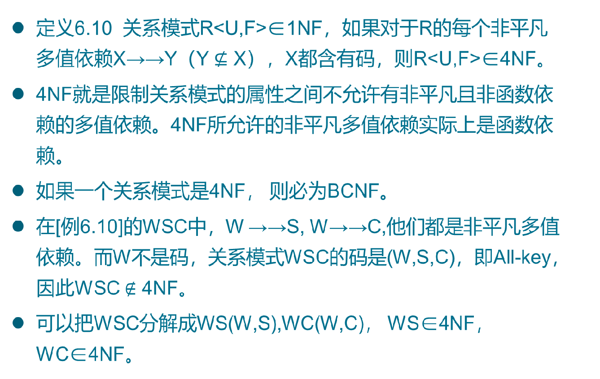