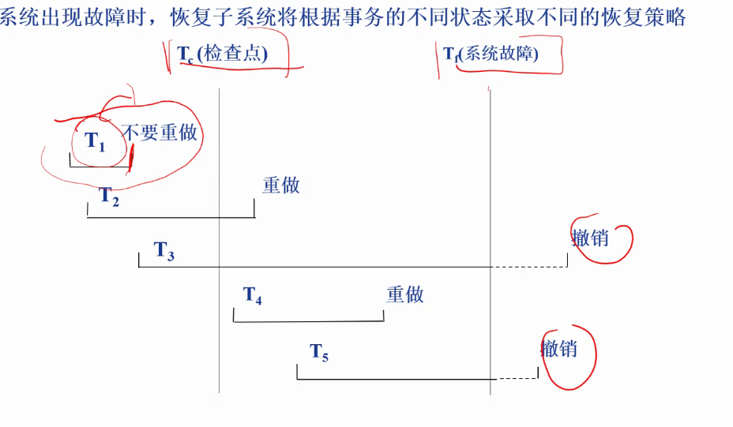
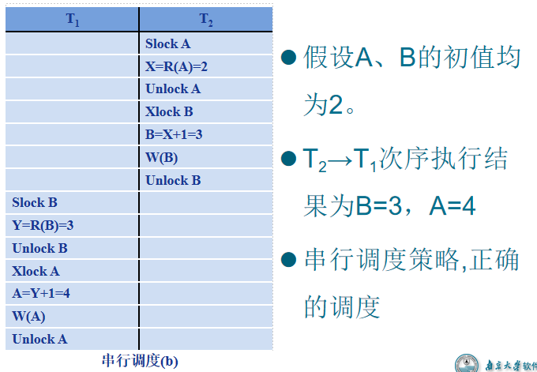
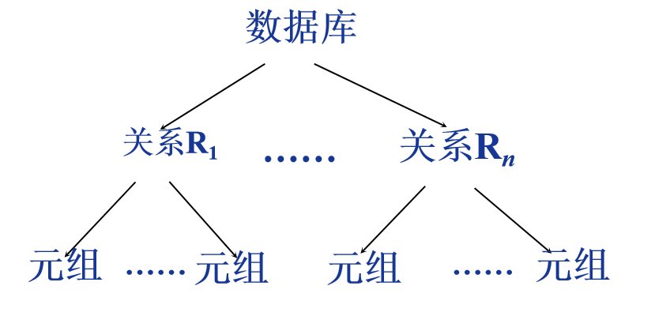

# 一 事务

## 1. 概念

- 事务是用户定义的一个数据库操作序列，这些操作要么全做，要么全不做，是一个不可分割的工作单位
- 事务和程序是两个概念
  - 事务可以是一条，一组SQL语句，也可以是一个程序
  - 一般来说一个程序包括多条事务
- 务是恢复和并发控制的基本单位

## 2. 定义事务

显示定义方式

 BEGIN TRANSACTION                   BEGIN TRANSACTION
          SQL 语句1                                             SQL 语句1
          SQL 语句2                                             SQL 语句2
          。。。。。                                            。。。。。
     COMMIT                                           ROLLBACK

## 3. 结束事务？？？？

- COMMIT
  - 事务正常结束   
  - 提交事务的所有操作（读+更新）
  - 事务中所有对数据库的更新写回到磁盘上的物理数据库中 
- ROLLBACK
  - 事务异常终止
  - 事务运行的过程中发生了故障，不能继续执行
  - 系统将事务中对数据库的所有已完成的操作全部撤销 
  - 事务滚回到开始时的状态
- commit和rollback实际上是事务执行的两个分支，commit就是当SQL语句读取完成后就一次性把SQL语句提交给数据库，而rollback就是当事务异常中断的时候回滚之前的所有操作

## 4. 事务的特性

### 4.1 原子性

- 事务是数据库的逻辑工作单位
  - All or Nothing：事务中的所有操作要么都做，要么都不做

### 4.2 一致性

- 事务的执行结果必须是使数据库从一个一致性状态变到另外一个一致性状态
- 一致性状态
  - 数据库中只包含成功事务提交的结果，即不存在事务做到一半的状态情况
- 不一致状态
  - 数据库系统运行中发生故障，有些事务尚未完成就被迫中断
  - 这些未完成事务对数据库所做的修改有一部分已写入物理数据库，这时数据库就处于一种不正确的状态 

### 4.3 隔离性

- 一个事务的执行不能被其他事务干扰
- 一个事务内部的操作及使用的数据对其他并发事务是隔离的
- 并发执行的各个事务之间不能互相干扰

### 4.4 持续性也称永久性

- 一个事务一旦提交，它对数据库中数据的改变就应该是永久性的。
- 接下来的其他操作或故障不应该对其执行结果有任何影响。

### 4.5 破坏事务ACID特性的因素

- 保证事务ACID特性是事务处理的任务
- 破坏事务ACID特性的因素
  - 多个事务并行运行时，不同事务的操作交叉执行
    - 数据库管理系统必须保证多个事务的交叉运行不影响这些事务的隔离性
  - 事务在运行过程中被强行停止
    - 数据库管理系统必须保证被强行终止的事务对数据库和其他事务没有任何影响 

# 二 故障和数据库恢复

- 故障是不可避免的
  - 计算机硬件故障
  - 软件的错误
  - 操作员的失误
  - 恶意的破坏
- 故障的影响
  - 运行事务非正常中断，影响数据库中数据的正确性 
  - 破坏数据库，全部或部分丢失数据

- 数据库的恢复
  - 数据库管理系统必须具有把数据库从错误状态恢复到某一已知的正确状态(亦称为一致状态或完整状态)的功能，这就是数据库的恢复管理系统对故障的对策
- 恢复子系统是数据库管理系统的一个重要组成部分 
- 恢复技术是衡量系统优劣的重要指标

## 1. 故障

- 故障的种类
  - ​	事务内部的故障
  - 系统故障
  - 介质故障
  - 计算机病毒
- 各类故障，对数据库的影响有两种可能性
  - 一是数据库本身被破坏
  - 二是数据库没有被破坏，但数据可能不正确，这是由于事务的运行被非正常终止造成的。

### 1.1 事务内部的故障及恢复

#### 事务内部的故障

例如，银行转账事务，这个事务把一笔金额从一个账户甲转给另一个账户乙。
           BEGIN TRANSACTION
    	      读账户甲的余额BALANCE;
           BALANCE=BALANCE-AMOUNT;    /*AMOUNT 为转账金额*/
           IF(BALANCE < 0 ) THEN
                 {打印‘金额不足，不能转账’；                                                                          	                                              /*事务内部可能造成事务被回滚的情况*/
                  ROLLBACK;                        /*撤销刚才的修改，恢复事务*/ 
                 }
           ELSE
                 {读账户乙的余额BALANCE1;
                   BALANCE1=BALANCE1+AMOUNT;
                   写回BALANCE1;
                   COMMIT;}

- 这个例子所包括的两个更新操作要么全部完成要么全部不做。否则就会使数据库处于不一致状态，例如只把账户甲的余额减少了而没有把账户乙的余额增加。
- 在这段程序中若产生账户甲余额不足的情况，应用程序可以发现并让事务滚回，撤销已作的修改，恢复数据库到正确状态。
- 事务内部更多的故障是非预期的，是不能由应用程序处理的。
  - 运算溢出
  - 并发事务发生死锁而被选中撤销该事务
  - 违反了某些完整性限制而被终止等
- 事务故障仅指这类非预期的故障

#### 事务内部的故障的恢复

- 事务故障意味着
  - 事务没有达到预期的终点(COMMIT或者显式的ROLLBACK)
  - 数据库可能处于不正确状态。 
- 事务故障的恢复：事务撤消（UNDO）
  - 强行回滚（ROLLBACK）该事务
  - 撤销该事务已经作出的任何对数据库的修改，使得该事务象根本没有启动一样

### 1.2 系统故障及恢复

#### 系统故障

- 系统故障，称为软故障，是指造成系统停止运转的任何事件（特定类型的硬件错误（如CPU故障）、操作系统故障、数据库管理系统代码错误、系统断电），使得系统要重新启动。 
  - 整个系统的正常运行突然被破坏
  - 所有正在运行的事务都非正常终止
  - 不破坏数据库
  - 内存中数据库缓冲区的信息全部丢失

#### 系统故障恢复

- 发生系统故障时，一些尚未完成的事务的结果可能已送入物理数据库，造成数据库可能处于不正确状态。 
  - 恢复策略：系统重新启动时，恢复程序让所有非正常终止的事务回滚，强行撤消（UNDO）所有未完成事务
- 发生系统故障时，有些已完成的事务可能有一部分甚至全部留在缓冲区，尚未写回到磁盘上的物理数据库中，系统故障使得这些事务对数据库的修改部分或全部丢失
  - 恢复策略：系统重新启动时，恢复程序需要重做（REDO）所有已提交的事务

### 1.3 介质故障

- 介质故障，称为硬故障，指外存故障
  - 磁盘损坏
  - 磁头碰撞
  - 瞬时强磁场干扰
- 介质故障破坏数据库或部分数据库，并影响正在存取这部分数据的所有事务 
- 介质故障比前两类故障的可能性小得多，但破坏性大得多

### 1.4 计算机病毒

- 计算机病毒
  - 一种人为的故障或破坏，是一些恶作剧者研制的一种计算机程序
  - 可以繁殖和传播，造成对计算机系统包括数据库的危害
- 计算机病毒已成为计算机系统的主要威胁，自然也是数据库系统的主要威胁 
- 数据库一旦被破坏仍要用恢复技术把数据库加以恢复

## 2. 数据库恢复

- 恢复操作的基本原理：冗余
  - 利用存储在系统别处的冗余数据来重建数据库中已被破坏或不正确的那部分数据
- 恢复的实现技术：复杂
  - 一个大型数据库产品，恢复子系统的代码要占全部代码的10%以上
- 恢复机制涉及的关键问题
  - 如何建立冗余数据（数据转储，登记日志文件）
  - 如何利用这些冗余数据实施数据库恢复

# 三 数据转储和日志文件

## 1. 数据转储

### 1.1 数据转储概念与基本实现

- 转储是指数据库管理员定期地将整个数据库复制到磁带、磁盘或其他存储介质上保存起来的过程

- 备用的数据文本称为后备副本(backup)或后援副本

- 数据库遭到破坏后可以将后备副本重新装入

- 重装后备副本只能将数据库恢复到转储时的状态

- 要想恢复到故障发生时的状态，必须重新运行自转储以后的所有更新事务

  例如： 

  - 上图中：
  - 系统在Ta时刻停止运行事务，进行数据库转储
  - 在Tb时刻转储完毕，得到Tb时刻的数据库一致性副本
  - 系统运行到Tf时刻发生故障
  - 为恢复数据库，首先由数据库管理员重装数据库后备副本，将数据库恢复至Tb时刻的状态
  - 重新运行自Tb ～ Tf时刻的所有更新事务（可以使用**日志**），把数据库恢复到故障发生前的一致状态

### 1.2 存储方式 — 静态转储

- 静态转储
  - 在系统中无运行事务时进行的转储操作
  - 转储开始时数据库处于一致性状态
  - 转储期间不允许对数据库的任何存取、修改活动
  - 得到的一定是一个数据一致性的副本 
- 优点：实现简单
- 缺点：降低了数据库的可用性；并且不符合某些应用的业务逻辑
  - 转储必须等待正运行的用户事务结束 
  - 新的事务必须等转储结束

### 1.3 存储方式 — 动态转储

- 动态转储
  - 转储操作与用户事务并发进行
  - 转储期间允许对数据库进行存取或修改
- 优点
  - 不用等待正在运行的用户事务结束
  - 不会影响新事务的运行
- 缺点
  - 不能保证副本中的数据正确有效
  - 例在转储期间的某时刻Tc ，系统把数据A=100转储到磁带上，而在下一时刻Td ，某一事务将A改为200。
  - 后备副本上的A过时了
- 利用动态转储得到的副本进行故障恢复
  - 需要把**动态转储期间**各事务对数据库的修改活动登记下来，建立日志文件
  - 后备副本加上日志文件就能把数据库恢复到某一时刻的正确状态

问题及解答

老师我想问又给关于动态转储问题，Ta-Tb是转储时间，如果有一个事务A的执行时间包括时间点Ta，并且其中有一个数据A，在Ta时间点之前值为100，Ta时间点之后为200，Ta时记录为100。在数据库出问题，调用Ta时刻的备份时，其中A的值为100，但是事务A是发生在Ta之前，即Ta之后的日志没有记录事务A，那么数据A不就出错了么

- 实际上关于恢复的一个问题，
- 个人理解的话应该是Ta开始转储，其记录的日志文件应该不只是从Ta开始的，而应该包括Ta时刻所未完成的所有事务，在使用备份的时候将Ta时刻未完成的事务REDO一次

### 1.4 存储内容 ：海量存储和增量存储

- 海量转储: 每次转储全部数据库
- 增量转储: 只转储上次转储后更新过的数据
- 海量转储与增量转储比较
  - 从恢复角度看，使用海量转储得到的后备副本进行恢复往往更方便
  - 如果数据库很大，事务处理又十分频繁，则增量转储方式更实用更有效

## 2. 日志文件

- 日志文件是用来记录事务对数据库更新操作的文件
- 日志文件的格式
  - 以记录为单位的日志文件	
    - 就是每一次对于一条数据的增删改进行记录
    - 其对于撤销UNDO和重做REDO更为方便
  - 以数据库为单位的日志文件
    - 记录每一个数据块的变更记录，之前的状态和之后的状态

### 2.1 以记录为单位的日志文件

- 日志文件中的一个日志记录 (log  record)包含
  - 各个事务的开始标记(BEGIN TRANSACTION)
  - 各个事务的结束标记(COMMIT或ROLLBACK)
  - 各个事务的所有更新操作
- 每条日志记录的内容
  - 事务标识（表明是哪个事务）
  - 操作类型（插入，删除，修改）
  - 操作对象（记录内部表示）
  - 更新前的数据旧值
  - 更新后数据新值

### 2.2 以数据块为单位的日志文件

- 以数据块为单位的日志文件，每条日志记录的内容
  - 事务标识
  - 被更新的数据块

### 2.3 日志文件的作用

- 事务故障恢复和系统故障恢复必须用日志文件。
- 在**动态转储方式**中必须建立日志文件，**后备副本和日志文件**结合起来才能有效地恢复数据库。
- 在**静态转储方式**中，也可以建立日志文件。
  - 当数据库毁坏后可重新装入后援副本把数据库恢复到转储结束时刻的正确状态
  - 利用日志文件，把已完成的事务进行重做处理
  - 对故障发生时尚未完成的事务进行撤销处理
  - 不必重新运行那些已完成的 *事务程序* 就可把数据库恢复到故障前某一时刻的正确状态 

### 2.4 登记日志文件

# 四 恢复策略

## 1. 事务故障的恢复策略

- 事务故障：事务在运行至正常终止点前被终止
- 恢复方法
  - 由恢复子系统利用日志文件撤消（UNDO）此事务已对数据库进行的修改
- 事务故障的恢复由系统自动完成，对用户是透明的，不需要用户干预

### 步骤

- 反向扫描文件日志（即从最后向前扫描日志文件），查找该事务的更新操作。
- 对该事务的更新操作执行逆操作。即将日志记录中“更新前的值” 写入数据库。
  - 插入操作， “更新前的值”为空，则相当于做删除操作
  - 删除操作，“更新后的值”为空，则相当于做插入操作
  - 若是修改操作，则相当于用修改前值代替修改后值 
- 继续反向扫描日志文件，查找该事务的其他更新操作，并做同样处理。
- 如此处理下去，直至读到此事务的开始标记，事务故障恢复就完成了。

## 2. 系统故障的恢复策略

- 系统故障造成数据库不一致状态的原因
  - 未完成事务对数据库的更新可能已写入数据库
  - 已提交事务对数据库的更新可能还留在缓冲区没来得及写入数据库
- 恢复方法
  - Undo 故障发生时未完成的事务
  - Redo 已完成的事务
- 系统故障的恢复由系统在重新启动时自动完成，不需要用户干预

### 步骤

- 正向扫描日志文件（即从头扫描日志文件）
  - 重做(REDO) 队列: 在故障发生前已经提交的事务
    - 这些事务既有BEGIN TRANSACTION记录，也有COMMIT记录
  - 撤销 (UNDO)队列:故障发生时尚未完成的事务
    -  这些事务只有BEGIN TRANSACTION记录，无相应的COMMIT记录
- 对撤销(UNDO)队列事务进行撤销(UNDO)处理
  - 反向扫描日志文件，对每个撤销事务的更新操作执行逆操作
  - 即将日志记录中“更新前的值”写入数据库 
- 对重做(REDO)队列事务进行重做(REDO)处理
  - 正向扫描日志文件，对每个重做事务重新执行登记的操作
  - 即将日志记录中“更新后的值”写入数据库 

## 3. 介质故障的恢复策略

- 介质故障的恢复的工作
  - 重装数据库
  - 重做已完成的事务
- 介质故障的恢复需要数据库管理员介入
- 数据库管理员的工作
  - 重装最近转储的数据库副本和有关的各日志文件副本
  - 执行系统提供的恢复命令
- 具体的恢复操作仍由数据库管理系统完成

### 步骤

- 装入最新的后备数据库副本(离故障发生时刻最近的转储副本) ，使数据库恢复到最近一次转储时的一致性状态。
  - 对于静态转储的数据库副本，装入后数据库即处于一致性状态
  - 对于动态转储的数据库副本，还须同时装入转储时刻的日志文件副本，利用恢复系统故障的方法（即REDO+UNDO），才能将数据库恢复到一致性状态。
- 装入有关的日志文件副本(转储结束时刻的日志文件副本) ，重做已完成的事务。
  - 首先扫描日志文件，找出故障发生时已提交的事务的标识，将其记入重做队列。
  - 然后正向扫描日志文件，对重做队列中的所有事务进行重做处理。即将日志记录中“更新后的值”写入数据库。

## 4. 具有检查点的恢复技术

首先清除事务故障、系统故障和介质故障一个比较大的区别时：前面两个只是事务未完成或者系统突然宕机，但是数据库磁盘中的数据仍然是好的，只需要判断哪些事务时发生故障时候正在做的，将其撤销再重做即可恢复正常状态

- 恢复的两个问题：
  - 搜索整个日志将耗费大量的时间
  - 重做处理： 重新执行会浪费大量的时间
    - 比如数据库上一次的备份是4月1号，而4月20号发生了**系统故障**，其中需要UNDO的事务可以从日志中大概划分一个范围（比如20号当天所有事务，虽然说这样也很多），更重要的是因为没有检查点只有4月1号的备份，所以无法确认这20天内有多少事务是已完成，存入数据库缓冲区，但是还未存入数据库当中的，为了保险起见，需要将20天的所有事务REDO，效率极低
      - 日志文件中存放的是SQL语句**执行的结果**
        - 所以只有等号之类的，并不会执行加减法啥的
      - 所以如果数据正确的话，REDO的结果并不会对数据造成更改，只有当数据错误，其才会被日志文件中的事务修改为正确
        - 比如一条日志记录 A = 200，重新执行后，只有当A !=  200才会变成200，如果已经是200就不会变了
- 具有检查点（checkpoint）的恢复技术
  - 在日志文件中增加检查点记录（checkpoint）
  - 增加重新开始文件
  - 恢复子系统在登录日志文件期间动态地维护日志

### 4.1 检查点技术

- 检查点也是一条日志记录，其中存放当前时刻正在处理的事务和结果留存在数据缓冲区已提交事务
- 检查点记录的内容
  - 建立检查点时刻所有正在执行的事务清单
  - 这些事务最近一个日志记录的地址
- 重新开始文件的内容
  - 记录各个检查点记录在日志文件中的地址

### 4.2 动态维护日志文件的方法

日志缓冲区：和数据库缓冲区类似，等到日志缓冲区填满了之后才将其中的日志写入磁盘的日志文件。

- 周期性执行如下操作：建立检查点，保护数据库状态
- 具体步骤是：
  - 将日志缓冲区种的所有日志记录都写入磁盘的日志文件
  - 在日志文件种写入一个检查点记录
  - 将当前数据缓冲区的所有数据写入数据库
    - 因此我们可以认为当下一个检查点记录被写入之后，上一个检查点记录之后的日志都是已经被执行并且写入数据库的了，所以撤销和重做只需要根据新检查点内容来即可，大大减少重做量
  - 把检查点记录在日志文件中的地址写入一个重新开始文件

### 4.3 建立检查点

### 4.4 利用检查点的恢复策略

- 使用检查点方法可以改善恢复效率
  - 当事务T在一个检查点之前提交，T对数据库所做的修改已写入数据库
  - 写入时间是在这个检查点建立之前或在这个检查点建立之时 
  - 在进行恢复处理时，没有必要对事务T执行重做操作
- 
  - 故障状态
    T1 ：在检查点之前提交
    T2 ：在检查点之前开始执行，在检查点之后故障点之前提交
    T3 ：在检查点之前开始执行，在故障点时还未完成
    T4 ：在检查点之后开始执行，在故障点之前提交
    T5 ：在检查点之后开始执行，在故障点时还未完成
  - 恢复策略
    T3和T5在故障发生时还未完成，所以予以撤销
    T2和T4在检查点之后才提交，它们对数据库所做的修改在故障发生时可能还在缓冲区中，尚未写入数据库，所以要重做
    T1在检查点之前已提交，所以不必执行重做操作

### 4.5 利用检查点的恢复步骤

- 从重新开始文件中找到最后一个检查点记录在日志文件中的地址，由该地址在日志文件中找到最后一个检查点记录
- 由该检查点记录得到检查点建立时刻所有正在执行的事务清单ACTIVE-LIST
  - 建立两个事务队列
    - UNDO-LIST 
    - REDO-LIST 
  - 把ACTIVE-LIST暂时放入UNDO-LIST队列，REDO队列暂为空。
- 从检查点开始正向扫描日志文件，直到日志文件结束
  - 如有新开始的事务Ti ，把Ti暂时放入UNDO-LIST队列
  - 如有提交的事务Tj，把Tj从UNDO-LIST队列移到REDO-LIST队列;直到日志文件结束
- 对UNDO-LIST中的每个事务执行UNDO操作
- 对REDO-LIST中的每个事务执行REDO操作

## 5. 数据库镜像

### 5.1 数据库镜像概念

- 介质故障是对系统影响最为严重的一种故障，严重影响数据库的可用性

  - 介质故障恢复比较费时
  - 为预防介质故障，数据库管理员必须周期性地转储数据库

- 提高数据库可用性的解决方案

  - 数据库镜像（Mirror）

  

- 数据库镜像

  - 数据库管理系统自动把整个数据库或其中的**关键数据**复制到另一个磁盘上
  - 数据库管理系统自动保证镜像数据与主数据的一致性
  - 每当主数据库更新时，数据库管理系统自动把更新后的数据复制过去

### 5.2 数据库镜像的用途

- 出现介质故障时

  - 可由镜像磁盘继续提供使用 

  - 同时数据库管理系统自动利用镜像磁盘数据进行数据库的恢复

  - 不需要关闭系统和重装数据库副本

    

- 没有出现故障时

  - 可用于并发操作

  - 一个用户对数据加排他锁，其他用户不同等待开锁，可以直接调用镜像

    

- 频繁地复制数据自然会降低系统的运行效率

  - 在实际应用中用户往往只选择对关键数据和日志文件镜像
    不是对整个数据库进行镜像

  

# 五 并发控制

## 1. 事务并发

- 多用户数据库系统，允许多个用户同时使用的数据库系统
  - 飞机定票数据库系统
  - 银行数据库系统 
- 特点：在同一时刻并发运行的事务数可达数百上千个 
- 事务并发执行带来的问题
  - 会产生多个事务同时存取同一数据的情况 
  - 可能会存取和存储不正确的数据，破坏事务隔离性和数据库的一致性
- 数据库管理系统必须提供并发控制机制，并发控制机制是衡量一个数据库管理系统性能的重要标志之一

## 2. 多事务执行方式

- 事务串行执行

  - 每个时刻只能有一个事务运行，其他事务必须等到这个事务结束以后参能运行
  - 不能充分利用系统资源，发挥数据库共享资源的特定
    - 因为一个事务可能包括CPU和数据库等操作，如图
    - 当一个事务执行时完全占用数据库，就会导致当前事务在使用CPU时使得数据库闲置无人使用会导致低效

- 交叉并发执行

  - 在单处理机(单CPU)系统种，事务并行执行时这些并行事务的并行操作轮流交叉运行

  - 单处理机系统种并行事务并没有真正的运行，但能够减少处理及的空闲时间，提高系统效率，实际上没有并发，但是宏观看起来像是并发

    

- 同时并发方式（simultaneous  concurrency）

  - 多处理机系统中，每个处理机可以运行一个事务，多个处理机可以同时运行多个事务，实现多个事务真正的并行运行
  - 最理想的并发方式，但受制于硬件环境
  - 更复杂的并发方式机制

## 3. 并发控制

- 事务是并发控制的基本单位
- 并发控制机制的任务
  - 对并发操作进行正确调度
  - 保证事务的隔离性
  - 保证数据库的一致性

### 3.1 不一致性的例子

- [例11.1]飞机订票系统中的一个活动序列 
  1. 甲售票点(事务T1)读出某航班的机票余额A，设A=16；
  2. 乙售票点(事务T2)读出同一航班的机票余额A，也为16；
  3. 甲售票点卖出一张机票，修改余额A←A-1，所以A为15，把A写回数据库；
  4. 乙售票点也卖出一张机票，修改余额A←A-1，所以A为15，把A写回数据库 
- 结果明明卖出两张机票，数据库中机票余额只减少1 
- 这种情况称为数据库的不一致性，是由并发操作引起的。
  在并发操作情况下，对T1、T2两个事务的操作序列的调度是随机的。
  若按上面的调度序列执行， T1事务的修改就被丢失。
- 原因：第4步中T2事务修改A并写回后覆盖了T1事务的修改

### 3.2 并发操作带来数据不一致性

- 丢失修改（Lost Update）
- 不可重复读（Non-repeatable Read）
- 读“脏”数据（Dirty Read）
- 记号
  - R(x):读数据x
  - W(x):写数据x 

#### 丢失修改

#### 不可重读

- 不可重复读是指事务T1读取数据后，事务T2执行更新操作，使T1无法再现前一次读取结果。

- 不可重复读包括三种情况， 后两种不可重复读有时也称为幻影现象（Phantom Row）：

  - 事务T1读取某一数据后，事务T2对其做了修改，当事务T1再次读该数据时，得到与前一次不同的值 
  - 事务T1按一定条件从数据库中读取了某些数据记录后，事务T2删除了其中部分记录，当T1再次按相同条件读取数据时，发现某些记录神秘地消失了。 
  - 事务T1按一定条件从数据库中读取某些数据记录后，事务T2插入了一些记录，当T1再次按相同条件读取数据时，发现多了一些记录。

  

#### 读“脏”数据

- 读“脏”数据是指：

  - 事务T1修改某一数据，并将其写回磁盘
  - 事务T2读取同一数据后， T1由于某种原因被**回滚**
  - 这时T1已修改过的数据恢复原值， T2读到的数据就与数据库中的数据不一致
  - T2读到的数据就为“脏”数据，即不正确的数据 

  

### 3.3 数据的不一致性及并发控制

- 数据不一致性：由于并发操作破坏了事务的隔离性
- 并发控制就是要用正确方式调度并发操作，使一个用户事务的执行不受其他事务干扰，从而避免事务的不一致性
- 对数据库的应用有时允许某些不一致性，例如有些统计工作涉及数据量很大，读到一些“脏”数据对统计精度没什么影响，可以降低对一致性的要求以减少系统开销 

## 4. 并发控制方式：Locking

- 封锁就是事务T在对某个数据对象（如表，记录等）操作之前先向系统发出请求，对其**加锁**
- 加锁后事务T就对该数据对象有一定控制，在事务T释放锁之前，其他事务不能查看或更新此事务
- 封锁是实现并发控制的一个非常重要的技术
  一个事务对某个数据对象加锁后究竟拥有什么样的控制由封锁的类型决定。
- 基本封锁类型
  - 排它锁（Exclusive Locks，简记为X锁）
  - 共享锁（Share Locks，简记为S锁）

### 4.1  排他锁和共享锁

- 排它锁又称为写锁
  - 若事务T对数据对象A加上X锁，则**只允许T读取和修改A**，其它任何事务都不能再对A加任何类型的锁，直到T释放A上的锁
  - 锁只能对锁起作用，其本身是**不会禁读禁写**的
    - 就是T1事务对数据D加上X锁后，T2事务如果不对数据D上锁的话，是可以对其进行读写的？
- 共享锁又称为读锁
  - 若事务T对数据对象A加上S锁，则<u>事务T可以读A但不能修改A</u>，<u>其它事务只能再对A加S锁</u>，而**不能加X锁**，直到T释放A上的S锁
  - 保证其他事务可以读A，但在T释放A上的S锁之前**不能对A做任何修改** 
    - 数据被加上S锁表示有一大堆对象在读取共享数据，并且保证了这个数据不能被加上X锁且不能偶被修改
- 锁的相容矩阵：
  - 在锁的相容矩阵中：
  - 最左边一列表示事务T1已经获得的数据对象上的锁的类型，其中横线表示没有加锁。
  - 最上面一行表示另一事务T2对同一数据对象发出的封锁请求。
  - T2的封锁请求能否被满足用矩阵中的Y和N表示
    - Y表示事务T2的封锁要求与T1已持有的锁相容，封锁请求可以满足
    - N表示T2的封锁请求与T1已持有的锁冲突， T2的请求被拒绝

### 4.2 封锁协议

- 在运用X锁和S锁对数据对象加锁时，需要约定一些规则，这些规则为封锁协议（Locking Protocol）。 
  - 何时申请X锁或S锁
  - 持锁时间
  - 何时释放
- 对封锁方式规定不同的规则，就形成了各种不同的封锁协议，它们分别在不同的程度上为并发操作的正确调度提供一定的保证。
  - 封锁协议越强越严格(持续时间长，加锁数据多)，并发正确性越能够得到保证，但是并发性能会降低
  - 反之，并发性能会更好，但是正确性难以保证

#### 一级封锁协议

- 内容
  - 事务T在修改数据R之前必须先对其加X锁，直到事务结束才释放。
    - 正常结束（COMMIT）
    - 非正常结束（ROLLBACK）
- 优点：
  - 一级封锁协议**可防止丢失修改**，并保证事务T是**可恢复的**。
- 缺点
  - 在一级封锁协议中，如果仅仅是读数据不对其进行修改，是不需要加锁的，所以它不能保证可重复读和不读“脏”数据。
- 例子：
  - 其确实能够避免丢失更新问题
  - 如果是不涉及数据A的操作，在A加X锁的过程中都是可以执行的
  - Commit不是可能会提交到数据库缓存区，可能还没提交到数据库，那么R(A)不是有可能会读错吗？
    - 数据库在正常运作的前提下，R(A)操作会从数据库缓存区，本地更新操作，远端数据库中读取都是由数据库管理系统自动判断并给出正确结果，所以不需要担心正确性
  - 可能会出现的问题：其在读写的时候其他事务可以随时修改，会导致
    - 幻影现象：读取在修改前后都进行，会导致读取结果不同
    - 读脏数据：

#### 二级封锁协议

- 二级封锁协议内容
  - 一级封锁协议加上事务T在读取数据R之前必须先对其加S锁，**读完后**即可释放S锁。
- 优点
  - 二级封锁协议可以防止丢失修改和读“脏”数据。
- 缺点：
  - 在二级封锁协议中，由于读完数据后即可释放S锁，所以它不能保证可重复读。
- 例子：
  - 能够解决读取脏数据问题，但是不能重复读的问题还是存在
    - 当一次事务有两次读取操作，读取时候上锁，其他事务无法修改数据；但是读取操作之间其他事务能够修改数据，导致两次读取结果不同，即不能重复读
  - 二级封锁的不适用场景：如淘宝的电商页面的销售界面，只要有一个人在看，那么其他人就没办法下单，不合适
  - 二级封锁的适用场景：电商页面需要调整商品价格，只有当没有人在看的时候才能够修改

#### 三级封锁协议

- 三级封锁协议内容
  - 一级封锁协议加上事务T在读取数据R之前必须先对其加S锁，直到**事务结束**才释放。
- 解决的问题：
  - 三级封锁协议可防止丢失修改、读脏数据和不可重复读。
- 例子

#### 封锁协议小结

- 三级协议的主要区别

  - 什么操作需要申请封锁、什么时候释放锁 （即持锁时间）

- 不同的封锁协议使得事务达到的一致性级别不同

  - 封锁协议级别越高，一致性程度越高

  

### 4.3 加锁遇到的情况：活锁与死锁

#### 活锁描述与解决

- 活锁情况描述
  - 事务T1封锁了数据R
  - 事务T2又请求封锁R，于是T2等待。
  - T3也请求封锁R，当T1释放了R上的封锁之后系统首先批准了T3的请求，T2仍然等待。
  - T4又请求封锁R，当T3释放了R上的封锁之后系统又批准了T4的请求……
  - T2有可能永远等待，这就是活锁的情形
- 活锁问题解决：采用先来先服务的策略（或者也可以自己设计策略）
  - 当多个事务请求封锁同一数据对象时
  - 按请求封锁的先后次序对这些事务排队
  - 该数据对象上的锁一旦释放，首先批准申请队列中第一个事务获得锁 
  - 可以通过一系列调度算法实现
- 例子
  - 

####  死锁的描述

- 死锁情况描述(下面的封锁指的是 排他锁—X锁)
  - 事务T1封锁了数据R1
  - 事务T2封锁了数据R2
  - T1又请求封锁R2 ，因T2已封锁了R2 ，于是T1等待T2释放R2上的锁
  - 接着T2又申请封锁R1 ，因T1已封锁了R1 ， T2也只能等待T1释放R1上的锁
  - 这样T1在等待T2 ，而T2又在等待T1 ， T1和T2两个事务永远不能结束，形成死锁 
- 例子：
  - 

#### 死锁的预防

- 死锁产生的原因：
  - 两个或多个事务都已封锁了一些数据对象，然后又都请求对已为其他事务封锁的数据对象加锁，从而出现死等待。
- 预防死锁的发生就是**要破坏产生死锁的条件**
- 操作系统中常用，数据库管理系统不常用（因为预防成本过高）

##### 预防方法1：一次封锁法

- 方法描述：要求每个事务必须一次将所有要使用的数据全部加锁，否则就不能继续执行
- 存在的问题
  - 降低系统并发度
  - 难于事先精确确定封锁对象
    - 数据库中数据是不断变化的，原来不要求封锁的数据，在执行过程中可能会变成封锁对象，所以很难事先精确地确定每个事务所要封锁的数据对象。
    - 解决方法：将事务在执行过程中可能要封锁的数据对象全部加锁，这就进一步降低了并发度。

##### 预防方法2：顺序封锁法

- 方法描述：预先对数据对象规定一个封锁顺序，所有事物都按照这个顺序实行封锁如图：
  - 一共有5个数据资源，给每个资源编号，所有事务加锁只能按照这个顺序来，能够解决死锁问题
  - 因为死锁问题是一个事务占用1号资源时，需要占用3号资源；而另外一个事务在占用3号资源，需要占用1号资源
  - 如果我们要求按照编号顺序进行申请，就不存在“占用3号资源，需要占用1号资源”的情况了
- 存在的问题
  - 维护成本高
    - 数据库系统中封锁的**数据对象极多**，并且随数据的插入、删除等操作而不断地变化，要**维护**这样的资源的封锁顺序非常困难，**成本很高**。
  - 难以实现
    - 事务的封锁请求可以随着事务的执行而动态地决定，**很难事先确定每一个事务要封锁哪些对象**，因此也就很难按规定的顺序去施加封锁 

#### 死锁的诊断解除

- 数据库管理系统在解决死锁的问题上更普遍采用的是诊断并解除死锁的方法
  - 适用于数据库管理（因为解除死锁即回滚的成本低）不适用于操作系统（回滚成本高）
- 方法：超时法、等待图法

##### 诊断方法1：超时法

- 方法描述：如果一个事务的等待时间超过了规定的时限，就认为发生了死锁
- 优点：实现简单
- 缺点：
  - 有可能将活锁误判成死锁
  - 时限若设置得太长，死锁发生后不能及时发现

##### 诊断方法2：等待图法

- 方法描述：并发控制子系统周期性地（比如每隔数秒）生成事务等待图，检测事务。如果发现图中存在回路，则表示系统中出现了死锁
  - 事务等待图是一个有向图G=(T，U)
  - T为结点的集合，每个结点表示正运行的事务
  - U为边的集合，每条边表示事务等待的情况
  - 若T1等待T2 ，则T1 ， T2之间划一条有向边，从T1指向T2
- 等待图例子：
  - 图(a)中，事务T1等待T2 ， T2等待T1 ，产生了死锁
  - 图(b)中，事务T1等待T2 ， T2等待T3 ， T3等待T4 ， T4又等待T1 ，产生了死锁 
  - 图(b)中，事务T3可能还等待T2 ，在大回路中又有小的回路 

## 5. 事务调度

### 5.1 并发调度的可串行性

- 数据库管理系统对并发事务不同的调度可能会产生不同的结果
- **串行调度是正确的**
  - 就是按照时间顺序完成许多事务是肯定不会出错的，这是默认的
- 执行结果等价于串行调度的调度也是正确的，称为**可串行化调度** 

### 5.2 可串行化调度

- 可串行化调度

  - 多个事务的并发执行是正确的，当且仅当其结果与按某一次序串行地执行这些事务时的结果相同

- 可串行性(Serializability)

  - 是并发事务正确调度的**准则**
    - 通过可串行性判断并发事务调度的正确性
  - 一个给定的并发调度，当且仅当它是可串行化的，才认为是正确调度 

- 例子：

  [例11.2]现在有两个事务，分别包含下列操作：
  事务T1：读B；A=B+1；写回A
  事务T2：读A；B=A+1；写回B
  现给出对这两个事务不同的调度策略 

  - 串行调度，正确的调度

    

    

  - 不可串行化调度，错误的调度

- 问题：效率低下：如果要通过并发事务的可串行性来判断正确性的化，就意味着我们得将事务串行的所有结果都计算出来（比如有3个事务进行串行，那么结果数量就是 A~3~^3^=6种）然后和并发调度的结果进行比对，事实上这是不必要的，如果我们已经算出串行调度的结果的话，只需要任取其中的一个结果作为正确结果即可，因此引入可串行化的更加严格的定义：冲突可串行化

  

### 5.3 冲突可串行化

#### 冲突可串行化概述

- 可串行化调度的目的是通过结果和串行调度的结果比对进而判断正确性，但是这样实际上是低效的，因为既然已经算出所有串行调度的结果了，只需要选择其中之一作为最终结果即可
- 因此我们需要定义一种更为严格的可串行化：**冲突可串行化**，当当前的并发调度满足 冲突可串行化，则当前调度正确
  - 冲突可串行化
    - 一个比可串行化更严格的条件
    - 商用系统中的调度器采用
- 而判断冲突可串行化的步骤就是 交换能交换的步骤，能够使之转化为串行调度的过程（但是实际上串行调度的结果是不知道的）
  - 不能交换的步骤见下

#### 不能交换的步骤

- 冲突操作：是指不同的事务对同一数据的读写操作和写写操作：
  - Ri(x)与Wj(x)		/*事务Ti读x，Tj写x，其中i≠j*/
  -  Wi(x)与Wj(x)		/*事务Ti写x，Tj写x，其中i≠j*/
- 其他操作是不冲突操作
- 不能交换（Swap）的动作:
  - 同一事务的两个操作
  - 不同事务的冲突操作

#### 判断冲突可串行化

- 一个调度Sc在保证冲突操作的次序不变的情况下，通过交换两个事务不冲突操作的次序得到另一个调度Sc’，如果Sc’是串行的，称调度Sc是冲突可串行化的调度
- 若一个调度是冲突可串行化，则一定是可串行化的调度
- 可用这种方法判断一个调度是否是冲突可串行化的
- 例子：

#### 冲突可串行化与可串行化

- 冲突可串行化调度是可串行化调度的充分条件，不是必要条件。还有不满足冲突可串行化条件的可串行化调度。
- [例11.4]有3个事务，T1=W1(Y)W1(X)，T2=W2(Y)W2(X)，T3=W3(X)
  - 调度L1=W1(Y)W1(X)W2(Y)W2(X)W3(X)是一个串行调度。
  - 调度L2=W1(Y)W2(Y)W2(X)W1(X)W3(X)不满足冲突可串行化。但是调度L2是可串行化的，因为L2执行的结果与调度L1相同，Y的值都等于T2的值，X的值都等于T3的值 

- 但是有些不满足冲突可串行化的调度，实际上是可串行的，其无法覆盖完全，所以引入下面的两段锁协议

### 5.4 两段锁协议

- 两段锁协议必定可以保证事务调度的可串行化，即正确性

- 数据库管理系统普遍采用两段锁协议的方法实现并发调度的可串行性，从而保证调度的正确性 

#### 两段锁协议概念

- 两段锁协议概述：所有事务必须分两个阶段对数据项加锁和解锁 
  - 在对任何数据进行读、写操作之前，事务首先要获得对该数据的封锁
  - 在释放一个封锁之后，事务不再申请和获得任何其他封锁

- “两段”锁的含义，事务分为两个阶段

  -  第一阶段是获得封锁，也称为扩展阶段
    - 事务可以申请获得任何数据项上的任何类型的锁，但是不能释放任何锁 
  -  第二阶段是释放封锁，也称为收缩阶段
    - 事务可以释放任何数据项上的任何类型的锁，但是不能再申请任何锁 

- 两段锁例子：

  

  

| T1        | T2        |
| --------- | --------- |
| Slock A   | Slock(B)  |
| R(A)      | R(B)      |
| Slock(B)  | Slock(A)  |
| R(B)      | R(A)      |
| Xlock(B)  | Xlock(A)  |
| B  = A+B  | A = A+B   |
| unlock(A) | unlock(B) |
| unlock(B) | unlock(A) |
|           |           |

| T1                   | T2                   |
| -------------------- | -------------------- |
| Slock A              |                      |
| R(A)                 |                      |
|                      | Slock(B)             |
|                      | R(B)                 |
| Slock(B)             |                      |
| R(B)                 |                      |
|                      | Slock(A)             |
|                      | R(A)                 |
| 等待T2释放B的Slock锁 | 等待T1释放A的Slock锁 |
| 等待T2释放B的Slock锁 | 等待T1释放A的Slock锁 |
| …….                  | …….                  |
| Xlock(B)             |                      |
|                      | Xlock(A)             |
| B  = A+B             |                      |
|                      | A = A+B              |
| unlock(A)            |                      |
|                      | unlock(B)            |
| unlock(B)            |                      |
|                      | unlock(A)            |

#### 两段锁协议与可串行化调度的关系

- 事务遵守两段锁协议是可串行化调度的**充分条件**，而不是必要条件。
- 若并发事务都遵守两段锁协议，则对这些事务的任何并发调度策略都是可串行化的
- 若并发事务的一个调度是可串行化的，不一定所有事务都符合两段锁协议

#### 两段锁协议与一次封锁法

- 一次封锁法要求每个事务必须一次将所有要使用的数据全部加锁，否则就不能继续执行，因此一次封锁法遵守两段锁协议
- 但是两段锁协议并不要求事务必须**一次性**将所有要使用的数据全部加锁，即满足两段锁封锁协议不一定能够实现一次封锁法，**即遵守两段锁协议的事务可能发生死锁**
  - 遵守两段锁协议的事务发生死锁例子：

## 6. 封锁粒度

- 封锁对象的大小称为封锁粒度
- 封锁对象：逻辑单元，物理单元
  - 逻辑单元的缺点：其大小不确定，较为随机：比如食堂关系和校医院关系都是关系，但是他们的大小可能会差很多
  - 我们主要讨论逻辑单元
- 例：在关系数据库种，封锁对象
  - 逻辑单元：属性值、属性值的集合、元组、关系、索引项、整个索引、整个数据库等
    - 索引项、整个索引的加锁解锁是由数据库自动做的
  - 物理单元：页（数据页或索引页）、物理记录等

### 6.1 选择封锁粒度原则

- 封锁粒度与系统的并发度和并发控制的开销密切相关。
  - 封锁的粒度越大，数据库所能够封锁的数据单元就越少，并发度就越小，系统开销也越小；
  - 封锁的粒度越小，并发度较高，但系统开销也就越大
- 例
  - 若封锁粒度是数据页，事务T1需要修改元组L1，则T1必须对包含L1的整个数据页A加锁。如果T1对A加锁后事务T2要修改A中元组L2，则T2被迫等待，直到T1释放A。
  - 如果封锁粒度是元组，则T1和T2可以同时对L1和L2加锁，不需要互相等待，提高了系统的并行度。
  - 又如，事务T需要读取整个表，若封锁粒度是元组，T必须**对表中的每一个元组加锁**，开销极大 
  - 可见细粒度和粗粒度在不同的场景下各有优势，因此我们可以采用多粒度封锁！

### 6.2 多粒度封锁

- 多粒度封锁(Multiple Granularity Locking)
  - 在一个系统中同时支持多种封锁粒度供不同的事务选择
- 选择封锁粒度，同时考虑封锁开销和并发度两个因素, 适当选择封锁粒度
  - 需要处理多个关系的大量元组的用户事务：以数据库为封锁单位
  - 需要处理大量元组的用户事务：以关系为封锁单元
  - 只处理少量元组的用户事务：以元组为封锁单位

#### 多粒度树

- 多粒度树
  - 以树形结构来表示多级封锁粒度
  - 根结点是整个数据库，表示最大的数据粒度
  - 叶结点表示最小的数据粒度
- 例：三级粒度树。根结点为数据库，数据库的子结点为关系，关系的子结点为元组。
  - 只针对需要的数据单元加锁，在满足加锁需求的前提下使得锁尽可能小

#### 多粒度封锁协议

- 允许多粒度树中的每个结点被独立地加锁
- 对一个结点加锁意味着这个结点的所有后裔结点也被加以同样类型的锁
- 在多粒度封锁中一个数据对象可能以两种方式封锁：
  - 显式封锁: 直接加到数据对象上的封锁
  - 隐式封锁:是该数据对象没有独立加锁，是由于其上级结点加锁而使该数据对象加上了锁
- 显式封锁和隐式封锁的效果是一样的

#### 显式封锁&隐式封锁

- 系统检查封锁冲突时（加锁的时候需要检查，但是加锁时候不仅需要检查隐式封锁的上级节点，还需要检查下级节点有没有冲突的锁）
  - 要检查显式封锁
  - 还要检查隐式封锁
- 例如，事务T要对关系R1加X锁
  - 系统必须搜索其上级结点数据库、关系R1
  - 还要搜索R1的下级结点，即R1中的每一个元组
  - 如果其中某一个数据对象已经加了不相容锁，则T必须等待 

- 对某个数据对象加锁，系统要检查
  -  该数据对象
    - 有无显式封锁与之冲突
    - 只检查自己，数量为1
  -  所有上级结点
    - 检查本事务的显式封锁是否与该数据对象上的隐式封锁冲突：(由上级结点已加的封锁造成的）
    - 检查上级，因为数据库层次也就那几个，所以数量很少
  - 所有下级结点
    - 看上面的显式封锁是否与本事务的隐式封锁（将加到下级结点的封锁）冲突
    - 因为下级节点是根据数据量决定的，所以可能会有非常多（比如学生关系下可能会有2000个学生具体信息的元组，需要检查2000个元组的锁是否相容，而且元组还得往下，检查无穷无尽），因此引入**意向锁**

#### 意向锁

- 引进意向锁（intention lock）目的
  - 提高对某个数据对象加锁时系统的检查效率
- 如果对一个结点加意向锁，则说明该结点的下层结点正在被加锁
- 对任一结点加基本锁，必须先对它的上层结点加意向锁
- 例如，对任一元组加锁时，必须先对它所在的数据库和关系加意向锁 

##### 常用意向锁：意向共享锁

- 意向共享锁(Intent Share Lock，简称IS锁)
  - 如果对一个数据对象加IS锁，表示它的后裔结点拟（意向）加S锁。
- 例如：事务T1要对R1中某个元组加S锁，则要首先对关系R1和数据库加IS锁 

##### 常用意向锁：意向排它锁

- 意向排它锁(Intent Exclusive Lock，简称IX锁)
  - 如果对一个数据对象加IX锁，表示它的后裔结点拟（意向）加X锁。
- 例如：事务T1要对R1中某个元组加X锁，则要首先对关系R1和数据库加IX锁 

##### 常用意向锁：共享意向排它锁

- 共享意向排它锁(Share Intent Exclusive Lock，简称SIX锁)
  - 如果对一个数据对象加SIX锁，表示对它加S锁，再加IX锁，即SIX = S + IX。
- 例：对某个表加SIX锁，则表示该事务要读整个表（所以要对该表加S锁），同时会更新个别元组（所以要对该表加IX锁）。

##### 意向锁的相容矩阵

##### 锁的强度

#### 具有意向锁的多粒度封锁方法

- 申请封锁时应该按自上而下的次序进行
- 释放封锁时则应该按自下而上的次序进行
- 具有意向锁的多粒度封锁方法
  - 提高了系统的并发度
  - 减少了加锁和解锁的开销
  - 在实际的数据库管理系统产品中得到广泛应用 

- 例如：事务T1要对关系R1加S锁
  - 要首先对数据库加IS锁
  - 检查数据库和R1是否已加了不相容的锁(X或IX)
  - 不再需要搜索和检查R1中的元组是否加了不相容的锁(X锁) 
