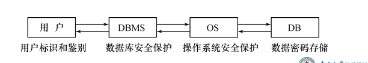
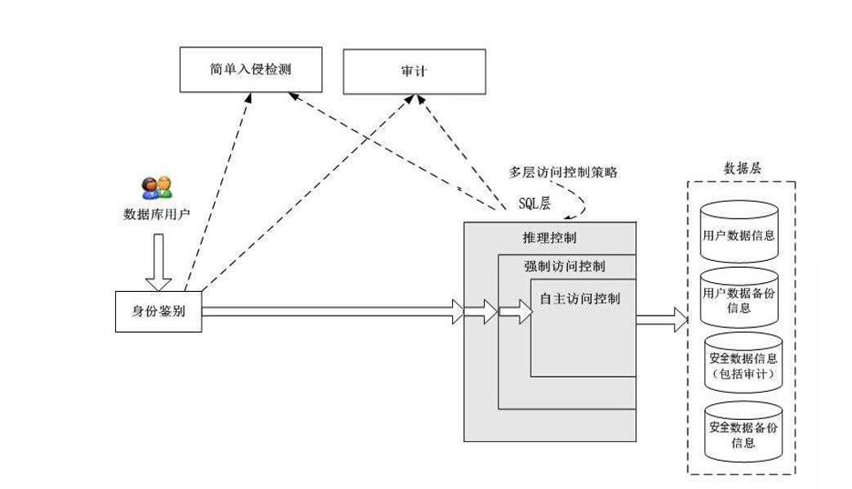
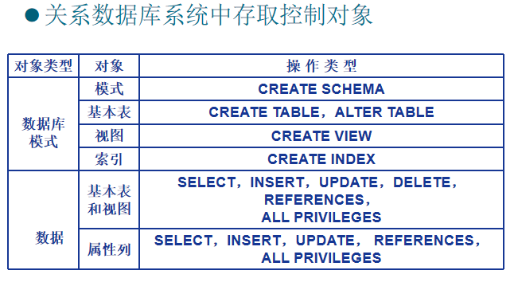
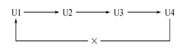
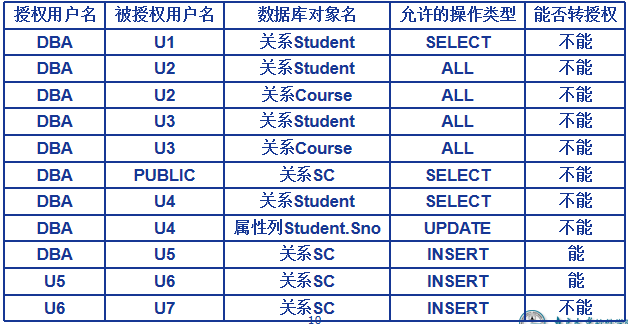
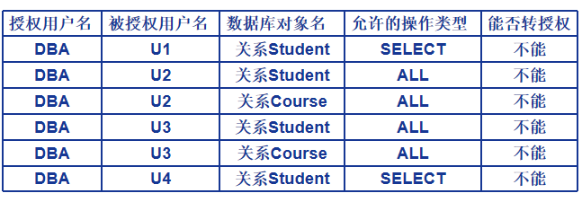

# 一 数据库安全性

- 问题的提出
  - 数据库的一大特点是数据可以共享
  - 数据共享必然带来数据库的安全性问题
  - 数据库系统中的数据共享不能是无条件的共享
    - 军事秘密、国家机密、新产品实验数据、市场需求分析、市场营销策略、销售计划、客户档案、医疗档案、银行储蓄数据
- 数据库的安全性是指保护数据库以防止不合法使用所造成的数据泄露、更改或破坏 。
- 系统安全保护措施是否有效是数据库系统主要的性能指标之一。

## 数据库的不安全因素

- 非授权用户对数据库的恶意存取和破坏
  - 一些黑客（Hacker）和犯罪分子在用户存取数据库时猎取用户	名和用户口令，然后假冒合法用户偷取、修改甚至破坏用户数据。
  - 数据库管理系统提供的安全措施主要包括用户身份鉴别、存取控制和视图等技术。
- 数据库中重要或敏感的数据被泄露
  - 黑客和敌对分子千方百计盗窃数据库中的重要数据，一些机密信息被暴露。
  - 数据库管理系统提供的主要技术有强制存取控制、数据加密存储和加密传输等。
  - 审计日志分析
- 安全环境的脆弱性
  - 数据库的安全性与计算机系统的安全性紧密联系
    - 计算机硬件、操作系统、网络系统等的安全性
  - 建立一套可信（Trusted）计算机系统的概念和标准

## 安全级别划分

## 计算机系统的安全模型

- 计算机系统中，安全措施是一级一级层层设置
- 系统根据用户标识鉴定用户身份，合法用户才准许进入计算机系统
- 数据库管理系统还要进行存取控制，只允许用户执行合法操作 
- 操作系统有自己的保护措施 
- 数据以密码形式存储到数据库中

- 自主访问控制：有权限的人可以吧这个权限给其他人，类似于
- 强制访问控制：？？
- 推理控制：避免能够通过现有数据推理出不能获得的数据
- 审计：会留存用户的访问记录，以便于事后追责
- 

# 二 存取控制

## 1. 存取控制机制组成

- 存取控制机制组成
  - 定义用户权限，并将用户权限登记到数据字典中
    - 用户对某一数据对象的操作权力称为权限 
    - DBMS提供适当的语言来定义用户权限，存放在数据字典中，称做安全规则或授权规则 
  - 合法权限检查 
    - 用户发出存取数据库操作请求
    - DBMS查找数据字典，进行合法权限检查
- **用户权限定义和合法权检查机制**一起**组成**了数据库管理系统的**存取控制子系统**

## 2. 自主存取控制

- 自主存取控制（Discretionary Access Control ，简称DAC）
  -  C2级
  - 用户对不同的数据对象有不同的存取权限
  - 不同的用户对同一对象也有不同的权限
  - 用户还可将其拥有的存取权限转授给其他用户

### 自主存取控制方法

- 通过 SQL 的GRANT 语句和REVOKE 语句实现

- 用户权限组成

  - 数据库对象

    

  - 操作类型

    - 能够对数据进行增删改查之类

- 定义存取权限称为授权 

  - 定义用户存取权限：定义用户可以在哪些数据库对象上进行哪些类型的操作

## 3. SQL中的授权机制

- 数据库管理员：
  - 拥有所有对象的所有权限
  - 根据实际情况不同的权限授予不同的用户
- 用户：
  - 拥有自己建立的对象的全部的操作权限
  - 可以使用GRANT，把权限授予其他用户
- 被授权的用户
  - 如果具有“继续授权”的许可，可以把获得的权限再授予其他用户
- 所有授予出去的权力在必要时又都可用REVOKE语句收回

### GRANT

- GRANT语句的一般格式：
         GRANT <权限>[,<权限>]... 
         ON <对象类型> <对象名>[,<对象类型> <对象名>]…
         TO <用户>[,<用户>]...
         [WITH GRANT OPTION];

- 语义：将对指定操作对象的指定操作权限授予指定的用户 

- 发出GRANT：

  - 数据库管理员
  - 数据库对象创建者（即属主Owner）
  - 拥有该权限的用户

- 按受权限的用户 

  - 一个或多个具体用户
  - PUBLIC（即全体用户） 

- WITH GRANT OPTION子句:

  - 指定：可以再授予
  - 没有指定：不能传播

- 不允许循环授权

  

- [例4.1] 把查询Student表权限授给用户U1
  GRANT   SELECT 
  ON   TABLE   Student 
  TO   U1;

- [例4.2] 把对Student表和Course表的全部权限授予用户U2和U3
  GRANT ALL PRIVILIGES 
  ON TABLE Student,Course 
  TO U2,U3;

- [例4.3] 把对表SC的查询权限授予所有用户
  GRANT SELECT 
  ON TABLE SC 
  TO PUBLIC;

- [例4.4] 把查询Student表和修改学生学号的权限授给用户U4
  GRANT UPDATE(Sno), SELECT 
  ON TABLE Student 
  TO U4;

  - 对属性列的授权时必须明确指出相应属性列名 

- [例4.5] 把对表SC的INSERT权限授予U5用户，并允许他再将此权限授予其他用户
  GRANT INSERT 
  ON TABLE SC 
  TO U5
  WITH GRANT OPTION;

  - 执行例4.5后，U5不仅拥有了对表SC的INSERT权限，还可以传播此权限：

- [例4.6] GRANT INSERT 
  ON TABLE SC 
  TO U6
  WITH GRANT OPTION;

- [例4.7]同样，U6还可以将此权限授予U7， 但U7不能再传播此权限。
  GRANT INSERT 
  ON TABLE SC 
  TO U7;

- 执行结果

### REVOKE

- 授予的权限可以由数据库管理员或其他授权者用REVOKE语句收回

- REVOKE语句的一般格式为：

     REVOKE <权限>[,<权限>]... 

     ON <对象类型> <对象名>[,<对象类型><对象名>]…

     FROM <用户>[,<用户>]...[CASCADE | RESTRICT];

- [例4.8] 把用户U4修改学生学号的权限收回
  	REVOKE UPDATE(Sno)
  	ON TABLE Student 
  	FROM U4;

- [例4.9] 收回所有用户对表SC的查询权限
  	REVOKE SELECT 
  	ON TABLE SC 
  	FROM PUBLIC;

- [例4.10] 把用户U5对SC表的INSERT权限收回
  	REVOKE INSERT 
  	ON TABLE SC 
  	FROM U5 *CASCADE* ;

  - 将用户U5的INSERT权限收回的时候使用CASCADE，则同时收回U6或U7的INSERT权限，否则拒绝执行该语句 
  - 如果U6或U7还从其他用户处获得对SC表的INSERT权限，则他们仍具有此权限，系统只收回直接或间接从U5处获得的权限 

- 执行结果	

### 创建用户

模式：数据库，模式，基本表，视图等等

- 数据库管理员在创建用户时实现
  CREATE USER语句格式
  CREATE  USER  <username> 
  \[WITH] [DBA|RESOURCE|CONNECT];
- 注： CREATE USER不是SQL标准，各个系统的实现相差甚远
- 只有系统的超级用户才有权创建一个新的数据库用户
- 新创建的数据库用户有三种权限：CONNECT、RESOURCE和DBA
  - 如没有指定创建的新用户的权限，默认该用户拥有CONNECT权限。拥有CONNECT权限的用户不能创建新用户，不能创建模式，也不能创建基本表，只能登录数据库
  - 拥有RESOURCE权限的用户能创建基本表和视图，成为所创建对象的属主。但不能创建模式，不能创建新的用户
  - 拥有DBA权限的用户是系统中的超级用户，可以创建新的用户、创建模式、创建基本表和视图等；DBA拥有对所有数据库对象的存取权限，还可以把这些权限授予一般用户

### 数据库角色

- 数据库角色：被命名的一组与数据库操作相关的权限
  - **角色是权限的集合** 
  - 可以为一组具有相同权限的用户创建一个角色
    - 相当于直接把这个角色给需要的用户
  - 简化授权的过程
- 角色的创建
  CREATE  ROLE  <角色名> 
- 给角色授权 
   GRANT  <权限>[,<权限>]… 
   ON <对象类型>对象名  
   TO <角色>[,<角色>]…
- 将一个角色授予其他的角色或用户
  GRANT  <角色1>[,<角色2>]…
  TO  <角色3>[,<用户1>]… 
  [WITH ADMIN OPTION]
  - 该语句把角色授予某用户，或授予另一个角色
  - 授予者是角色的创建者或拥有在这个角色上的ADMIN OPTION
  - 指定了WITH ADMIN OPTION则获得某种权限的角色或用户还可以把这种权限授予其他角色
- 一个角色的权限：直接授予这个角色的全部权限加上其他角色授予这个角色的全部权限
- 用户可以回收角色的权限，从而修改角色拥有的权限
- REVOKE执行者是
  - 角色的创建者
  - 拥有在这个（些）角色上的ADMIN OPTION

#### 例子

- [例4.11] 通过角色来实现将一组权限授予一个用户。步骤如下：
  首先创建一个角色 R1
      	  CREATE  ROLE  R1;
- 然后使用GRANT语句，使角色R1拥有Student表的SELECT、UPDATE、INSERT权限
         	GRANT SELECT, UPDATE, INSERT 
            	 ON TABLE Student 
            	 TO R1;
- 将这个角色授予王平，张明，赵玲。使他们具有角色R1所包含的全部权限
      	 GRANT  R1 
            	 TO 王平,张明,赵玲;
- 可以一次性通过R1来回收王平的这3个权限
       	  REVOKE  R1 
              	  FROM 王平;

- [例4.12] 角色的权限修改
          GRANT DELETE 
          ON TABLE Student
          TO R1;
  - 使角色R1在原来的基础上增加了Student表的DELETE 权限
  - 原来有R1角色的用户也会同时增加DELETE权限

- [例4.13] 使R1减少了SELECT权限　
     	 REVOKE SELECT 
          ON TABLE Student
          FROM  R1；

### 自主存取控制优缺点

- 可能存在数据的“无意泄露”
  - 原因：这种机制仅仅通过对数据的存取权限来进行安全控制，而数据本身并无安全性标记
  - 解决：对系统控制下的所有主客体实施强制存取控制策略

## 4. 强制存取控制

- 强制存取控制（Mandatory Access Control，简称 MAC）
  - B1级，保证更高程度的安全性
  - 每一个数据对象被标以一定的密级
  - 每一个用户也被授予某一个级别的许可证
  - 对于任意一个对象，只有具有合法许可证的用户才可以存取
  - 用户不能直接感知或进行控制
  - 适用于对数据有严格而固定密级分类的部门
    -  军事部门
    -  政府部门

### 强制存取控制方法

#### 实体

- 在强制存取控制中，数据库管理系统所管理的全部实体被分为主体和客体两大类
  - 主体是系统中的活动实体
    -  数据库管理系统所管理的实际用户
    -  代表用户的各进程
  - 客体是系统中的被动实体，受主体操纵
    -  文件、基本表、索引、视图

#### 敏感度标记

- 对于主体和客体，DBMS为它们每个实例（值）指派一个敏感度标记（Label）
-  敏感度标记分成若干级别
  - 绝密（Top Secret，TS）
  - 机密（Secret，S）
  - 可信（Confidential，C）
  - 公开（Public，P）
  - TS>=S>=C>=P
- 主体的敏感度标记称为许可证级别（Clearance Level）
- 客体的敏感度标记称为密级（Classification Level）
- 许可证级别和密级不可更改？（不确定）

#### 强制存取控制规则

-  强制存取控制规则
  - 仅当主体的许可证级别大于或等于客体的密级时，该主体才能读取相应的客体
  - 仅当主体的许可证级别小于或等于客体的密级时，该主体才能写相应的客体
    - 避免高级别的主体写出低密级的数据从而被低级别的主体看到，从而避免主观失误
    - 也避免高级别主体主观修改低级别主体数据
- 强制存取控制（MAC）是对数据本身进行密级标记，无论数据如何复制，标记与数据是一个不可分的整体，只有符合密级标记要求的用户才可以操纵数据。**数据由相应主体发出来的瞬间，它的密级就已经确定不可更改了**。

### DAC + MAC

- 实现强制存取控制时要首先实现自主存取控制
  - 原因：较高安全性级别提供的安全保护要包含较低级别的所有保护
- 自主存取控制与强制存取控制共同构成数据库管理系统的安全机制，先进行自主存取控制检查，通过自主存取控制检查的数据对象再由系统进行强制存取控制检查，只有通过强制存取控制检查的数据对象方可存取。

# 三 视图机制、审计、数据加密及其他

## 1. 视图机制

- 把要保密的数据对无权存取这些数据的用户隐藏起来，对数据提供一定程度的安全保护 
- 间接地实现支持存取谓词的用户权限定义

- [例4.14] 建立计算机系学生的视图，把对该视图的SELECT权限授于王平，把该视图上的所有操作权限授于张明 

- 先建立计算机系学生的视图CS_Student
  CREATE VIEW CS_Student
  AS 
  SELECT  *
  FROM   Student
  WHERE  Sdept='CS';

- 在视图上进一步定义存取权限
       GRANT  SELECT
       ON  CS_Student  
       TO 王平;

  ​     GRANT ALL PRIVILIGES
  ​     ON  CS_Student  
  ​     TO  张明;

## 2. 审计

- 审计
  - 启用一个专用的审计日志（Audit Log）将用户对数据库的所有操作记录在上面
  - 审计员利用审计日志监控数据库中的各种行为，找出非法存取数据的人、时间和内容
  - C2以上安全级别的DBMS必须具有审计功能
- 审计功能的可选性
  - 审计很费时间和空间
  - DBA可以根据应用对安全性的要求，灵活地打开或关闭审计功能
  - 审计功能主要用于安全性要求较高的部门

### 审计事件

### 审计功能

### 审计级别

- 用户级审计
  - 任何用户可设置的审计
  - 主要是用户针对自己创建的数据库表和视图进行审计
- 系统级审计
  - 只能由数据库管理员设置
  - 监测成功或失败的登录要求、监测授权和收回操作以及其他数据库级权限下的操作

### 审计语句

## 3. 数据加密

- 数据加密
  - 防止数据库中数据在存储和传输中失密的有效手段
- 加密的基本思想
  - 根据一定的算法将原始数据—明文（Plain text）变换为不可直接识别的格式­—密文（Cipher text）
- 加密方法
  - 存储加密
  - 传输加密

### 存储加密

- 透明存储加密
  - 内核级加密保护方式，对用户完全透明
  - 将数据在写到磁盘时对数据进行加密，授权用户读取数据时再对其进行解密
  - 数据库的应用程序不需要做任何修改，只需在创建表语句中说明需加密的字段即可
  - 内核级加密方法: **性能较好，安全完备性较高，但是资源消耗较大**
- 非透明存储加密
  - 通过多个加密函数实现

### 传输加密

- 链路加密
  - 在链路层进行加密
  - 传输信息由报头和报文两部分组成
  - 报文和报头均加密
- 端到端加密
  - 在发送端加密，接收端解密
  - 只加密报文不加密报头
  - 所需密码设备数量相对较少，容易被非法监听者发现并从中获取敏感信息

## 4. 其他安全性防护

- 推理控制
  - 避免用户利用能够访问的数据**推知**更高密级的数据
- 隐蔽信道
  - 间接数据传递
- 数据隐私保护
  - 描述个人控制其不愿他人知道或他人不便知道的个人数据的能力
  - 范围很广：数据收集、数据存储、数据处理和数据发布等各个阶段