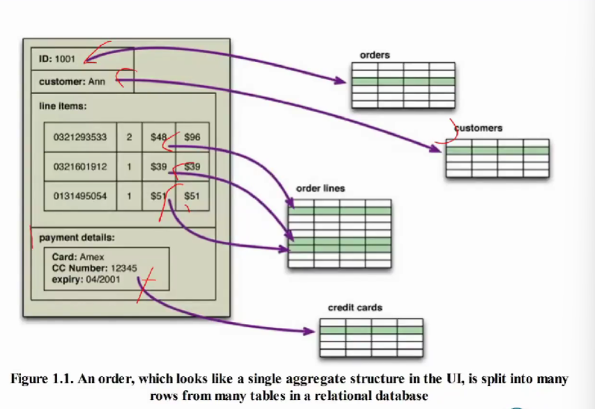

需要知道关系型数据库和非关系型数据库的区别，各自优势与特征等

# 一 关系型数据库的价值

关系型数据库目前都是第一挑选，其占头位，其有价值

## 1. 获取持久化数据

- 持久存储大量数据
- 在大多数的计算架构中，有两个存储区域: 
  - 速度快但是数据易丢失的“主存储器”(main memory)
    - 空间有限
    - 易挥发
  - 存储量大但速度较慢的“后备存储器”(backing store)
    - 文件系统，如许多生产力应用程序(productivity application，比如文字处理软件) 
    - 数据库，大多数企业级应用程序

## 2. 能够实现并发

- 多个用户会一起访问同一份数据体，并且可能要修改这份数据。（大多数情况下，他们都在不同数据区域内各自操作，但是，偶尔也会同时操作一小块数据）
- 关系型数据库提供了 “事务”机制来控制对其数据的访问，以便处理此问题。
- 事务在处理错误时也有用。通过事务更改数据时，如果在处理变更的过程中出错了，那么就可以回滚（roll back）这一事务，以保证数据不受破坏。

## 3. 集成

将多个应用程序的数据保存在同一个数据库中，进行集成

- 企业级应用程序居于一个丰富的生态系统中，它需要与其他应用程序协同工作。不同的应用程序经常要使用同一份数据，而且某个应用程序更新完数据之后，必须让其他应用程序知道这份数据已经改变了。
- 常用的办法是使用**共享数据库集成**(shared database integration) ，**多个应用程序都将数据保存在同一个数据库中**。这样一来，所有应用程序很容易就能使用彼此的数据了。
- 与多用户访问单一应用程序时一样，数据库的并发控制机制也可以应对多个应用程序。

## 4. 近乎标准的模型

- 关系型数据库以近乎标准的方式提供了数据模型。
- 尽管各种关系型数据库之间仍有差异，但其核心机制相同
  - 不同厂商的SQL方言相似
  - “事务” 的操作方式也几乎一样、
  - 移植性好！！！

# 二 NoSQL的由来

相当于是关系型数据库暴露的问题

## 1. 关系型数据库的问题：阻抗失谐

### 1.1 问题描述

- 基于关系代数(relational algebra)，关系模型把数据组织成 “关系”(relation)和“元组”(tuple)。
  - 元组是由“键值对”(name-value pair)构成的集合
  - 而关系则是元组的集合。
  - SQL操作所使用及返回的数据都是“关系”
- 元组不能包含“嵌套记录”(nested record)或“列表”(list) 等任何结构
- 而内存中的数据结构则无此限制，它可以使用的数据组织形式比“关系”更丰富。
- 关系模型和内存中的数据结构之间存在差异。这种现象通常称为“阻抗失谐”。
- 如果在内存中使用了较为丰富的数据结构，那么要把它保存到磁盘之前，必须先将其转换成“关系形式。于是就发生了“阻抗失谐”：需要在两种不同的表示形式之间转译

- 左边的是内存中的结构(允许嵌套)，右边是数据库中的结构(不允许嵌套)，二者之间的转化需要**代价**
- 比如需要使用ER来表示一棵树，效率会非常低下

### 1.2 解决办法

- 面向对象数据库
- “对象-关系映射框架”( object-relational mapping framework) 通过映射模式( mapping pattern)表达转换
- 问题：
  - 查询性能问题
  - 集成问题

## 2. 集成与应用程序数据库

### 2.1 集成数据库

相当于是多个应用程序共享一个数据库，目前关系数据库是最好的解决方案

- SQL充当了应用程序之间的一种集成机制。数据库在这种情况下成了“集成数据库”(integration database)
  - 通常由不同团队所开发的多个应用程序，将其数据存储在一个公用的数据库中。
  - 所有应用程序都在操作内容一致的持久数据，提高了数据通信的效率
  - 为了能将很多应用程序集成起来，数据库的结构比单个应用程序所要用到的结构复杂得多
  - 如果某个应用程序想要修改存储的数据，那么它就得和所有使用此数据库的其他应用程序相协调。
  - 各种应用程序的结构和性能要求不尽相同，数据库通常不能任由应用程序更新其数据。为了保持数据库的完整性，我们需要将这一责任交由数据库自身负责。

### 2.2 应用程序数据库

相当于是一个应用程序独占数据库，其他应用程序想要获取数据都得通过它才能获取

- 将数据库视为“应用程序数据库”(application database)， 其内容只能由一个应用程序的代码库直接访问
  - 由于只有开发应用程序的团队才需要知道其结构，模式的维护与更新就更容易了。由于应用程序开发团队同时管理数据库和应用程序代码，因此可以把维护数据库完整性的工作放在应用程序代码中。
- 交互工作转交由应用程序接口来完成
  - “面向服务架构” 、Web服务。使得应用程序间通过平台中立的方式完成集成。
  - 在Web服务作为集成机制后，所交换的数据可以拥有更为灵活的结构
    - 如XML、 JSON格式，它们均能够使用嵌套记录及列表等更丰富的数据结构
    - 使用“面向文档”的交互方式，减少通讯次数和开销
    - 既可以传输文本，也可以传输二进制
- 在使用应用程序数据库后，由于内部数据库与外部通信服务之间已经解耦，**所以外界并不关心数据如何存储，这样就可以选用非关系型数据库了**
  - 关系型数据库的许多特性，诸如安全性等，可以交给使用该数据库的外围应用程序(enclosing application)来做

## 3. 集群问题

- 纵向扩展(scale up)及横向扩展(scale out)
  - 采用集群应对横向扩展
- 关系型数据库的“分片”和“复制”
  - 在负载分散的同时，应用程序必须控制所有分片，需要知道数据库中的每份小数据的存储情况
  - 如何确保跨分片的查询、参照完整性(referential integrity)、 事务、一致性控制(consistency control)等操作

## 4. NoSQL

- NoSQL没有规范的定义
  - “开源分布式的非关系型数据库”
- 各种NoSQL数据库的共同特性是
  - 不使用关系模型
  - 在集群中运行良好
    - 关系型数据库使用ACID事务来保持整个数据库的一致性，而这种方式本身与集群环境相冲突
    - NoSQL数据库为处理并发及分布问题提供了众多选项。
- 开源
- 适用于21世纪的互联网公司
- 无模式
  - 不用事先修改结构定义，即可自由添加字段了
  - 这在处理不规则数据和自定义字段时非常有用

# 三 聚合

大量数据库是可以直接共给单个应用，集成问题可以通过软件解决，因此可以采用非关系型数据库。
因此对于只供给单个应用的数据库，可以采用关系型数据库，也可以不用，自己设计数据库来进行使用
粗略理解，聚合就是不再使用砖来盖房子从而形成小区(类似于关系型数据库)，而是直接把一栋栋房子组合成小区

## 1. 聚合概念

### 1.1 聚合相关概念

- **把一组相互关联的对象视为一个整体单元进行操作，这个单元就叫聚合**
  - 通过原子操作**更新聚合的值**（含一致性管理）
  - 以聚合为单位**与数据存储通信**（不考虑聚合的内部结构）
  - 在集群中操作数据库时，以聚合为单位来复制和分片
    - 聚合是没有标准的，一个应用中使用的聚合在另外一个应用中可能不成立
  - 由于程序员经常通过聚合结构来操作数据，故而采用聚合也能够让其工作更轻松（想放什么数据结构就放什么，解决阻抗失谐）
- 面向聚合操作数据时所用的单元，其所用的结构比元组复杂得多
  - “键值数据库”、“文档数据库”、“列族数据库”

### 1.2 “聚合无知”

聚合无知是关系型模型中的一种概念

- 关系型数据库的数据模型中，没有“聚合”这一概念，因此我们称之为“聚合无知”(aggregate- ignorant)。 

  - “图数据库"也是聚合无知的。

- 聚合反应数据操作的边界，很难在共享数据的多个场景中“正确” 划分，对某些数据交互有用的聚合结构，可能会阻碍另一些数据交互

  - 在客户下单并核查订单，以及零售商处理订单时，将订单视为一个聚合结构就比较合适。
  - 如零售商要分析过去几个月的产品销售情况，那么把订单做成一个聚合结构反而麻烦了。要取得商品销售记录，就必须深挖数据库中的每一个聚合。

- 若是采用“聚合无知模型”，那么很容易就能以不同方式来查看数据

  - 在操作数据时，如果没有一种占主导地位的结构，那么选用此模型效果会更好。

  > 当数据被利用的方式超过一种的时候，聚合无知的方式是更加方便的，因为聚合无知，所以数据可以被组成不同类型的数据结构从而被不同方式查看与使用
  >
  > 如果存在聚合，它可能在面对数据结构相符的应用时会高效，但是在需要数据结构不同的时候需要先拆分成基本单元再进行组合，更低效

## 2. 关系模型VS聚合模型

### 2.1 关系模型

模型：

实例

### 3.2 聚合数据模型

#### 两个聚合的数据模型

模型

实例

#### 一个聚合的数据模型

模型

实例

## 3. 聚合之间的关系

非关系型数据库适用情况：有明确的聚合的概念，聚合关系的维护交给应用

- 例如：把订单和客户放在两个聚合中，但是想在它们之间设定某种关系，以便能根据订单查出客户数据。

  - 要提供这种关联，最简单的办法就是把客户ID嵌入订单的聚合数据中。在应用层级提供关联。
  - 在数据库层级提供聚合之间关系的表达机制
- 操作多个有关联的聚合，由应用保证其正确性
  - 面向聚合数据库获取数据时以聚合为单元，只能保证单一聚合内部内容的原子性。

## 4. 聚合、集群和事务处理

- 在集群上运行时，需要把采集数据时所需的节点数降至最小
  - 如果在数据库中明确包含聚合结构，那么它就可以根据这一重要信息，知道哪些数据需要一起操作了，而且这些数据应该放在同一个节点中
- 通常情况下，面向聚合的数据库不支持跨越多个聚合的ACID事务。它每次只能在一个聚合结构上执行原子操作。
  - 如果想以原子方式操作多个聚合，那么就必须自己组织应用程序的代码	
  - 在实际应用中，大多数原子操作都可以局限于某个聚合结构内部，而且，在将数据划分为聚合时，这也是要考虑的因素之一

# 四 主要的NoSQL数据模型

## 1. 键值数据模型和文档数据模型

- 这两类数据库都包含大量聚合，每个聚合中都有一个获取数据所用的键或ID。
- 两种模型的区别是:
  - 键值数据库的聚合不透明，只包含一些没有太多意义的**大块信息**
    - 聚合中可以存储任意数据。数据库可能会限制聚合的总大小，但除此之外，其他方面都很随意
    - 在键值数据库中，要访问聚合内容，只能通过键来查找（**键对应的值全部都得拿出来**）
  - 在文档数据库的聚合中，可以看到其结构。（**文档也是键值对**的形式，不过它的值是有结构的，因此可以取特定的值）
    - 限制其中存放的内容，它定义了其允许的结构与数据类型
    - 能够更加灵活地访问数据。通过用聚合中的字段查询，**可以只获取一部分聚合，而不用获取全部内容**（相当于键对应的值可以只拿一部分，而不用全部）
    - 可以按照聚合内容创建索引

## 2. 列族存储

### 2.1 概念

- 大部分数据库都以行为单元存储数据。然而，有些情况下写入操作执行得很少，但是经常**需要一次读取若干行中的很多列**。此时，列存储数据库**将所有行的某一组列作为基本数据存储单元**
- 列族数据库将列组织为列族。每一列都必须是某个列族的一部分，而且访问数据的单元也得是列
  - 某个列族中的数据经常需要一起访问。
- 列族模型将其视为两级聚合结构(two-level aggregate structure)。
  - 与“键值存储”相同，第一个键通常代表行标识符，可以用它来获取想要的聚合。
  - 列族结构与“键值存储”的区别在于，其“行聚合”(row aggregate)本身又是一个映射，其中包含一些更为详细的值。这些“二级值” (second-level value)就叫做“列”。与整体访问某行数据一样，我们也可以操作特定的列。

### 2.2 例子

- 列族存储相当于是有两个key，一个是rowKey，一个是column family
  - row key用于确定行，是哪一行的数据，我们可以直接通过行标识符得到其对应的值，即右边的所有数据，这个数据是黑盒的，只有存放数据的应用知道它的结构能够对应的访问
  - 再通过rowKey得到对应的值后，也可以通过column value得到对应的值，这个类似于文档数据模型
  - 这边也可以通过column family得到一组列的数据，这就是列祖存储的作用

### 2.3 两种数据组织方式

- 面向行( row-oriented)：每一行都是一个聚合(例如ID为1234的顾客就是一个聚合)，该聚合内部存有一些包含有用数据块(客户信息、订单记录)的列族
- 面向列(column-oriented): 每个列族都定义了一种记录类型(例如客户信息)，其中每行都表示一条记录。数据库中的大“行”理解为列族中每一个短行记录的串接

### 2.4 面向聚合的数据模型

- 共同点
  - 都使用聚合这一概念，而且聚合中都有一个可以查找其内容的索引键。
  - 在集群上运行时，聚合是中心环节，因为数据库必须保证将聚合内的数据存放在同一个节点上。
  - 聚合是“更新”操作的最小数据单位(atomic unit)，对事务控制来说，以聚合为操作单元
- 差别
  - 键值数据模型将聚合看作不透明的整体，只能根据键来查出整个聚合，而不能仅仅查询或获取其中的一部分
  - 文档模型的聚合对数据库透明，于是就可以只查询并获取其中一部分数据了，不过，由于文档没有模式，因此在想优化存储并获取聚合中的部分内容时，数据库不太好调整文档结构
  - 列族模型把聚合分为列族，让数据库将其视为行聚合内的一个数据单元。此类聚合的结构有某种限制，但是数据库可利用此种结构的优点来提高其易访问性。

## 3. 图结构

- 图数据库的基本数据模型：由边(或称“弧”，arc)连接而成的若干节点。
- 可以用专门为“图”而设计的查询操作来搜寻图数据库的网络了
  - 指定节点，通过边进行查询
- 关系型数据可以通过“外键”实现，查询中的多次连接，效率较差

## 4. 无模式

### 4.1 概念

- 关系型数据库中，首先必须定义“模式”，然后才能存放数据。
  - 先有形才有值，得先确定值的名字类型等性质，才能放入值
- NoSQL数据库是无模式的：
  - “键值数据库”可以把任何数据存放在一个“键”的名下。
  - “文档数据库” 对所存储的文档结构没有限制
  - 在列族数据库中，任意列里面都可以随意存放数据
    - 实际上就是存在二重的key，并且第二重的key可能会相互关联
  - 图数据库中可以新增边，也可以随意向节点和边中添加属性。

### 4.2 格式不一致的数据

- 每条记录都拥有不同字段集(set of field) 
- 关系型数据库中，“模式”会将表内每一行的数据类型强行统一，若不同行所存放的数据类型不同，那这么做就很别扭。
  - 要么得分别用很多列来存放这些数据，而且把用不到的字段值填成null(这就成了“稀疏表”，sparse table)，
  - 要么就要使用类似custom column 4这样没有意义的列类型。
- 无模式表则没有这么麻烦，每条记录只要包含其需要的数据即可，不用再担心上面的问题了。
  - NoSql放数据的应用也是拿数据的应用，即数据的生产者和消费者是同一个人，相当于没有数据共享问题，所以说应用知道自己存放的数据的结构，进而进行使用

### 4.3 无模式的问题

- 存在“隐含模式”。在编写数据操作代码时，对数据结构所做的一系列假设
  - 应用与数据的耦合问题
    - 这是必然的！！！！
  - 无法在数据库层级优化和验证数据
    - 需要再应用层面进行，程序员自己做
- 在集成数据库中，很难解决
  - 使用应用程序数据库，并使用Web Services、SOA等完成集成
  - 在聚合中为不同应用程序明确划分出不同区域（利用冗余）
    - 在文档数据库中，可以把文档分成不同的区段(section) 
    - 在列族数据库，可以把不同的列族分给不同的应用程序
    - 但是这样会导致空间浪费

# 五 分布式模型

中心化 往 去中心化，关系型数据关键想法是：不需要知道底层细节，关系型数据库的管理系统能够帮助实现底层数据的存放与读取，其倾向于将所有的数据节点当作单一节点，只需要根据接口规范进行操作，就可以对相同的数据库进行操作，实现共享，并且保证不出错以及并发回滚等保证正确性的实现

- 优点：
  - 完全解耦，和当前应用没有直接关联。
  - 按照接口规范进行操作，能够实现共享
- 缺点：
  - 关系型数据模型是一个折中的方案，它将数据拆到最散以实现共享，这也导致了其无法针对应用做出优化
    - 因此可能导致阻抗失谐
- NoSql：为了解决Mysql的缺点而出现，不共享，不集成，每个应用都有自己独有“聚合”(基本单位)，定制和当前应用有关的物理分布，能够操作底层的实现方案
- 优先选择关系型数据库（因为其不需要自己设计底层实现），当关系型数据库无法实现的时候再选用非关系型数据库，下面就讲的是Nosql的底层实现
- 关系型数据库中只有一格节点（因为需要共享），非关系型数据库可以有多个节点

## 1. 数据分布

- 数据分布有两条路径：分片与复制
  - 分片：将**不同数据**存放再不同节点中
  - 复制：将**同一份数据**拷贝至多个节点
    - 主从式和对等式
  - 既可以在两者中选一个来用，也可以同时使用它们，各有各的作用

### 2.1 分片

#### 分片概念

- 一般来说，数据据库的繁忙体现在：不同用户需要访问[数据集]中的**不同部分**

- 在这种情况下，把数据的各个部分放在不同的服务器中，以实现横向扩展，该技术就叫**分片**

  - 相当于是把同一份数据给拆开，如果有同时有对数据不同部分的访问需要，则可以同时进行

  

#### 分片原则

- 在理想情况下，不同的服务器节点会服务于不同的用户。每位用户只需与一台服务器通信，并且很快就能获得服务器的响应。网络负载相当均衡地分布于各台服务器上。
- 为达成目标，必须保证需要**同时访问的那些数据**都**存放在同一节点**上，而且节点必须排布好这些数据块，使访问速度最优。
  - 若使用面向聚合的数据库，可以把**聚合**作为**分布数据的单元**。
  - 在节点的数据排布问题上，有若干个与性能改善相关的因素。
    - 地理因素
    - 负载均衡：每个节点的数据量与访问量均衡
    - 聚合有序放置

#### 分片方式

- 采用应用程序的逻辑实现分片
  - 应用决定数据怎么放，放在哪，比如按照性别进行分片，男放服务器1，女放服务器2，等等
  - 编程模型复杂化，因为应用程序的代码必须负责把查询操作分布到多个分片上
  - 若想重新调整分片，那么既要修改程序代码，又要迁移数据
    - 程序和数据节点的耦合度高
  - 优点：应用程序权限高，可自定义使得效率最大化
- 采用NoSQL数据库提供的“自动分片”(auto-sharding)功能
  - 让数据库自己负责把数据分布到各分片
  - 并且将数据访问请求引导至适当的分片上
  -  不需要自定义，但是效率折中

#### 分片优缺点

- 分片可以同时**提升读取和写入效率**
  - 复制只能提高读取效率，写入效率反而会降低
- 分片对**改善数据库的“故障恢复能力”帮助并不大**。尽管数据分布在不同的节点上，但是和“单一服务器”方案一样，只要某节点出错，那么该分片上的数据就无法访问了
  - 在发生故障时，只有访问此数据的那些用户才会受影响，而其余用户则能正常访问
  - 由于多节点问题，从实际效果出发，分片技术可能会降低数据库的错误恢复能力，并且提高出错的概率！

### 1.2 复制

#### 主从复制

- 在“主从式分布”(master-slave distribution)中
  - 其中有一个节点叫做“主(master) 节点”，或“主要(primary) 节点”。主节点存放权威数据，而且通常负责**处理数据更新操作**。
  - 其余节点都叫“从(slave) 节点”，或“次要(secondary) 节点”，和主节点**保持同步**，负责读取操作 。
- 优点：在需要频繁读取数据集的情况下，“主从复制”(master-slave replication) **有助于提升数据访问性能**
  - 以新增更多从节点的方式来进行**水平扩展**，就可以同时处理更多数据读取请求，并且能保证将所有请求都引导至从节点
    - 分片实际上是**纵向扩展**
  - 在写入操作特别频繁的场合，数据库仍受制于主节点处理更新，以及向从节点发布更新的能力 ,其**写入效率反而会下降**
- 优点：“主从复制” 可以**增强“读取操作的故障恢复能力”**(read resilience)
  - 万一主节点出错了，那么从节点依然可以处理读取请求。
  - **主节点出错之后**，除非将其恢复，或另行指派新的主节点，否则数据库就**无法处理写入操作**。
  - 在主节点出错之后，由于拥有内容与主节点相同的从节点，很快就能指派一个从节点作为新的主节点，从而具备故障恢复能力。
  - 主节点可以手工指派，也可自动选择。 
- 问题：“数据的不一致性”问题如何解决

#### 对等复制

“对等复制” 它没有“主节点”这一概念。所有“副本”(replica) 地位相同，都可以接受写入请求，而且丢失其中一个副本，并不影响整个数据库的访问。

- 每个节点都可以是主节点，都可以执行更新和读写操作
- 一致性要求不高，由其特点决定
  - 没有权威数据备份，数据不一致的时候没有参考对象
  - 会导致写入冲突

### 1.3 分片与复制结合

分片提高效率，复制保证数据稳定性

#### 主从复制 + 分片

- 如果同时使用 主从复制 与 分片，那么就意味着整个系统有多个主节点， 对于每项数据来说，负责它的主节点只有一个（主节点的判断是根据数据来的，只能说是 是某数据的主节点）
- 根据配置需要，同一个节点既可以做某些数据的主节点，也可以充当其他数据的从节点，此外，也可以指派全职的主节点或从节点

#### 对等复制 + 分片

实际上就是先把数据按需分片，在保证每一块数据存放在“复制因子”个数的节点当中，每个节点都是主节点

- 使用列族数据库时，经常会将“对等复制”与“分片”结合起来。
- 数据可能分布于集群中的数十个或数百个节点上。在采用“对等复制”方案时，一开始可以用“3”作为复制因子(replication factor), 也就是把每个分片数据放在3个节点中。一旦某个节点出错，那么它上面保存的那些分片数据会由其他节点重建

## 2. 数据分布模型的一致性

### 2.1 写入冲突和读写冲突

- 当两个客户端试图同时修改一份数据时，会发生“写入冲突”。而当某客户端在另一个客户端执行写入操作的过程中读取数据时，则会发生“读写冲突”。
- **悲观方式**以锁定数据记录来避免冲突
  - “写入锁" (write lock)
  - 资源消耗量大，占用时间长，如果加锁会导致高延迟低效率，有些情况下是完全无法接受的（比如20min买一件衣服，加锁20min是无法接受的）
- **乐观方式**则在事后检测冲突并将其修复
  - “条件更新”( conditional update)，任意客户在执行更新操作之前，都要先测试数据的当前值和其上一次读入的值是否相同
    - 当前事务更新操作发生前，执行其他操作的时候，其他事务更改了对应数据，导致数据和之前读取的时候不同，所以需要在实际执行更新操作前再读一遍进行判断
  - 保存冲突数据 。用户自行“合并”(merge)或 “自动合并”（面向特定领域）
    - 两个事务同时对一个数据做出了不同的修改，则保存冲突的数据(两个)，进行人工合并或者按照规则特定合并
- 无所谓方式：错就错，无所谓

### 2.2 NoSQL中的不一致性

#### 本身特性导致的不一致性

- “图数据库”常常和关系型数据库一样，也支持ACID事务。
- 面向聚合的数据库通常支持“原子更新”( atomic update),但**仅限于单一聚合内部** 
  - “一致性” 可以在某个聚合内部保持，但在各聚合之间则不行
    - 可能是因为聚合没法加锁，如果同时修改两个聚合，会导致其中的数据的不宜自行
  - 在执行影响多个聚合的更新操作时，会留下一段时间空档，让客户端有可能在此刻读出逻辑不一致的数据
    - 因为不加锁，所以可能会导致不一致空挡
    - 存在不一致风险的时间长度就叫“不一致窗口”(inconsistency window)。

#### 复制一致性受威胁

复制一致性”(replication consistency)。要求从不同副本中读取同一个数据项时，所得到的值相同

- 在分布式系统中，如果某些节点收到了更新数据，而另外一些节点却尚未收到，那么这种情况就视为“读写冲突”。
- 若写入操作已经传播至所有节点，则此刻的数据库就具备“**最终一致性**”( eventually consistent)
- 复制不一致性带来的“不一致窗口”，在考虑网络环境后，会比单一节点导致的“不一致窗口”**长的多**
  - 不一致性窗口对应用的影响不同（卖钢笔和提供血液）
  - 越是严格的应用越偏向于关系型数据库（因为其中的并发操作保证了数据的一致性，避免不一致窗口，但低效）

### 2.3 分布式系统中的会话一致性

#### 会话一致性

- “照原样读写出所写内容的一致性”要求：在执行完更新操作之后，要能够立刻看见新的值（可能写入的节点和读的节点不同，导致写入后无法立刻得到更新结果）
- 会话一致性：在用户会话内部保持“照原样读出所写内容的一致性”
- 实现方式
  - 黏性会话：写入和读取操作都安排在同一个节点上
    - 因为用户会话（写入和读取）安排在同一个节点上，自然就可以保证会话一致性
    - 但是会降低“负载均衡器”的效能（因为其无法根据负载调整读取和写入的节点了）
  - 使用“版本戳”(version stamp)，并确保同数据库的每次交互操作中，都包含会话所见的最新版本戳。服务器节点在响应请求之前必须先保证，它所含有的更新数据包含此版本戳。

#### 分布式系统中实现会话一致性

- 方法一：将写入请求先发给从节点，由它负责将其转发至主节点，并同时保持客户端的“会话一致性”。（这个会导致不一致窗口，但是能够保证会话一致性）
- 方法二：在执行写入操作时临时切换到主节点，并且在从节点尚未收到更新数据的这一段时间内，把读取操作都交由主节点来处理。（类似于粘性会话）

## 3. 分布式环境中：放宽‘“一致性”和“持久性”约束

### 3.1 事务的局限性（放宽的需要）

#### 事务达成强一致性

- 使用“事务”达成强一致性
- 引入放松“隔离级别” ( isolation level)的功能，以允许查询操作读取尚未提交的数据。
  - 读未提交，一个事务可以读取另一个未提交事务的数据。脏读
  - 读已提交，一个事务要等另一个事务提交后才能读取数据。不可重复读
  - 可重复读，在开始读取数据（事务开启）时，不再允许修改操作。幻读
  - 可串行化，事务串行化顺序执行。严格一致性，效率是一个问题

#### 事务的问题

- 在并发不大的前提下，是否需要事务
- 在数据较多的情况下，为了让应用性能符合用户要求，它们必须弃用“事务”
  - 尤其在需要引入分片机制时，更是如此
- 在分布式应用中，如事务的业务范围涉及多个以网络连接的参与者。其规模、复杂度和波动性均导致无法使用事务进行良好描述

### 3.2 CAP定理

- CAP定理:给定“一致性”(Consistency)、“可用性”(Availability)、“分区耐受性”( Partition tolerance) 这三个属性，**我们只能同时满足其中两个属性。**
  - C : “一致性”
  - A : “可用性”，如果客户可以同集群中的某个节点通信，那么该节点就必然能够处理读取及写入操作。 
  - P : “分区耐受性” ，如果发生通信故障，导致整个集群被分割成多个无法互相通信的分区时(这种情况也叫“ 脑裂”，split brain)，需要保障两个集群仍然分别可用，就是分区耐受性。
    - 如图，这个网络被分成了两部分，但是需要保证集群仍然可用

#### CA系统

- CA系统：具备“一致性”“可用性”，不具备分区耐受性的系统
  - 大多数关系型数据库都是CA系统
  - 因为关系型数据库一般都是视为整体，如果其中有任何一个分区出问题了，而且大多数关系型数据库都是单点的，也不需要分区耐受性就是了
- CA集群：相当于是有很多节点，每个节点存放数据库局部数据的系统
  - 无法保证“分区耐受性”，一旦“分区”发生(比如上面的断开，或者某个节点坏掉)，所有节点必须停止运作
    - CAP中的，可用性定义为“系统中某个无故障节点所接收的每一条请求， 无论成功或失败，都必将得到响应。”
    - 介于此时所有节点均为故障节点，不违反CAP中的“可用性”

#### CAP系统的现实含义

- 尽管“CAP定理”经常表述为“三个属性中只能保有两个”，实际上当系统可能会遭遇“分区”状况时(比如分布式系统)**“分区耐受性”不可或缺**，需要在“一致性”与“可用性”之间进行权衡。
  - 这并不是个二选一的决定，通常来说，我们都会略微舍弃“一致性”，以获取某种程度的“可用性”
  - 这样的系统，既不具备完美的“一致性”，也不具备完美的“可用性”，两个都需要，但是不完美，但是能够满足需要
    - 因此NoSql中存放的是要求不是非常严格的数据
    - 如果数据必须要保证可用性和一致性，那就不能保证分区耐受性，因此只能使用单点的关系型数据库

#### “可用性”的例子

##### 缺乏“可用性”

- 假设Martin与Pramod都想预订某旅馆的最后一间客房，预订系统使用“对等式分布模型”，它由两个节点组成
  - Martin 使用位于伦敦的节点，而Pramod使用位于孟买的节点。
  - 若要确保一致性，那么当Martin要通过位于伦敦的节点预订房间时，该节点在确认预订操作之前，必须先告知位于孟买的节点。
  - 两个节点必须按照相互一致的顺序来处理它们所收到的操作请求
- 此方案保证了“一致性”，但是假如网络连接发生故障，那么由故障导致的两个“分区”系统，就都无法预订旅馆房间了，于是系统失去了“可用性”。
  - 一致性的前提是需要两个节点收到使用相同资源的请求后需要进行协商再使用，但是如果因为其他原因导致无法协商，没有协商结果，两个节点都无法使用

#### 牺牲“一致性”改善“可用性”

- 指派其中一个节点作为某家旅馆的“主节点”，确保所有预订操作都由“主节点”来处理。
  - 假设位于孟买的节点是“主节点”，那么在两个节点之间的网络连接发生故障之后，它仍然可以处理该旅馆的房间预订工作，这样Pramod将会订到最后一间客房
  - 位于伦敦的用户看到的房间剩余情况会与孟买不一致，但是他们无法预订客房，于是就出现了“更新不一致”现象。
  - Martin可以和位于伦敦的节点通信，但是该节点却无法更新数据。于是出现了“可用性”故障(availability failure)
- 这种在“一致性”与“可用性”之间所做的权衡，上一种是如果二者连接中断，导致二者都无法下单，但是这种情况是Pramod可以正常下单，Martin这边看到剩一间客房(网络中断无法同步)且无法下单(写需要在主节点进行，通信中断从节点无法到主节点进行写操作)，虽然一致性差了些，但是至少最后一间房卖出去了，比上一种好

#### 进一步改善“可用性”的例子

- 让两个“分区”系统都接受客房预订请求，即使在发生网络故障时也如此。
  - 这种方案的风险是，Martin和Pramod有可能都订到了最后一间客房。然而，根据这家旅馆的具体运营情况，这也许不会出问题：
    - 通常来说，旅行公司都允许一定数量的超额预订，这样的话，如果有某些客人预订了房间而最终没有人住，那么就可以把这部分空余房间分给那些超额预订的人了
    - 与之相对，某些旅馆总是会在全部订满的名额之外多留出几间客房，这样万一哪间客房出了问题，或者在房间订满之后又来了一位贵宾，那么旅馆可以把客人安排到预留出来的空房中
    - 还有些旅馆甚至选择在发现预订冲突之后向客户致歉并取消此预订。
    - 总之，因需要确保可用性将房间全部卖完而导致最后的一致性冲突问题的好处来的多，因为后者的一致性冲突问题(如同时订到了最后一间房)是可以通过业务方式解决的
- 该方案所付出的代价，要比因为网络故障而彻底无法预订的代价小。

#### “一致性”例子

##### 一个写入不一致的例子

- 购物车是允许“写入不一致”现象的一个经典示例
  - 即使网络有故障，也总是能够修改购物车中的商品。
  - 这会导致不同节点上的购物车信息不同，从而导致多个购物车出现
  - 而结账过程则会将两个购物车合并，具体做法是，将两个购物车中的每件商品都拿出来，放到另外一个购物车中，并按照新的购物车结账。
  - 这个办法基本上不会出错，万一有问题，客户也有机会在下单之前先检视一下购物车中的东西。

#### BASE

- 与关系型数据库锁支持的ACID事务不同，NoSQL具有 BASE属性
  - ACID是保证事务绝对可用，而BASE属性有三种
    - 基本可用，Basically Available：节点基本可用
    - 柔性状态，Soft state：节点不稳定，可能会宕
    - 最终一致性，Eventual consistency ：最终状态一致
  - “ACID”与“BASE"不是非此即彼的关系，两者之间存在着多个逐渐过渡的权衡方案可选。

#### “一致性”与“延迟”之间的取舍

- 在权衡分布式数据库的“一致性”时，与其考虑如何权衡“一致性”与“**可用性**”，不如思考怎样在“一致性”与“**延迟**”(latency)之间取舍。
  - 可用性和延迟是相关的，可用性越低，延迟越高
    - 实际分布式系统中，是同时利用分片和复制来保证效率即稳定性的
  - 参与交互的节点越多，一致性越好
    - “参与交互”意味着写入操作必须要等参与交互的节点都给出收到的反馈后才能进行，能够保证参与交互的节点中的数据一致，自然参与交互的节点越多，一致性越高
  - 在要求一致性的前提下，每新增一个节点，都会使交互操作的响应时间变长，即延迟变高
    - 越多的节点参与交互，那么系统的一致性就越高
    - 一致性的保证是需要访问其他节点协商修改，节点越多，修改一次数据需要修改的节点越多，全部修改完成之后才能在当前节点响应修改，导致高延迟
  - “可用性”可以视为能够忍受的最大延迟时间，一旦延迟过高，我们就放弃操作，并认为数据不可用
  - 这样一来，就和“CAP定理”对“可用性”所下的定义相当吻合了

### 3.3 持久性的权衡

- 数据库大部分时间都在内存中运行，更新操作也直接写入内存，并且定期将数据变更写回磁盘
  - 可以大大提高响应请求的速度。
  - 代价在于，一旦服务器发生故障，任何尚未写回磁盘的更新数据都将丢失。
- 多用户的“会话状态”信息
  - 会话数据就算丢失，与应用系统效率相比，也不过是个小麻烦。这时可以考虑非持久性写入操作”(nondurable write)。
  - 可以在每次发出请求时，指定该请求所需的持久性。从而，把某些极为重要的更新操作立刻写回磁盘。
- 捕获物理设备的遥测数据(telemetric data)。就算最近的更新数据可能会因为服务器发生故障而丢失，也还是选择把快速捕获数据放在首位。

#### 分布模型中“持久性”的权衡

问题描述

- 如一个节点处理完更新操作之后，在更新数据尚未复制到其他节点之前就出错了，那么则会发生“复制持久性”(replication durability) 故障。
- 假设有一个采用“主从式分布模型”的数据库，在其主节点出错时，它会自动指派一个从节点作为新的主节点。
  - 若主节点发生故障，则所有还未复制到其他副本的写入操作就都将丢失
    - 新产生的主节点会丢失主节点处更新操作
  - 一旦主节点从故障中恢复过来，那么，该节点上的更新数据就会和发生故障这段时间内新产生的那些更新数据相冲突
  - 我们把这视为一个“持久化”问题，因为主节点既然已经接纳了这个更新操作，那么用户自然就会认为该操作已经顺利执行完，但实际上，这份更新数据却因为主节点出错而丢失了

解决方案

- 重新指派新的主节点
  - 在主节点出错之后迅速将其恢复
- 确保主节点在收到某些副本对更新数据的确认之后，再告知用户它已接纳此更新
  - 从节点发生故障时，集群不可用
  - 拖慢更新速度

与处理“持久性”的基本手段类似，也可以针对单个请求来指定其所需的持久性。

## 4. 仲裁

### 4.1 写入仲裁

- **处理请求所的节点越多，避免“不一致”问题的能力就越强**，要想保“强一致性”(strong consistency)， 需要使用多少个节点才行?
- “对等式分布模型”：
  - “写入仲裁”(write quorum)：如果发生两个相互冲突的写入操作，那么只有其中一个操作能为超过半数的节点所认可，W>N/2 。即，参与写入操作的节点数(W)，必须超过副本节点数(N)的一半。副本个数又称为“复制因子”
- “主从式分布模型”
  - 只需要向主节点中写入数据

### 4.2 读取仲裁

- 想要保证能够读到最新数据，必须与多少个节点联系才行?
- “对等式分布模型”：
  - 只有当R+W>N时，才能保证读取操作的“强一致性”。其中，执行读取操作时所需联系的节点数(R)，确认写入操作时所需征询的节点数(W)，以及复制因子(N)
- “主从式分布模型”
  - 只需从主节点中读取数据

### 4.3 复制因子

- 复制因子”( replication factor)。
  - 同一份数据保存的副本数量
  - 一个集群有100 个节点，然而其“复制因子”可能仅仅是3，因为大部分数据都分布在各个"分片”之中。
  - 将“复制因子”设为3，就可以获得足够好的“故障恢复能力”了。
- 如果只有一个节点出错，那么仍然能够满足读取与写入所需的最小法定节点数。
  - 因为N(副本数) = 3，所以写入强一致性和读取强一致性的节点数都为2(>N/2+1)，坏了一个节点刚好剩下两个节点满足要求
- 若是有自动均衡( automatic rebalancing) 机制，那么用不了多久，集群中就会建立起第三个副本，在替代副本建立好之前，再次发生副本故障的概率很小。

### 4.4 实际情况

- 需要在“一致性”与“可用性”之间权衡，参与某个操作的节点数，可能会随着该操作的具体情况而改变。
  - 在写入数据时，根据“一致性”与“可用性”这两个因素的重要程度，有一些更新操作可能需要获得足够的节点支持率才能执行，而另外一些则不需要。
  - 与之相似，某些读取操作可能更看中执行速度，而可以容忍过时数据，此时，它就可以少联系几个节点。
- 通常需要协调考虑读、写两种情况：
  - 假设需要**快速**且具备“强一致性”的**读取操作**，那么写入操作就要得到全部节点的确认才行，这样的话，只需联系一个节点，就能完成读取操作了(N=3，W=3，R=1)
  - 但是，这个方案意味着，写入操作会比较慢，因为它们必须得到全部三个节点确认之后，才能执行，而且此时连一个节点都不能出错。
    - 如果一个节点出错，意味着这个节点无法给出写入的反馈，写入操作就受其限制，直到它修复完成或者采用其他节点做备份才能够完成当前写入操作

## 5. 版本戳

作用

- 拿出来的节点中的数据不同，根据版本戳选择最新版本
- 实际情况下用于处理商业活动(具体原因方式见下)
- 实现数据挥发性数据库

### 5.1 商业活动

- “商业活动”(Business Activity)。
  - 例如，用户浏览产品目录，选中了一瓶价格很实惠的Talisker威士忌，填入信用卡信息，然后确认订单。
- 需要确保最终一致性，但是出于时间、交互的考虑，无法使用事务加以实现
  - 如使用事务实现，必须锁住数据库中各个元素。而长时间锁定元素是不现实的。
    - 比如在确认订单前等待了两小时，如果使用事务实现，意味着要锁住威士忌啤酒数据库两小时，其他用户无法购买，代价过大
  - 因此，应用程序通常只在处理完用户交互操作之后才开始“系统事务”，这样的话，锁定时间就比较短了。
    - 比如在用户点击确认订单并付款之后才通过事务实现
  - 然而当需要计算和决策的时候，数据有可能已经改动了。
    - 价格表上Talisker威士忌的售价也许已经变了，或是某人可能会修改客户的地址，从而导致运费改变
    - 这个通过条件更新和版本戳实现

### 5.2 条件更新和版本戳

- “条件更新”(conditional update)，客户端执行操作时，将重新读取“商业活动”所依赖的信息，并检测**该信息在首次读取之后是否一直没有变动**(根据数据版本戳判断)
  - 若一直未变(版本戳相同)，则将其展示给用户。
  - 若发生改变(版本戳不同)，可以进行其他操作。
- 通过保证数据库中的记录都有某种形式的“版本戳”(version stamp) 实现“乐观离线锁”(Optimistic Offline Lock) 。
  - 版本戳是一个字段，每当记录中的底层数据改变时，其值也随之改变。
  - 读取数据时可以记下版本戳，这样的话，在写入数据之前，就可以先检查一下数据版本是否已经变了。
  - 如果版本戳不同，则可以设置新数据，或者将原数据回滚，或者其他行为都交给程序员决定
- 使用版本戳避免“更新冲突” ，维护“会话一致性”
- “CAS”操作 ( “compare-and-set”操作）
  - 既可以由数据库提供
  - 也可以由开发者负责检测的执行

### 5.3 构建版本戳的方法

#### 单个版本戳

- 使用计数器
  - 每当资源更新时，就把它的值加1。根据它的值很容易就能看出哪个版本比较新。
  - 如果是主从式分布，则版本号由主节点统一管理(数据更新后就给对应数据版本加1)
  - 如果是对等式分布，则可能出现版本戳相同的问题
    - 对等式意味着每个节点都可以进行修改数据，如果一个数据在两个节点同时写入并更新，并且二者间同行较差，可能出现比如都是2版本的数据，A节点更新完之后得到3版本，B节点更新完之后得到4版本，冲突
    - 解决方法：需要服务器来生成该值，并且要有一个主节点来保证不同版本的计数器值不会重复。
- 使用GUID（全局唯一标识符），也就是一个值很大且保证唯一的随机数。
  - 可以将日期、硬件信息，以及其他一些随机出现的资源组合起来以构建此值。
  - 好处是任何人都可以生成，不用担心重复。
    - 只要版本戳一样，则数据相同，如果数据版本戳不同，则表示数据发生了更新
  - 缺点则是数值比较大，而且无法通过直接比较来判断版本的新旧。

- 根据资源内容生成哈希码(hash)。只要哈希键足够大，那么“内容哈希码”(content hash)就可以像GUID那样全局唯一，而且任何人都可以来生成它。
  - 优点：哈希码的内容是确定的:只要资源数据相同，那么任何节点生成的“内容哈希码”都是一样的。
  - 缺点：但是，哈希码与GUID一样，都无法通过直接比较来看出版本新旧，而且比较冗长。
- 使用上一次更新时的时间戳( timestamp)。
  - 优点：
    - 与计数器一样，时间戳也相当短小，而且可以直接通过比较其数值来确定版本先后
  - 缺点：
    - 时间戳不需要由主节点来生成，可以由多台**时钟同步**的计算机生成。如果某个节点的时钟出错了，那么可能会导致各种数据损毁(data corruption)现象。
    - 若时间戳精确度过低，则可能重复：假如每毫秒都要更新很多次的话，那么将时间戳的精确度设为毫秒是不够的。
      - 而且多台机器需要**对时**，毫秒级的对时难以保证？
  - 尽管其有优缺点，但是时间戳基本需要维护，因为大部分应用中时间戳是业务数据的一部分

#### 复合版本戳

- 可以把几种时间戳生成方案的优点融合起来，同时使用多种手法创建出一个“复合版本戳”(composite stamp)。
- 在CouchDB创建版本戳时，使用了计数器与“内容哈希码”。
  - 大部分情况下，只要比较版本戳就可以判定两个版本的新旧
  - 万一碰到两个节点同时更新数据的情况，因为两个版本戳的计数器相同，而“内容哈希码”却不同，立刻就能发现冲突。

### 5.4 不同分布模型中的版本戳

#### “主从式复制模型”中的版本戳

- 在“主从式复制模型”中，只有一个权威数据源(authoritative source for data)，使用基本的版本戳生成方案
- 由主节点负责生成版本戳，而从节点必须使用主节点的版本戳。
  - 以计数器为例，节点每次更新数据时，都将它加1,并把其值放人版本戳中。
  - 假设某主节点有两个副本，分别是“蓝色”节点和“绿色”节点。
  - 如果在蓝色节点所给出的应答数据中，版本戳为4，而绿色节点的版本戳是6，那么绿色节点上的数据就比较新。

#### “对等式分布模型”中的版本戳

对等分布模型中，最终一致性是满足的，但是达成最终一致性之前可能会有不一致窗口，版本戳的目的就是发现这个问题，最好可以解决这个问题

- 在“对等式分布模型”中，没有统一设置版本戳的节点
- 如果向两个节点索要同一份数据，那么有可能获得不同的答案
  - 有可能是更新操作已经通知给其中一个节点了，而另外一个节点尚未收到通知
    - 可以选用新的数据
  - 发生了“更新不一致”现象

- 在“对等式分布模型”中 处理 更新不一致现象
  - 确保所有节点都有一份“版本戳记录”(version stamp history)。从而判断出蓝色节点给出的应答数据是不是绿色节点所给数据的“祖先” 。
    - 版本戳记录：相当于是一个存放版本戳记录的栈
    - 要么让客户端保存“版本戳记录”，要么由服务器节点来维护此记录，并且把它放在应答数据中，传给客户端。
    - 用“版本戳记录”可以检测出数据“不一致”现象
      - 如果两份应答数据中的版本戳都无法在对方的“版本戳记录”中找到，那么就可以判定发生了“不一致”问题。
  - 使用“时间戳”
    - 很难确保所有节点的时间都一致
    - 无法检测“写入冲突”

### 5.5 数组式版本戳

#### 概述

- “数组式版本戳” (vector stamp) 由一系列计数器组成，每个计数器都代表一个节点。
- 假设有三个节点(分别记为“蓝色(blue)、“绿色”(green)、“黑色”(black)),那么一个可能的“数组式版本戳” 就类似[blue: 43，green :54，black: 12] 
- 每当节点执行“内部更新”(internal update)操作时，就将其计数器加1，
  - 假设绿色节点执行了一次更新操作，那么现在这个“数组式版本戳”就成了[blue: 43，green: 55， black: 12]。
- 只要两个节点通信，它们就同步数据及其“数组式版本戳”。具体的同步方式有很多种。
- 使用此方案，就能辨别某个“数组式版本戳”是否比另外一个新，因为版本戳中的计数器总是大于或等于旧版本戳。
  - [blue: 1，green: 2，black: 5]比[blue: 1, green: 1, black: 5]新

#### 写入冲突及解决

- 若两个版本戳中都有一个计数器比对方大，那么就发生了“写入冲突”
  - 比如，[blue: 1,green:2，black: 5] 与[blue: 2，green: 1，black: 5]相冲突
- 数组中可能缺失某些值，我们将其视为0。
  - 比如，[blue: 6, black: 2] 与[blue: 6，green: 0，black: 2]等价。
  - 不需要弃用现有的“数组式版本戳”，就可以向其中轻易新增节点。
- “数组式版本戳”是一种能够侦测出“不一致”现象的有用工具，**然而它们无法解决此问题**。要想解决冲突，就得依赖领域知识(应用自己处理吧)
- 在“一致性”与延迟之间权衡时。
  - 如果偏向“一致性”，那么系统在出现“网络分区”现象时就无法使用
  - 反之，若要减少延迟，则必须自己检测并处理“不一致”问题。

## Extra 分布形式

### 不分布：单一服务器

- 最简单的分布形式：根本不分布。

  - 将数据库放在一台电脑中，让它处理对数据存储的读取与写入	操作。
  - 不用考虑使用其他方案时所需应对的复杂事务，这对数据操作管理者与应用程序开发者来说，都比较简单。
- 尽管许多NoSQL数据库都是为集群运行环境而设计的，但是只要符合应用程序需求，那就完全可以按照单一服务器的分布模型来使用
  - 图数据库配置在一台服务器上
  - 如果只是为了处理聚合，那么可以考虑在单一服务器上部署“文档数据库”或“键值数据库”

# 六 具体NoSQL数据库

## 1. 键值数据库

### 1.1 键值数据库概述

- 键值数据库(key-value store)是一张简单的哈希表(hash table)，主要用在所有数据库访问均通过主键(primary key)来操作的情况下。

  - 可把此表想象成传统的“关系” 该关系有两列：ID与NAME
  - ID列代表关键字，NAME列存放值。NAME列仅能存放String型的数据。
  - 应用程序可提供ID及VALUE值，并将这一键值对**持久化**
  - 假如ID已存在，就用新值覆盖当前值，否则就新建一条数据。

  

- 问题：

  - 不同应用的ID关键字可能会冲突
    - 使用分区，比如学生，课程等各自分一个区，要求同一个区内部的ID不同，这个区就是**存储区**。
    - 同一个分区中的Value的格式可以不同

- VS 关系型数据库

  - 关系型数据库对输入数据有一系列限制，如实体完整性，参照完整性等，能够限制数据库正常的运作；但是键值数据库没有这一系列要求，需要编程人员自行设置，权限高，但成本也高
  - 键值数据库在应用符合的情况下效率高于关系型数据库

- 特点：

  - 键值数据库是最简单的NoSQL数据库。
  - 客户端可以根据键查询值，设置键所对应的值，或从数据库中删除键。
    - “值”只是数据库存储的一块数据而已，它并不关心也无需知道其中的内容
    - 应用程序负责理解所存数据的含义。
  - 由于键值数据库总是通过主键访问，所以它们一般性能较高，且易于扩展。
  - 流行的键值数据库有:Riak、Redis、 Memcached DB及其变种、Berkeley DB、HamsterDB (尤其适合嵌入式开发) 、 Amazon DynamoDB (不开源)和Project Voldemort ( Amazon DynamoDB的开源实现)。

### 1.2 存储区

#### 单一存储区

#### 领域存储区

- “领域存储区”(domain bucket)来存放特定数据
- 客户端驱动程序可以对其执行“序列化”(serialization) 与“反序列化”(deserialization) 操作
- 将跨越多个“存储区”的数据分割成对象，将之存放在“领域存储区”或不同的“存储区”中，这样一来，无需改变关键字的命名方式，即可读出所需对象
- 存放表达相同含义的不同聚合方案，以应对多种不同应用的需求
  - 相当于把一份数据存放多遍，每份的数据值都相同，但是聚合的形式不同，比如一份数据中聚合是一个学生，另外一份数据中的一个聚合是课程
  - 效率及数据不一致性问题

### 1.3 一致性

- **只有针对单个键的操作才具备“一致性”**，因为这种操作只可能是“获取”、“设置”或“删除”。
  - 如果是针对多个键的操作需要保证一致性，就得需要关系型数据库中的事务模式（all or nothing），但是这个是需要程序学院自己去实现的，而针对单个键的就不需要事务模式，因为
  - 由于数据库无法侦测数值改动， “乐观写入”(optimistic write)功能的实现成本太高。
- 分布式键值数据库，用“最终一致性模型” 实现“一致性”。
  - 两种解决“更新冲突”的办法:
    - 采纳新写入的数据而拒绝旧数据（版本戳）
    - 将两者(或存在冲突的所有数据)返回给客户端，令其解决冲突

- 在创建“存储区”时设置与一致性有关的选项。
  - 例如可以规定：执行完写入操作后，只有当存放此数据的全部节点一致将其更新，才认定该操作生效。
    - 显然降低了集群的写入效率
  - 若想提高写入冲突或读取冲突的解决速度，可在创建“存储区”时设置为数据库接纳最新的写入操作，而不再创立“旁系记录”(sibling) 。

### 1.4 事务

- 不同类型的键值数据库，其“事务”规范也不同，实现“事务”的方式各异。一般说来，无法保证写入操作的“一致性"。
- 在调用写入数据的API时，它使用W值与复制因子来实现“仲裁”。
  - 假设某个集群的复制因子是5，而W值为3。
  - 在写入数据时，必须有至少3个节点汇报其写入操作已顺利完成，数据库才会认为此操作执行完毕。
  - 由于N等于5而W是3，所以集群在两个节点(N-W=2) 故障时仍可执行写入操作，不过，此时我们无法从那些发生故障的节点中读取某些数据。

### 1.4 查询功能

- 所有键值数据库都可以按关键字查询。它们的查询功能基本上仅限于此。
  - 需要实现遍历的功能是很方便的，但是也仅限于此
- 如果希望根据“值列”(value column)的某些属性来查询，那么无法用数据库完成此操作
  - 应用程序需要自己读出值，并判断其属性是否符合查询条件。
- 如果不知道关键字该怎么办?
  - 大部分数据库都不提供全部主键列表，即便提供了，获取关键字列表并查询其值的操作也很烦琐
    - 因此**“键名”的设置**需要谨慎，需要有规律地设置，防止数据拿进去后因为忘记键的值而拿不出来
  - 某些键值数据库支持数值搜寻，以解决此问题
- 通过API、HTTP、Curl等，操作键值数据库

#### 键名的设计

- 使用键值数据库时，通过某种算法生成键
  - 使用用户信息(例如ID、电子邮件地址等)、时间戳等值，生成键
- 键值数据库非常适合保存会话(用会话ID作为键)、购物车数据、用户配置等信息

### 1.5 数据结构

- 键值数据库并不关心键值对里的值。它可以是二进制块、文本、JSON、XML等。
- 可在POST请求中用Content-Type指定数据类型
  - content-type：发送请求方需要收到的数据类型
  - 数据库自己实际上是不知道每个键对应的数据类型的，这个只有放数据的人才知道对应的键是什么数据类型，因此是由应用判定其内容

### 1.6 可扩展性

- 很多键值数据库都可用“分片”技术扩展。采用此技术后，键的名字就决定了负责存储该键的节点。
  - 假设按照键名的首字母“分片”。如果键名是f4b19d79587d，那么由于其首字母为f,所以存放它的节点就与存放ad9c7a396542这个键的节点不同。
  - 当集群中的节点数变多时，这种“分片”设定可提高效率。
- “分片”也会引发某些问题。假如存放首字母为f的键所用的那个节点坏了，那么其上的数据将无法访问，而且也不能再写入其他键名首字母为f的新数据了。

- 可以控制“CAP定理” 中的参数: N (存放键值对的副本节点数)、R (顺利完成读取操作所需的最小节点数)和W (顺利完成写入操作所需的最小节点数)。
  - 假设集群有5个节点。将N设为3，意思就是所有数据都至少要复制到3个节点中，将R设为2，意思是GET请求要有两个节点应答，才能成功，将W设为2,意思是PUT请求必须写入两个节点，才算执行完毕。
- 可以利用这些设置来微调读取及写入操作所能容忍的故障节点数。应该按照应用的需要来改变这些值，以提升数据库的“可读能力”(read availability) 及“可写能力”(write availability)。通常应该根据“一致性”需求来确定W值。
- 创建“存储区”时可设定上述各参数的默认值。

### 1.7 适用场景

#### 存放会话信息

- 通常来说，每一次网络会话都是唯一的，所以分配给它们的sessionid值也各不相同。
- 如果应用程序原来要把sessionid存在磁盘上或关系型数据库中，那么将其迁移到键值数据库之后，会获益良多
  - 因为全部会话内容都可以用一条PUT请求来存放，而且只需一条GET请求就能取得。
  - 由于会话中的所有信息都放在一个对象中，所以这种“单请求操作”(single-request operation) 很迅速。

#### 用户配置信息

- 用户配置信息，几乎每位用户都有userId、username或其他独特的属性，而且其配置信息也各自独立，诸如语言、颜色、时区、访问过的产品等。
- 这些内容可全部放在一个对象里，以便只用一次GET操作即获取某位用户的全部配置信息。
- 同理，产品信息也可如此存放。

#### 购物车数据

- 购物车数据，电子商务网站的用户都与其购物车相绑定。
- 由于购物车的内容要在不同时间、不同浏览器、不同电脑、不同会话中保持一致，所以可把购物信息放在value属性中，并将其绑定到userid这个键名上。

### 1.8 不适用场景

- 数据间关系
  - 如果要在不同数据集之间建立关系，或是将不同的关键字集合联系起来，那么即便某些键值数据库提供了“链接遍历”等功能，它们也不是最佳选择了。
  - 某个同学选择一门课，这门课的相关信息在另一个数据中，相当于数据中存在外键，和其他数据存在联系，键值数据库无法实现
- 含有多项操作的事务
  - 键值数据库只有在处理一个数据的时候才能保证一致性，如果需要同时操作多个数据且保证一致性，需要程序员自己实现
  - 如果在保存多个键值对时，其中有一个关键字出错，而又需要复原或回滚其余操作，那么键值数据库就不是最好的解决方案。
- 查询数据
  - 如果要根据键值对的某部分值来搜寻关键字，那么键值数据库就不是很理想了。我们无法直接检视键值数据库中的值，除非使用某些 “ 检索引擎”(indexing engine)。
  - 键值数据库完全牺牲了读取的速率 以换取写入的速率，导致其查询功能较弱，不适合频繁读取的场景
- 操作关键字集合
  - 由于键值数据库一次只能操作一个键，所以它无法同时操作多个关键字。假如需要操作多个关键字，那么最好在客户端处理此问题。

## 2. 文档数据库

键值数据库中的值对于数据库而言是黑盒，数据库实际上不知道值是什么，也无法通过给值设置条件进行检索，文档数据库相当于是值可查的键值数据库，可以给值设置条件后进行检索

### 2.1 文档数据库概念

- “文档”( document)是文档数据库中的主要概念。
  - 其格式可以是XML、JSON、BSON等。
  - 文档具备自述性(self-describing)，呈现分层的树状数据结构(hierarchical tree data structure)，可以包含映射表、集合和纯量值。
- 文档彼此相似，但不必完全相同。文档数据库所存放的文档，就相当于键值数据库所存放的“值”。
- **文档数据库可视为其值可查的键值数据库。**

- 文档数据库中，放在同一“集合”内的各文档的“数据模式”(the schema of the data)可以不同
  - 有什么就放什么，没有的就直接不写，而不是用null占位
  - 关系型数据库中，表格中每行数据的模式都要相同。
- 文档中可以嵌套数组等基本数据类型，也可以将“子文档”(child document) 以“子对象”(sub object) 的形式嵌入主文档。
  - 可嵌套一定程度上实现了数据之间的引用关系
- 由于没有“数据模式”约定，文档数据库的文档中没有空属性，若其中不存在某属性，就假定该属性值未设定或与此文档无关。向文档中新增属性时，既无需预先定义，也不用修改已有文档内容。
  - 关系型数据库中，需要定义表中的每一列，而且若某条记录中的某列没有数据，则要将其留空(empty) 或设为null。
- 流行的文档数据库有: MongoDB、 CouchDB、Terrastore、OrientDB、RavenDB和Lotus Notes。

### 2.2 一致性

- 通过配置“副本集”(replica set) 实现“复制”，以提供较高的“可用性”
- 规定写入操作必须等待所写数据复制到全部或是给定数量的从节点之后，才能返回。从而指定数据库的“一致性”强度。
  - 在只有一台服务器时如果指定w为“大多数”，那么写入操作立刻就会返回，因为总共只有一个节点。
  - 假设“副本集”中有三个节点，则写入操作必须在至少两个节点上执行完毕，才会视为成功
    - 提升w值可以增强“一致性”，但是会降低写入效率，因为写入操作必须在更多的节点上完成才行。
- 也可以增加“副本集”的读取效率:设置slaveOk选项之后，就可以于从节点中读取数据了。
- 参数既可设置到整个"连接”、“数据库”、“集合”之上，也可针对每项操作独立设置。

### 2.3 事务

- NoSQL数据库通常没有这些机制:其写入操作要么成功，要么失败。
- “单文档级别”(single-document level)的“事务”叫做“原子事务”(atomic transaction)。
- 可以用不同级别的WriteConcern参数来确保各种安全级别的写入操作
  - 在默认情况下，所有写入操作都将顺利执行。
  - 以WriteConcern.REPLICAS_SAFE为参数写入,即可确保该操作至少要写入两个节点才算成功。
  - 在写日志条目(log entry)时，就可使用最低的安全级别，也就是WriteConcern.NONE。

### 2.4 可用性

- 文档数据库可以用主从式数据复制技术来增强“可用性”。多个节点都保有同一份数据，即便主节点故障，客户端也依然能获取数据。应用程序代码一般不需检测主节点是否可用。
- MongoDB通过“副本集”实现“复制”，以提供较高的“可用性”。副本集中至少有两个节点参与“异步主从式复制”(asynchronous master-slave replication)。
  - “副本集”通常用于处理“数据冗余”( data redundancy)、“自动故障切换”( automated failover)、 “读取能力扩展”(read scaling)、“无需停机的服务器维护( server maintenance without downtime)和“灾难恢复”(disaster recovery)等事项。
- 应用程序的写入或读取操作都针对主节点。建立连接后，应用程序只需要同“副本集”中的一个节点相连即可(是不是主节点无所谓)，数据库会自动找到其余节点。若主节点故障，则数据库驱动会同“副本集”中新选出的主节点联系。应用程序不用处理通信错误，也无需干预主节点的选拔准则。
- 副本集在其内部选举“主”(master)节点，或 “主要”(primary)节点。假定所有节点投票权相同，其中某些节点可能会因为距离其他服务器较近，或具有更多运行内存(RAM)等因素而获得更多选票。用户也可以为节点指定一个值在0 ~ 1000之间的优先级( priority)来影响选举过程。
- 所有请求都由主节点处理，而其数据会复制到从节点。若主节点故障，则“副本集”中剩下的节点就会在其自身范围内选出新的主节点，所有后续请求就交由新的主节点处理，从节点也开始从新的主节点处获取数据。
- 当原来的主节点从故障中恢复时，它会作为从节点重新加入，并获取全部最新数据，以求与其他节点一致。
