08-软件设计基础
---

<!-- TOC -->

- [1. 什么是软件设计](#1-什么是软件设计)
  - [1.1. 软件设计 重要](#11-软件设计-重要)
  - [1.2. 软件设计的核心思想](#12-软件设计的核心思想)
  - [1.3. 软件设计思想的发展](#13-软件设计思想的发展)
  - [1.4. 软件设计的核心思想](#14-软件设计的核心思想)
    - [1.4.1. 为什么要设计](#141-为什么要设计)
    - [1.4.2. 为什么软件是复杂的?](#142-为什么软件是复杂的)
    - [1.4.3. 设计的复杂度](#143-设计的复杂度)
    - [1.4.4. 如何去控制复杂度？](#144-如何去控制复杂度)
  - [1.5. 理解软件设计](#15-理解软件设计)
    - [1.5.1. 什么是设计](#151-什么是设计)
  - [1.6. 工程设计还是艺术设计](#16-工程设计还是艺术设计)
  - [1.7. Rational or Pragmatic? 理性主义or经验主义？](#17-rational-or-pragmatic-理性主义or经验主义)
    - [1.7.1. 理性主义代表](#171-理性主义代表)
    - [1.7.2. 经验主义代表](#172-经验主义代表)
  - [1.8. 软件设计的演化性](#18-软件设计的演化性)
  - [1.9. 设计的决策](#19-设计的决策)
    - [1.9.1. 决策的约束性](#191-决策的约束性)
    - [1.9.2. 决策的多样性](#192-决策的多样性)
    - [1.9.3. 决策的演化性](#193-决策的演化性)
- [2. 软件设计的分层 重要](#2-软件设计的分层-重要)
  - [2.1. 程序设计的建立](#21-程序设计的建立)
  - [2.2. 低层设计](#22-低层设计)
    - [2.2.1. 低层设计的本质](#221-低层设计的本质)
    - [2.2.2. 低层设计: 代码设计](#222-低层设计-代码设计)
    - [2.2.3. 模块划分](#223-模块划分)
  - [2.3. 中层设计的开始](#23-中层设计的开始)
    - [2.3.1. 模块化的目标：完全独立性](#231-模块化的目标完全独立性)
    - [2.3.2. 模块化的问题与困难](#232-模块化的问题与困难)
    - [2.3.3. 中层设计总结——设计目标](#233-中层设计总结设计目标)
  - [2.4. 中低层设计的问题](#24-中低层设计的问题)
  - [2.5. 高层设计：体系结构](#25-高层设计体系结构)
  - [2.6. 敏捷视点](#26-敏捷视点)
- [3. 软件设计过程、方法和模型、描述](#3-软件设计过程方法和模型描述)
  - [3.1. 软件设计过程的主要活动](#31-软件设计过程的主要活动)
  - [3.2. 设计的方法](#32-设计的方法)
    - [3.2.1. 结构化设计方法](#321-结构化设计方法)
    - [3.2.2. 面向对象设计方法](#322-面向对象设计方法)
    - [3.2.3. 以数据为中心设计](#323-以数据为中心设计)
    - [3.2.4. 基于构件的设计](#324-基于构件的设计)
    - [3.2.5. 形式化方法设计](#325-形式化方法设计)
  - [3.3. 静态模型vs动态模型](#33-静态模型vs动态模型)
    - [3.3.1. 静态模型](#331-静态模型)
    - [3.3.2. 动态模型。](#332-动态模型)
  - [3.4. 结构化设计模型和⾯向对象设计模型](#34-结构化设计模型和向对象设计模型)
  - [3.5. 软件设计描述规范](#35-软件设计描述规范)
  - [3.6. 软件设计描述模型](#36-软件设计描述模型)
  - [3.7. 设计视角](#37-设计视角)
  - [3.8. 利益相关者](#38-利益相关者)
  - [3.9. 设计理由](#39-设计理由)
- [4. 设计描述文档模版](#4-设计描述文档模版)
  - [4.1. 设计文档书写要点](#41-设计文档书写要点)

<!-- /TOC -->

# 1. 什么是软件设计

## 1.1. 软件设计 重要
1. 软件设计是指关于软件对象的设计，是一种设计活动。软件设计既指软件对象实现的规格说明，又指这个规格说明产生的过程。
2. 软件设计活动以需求开发的制品（需求规格说明和分析模型）为基础，构建软件设计方案描述和原型，为后期的构造活动提供规划或蓝图。
3. 软件设计兼具工程性和艺术性，由于软件系统的可变性，软件设计具有演化性，也因为软件设计的过程实际上就是一系列决策发生的过程，软件设计具有决策性。 

## 1.2. 软件设计的核心思想
1. 软件设计方法的核心问题：控制系统复杂度
2. 分解与抽象是软件设计的核心思想，两者都是由层次性的，彼此之间可以嵌套使用。
   1. 分解:横向上将系统分割为几个相对简单的子系统与子系统之间的关系
   2. 抽象:在纵向上聚焦个子系统的接口(这里的接口与实现相对)，可以分离接口和实现，使得人们更好的关注软件系统本质，降低复杂度。

## 1.3. 软件设计思想的发展
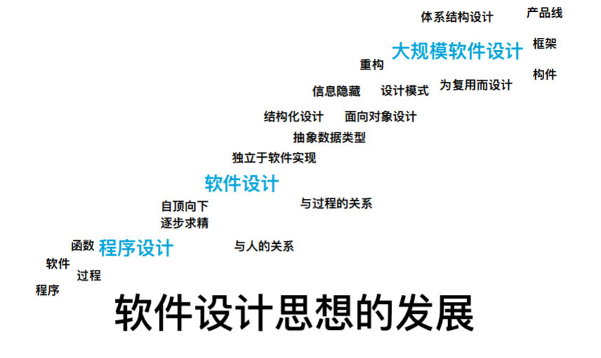

1. 横轴时间线，纵轴抽象程度

2. 程序设计 → 软件设计 → 大规模软件设计 → 当下的“云” — 更大规模

   

## 1.4. 软件设计的核心思想

### 1.4.1. 为什么要设计
1. 事物的复杂性 VS 思维的有限性
   1. 7±2规则:在一个屏幕上，同时出现多位数字或字母，瞬间出现和消失，在7±2的范围内，会可能比原来记住的更好
   2. 关注点分离与层次性：一次只能看7±2，那么就通过分离使其一次只出现7±2

### 1.4.2. 为什么软件是复杂的?
>软件的复杂性是一个本质的东西，而不是一个偶然出现的
1. 解决的问题域时很复杂的
2. 管理的开发过程是复杂的
3. 软件的灵活性导致的复杂性
4. 离散系统行为的符号化的问题

### 1.4.3. 设计的复杂度
1. 事物复杂度 VS 载体复杂度：对外表现 与 内部结构
2. 设计复杂度 = 事物复杂度 + 载体与事物的适配复杂度
   1. 本身问题域就是很难用编程语言解决的，在此基础上还要和当前的系统（如现有设备）进行适配，

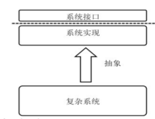

### 1.4.4. 如何去控制复杂度？

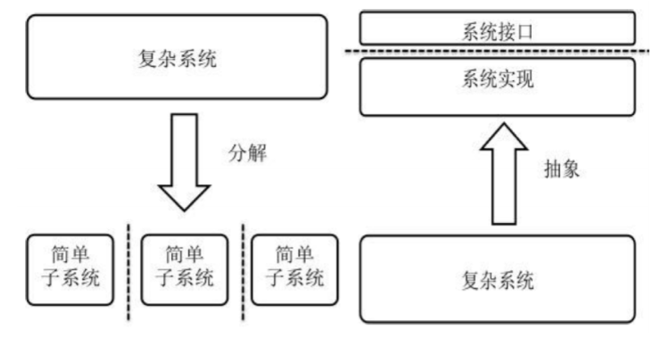

1. 软件设计的核⼼思想 —— 分解与抽象
   1. 上图是将接口即适配复杂度和系统实现即事物复杂度分离

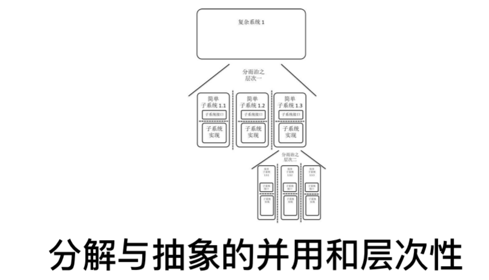

## 1.5. 理解软件设计

### 1.5.1. 什么是设计
1. Wiki：设计是**为制作每个对象或系统奠定基础的<u>计划</u>**。
2. [Brooks 2010]认为上述定义的精髓在于**计划、思维和后续执行**。
3. [Ralph 2009]将设计定义为:
   1. 设计(名词):⼀个对象的规格说明。它由⼈创造,有明确的⽬标,适⽤于特殊的环境,由⼀些基础类型构件组成,满⾜⼀个需求集合,受⼀定的限制条件约束。
   2. 设计(动词):在⼀个环境中创建对象的规格说明

4. 设计经常需要⼀个设计师考虑⼀个对象或过程的**审美、功能以及其他方面**，这通常需要进⾏相当的研究、思考、建模、交互调整和重新设计。

## 1.6. 工程设计还是艺术设计
1. 软件设计应该偏向工程还是艺术？
2. [Faste2001]认为软件设计要**偏向工程**:
   1. 时刻保持**以用户为中心**,为其建造有⽤的软件产品;
   2. 将设计知识科学化、系统化,并能够通过**职业教育**产⽣合格的软件设计师; 
   3. 能够进⾏设计**决策与折中**,解决设计过程中出现的不确定性、信息不充分、要求冲突等复杂情况。
      1. 为什么要折衷?因为问题是不确定的，是有冲突的

3. [Smith1996]认为在软件设计(尤其是⼈机交互设计)要偏向艺术：
   1. 设计师需要学会:
      1. 发散性思维和创新;
      2. **与用户共情**,体会他们的内⼼感受;
      3. 进⾏相关因素的评价和平衡,例如可靠性与时尚(Fashion)、简洁性与可修改性等;
      4. 构思与想象,设计软件产品的可视化外观(Visualization)。

4. Design = Engineering + Art 设计等于工程加艺术

- Vitruvius(《De Architectura》,公元前 22 年)认为好的建筑架构要满⾜“**效用(Useful)、 坚固 (Solid)与美感(Beautiful)**”三个⽅⾯的要求。
- [Brooks2010]认为重要的美感因素包括:**简洁、结构清晰和⼀致。**

## 1.7. Rational or Pragmatic? 理性主义or经验主义？

### 1.7.1. 理性主义代表 — 人类可以达到完全完美
1. 理性主义更看重设计的工程性,希望以**科学化知识**为基础,利⽤**模型语言、建模方法、工具支持**,将软件设计过程组织成系统、规律的模型建立过程 [McPhee1996]。
2. 在考虑到⼈的因素时,理想主义认为⼈是**优秀**的,虽然会犯错,但是可以通过教育不断完善⾃⼰ [Brooks2010]。
3. 设计⽅法学的目标就是**不断克服人的弱点**,持续完善软件设计过程中的不⾜, 最终达到完美[McPhee1996]。
4. **形式化软件工程**的支持者是典型的理想主义:通过数学证明来证明软件工程

### 1.7.2. 经验主义代表 — 人类有不可避免的缺陷
1. 经验主义者则在重视**工程性**的同时,也强调**艺术性**,要求给软件设计过程框架添加⼀些灵活性以应对设计中**人**的因素。
2. [Parnas1986]曾指出**没有过程指导和完全依赖个⼈的软件设计活动是不能接受的**,因为不能保证质量和工程性。但是[Parnas1986]也指出⼀些⼈的因素决定了**完全理性**的设计过程是不存在的:
   1. ⽤户并不知道他们到底想要怎样的需求;
   2. 即使⽤户知道需要什么,仍然有些事情需要反复和迭代才能发现或理解;
   3. ⼈类的认知能⼒有限;
   4. **需求的变更⽆法避免**;
   5. ⼈类总是会犯错的;
   6. ⼈们会固守⼀些旧有的设计理念;习惯套已有模板偷懒
   7. 不合适复⽤。
3. 所以,[Parnas1986]认为软件设计需要使⽤⼀些⽅法弥补⼈的缺陷,以建⽴⼀个**尽可能好(不坏就行)的**软件设计过程。⽂档化、原型、尽早验证、迭代式开发等都被实践证明能够有效弥补⼈类的缺陷[Parnas1986, Brooks 2010]

## 1.8. 软件设计的演化性

1. 需求是外部表现，需求和内部结构是有鸿沟的。
2. 需求分配和质量反思之间必须要不断演化才能形成最后的内部结构
   1. 比如购物软件为购物设计了一个内部结构之后，此时还有一个“秒杀”的需求，那么需要进行质量反思，即当前的内部结构是否能够支撑当前这个需求，不行则得创建新的内部结构，即不断演化

## 1.9. 设计的决策
1. [Freeman1980]认为:软件设计是⼀种**问题求解和决策**的过程;问题空间是⽤户的需求和项⽬约束,解空间是软件设计⽅案;从问题空间到**解空间**的转换是⼀个跳跃性的过程,需要发挥设计师的创造性,设计师跳跃性地建⽴解决方案的过程被称为决策。
2. 软件设计的问题求解与决策比普通数学问题的求解与决策要**困难的多**,因为软件设计面对的问题通常都是**不规则的**(Ill-Structured)[Simon1978],包含有很多的不确定性和信息不充分情景,所以进行设计决策时并不能保证决策的正确性,往往需要在很⻓时间之后才能通过验证发现之前决策的正确与否。

### 1.9.1. 决策的约束性
1. 约束满足与决策
2. 约束：
   1. 需求；环境；资源；技术 …
   2. 最初的需求确定了对设计情况的最基本的约束和要求。
   3. 通常，在设计工作本身中最终会发现更多的约束。
   4. 约束既适用于设计的工件，也适用于设计活动中涉及的流程和参与者
3. 决策依据

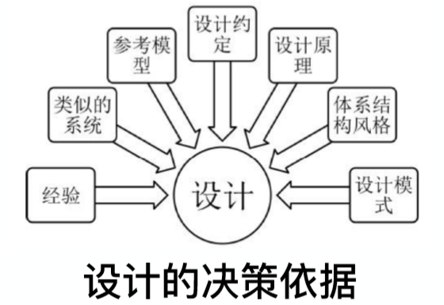

### 1.9.2. 决策的多样性
1. 决策的选择性
2. 多个**同样好**的方案，选择一个
   1. 对于方案进行筛选，找到一个合适的
   2. 充分理解**足够好**的概念
3. 设计问题的解决方案空间非常大，其庞大的规模消除了穷举搜索，这是一种可能的问题解决技术
4. “设计”的特征在于各种设计备选方案之间的一系列决策

### 1.9.3. 决策的演化性
1. 遵循路线：问题决策验证下⼀个问题
2. 决策的顺序影响:上一个决策会设计到下一步行为。
3. 前⼀个决策会影响后⼀个，⽽且不可预见
4. 每个不同的观点都可能以不同且不可预测的方式影响设计的进度。
5. 决策的**不可逆性**，设计决策一定要慎重！
   1. 不可逆的！

6. **无法完全消除⼀个前期错误的决策**
7. 决策要一致！因为决策真的很重要

8. 决策的概念完整性也⼗分重要！
   1. 决策一定要慎重，不能过于随意。
   2. 从服务、包装、售卖都会给你提供一种一致的体验。
   3. 魅族的人机交互

# 2. 软件设计的分层 重要
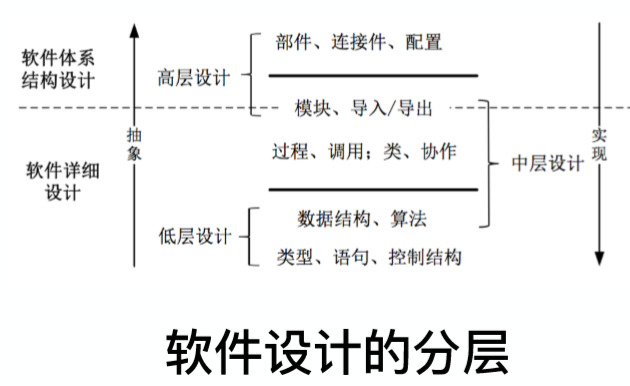

1. 一种是分为软件体系结构和软件详细设计。
2. 另一种是分为高层设计、中层设计和低层设计。
   1. 高层设计：基于反映软件高层抽象的构件设计，描述系统的高层结构、关注点和设计决策。
   2. 中层设计：更加关注组成构件的模块的设计、导入/导出、过程之间调用关系或者类之间的写作
   3. 低层设计：深入模块和类的内部，关注具体的数据结构、算法、类型、语句和控制结构等。

## 2.1. 程序设计的建立
1. 1950s
   + 第一代语言 机器语言，第二代语言 汇编语言
   + 语句为最小单位
2. 1960s
   + 第三代语言
   + 类型与函数：第一次复杂系统分割
3. 1970s
   + 类型与函数的成熟：形式化⽅法
   + 数据结构 + 算法 = 程序

## 2.2. 低层设计
1. 将基本的语言单位（类型与语句），组织起来，建⽴⾼质量的数据结构+算法
2. 常见设计场景：
    + 数组的使⽤，链表的使⽤，内存的使⽤，遍历算法，递归算法…
    + 一次问相对比较大的内存，然后我们自己在进行的内存的分配。
3. 经典场景：
    1. 堆栈，队列，树，排序算法，查找算法…
4.  数据结构与算法审美：
    1. 简洁、结构清晰，坚固（可靠、⾼效、易读）
    2. 数据结构与算法课程
    3. <计算机程序设计艺术> 第四本

### 2.2.1. 低层设计的本质
1. 屏蔽程序中**复杂数据结构与算法**的实现细节！
   + 对于复杂数据结构与算法的实现细节隐藏。

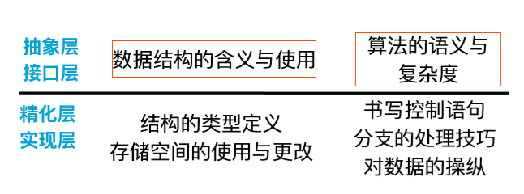

### 2.2.2. 低层设计: 代码设计
1. 对⼀个方法/函数的内部代码进⾏设计
2. 又被称为**软件构造**，通常由程序员独立完成
3. 依赖于语⾔提供的机制（程序设计课程）
    1. 面向对象和结构化
    2. 指针或地址

### 2.2.3. 模块划分
1. 1970s：函数的成熟与模块的出现
2. 模块划分：将系统分成简单片段：⽚段有名字，可以被反复使用
3. 名字和使⽤⽅法称为**模块的抽象与接⼝**
4. 模块内部的程序⽚段为精化与实现

## 2.3. 中层设计的开始
1. 模块划分**隐藏**⼀些程序片段（数据结构+算法）的细节，暴露接口于外界
2. **以模块作为概念**

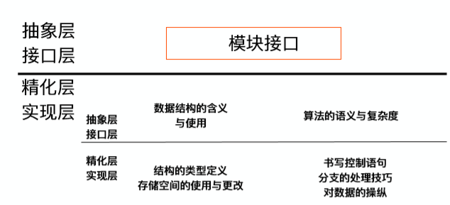

### 2.3.1. 模块化的目标：完全独立性
完全独⽴有助于理解、使用与复用、开发、修改

### 2.3.2. 模块化的问题与困难 
1. 程序⽚段之间不可能是完全独立的
2. ⽅法：实现尽可能的独立
   1. 模块化
   2. 信息隐藏
   3. 抽象数据类型
   4. 封装
   5. …

### 2.3.3. 中层设计总结——设计目标
1. 最终审美目标：简洁性、结构清晰、⼀致性、质量（可修改、易开发（易理解、易测试、易调试）、易复用）
2. 直接评价标准：模块化；信息隐藏；OO原则 

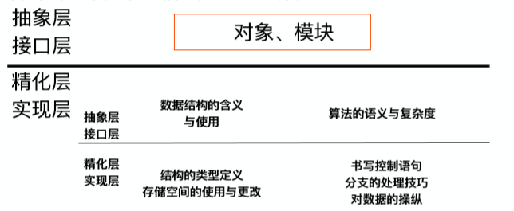

## 2.4. 中低层设计的问题
1. 《Programming-in-the-Small VS Programming-in-the-Large》
2. 过于依赖细节
   1. 连接与依赖
   2. 接口与实现
3. 忽略的关键因素: 无法有效抽象部件的整体特性
   1. 总体结构
   2. 质量属性 
4. ⼤型软件开发的⼀个根本不同是它更关注如何将⼤批独⽴模块组织形成⼀个“系统”，也就是说更重视系统的**总体组织**
5. 12306的宕机问题，我们也不能承受过亿的PV,使用硬件不划算，但是我们可以**快速的恢复**就很好
   1. 服务器之间的负载均衡，部分静态数据，缓存和反向代理

## 2.5. 高层设计：体系结构
1. **部件**承载了系统主要的**计算与状态**
2. **连接件**承载部件之间的**交互**
3. 部件与连接件都是抽象的类型定义（就像类定义），它们的实例（就像类的对象实例）组织构成软件系统的整体结构，配置将它们的实例连接起来
4. 连接件是⼀个与部件平等的单位
   + 消息队列、方法调用都可以被我们理解为连接件 

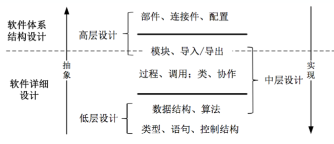

5. 和中低层设计完全的不同

## 2.6. 敏捷视点
1. 只有高层设计良好，底层设计才可能良好
2. 只有写完并测试代码之后，才能算是完成了设计！
3. 源代码可能是主要的设计⽂档，但它通常不是唯⼀⼀个必须的。

# 3. 软件设计过程、方法和模型、描述

## 3.1. 软件设计过程的主要活动
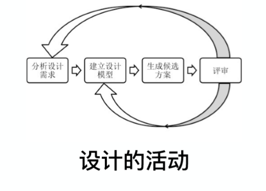

1. 分析设计出发点
2. 建立候选方案
3. 生成最终方案评价
4. 设计需求:对于设计我们要做的事情

## 3.2. 设计的方法
1. 软件设计的方法可以分为以下几种[SWEBOK 2004]:
   1. 结构化设计方法
   2. ⾯向对象设计
   3. 数据为中⼼设计:有一些项目是做数据仓库等的，数据爬取操作和读取。
   4. 基于构件的设计:调用构件和库
   5. 形式化方法设计

### 3.2.1. 结构化设计方法
1. 是一个经典的软件设计方法，采取自下向上和逐步求精的思想，按照功能对系统进行分解

### 3.2.2. 面向对象设计方法
1. 源自于数据抽象和职责驱动，利用封装、继承、多态等方法，提高软件的可扩展性和可复用性。

### 3.2.3. 以数据为中心设计
1. 开始于系统操纵的数据结构而不是它所表现的功能。

### 3.2.4. 基于构件的设计
1. 重点在于构件的提供、开发和继承，以提高系统的可复用性。

### 3.2.5. 形式化方法设计
1. 通过数学方法来对复杂系统进行建模。

## 3.3. 静态模型vs动态模型
1. 描述软件设计的模型,通常可以分为两类:

### 3.3.1. 静态模型
1. 静态模型是通过**快照**的⽅式对**系统中时间不变的属性**进⾏描述。通常描述的是状态,⽽不是⾏为。
2. ⽐如:⼀个数字的列表是按⼤⼩排序好的。

### 3.3.2. 动态模型。
1. 动态模型通常描述的是**系统行为和状态转移**。
2. ⽐如:排序的过程中如何进⾏排序。

## 3.4. 结构化设计模型和⾯向对象设计模型
1. 在结构化设计中
   1. 静态模型：实体关系图
   2. 动态模型：数据流图和结构图(Structure Chart)
2. 在面向对象设计中
   1. 静态模型：类图、对象图、构件图、部署图;
   2. 动态模型：交互图(顺序图和通信图)、状态图、活动图等

## 3.5. 软件设计描述规范
1. 早在 1998 年,IEEE 组织就提出了 IEEE 1016-1998 号标准[IEEE1016-1998] 以规范软件设 计的⽂档化描述。
2. 在 2009 年 3 ⽉,IEEE-SA 标准委员会修订了 1016 号标准[IEEE1016-2009]。 IEEE 的标准并没有限定设计描述⽂档的具体结构,⽽是通过解释⼀ 系列概念说明了软件设计 描述⽂档应该遵循的思路和基本内容。

## 3.6. 软件设计描述模型
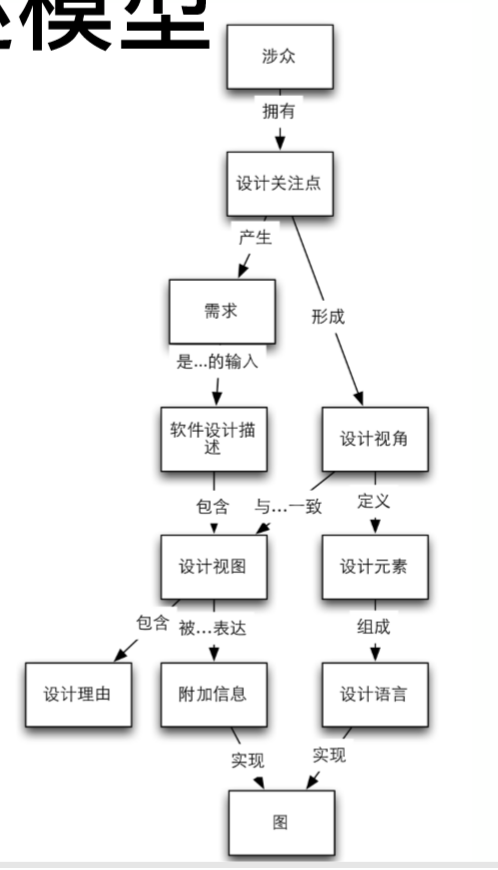
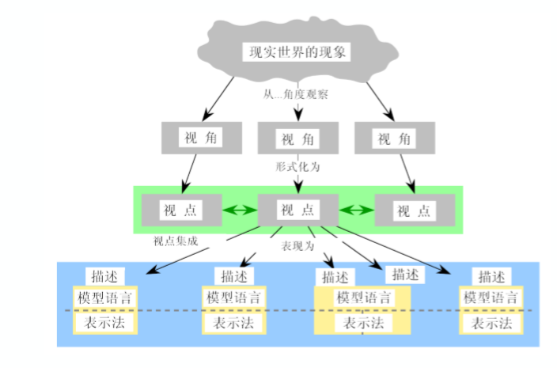
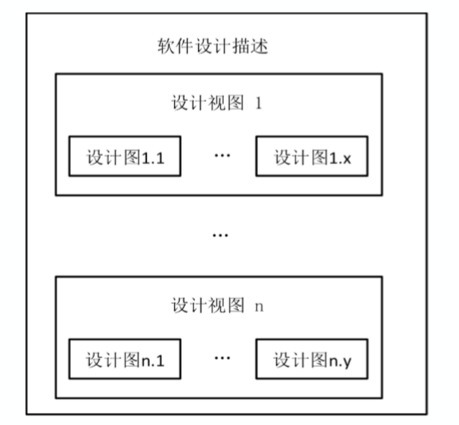

1. 设计视图是应该包含设计图的

## 3.7. 设计视角
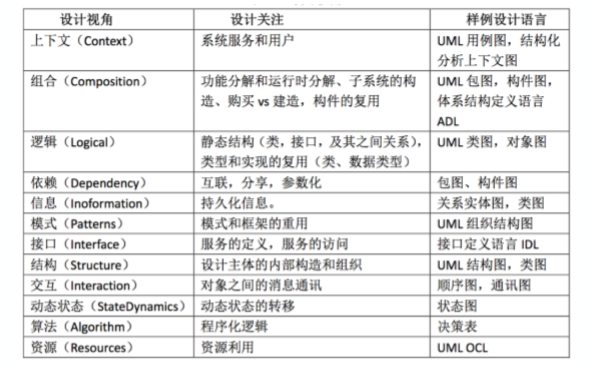

## 3.8. 涉众和其关注点
1. 设计视角必须符合在需求(Requiement)中利益相关者(Stakeholder)的设计关注点 (Design Concern)。
2. 设计对不同的利益相关者来讲,有着不同的意义,不同的设计关注点:
   1. **顾客**想要确认现有的软件设计⽅案能够保证其所期望的系统的**功能和行为**可以实现。 
   2. **架构师**想要知道软件单元、计算平台和系统环境足够实现需求中要求的**非功能性需求**。
      1. 非功能性需求：响应时间，并发数量 
   3. **设计人员**想要了解系统的整体设计,以确保系统的每个**设计决策和系统功能**都能实现。 
   4. **开发人员**想要知道所开发的单元的**精确描述**,以及与其它单元的关系。 
      1. 描述的越详细越好，越方便开发
   5. **测试人员**想要确认怎样测试设计的**所有方案**。 
   6. **维护人员**系统想要在修复问题和添加新特性时,能够保持体系结构的完整性和设计的⼀致性。 
3. 因为每个利益相关者⽬的不⼀样,对设计就会产⽣不同的设计关注点。⽽我们的设计得全⾯考量各个利益相关者的**设计关注点**,给出相应的**设计视角**下的**设计视图。**（这样最后的评审才能过）

## 3.9. 设计理由

每个设计都有一个设计理由，记录设计理由能够帮助其他人更好地理解设计

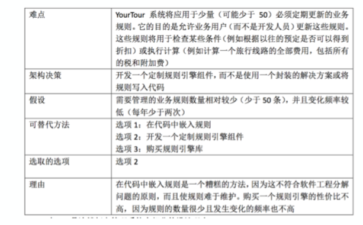

# 4. 设计描述文档模版
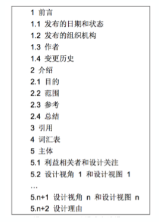

## 4.1. 设计文档书写要点
1. 充分利⽤标准的⽂档模版,根据项⽬特点进⾏适当的**裁剪**。
2. 可以利⽤**体系结构⻛格**的图,让读者更容易把握⾼层抽象。 
3. 利⽤完整的接口规格说明定义**模块与模块之间的交互**。
4. 要从**多视角**出发,让读者感受⼀个⽴体的软件系统。
5. 在设计⽂档中应体现对于**变更的灵活性**。