13-详细设计中的模块化与信息隐藏
---

<!-- TOC -->

- [1. 内聚和耦合 概念重要](#1-内聚和耦合-概念重要)
- [2. 模块化与信息隐藏思想](#2-模块化与信息隐藏思想)
  - [2.1. 设计好的软件](#21-设计好的软件)
    - [2.1.1. Parnas 1972](#211-parnas-1972)
    - [2.1.2. Stevens 1974](#212-stevens-1974)
    - [2.1.3. Beohm 1976](#213-beohm-1976)
  - [2.2. 动机](#22-动机)
  - [2.3. 模块化与信息隐藏思想的发展](#23-模块化与信息隐藏思想的发展)
    - [2.3.1. 背景](#231-背景)
    - [2.3.2. 历史发展](#232-历史发展)
    - [2.3.3. Wirth1971 - 萌芽](#233-wirth1971---萌芽)
    - [2.3.4. Parnas 1972 - 萌芽](#234-parnas-1972---萌芽)
    - [2.3.5. Stevens 1974 - 形成](#235-stevens-1974---形成)
    - [2.3.6. Stevens 1974: Designing the structure 设计结构](#236-stevens-1974-designing-the-structure-设计结构)
    - [2.3.7. Parnas 1978 - 形成](#237-parnas-1978---形成)
    - [2.3.8. Parnas 1985 - 形成](#238-parnas-1985---形成)
    - [2.3.9. Eder 1992 - 发展](#239-eder-1992---发展)
    - [2.3.10. Hitz 1995 - 发展](#2310-hitz-1995---发展)
    - [2.3.11. McConnell 1996 - 反思](#2311-mcconnell-1996---反思)
    - [2.3.12. Demarco2002 - 反思](#2312-demarco2002---反思)
- [3. 模块化](#3-模块化)
  - [3.1. 什么是模块？](#31-什么是模块)
  - [3.2. 为什么要将系统进行模块化？](#32-为什么要将系统进行模块化)
  - [3.3. 结构化设计中的耦合](#33-结构化设计中的耦合)
    - [3.3.1. 模块化](#331-模块化)
    - [3.3.2. 模块之间](#332-模块之间)
    - [3.3.3. 结构化的耦合](#333-结构化的耦合)
    - [3.3.4. 耦合的强度 1 - 连接有多复杂](#334-耦合的强度-1---连接有多复杂)
    - [3.3.5. 原则一:全局变量是被认为是有害的](#335-原则一全局变量是被认为是有害的)
    - [3.3.6. 连接到全局环境](#336-连接到全局环境)
    - [3.3.7. 常见环境的缺陷](#337-常见环境的缺陷)
    - [3.3.8. 原则二：如果没有特殊要求，让代码清晰一点](#338-原则二如果没有特殊要求让代码清晰一点)
    - [3.3.9. 明确的和可修改的](#339-明确的和可修改的)
    - [3.3.10. 原则三：不要重复](#3310-原则三不要重复)
    - [3.3.11. 耦合的强度 2 - 连接是指模块本身还是模块内部的东西](#3311-耦合的强度-2---连接是指模块本身还是模块内部的东西)
    - [3.3.12. 原则四：面向接口编程](#3312-原则四面向接口编程)
    - [3.3.13. 结构良好的系统](#3313-结构良好的系统)
    - [3.3.14. 耦合的强度 3 - 应该对外提供什么和接收什么](#3314-耦合的强度-3---应该对外提供什么和接收什么)
    - [3.3.15. 更简单一点](#3315-更简单一点)
    - [3.3.16. 结构化方法中的耦合度](#3316-结构化方法中的耦合度)
  - [3.4. 结构化设计中的内聚](#34-结构化设计中的内聚)
    - [3.4.1. 内聚](#341-内聚)
    - [3.4.2. 内聚度（绑定类型）](#342-内聚度绑定类型)
- [4. KWIC案例](#4-kwic案例)
  - [4.1. KWIC](#41-kwic)
  - [4.2. KWIC来实现系统的模块化](#42-kwic来实现系统的模块化)
  - [4.3. 根据功能进行设计](#43-根据功能进行设计)
  - [4.4. 循环位移算法的实现](#44-循环位移算法的实现)
  - [4.5. 信息隐藏](#45-信息隐藏)
  - [4.6. 根据设计决策进行设计](#46-根据设计决策进行设计)
  - [4.7. CircularShifter的定义](#47-circularshifter的定义)
  - [4.8. 分解标准](#48-分解标准)
  - [4.9. 可修改性比较](#49-可修改性比较)
  - [4.10. 独立的发展](#410-独立的发展)
  - [4.11. 可理解性](#411-可理解性)
  - [4.12. 模块化](#412-模块化)
  - [4.13. 结论](#413-结论)
- [5. 结构化的模块化](#5-结构化的模块化)
- [6. MSCS中的模块思想的应用](#6-mscs中的模块思想的应用)
  - [6.1. 低耦合处理](#61-低耦合处理)
  - [6.2. 软件体系结构的物理包设计中](#62-软件体系结构的物理包设计中)
  - [6.3. 详细设计中对象创建者的选择:](#63-详细设计中对象创建者的选择)
  - [6.4. 详细设计中选择控制⻛格:](#64-详细设计中选择控制格)
  - [6.5. 高内聚处理](#65-高内聚处理)
- [7. 结构化的信息隐藏](#7-结构化的信息隐藏)
  - [7.1. Information 信息](#71-information-信息)
    - [7.1.1. 最有可能修改的设计领域](#711-最有可能修改的设计领域)
  - [7.2. 隐藏](#72-隐藏)
  - [7.3. 信息隐藏](#73-信息隐藏)
    - [7.3.1. 接口与实现](#731-接口与实现)
    - [7.3.2. 什么是接口](#732-什么是接口)
    - [7.3.3. 进一步原则](#733-进一步原则)
    - [7.3.4. 耦合与内聚](#734-耦合与内聚)
  - [7.4. Module Guide](#74-module-guide)
    - [7.4.1. 模块的主要秘密](#741-模块的主要秘密)
    - [7.4.2. 模块的次要秘密](#742-模块的次要秘密)
    - [7.4.3. 模块的角色](#743-模块的角色)
    - [7.4.4. 模块的对外接⼝](#744-模块的对外接)
    - [7.4.5. 循环位移模块的模块说明](#745-循环位移模块的模块说明)
    - [7.4.6. 复杂系统的快速示例](#746-复杂系统的快速示例)
    - [7.4.7. Parnas’s Experience](#747-parnass-experience)
  - [7.5. 思想的应用(信息隐藏处理)](#75-思想的应用信息隐藏处理)
    - [7.5.1. 在软件体系结构设计的分层设计中:](#751-在软件体系结构设计的分层设计中)
    - [7.5.2. 在软件体系结构设计的物理包设计中:](#752-在软件体系结构设计的物理包设计中)
    - [7.5.3. 在软件体系结构设计的物理包设计中:](#753-在软件体系结构设计的物理包设计中)
    - [7.5.4. 在软件体系结构设计与详细设计中:](#754-在软件体系结构设计与详细设计中)
    - [7.5.5. 在详细设计中使用控制风格:](#755-在详细设计中使用控制风格)
- [8. 内聚的例子](#8-内聚的例子)
  - [8.1. 偶然内聚](#81-偶然内聚)
  - [8.2. 逻辑内聚](#82-逻辑内聚)
  - [8.3. 时间内聚](#83-时间内聚)
  - [8.4. 过程内聚](#84-过程内聚)
  - [8.5. 通信内聚](#85-通信内聚)
  - [8.6. 功能内聚](#86-功能内聚)
  - [8.7. 信息内聚](#87-信息内聚)
- [9. 耦合的例子](#9-耦合的例子)
  - [9.1. 数据耦合](#91-数据耦合)
  - [9.2. 印记耦合](#92-印记耦合)
  - [9.3. 控制耦合](#93-控制耦合)
  - [9.4. 重复耦合](#94-重复耦合)
  - [9.5. 公共耦合](#95-公共耦合)
  - [9.6. 内容耦合](#96-内容耦合)
- [10. KWIC的四种不同实现](#10-kwic的四种不同实现)
  - [10.1. 主程序和子程序(MS)](#101-主程序和子程序ms)
  - [10.2. 面向对象(OO)](#102-面向对象oo)
  - [10.3. Pipe Filter](#103-pipe-filter)
  - [10.4. 基于事件](#104-基于事件)

<!-- /TOC -->

# 一 内聚和耦合 概念重要
1. 内聚：内聚表达的是一个模块内部的联系的紧密型：包括信息内聚、功能内聚、通信内聚、过程内聚、时间内聚、逻辑内聚和偶然内聚。
```java
public class Rous{
    public static int findPattern(String text,String pattern)
    public static int average(Vector numbers)
    public static OutputStream openFile(String fileName)
}
```
2. 耦合:耦合描述的是两个模块之间关系的复杂程度：包括内容耦合，公共耦合，重复耦合，控制耦合，印记耦合，数据耦合
```java
public class Employee{
    public String name,emailID;
}
public class Emailer{
    public void sendEmail(Employee e,String text)
}
```

# 二 模块化与信息隐藏思想

## 1. 动机：设计好的软件
1. **什么是好的软件代表的？**不同的人给出不同的解释

### 1.1. Parnas 1972
1. 管理人员(可管理性)

2. 产品灵活性(灵活性)

3. 可理解性(可理解性)

4. 特征
   1. 允许编写一个模块，而几乎不了解另一个模块中的代码
   
   2. 允许在不重新组装整个系统的情况下重新组装和更换模块。
   
      > 侧重于模块之间的独立性

### 1.2. Stevens 1974
1. **简洁性**（Simplicity）
   1. 易于调试
   2. 易于分解
2. **可观察性**（Observability）
   1. 易于修改

### 1.3. Beohm 1976
1. 可维护性
2. 可扩展性
3. 可理解性
4. 可重用性

## 2. 发展：模块化与信息隐藏思想的发展

### 2.1. 背景
1. 1960s
   1. 软件和硬件不同
   2. 软件制作
2. 1970s
   1. 软件是数据 + 算法
   2. 瀑布模型
   3. 形式化方法
3. 1980s
   1. 重用
   2. 对象
   3. 人件

### 2.2. 历史发展
1. 萌芽：Wirth1971; Parnas1972; 
2. 形成：Stevens1974; Parnas1978; Parnas1985; 
3. 发展：Eder1992; Hitz1995; 
   1. Eder给面向对象模块隐藏提供定性分析，怎么样做到耦合
   2. Hitz则是定量分析，度量耦合内聚程度

4. 反思：McConnell1996; Demarco2002

#### 萌芽

##### Wirth1971

1. 软件通过逐步求精发展
2. 核心思想:**逐步求精**
3. 该程序是在一系列优化步骤中逐步开发的
   1. 尽可能分解决策
   2. 解开看似相互依赖的方面
   3. 关键点：**尽可能推迟有关展示细节的决定**
4. 对程序和数据结构的描述的修饰应并行进行。
5. 以这种方式获得的模块化程度将决定程序可以适应目的变化或扩展或环境变化的难易程度。
6. 每个优化都基于一组设计标准隐含了许多设计决策。
7. 仔细编程并不是一件容易的事。

##### Parnas 1972 

1. 关于将系统分解为模块的标准
2. 什么是模块化？
   1. 模块：成为职责分配而不是子程序
   2. 模块化：包括在独立模块上的工作开始之前必须做出的设计决策（“系统级”决策）
3. 分解标准
   1. 信息隐藏：隐藏的是设计决策
   2. 分解中的每个模块都以其对设计决策的了解为特征，而对其他所有决策则都不了解。
4. 层次结构
   1. 如果可以在模块或程序之间定义某种关系
   2. 该关系是偏序的
   3. 我们关注的关系是“使用”或“依赖”
5. 数据结构，其内部链接，访问过程和修改过程是单个模块的一部分（封装的思想）
6. 操作系统和类似程序的队列中使用的控制块格式必须在“控制块模块”中隐藏
7. 在此之前都是想法，而不是方法

#### 形成

##### Stevens 1974 

最大的贡献：**对耦合和内聚进行定义**

1. “Structured design” 结构化设计
2. 模块：一组一个或多个连续的程序语句，其名称具有系统其他部分可以调用的名称，并且最好具有其自己独特的变量名称集
3. 耦合：通过一个模块到另一个模块的连接建立的关联强度的度量
4. 内聚：巧合;逻辑;沟通;顺序;功能性
5. 模块的控制范围
6. 决策的效力范围
7. 系统会更简单，当决策的影响范围在包含决策的模块的控制范围内时

提出了结构化分析的方法、流程：

- 步骤1：勾画出问题的功能图

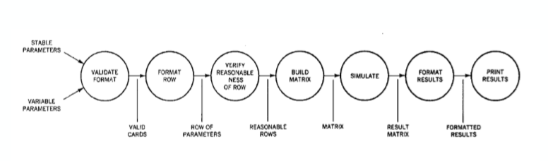

- 步骤2：确定外部概念性数据流。
- 步骤3：确定问题中的主要外部概念数据流

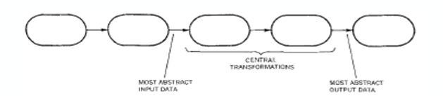

- 步骤4：使用源模块针对每个概念输入流设计源结构，该模块存在于大多数抽象输入数据的位置；简单的下沉模块

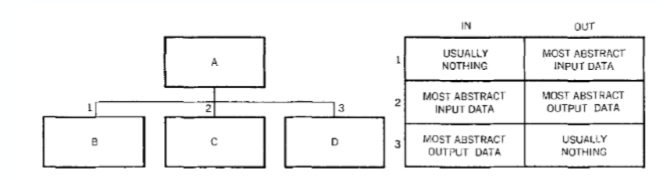

- 步骤5：对于每个模块，确定产生该模块返回的表单所需的最后一次转换

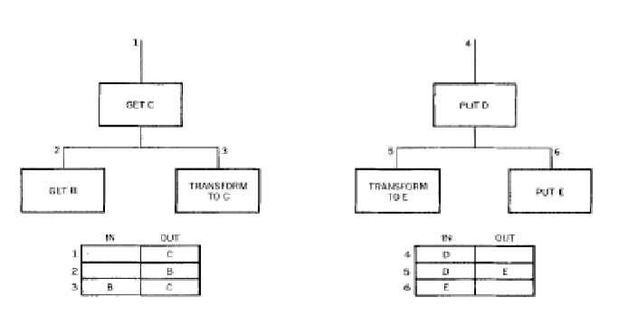

- 担心的是一个地方的变更会导致其他部分的变更

##### Parnas 1978 
1. “设计易于伸缩的软件”
2. 迈向更好结构的步骤
   1. 需求定义：首先确定子集
   2. 信息隐藏：接口和模块定义
   3. 虚拟机概念
   4. 设计“用途”结构
3. “依赖”关系
   1. 如果A可能需要正确执行B才能完成A规范中描述的任务，则A使用B
   2. 满足以下所有条件时，允许A“使用”B：
      1. A本质上更简单，因为它使用B
      2. B实际上不复杂，因为它不允许使用A
      3. A 有一个有用的子集，包含B，不需要A
      4. 没有可以想象的有用的子集包含A但不包含B

##### Parnas 1985
1. “复杂系统的模块化结构”
2. 模块说明
   1. 主要隐藏
   2. 角色
   3. 分配模块特定职责的标准
3. 模块层次结构
   1. 顶层分解
   2. 二级分解
   3. 第三级
4. 隐藏
   1. 主要隐藏：模块中包含的隐藏信息。隐藏细节，需求
   2. 次要隐藏: 用于实施模块的实施决策。实现细节，实现需要
5. 顶层分解
   1. 硬件隐藏模块
   2. 行为隐藏模块
   3. 软件决策模块

#### 发展

##### Eder 1992

1. “面向对象系统中的耦合和内聚”
2. “良好”设计准则
3. 面向对象的耦合：相互作用耦合；组件耦合；继承耦合
4. 面向对象的凝聚力：方法凝聚力；类凝聚力；继承凝聚力

####  Hitz 1995
1. “在面向对象的系统中测量耦合和内聚”
2. 类级耦合
3. 对象级耦合
4. 耦合和内聚综合指标的框架
5. 定量分析面向对象系统

####  反思

##### McConnell 1996

不要忘记信息隐藏

1. “缺少行动：信息隐藏”
2. 信息隐藏
   1. 是软件工程研讨会的设计思路之一
   2. 不需要或不依赖任何特定的设计方法
   3. 其特点是“隐藏”
   4. 最常见的隐藏是您认为可能会更改的设计决策
   5. 询问需要隐藏哪些内容，可以支持所有级别的良好设计决策

##### Demarco2002


1. 内容:描述了75年自己写的文章的内容，什么到现在仍然是对的


2. 灰色不适用，黑丝仍适用
2. 第五条:接口隔离原则；第九条：迭代开发

## 3. 模块化与信息隐藏
1. 计算机系统不是单体的：它通常由多个交互模块组成。
2. 长期以来，模块化一直被视为廉价(高效率)，高质量软件的关键。
3. **系统设计的目标**是**决定**：
   1. 什么是模块；
   2. 怎么样确定模块
   3. 模块之间如何交互。

### 3.1. 什么是模块？
1. 不同的视角
   1. 一段代码。有局限性。
   2. 编译单元，包括相关的声明和接口
   3. 一个工作单元。
   4. 编程单元（程序，类等）的集合
      1. 在整个系统中具有明确定义的界面和目的，
      2. 可以独立分配给开发人员

2. 课本总结:模块是一个词汇上邻接的程序语句序列，由边界元素限制范围，有一个聚合标识符。

#### 为什么要将系统进行模块化（模块化的优点）
1. 管理：分而治之
2. 演化：分离系统的各个部分，以便将一个部分的更改与其他部分的更改隔离开
   1. 直接性原则（将需求明确分配到模块，理想情况下一个需求（或多个）映射到一个模块）
   2. 连续性/局部性原则（需求的微小变化仅触发对一个模块的更改）
3. 理解：促使我们的系统更加容易被理解
   1. 作为思维大小的块的组成，例如7±2规则
   2. 一部分只有一个问题，例如本地性原则，封装，关注点分离
4. 关键问题：模块化使用什么**标准**？**怎样确定模块？**->**信息隐藏**

### 3.2 **怎样确定模块？信息隐藏**

#### 需要隐藏的信息

1. 信息隐藏
2. 什么需要隐藏？变更
   1. 数据表示
   2. 设备的属性（必需属性除外）
   3. 实施世界模型
   4. 支持算法的各种机制
3. 信息隐藏的核心是将每个模块都隐藏一个重要的设计决策

##### 最有可能修改的信息

1. 硬件依赖：外部软件系统
2. 输入输出格式：DB, Internet, UI, …
3. 非标准语言特性和依赖路径：Platform: os, middleware, framework…
4. 困难的设计和实现部分
   1. 通常是被设计的很不好的部分或者是需要被重新设计和重新实现的部分
   2. Complex…, monitor, exception, log, …
5. 复杂的数据结构，被多个类使用的数据结构，或者是不让你满意的数据结构
   1. Separate model from logic 逻辑分块
6. **复杂逻辑**，他们被认为就像数据结构一样复杂。
7. **算法，时间表**，时间紧迫，实现紧迫
8. **全局变量**:常常并没有并真正使用，但是常常受益于权限访问的隐藏：Data Access Routines
9. 数组声明的数据量打下和循环限制。
10. 以及商业规则:比如法律、规则、正则和被转换成计算机系统的过程。

#### 隐藏的原则

1. 尝试讲未来的变化限制在本地

   1. 隐藏可能会独立更改的系统详细信息
   2. 如果变化，变化频率不同的信息也要分开
   3. 将不容易变的部分暴露出来当接口

   

#### 信息隐藏的方式

1. 最常见的隐藏是您认为可能会更改的设计决策。
2. 然后，您可以通过将每个设计秘密分配给自己的类，子例程或其他设计单元来分离它们。
3. 接下来，您隔离（封装）每个机密，这样，如果它确实发生了更改，则更改不会影响程序的其余部分。

### 3.3 模块之间如何交互？定义接口

#### 接口与实现

1. 模块的用户和实施者对此有不同的看法。
2. 界面：用户对模块的看法。
3. 仅描述用户使用模块需要知道的内容
4. 使其更易于理解和使用
5. 描述了该模块提供的服务，但没有描述如何提供这些服务

#### 什么是接口

是协议，是契约，分为供接口和需接口


1. 作为合同的接口:模块发布的任何内容
   - 提供的接口：模块的客户端可以依赖于所需的接口：该模块可以依赖于其他模块
   - 需要的接口：这个
2. 语法接口
   1. 如何调用操作
      1. 方法参数
      2. 方法接口
3. 语义接口
   1. 这些操作是做什么的，例如
      1. 前置条件和后置条件
      2. 用例

#### 接口定义原则

1. 显式接口：使模块之间的所有依赖关系明确（无隐藏的耦合）
2. 低耦合-接口少：最小化模块之间的依赖性
3. 小接口
   1. 保障小接口
      1. 将许多参数当成对象
      2. 将大型接口分为几个接口
   2. 面向接口编程
4. 高内聚：一个模块应该封装一些定义良好的，连贯的功能（稍后会详细介绍）

#### 模块之间满足高内聚低耦合

1. 内聚是模块之间的一致性的度量。
2. 耦合是模块之间的交互程度。
3. 需要高凝聚力和低耦合。

## 4 . KWIC案例

1. 一共有4种Java的实现方式，注意复习

### 4.1. KWIC

1. 简称KWIC，⼜称上下⽂关键词索引，由IBM的卢恩首创，是最早出现的机编索引， 1960年首次用于美国化学文摘社出版的《化学题录》(Chemical Titles)。
2. KWlC索引的的编制特点是：
   1. 使用禁用词表选择标题中具有检索意义的词为关键词，并将其作为确定索引条目的依据；
   2. 关键词的排检点设于标题的中部，所有索引条目按关键词的字顺竖向排列；
   3. 保留文献篇名中关键词前后的上下文，如⽂献名称过长，可以以轮排的形式移至条目的前部或后部；款目后跟随该信息资源的位置。
3. 上述条目均按关键词的字顺排列在相应位置，检索时先在检索入口处查找与检索课题有关的关键词，再通过阅读上下⽂寻找符合检索要求的文献。可以按排检点为中心对同⼀关键词有关的资源集中检索查找，是这⼀索引的优点；不足是将索引的排检点设置在中部不符合⽤户使⽤习惯。


4. 对很多的关键词进行关键词排序


- KWIC索引系统接受：
  1. 一组有序的线
  2. 每行是一组有序的单词
  3. 每个单词都是一组有序的字符
- 每行都“循环移位”并通过以下方式复制：
  1. 反复删除第一个单词
  2. 将其附加在行的末尾
- 输出按字母顺序排列的所有行的所有循环移位的列表

### 4.2. 第一种模块化结构：根据功能进行设计

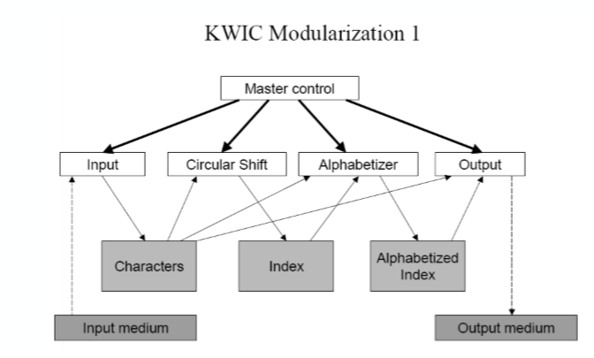

#### 功能设计：循环位移算法的实现

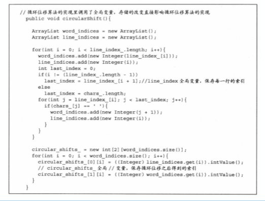

- 模块之间的交互更多是通过使用全局变量实现

### 4.3 第二种模块化结构：根据设计决策进行设计

设计决策实际上是信息隐藏，即通过将需要的信息都隐藏在模块内部来进行设计

#### 信息隐藏

1. 基本思想：每个模块都隐藏了重要设计决策的实现，因此只有该模块的组成部分才知道详细信息
2. 所有设计决策彼此独立
3. 两种常见的信息隐藏：
   1. 一是根据需求分配的职责，因为实践表明，需求是经常变化的，频率和幅度都很大；
   2. 二是内部实现机制，常见的变化主题包括硬件依赖，输入输出形式，非标准语言特征和库，负责的设计和实现，复杂的数据结构，复杂的逻辑，全局变量。数据大小限制等。

#### 根据设计决策进行设计

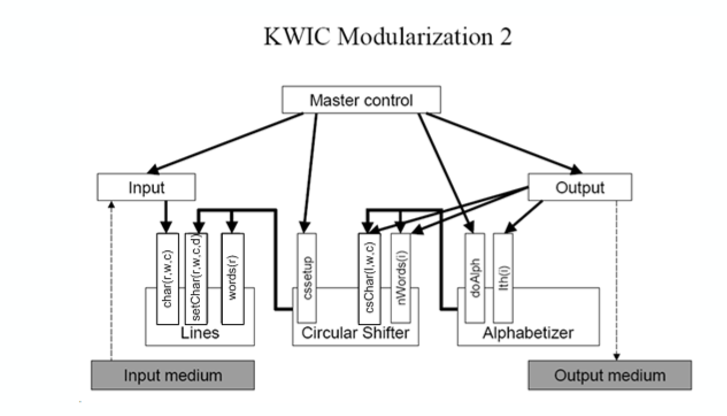

1. 模块之间的交互是通过接口实现的

#### 功能实现：CircularShifter

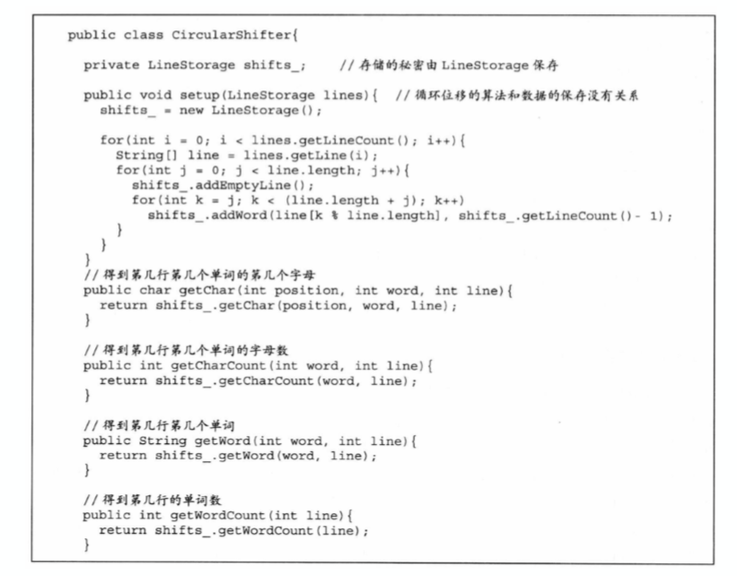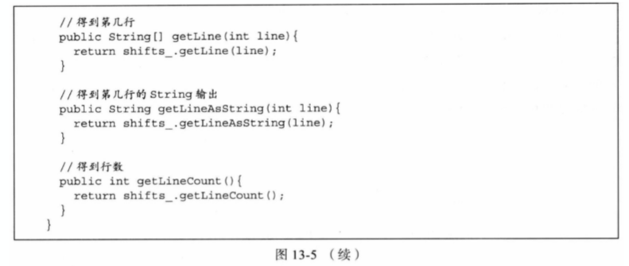

### 4.4 两种方法对比

#### 实现方式不同

- 第一种模块化：
  - 处理过程中的每个主要步骤都是一个模块
  - 是按照算法进行分解

- 第二种模块化：
  - 通过信息隐藏，定义接口方式实现（每个模块都有一个或多个“隐藏”，比如：）
    - 行：字符/行的存储方式
    - 循环位移：位移算法，位移存储
    - 字符表化：排序算法
  - 每个模块都以其对设计决策的了解为特征，而对其他所有决策则都不了解。
- 预期不到的变更是无法进行规避的

#### 可修改性不同


1. 按照算法分解比按照决策分解的修改范围大的多

#### 并行开发的代价不同

1. 模块化 1
   1. 必须先设计所有数据结构，然后才能进行并行工作
   2. 需要复杂的描述：描述各个模块所做的事情，而且有很多全局的东西，需要说明清除其作用
2. 模块化 2
   1. 必须先设计接口，然后才能开始并行工作
   2. 仅简单描述

#### 可理解性不同

1. 第二种模块化是更好的
   1. 主观性判断
   2. 更低的模块之间的耦合：面向接口编程

### 4.5 结论

1. 模块
   - 可以被放置到一起的去形成一个完成系统的模块
   - 职责分配，子过程，内存加载，功能部分
2. 模块化：设计**独立的**模块，第二种设计方法
3. 封装
   - 通过语言（面向对象）来 实现
   - 面向对象三大基本思想:数据和行为在一起，体现共同职责
4. 信息隐藏
   - 设计原则
   - 信息隐藏是更高的设计原则
5. 其类似于体系风格中的分析，但是思考的层级不一样，前者是模块，后者是类


# 三 结构化的模块化

## 0. 原则（考试会考的）

### 原则一:全局变量是被认为是有害的

例子：

- 一种方式：m1，m2组成的大包，依赖于下面的打包
  - 则依赖的关系是: m1
- 另一种方式：m1依赖于n1，m2依赖于n2
  - 依赖关系有：m1*n1，m2\*n2
- 而全局变量的存在表示所有包都可以用，所有包都互相依赖，耦合度极高，所以不合适！

#### 使用全局变量的危害

1. 假设N1 + N2 = N，M1 + M2 = M
   1. 如果M个模块共享N个元素
      1. 有潜在的N * M个连接
      2. (N1 + N2) * (M1 + M2)= N1 * M1 + N2 * M2 + N1 * M2 + N2 * M1
   2. 如果M1模块有N1个共享元素，而M2模块有N2个共享元素(也就是N1 对应 M1，而N2 对应M2)：存在潜在的(N1 * M1 + N2 * M2)连接
2. 封装减少耦合：抽象和分解
   1. 将潜在的共享元素细分成组
   2. 将每个组的访问权限限制为最小的模块子集
3. 连接将每个模块共享给每个其他这样的模块
   1. 一个模块中的错误和更改可以传播到其他模块
   2. 理解一个模块需要其他人的帮助
   3. 更难于重用
4. 通用环境中的每个元素都会增加整个系统的复杂性

### 原则二：to be explict


- 上一张图片是隐式的（不知道data里面有什么），但是方便修改
- 下一张图片是显示的（知道属性），但是修改时候需要修改两处
- 如果对于修改行要求不高，尽量选显示的

### 原则三：不要重复

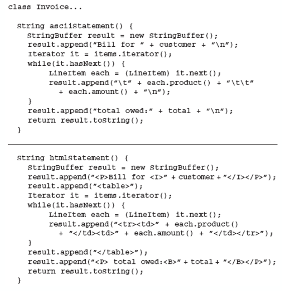

- 有重复也有不同

- 如何消除重复呢？先写接口

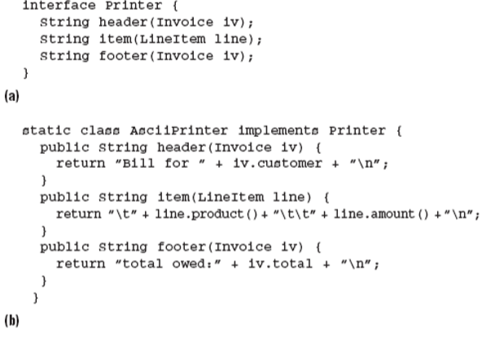

- 也就是我们只需要new一个printer就行

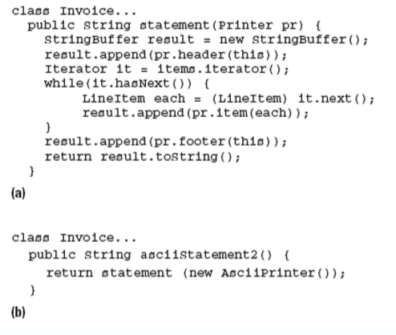

### 原则四：面向接口编程

- 结构良好的系统
  - 通过已定义的接口通过传递的参数进行通讯


## 1. 耦合

### 1.1 模块化

#### 模块内部

目标是提高内聚，降低模块间的耦合

1. 两种思路

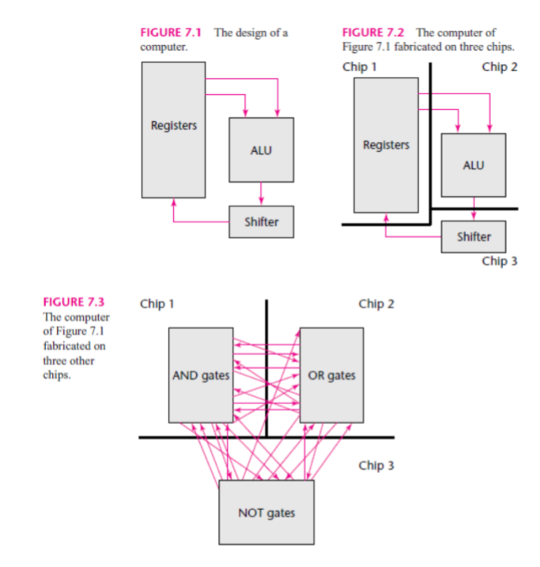

2. 可以根据数据总线进行切割
3. 可以根据门电路进行划分
4. 显然上者的模块划分方式更好，下面那个耦合太离谱了，所以模块内部应该按照职责进行划分

#### 模块之间

1. 连接：连接是对其他地方定义的某些标签或地址的引用
2. 联系(两个模块之间)的复杂度
   1. 数量
   2. 程度

### 1.2 耦合强度的评判标准

- 耦合是对从一个模块到另一个模块的连接所建立的关联强度的度量。
   - 连接有多复杂
   - 连接是指模块本身还是模块内部的东西
   - 正在发送或接收的内容

#### 连接有多复杂

1. 连接模块：对常见的环境：全局变量，范围
2. 对于其他模块


#### 连接是指模块本身还是模块内部的东

- 早期的语言是可以直接跳转到模块内部的

1. Connections that address or refer to a module as a whole by its name yield lower coupling than connections referring to the internal elements of another module 以其名称寻址或整体**引用一个模块的连接**产生的耦合比**引用另一个模块内部元素**的连接产生的**耦合低**(整体连接的耦合程度高于模块内部元素连接的耦合)

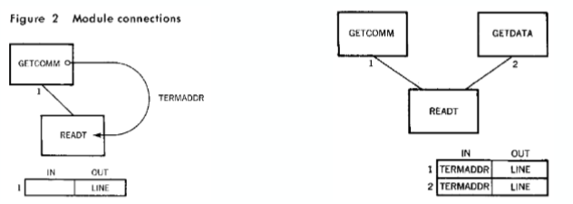

2. 关联到内部是不合适的，应该是关联到接口
3. 接口耦合度低，而如果是具体关联耦合度高

#### 传输与接受的数据

- 内容耦合:最高级别的耦合
   1. 传递必要数据的连接
   1. 模块之间可以修改对方数据
   1. 最不可接受的
- 公共耦合:次一级的耦合
   1. 往往是多方耦合，比如使用全局变量
- 重复耦合：
   - 出现相同的代码

- 控制耦合:除了数据还有控制信号
   1. 传递数据和控制元素的连接
   1. 模块之间传递控制信息

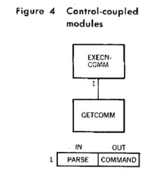

- 控制耦合简化：

  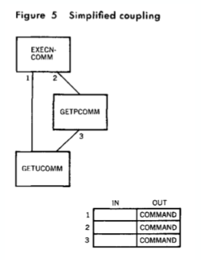

  1. 在上层已经处理好需要处理啥
  2. case1，2是分开的实现好的两个，上一个模块只负责判断对下面的模块进行调用
  3. 不需要传递控制信号

- 印记耦合：传递的数据多于所需要的数据

  - B需要学生的数据，A却传给B整个大学的数据

- 数据耦合：模块之间通过参数传递，只共享对方需要的数据


## 2. 内聚


1. 偶然内聚:没什么关系(避免)
2. 逻辑内聚:将一系列操作放在一起，由其他模块进行调用
3. 时间内聚:操作和时间有关系
4. 过程内聚:**更强调**按照一定步骤进行调用
5. 通信内聚:需要操作相同的数据
6. 功能内聚:只执行一个单一操作和功能
7. 信息内聚:数据和行为是在一起的
8. 事件、过程、通信尽量做
9. 最好能做到功能、信息内聚

## 3. 思想的应用

### 3.1 低耦合处理

包之间耦合降低

1. 软件体系结构的分层设计中:
   - 不同层的模块之间仅能通过程序调⽤与数据传递实现交互,不能共享数据(例如 Model 层建⽴⼀个数据对象并将引⽤传递给 Logic 层使⽤)否则会导致公共耦合。
2. 软件体系结构的逻辑包设计中:
   - 依据功能的特点将三个层次进⼀步划分为更⼩的包,⽽不是只使⽤ Presentation、Logic和 Model 三个包,可以通过包分割实现接⼝最⼩化,这能去除不必要的耦合。
     - 相当于是把包变小，精确化依赖
3.  软件体系结构的物理包设计中
   1. 将不同包的重复内容独⽴为单独的包以消除重复,避免产生隐式的重复耦合;

4. 详细设计中对象创建者的选择:
   1. 如果两个对象 A、B 间已有比较高的耦合度了, 那么使⽤ A 创建 B 或者反之就不会带来额外的耦合度。这就是表 12-4 内容的核⼼思想——不增加新的耦合。 

5.  详细设计中选择控制⻛格
   1. 解除界⾯与逻辑对象的直接耦合。


### 3.2 高内聚处理 

包内部高内聚

1. 软件体系结构的分层设计中:
   - 三个层次都是⾼内聚的,⼀个处理交互任务, ⼀个处理业务逻辑,⼀个处理数据持久化。 
2. 软件体系结构的逻辑包设计中:
   - 将三个层次进⼀步划分为更⼩的包,可以实现每个更⼩的包都是⾼内聚的。
3. 详细设计中抽象类的职责:
   - 要求状态与⽅法紧密联系就是为了达到⾼内聚 (信息内聚)。 
4. 详细设计中使⽤控制⻛格:
   - 控制⻛格分离了控制逻辑,可以实现业务逻辑对 象的⾼内聚(功能内聚)。因为封装了控制逻辑,所以控制器对象承载了不可避免的顺序内聚、通信内聚和逻辑内聚,这就要求控制器对象必须是受控的,也是它们为什么倾向于对外委托⽽不是⾃⼰进⾏业务计算的原因。


# 四 结构化信息隐藏

## 1. 模块的主要秘密

1. 主要秘密描述的是这个模块所要实现的**用户需求**。是设计者对⽤户需求的实现的⼀次职责分配。有了这个描述以后，我们可以利⽤它检查我们是否完成所有的⽤户需求，还可以利⽤它和需求优先级来决定开发的次序。

## 2. 模块的次要秘密

1. 次要秘密描述的是这个模块在实现职责时候所涉及的具体的**实现细节**。包括数据结构，算法，硬件平台等信息。

## 3. 模块的角色

1. 描述了独⽴的模块在整个系统中所承担的⻆⾊，所起的作⽤。以及与哪些模块有相关联的关系。

## 4. 模块的对外接口

1. 模块提供给别的模块的接⼝。

## 5. 例子

### 5.1 KWIC循环位移模块

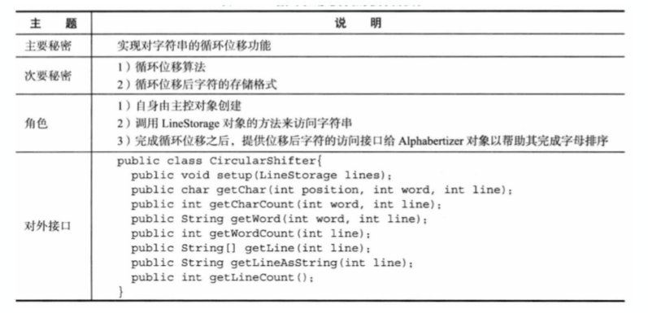

### 5.2 复杂系统的快速示例

1. A-7E飞机
2. 极其复杂的机上飞行计划
3. 内存有限
4. 实时约束

### 5.3. Parnas’s Experience

1. “当我们试图在没有指南的情况下工作时，……责任要么以两个模块要么没有。 有了模块指南，设计的进一步进展显示出相对较少的疏忽。”
2. 集成测试仅用了一周
3. 仅发现了9个错误。
4. 错误隔离到单个模块的位置。
5. 所有的bug都被很快的修复了
