14-面向对象的模块化
---

<!-- TOC -->

- [1. 模块化的原则(总结)](#1-模块化的原则总结)
- [2. 面向对象中的模块与耦合](#2-面向对象中的模块与耦合)
  - [2.1. 类](#21-类)
  - [2.2. 模块](#22-模块)
  - [2.3. 耦合中的结构方法与OO方法](#23-耦合中的结构方法与oo方法)
  - [2.4. 降低耦合的设计原则](#24-降低耦合的设计原则)
- [3. 访问耦合](#3-访问耦合)
  - [3.1. 隐式耦合:Cascading Message 级联调用问题](#31-隐式耦合cascading-message-级联调用问题)
    - [3.1.1. 解决方案 — 引入局部变量](#311-解决方案--引入局部变量)
    - [3.1.2. Cascading Message问题案例](#312-cascading-message问题案例)
    - [3.1.3. 解决方案 — 委托](#313-解决方案--委托)
- [4. 组件耦合原理](#4-组件耦合原理)
  - [4.1. 原则四：面向接口编程](#41-原则四面向接口编程)
  - [4.2. 原则五:迪米特法则](#42-原则五迪米特法则)
    - [4.2.1. 问题案例](#421-问题案例)
  - [4.3. 原则六：接口隔离原则（ISP）/也叫接口最小化原则](#43-原则六接口隔离原则isp也叫接口最小化原则)
  - [4.4. 解释接口隔离原则](#44-解释接口隔离原则)
    - [4.4.1. 案例一:GUI界面问题](#441-案例一gui界面问题)
    - [4.4.2. 案例二:Application的依赖问题](#442-案例二application的依赖问题)
- [5. 继承耦合](#5-继承耦合)
  - [5.1. 修饰继承耦合](#51-修饰继承耦合)
    - [5.1.1. 案例](#511-案例)
  - [5.2. 完善继承耦合](#52-完善继承耦合)
  - [5.3. 扩展继承耦合](#53-扩展继承耦合)
- [6. 降低继承耦合的方法](#6-降低继承耦合的方法)
  - [6.1. 继承耦合原理](#61-继承耦合原理)
  - [6.2. 原则七：里氏替换原则](#62-原则七里氏替换原则)
    - [6.2.1. 问题案例一:银行问题](#621-问题案例一银行问题)
    - [6.2.2. 问题案例二:Is a Square a Rectangle?](#622-问题案例二is-a-square-a-rectangle)
    - [6.2.3. 问题案例三:Penguin is a bird?](#623-问题案例三penguin-is-a-bird)
  - [6.3. 里氏替换原则总结](#63-里氏替换原则总结)
    - [6.3.1. 课堂练习](#631-课堂练习)
  - [6.4. 设计原则八:组合代替继承](#64-设计原则八组合代替继承)
    - [6.4.1. Coad的继承规则](#641-coad的继承规则)
    - [6.4.2. 继承/组合 实例一](#642-继承组合-实例一)
    - [6.4.3. 继承/组合 示例二](#643-继承组合-示例二)
- [7. 内聚](#7-内聚)
  - [7.1. 方法内聚](#71-方法内聚)
  - [7.2. 提高内聚的方法](#72-提高内聚的方法)
    - [7.2.1. 原则九：单一责任原则（SRP）](#721-原则九单一责任原则srp)
      - [7.2.1.1. 问题案例](#7211-问题案例)
      - [7.2.1.2. 结局方案](#7212-结局方案)
    - [7.2.2. 单一职责原则](#722-单一职责原则)
  - [7.3. 课堂练习](#73-课堂练习)
- [8. 耦合和内聚的度量](#8-耦合和内聚的度量)
  - [8.1. 类之间的耦合度量](#81-类之间的耦合度量)
    - [8.1.1. 第一种度量:CBO(方法调用耦合)](#811-第一种度量cbo方法调用耦合)
    - [8.1.2. 第二种度量:DAC(数据抽象耦合)](#812-第二种度量dac数据抽象耦合)
    - [8.1.3. 第三种度量:Ca和Ce(有效和)](#813-第三种度量ca和ce有效和)
    - [8.1.4. 第四种度量:DIT 继承树的深度](#814-第四种度量dit-继承树的深度)
    - [8.1.5. 第五种度量 Number of children (NOC) 子类的数量](#815-第五种度量-number-of-children-noc-子类的数量)
    - [8.1.6. 衡量类凝聚力 LCOM](#816-衡量类凝聚力-lcom)
  - [8.2. Summary:Principles from Modularization 模块化的原则](#82-summaryprinciples-from-modularization-模块化的原则)

<!-- /TOC -->

# 1. 模块化的原则(总结)
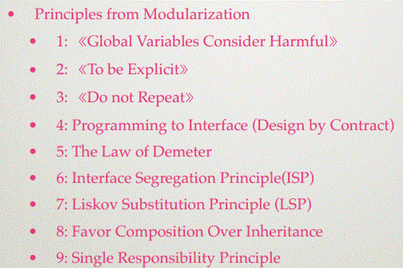

1. 核心就是上面的
2. 题目是，给例子，发现违反的原则并纠正

# 2. 面向对象中的模块与耦合

## 2.1. 类
1. 模块化是消除软件复杂度的一个重要方法，它有效地将一个复杂系统分解为若干个代码片段，每一个代码片段完成一个功能，并且包含完成这个功能所需要的信息。
2. 模块化希望代码片段由两部分组成:接口和实现。

## 2.2. 模块
1. 一段代码
   1. 方法
   2. 类
   3. 模块(包)
2. 耦合:模块之间
3. 聚合:模块内部

## 2.3. 结构方法与OO方法中的耦合
1. 耦合:耦合是对从一个模块到另一个模块的连接所建立的关联强度的度量。
2. 结构化方法:连接是对其他地方定义的某些标签或地址的引用
3. 面向对象方法
   1. 访问耦合
   2. 继承耦合

## 2.4. 降低耦合的设计原则
1. 原则一：Global Variables Consider Harmful
2. 原则二：To be Explicit
3. 原则三：Do not Repeat
4. 原则四：Programming to Interface

# 3. 访问耦合类别
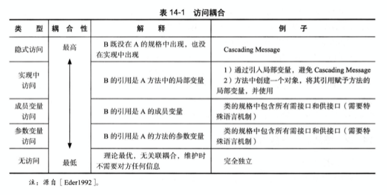

## 3.1. 隐式耦合:Cascading Message 级联调用问题


- involvelnProject中隐式包含EMPLOYEE类，但是其完全没有出现，是隐式耦合

## 3.2 改进：实现中访问
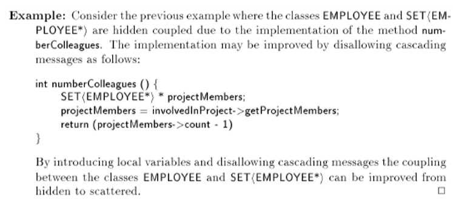

- 引入局部变量，避免隐式耦合，变为显式耦合，降低耦合度

## 3.3. Cascading Message问题案例
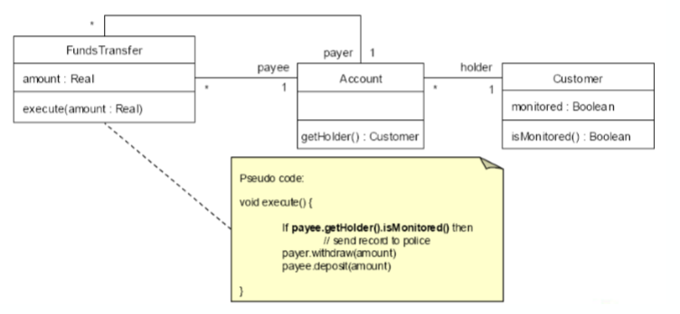

- 使用委托的方式来解决，委托给一个类来完成这个业务

### 3.3.1 解决方案 — 委托
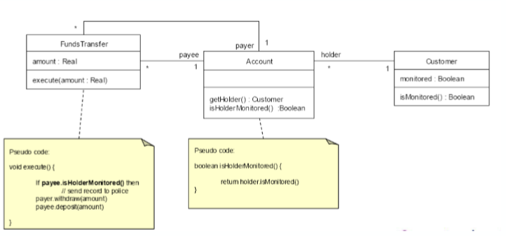

# 4. 访问耦合原理

## 4.1. 原则四：面向接口编程
1. 编程到所需的接口，不仅是受支持的接口
2. 按照约定设计
   1. 模块/类合同：所需方法/提供的方法
   2. 方法合同：前提条件，后置条件，不变式
3. 在考虑(非继承的)类与类之间的关系时，一方面要求值访问对方的接口，另一方面要避免隐式访问。
4. 课本231页关于契约的含义的补充:
   1. 前置条件
   2. 后值条件
   3. 不变式
5. 案例

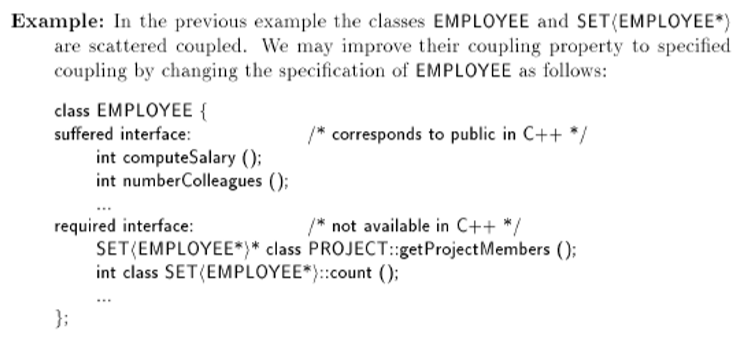

## 4.2. 原则五:迪米特法则
1. 通俗说法
   1. 你可以自己玩。(this)
   2. 你可以玩自己的玩具，但不能拆开它们(自己的成员变量)
   3. 你可以玩送给你的玩具。(方法)
   4. 你可以玩自己制作的玩具。(自己创建的对象)
2. 更加形式化的说法:
   1. 每个单元对于其他单元只能拥有优先的知识，只是与当前单元紧密联系的单元
   2. 每个单元只能和它的朋友交谈，不能和陌生单元交谈
   3. 只和自己的直接的朋友交谈
3. 课本232页的例子很生动

### 4.2.1. 问题案例
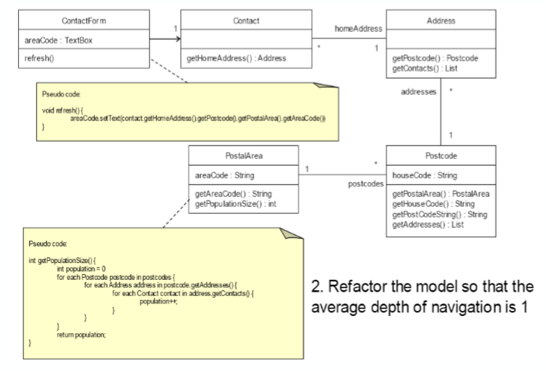

- 通过联系人获得信息
- 如何获得其他的引用？
  1. this
  2. 成员变量:√在Contact里面持有PostalArea的一个成员变量。
  3. 方法
  4. 自己创建
- 这里需要再去确定一下

## 4.3. 原则六：接口隔离原则（ISP）/也叫接口最小化原则
1. 不应强迫客户端依赖于不使用的接口。 马丁（R. Martin），1996年
2. 用到啥依赖啥，尽量不依赖大接口，精确化依赖
2. 许多客户端专用接口比一个通用接口要好（意思同上其实）

## 4.4. 解释接口隔离原则
1. 多用途的类
   1. 方法分成不同组
   2. 没有一个用户使用所有的方法
2. 可能会导致不想要的依赖：使用类的一个方面的客户端也间接依赖于其他方面的依赖性
3. ISP有助于解决问题：使用多个客户端特定的接口

### 4.4.1. 案例一:GUI界面问题
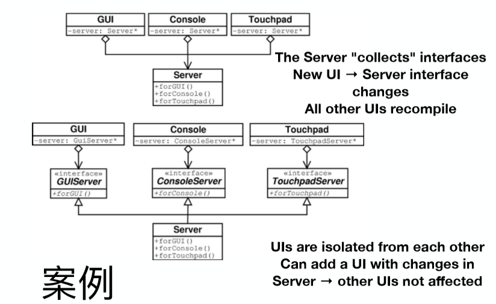

- GUI、Console、TouchPad是最上层，需要其他东西来提供服务
- 但是三者持有整个server，即可以使用其他两者所需要的方法，这就不符合接口最小化原则
- 所以应该顶三个小接口，GUIServer，…，然后让server去实现这三个小接口

### 4.4.2. 案例二:Application的依赖问题

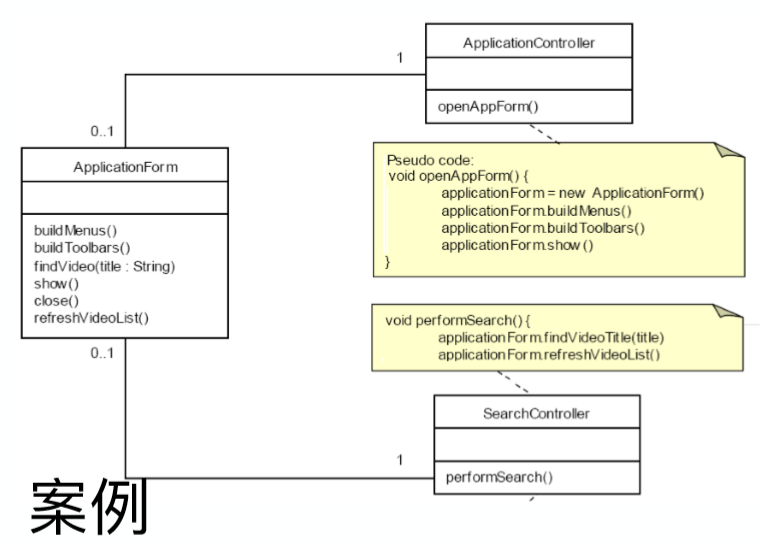

- 问题：ApplicationController和SearchController都只用到了ApplicationForm的一部分，但是却持有整个ApplicationForm
- 想法一:将ApplicationForm拆开
- 想法二:将Controller合并
- 根据具体情况选择想法一和想法二

# 5. 继承耦合


1. 在以上的各种类型的继承关系中，**修改规格、修改实现、精化规格**是不可以接受的。
2. 扩展是最好的继承耦合

## 5.1. 修改 继承耦合
1. 没有任何规则和限制的修改
2. 最差的继承耦合
3. 如果客户端使用父引用，则需要使用parent和child方法
   1. 隐含的
   2. 有两个连接，比较复杂
4. 危害多态

### 5.1.1. 案例
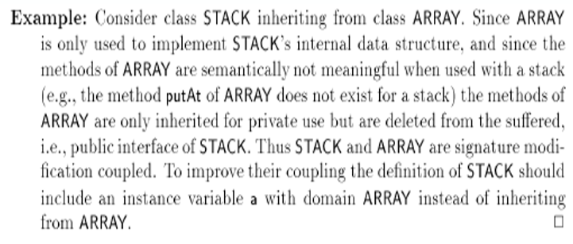

- stack能做的array没有，array有的stack不需要，所以如果stack继承array的话，其需要删掉array中不需要的接口，以及新增自己需要的接口，这就是修改规格耦合，最差的
- 父类能做的子类都能做吗?√
- 子类能做的父类都能做吗?×

## 5.2. 精化 继承耦合
1. 定义新信息
2. 继承的信息仅根据预定规则进行更改
3. 如果客户使用父母参考，则需要整个父母和子女的修饰
   1. 1+connections
4. 常见的

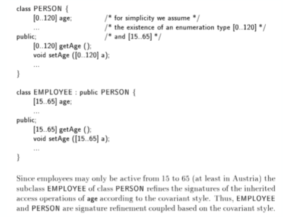

- 父类的age是在0-120，子类的age是在15-65，是在父类的age范围内，是一种精化，而非修改

## 5.3. 扩展 继承耦合
1. 子类仅添加方法和实例变量，而没有修改或修饰任何继承的方法和实例变量
2. 如果客户端使用父引用，则仅需要父引用：一次引用

# 6. 降低继承耦合的方法

## 6.1. 继承耦合原理

## 6.2. 原则七：里氏替换原则（LSP）
1. 所有派生类都必须可以替代其基类
2. “使用指针或对基类的引用的函数必须能够在不知道的情况下使用派生类的对象。” -R. Martin，1996年
   1. 即指向父类的指针同样能够指向子类？？


### 6.2.1. 问题案例一:银行问题
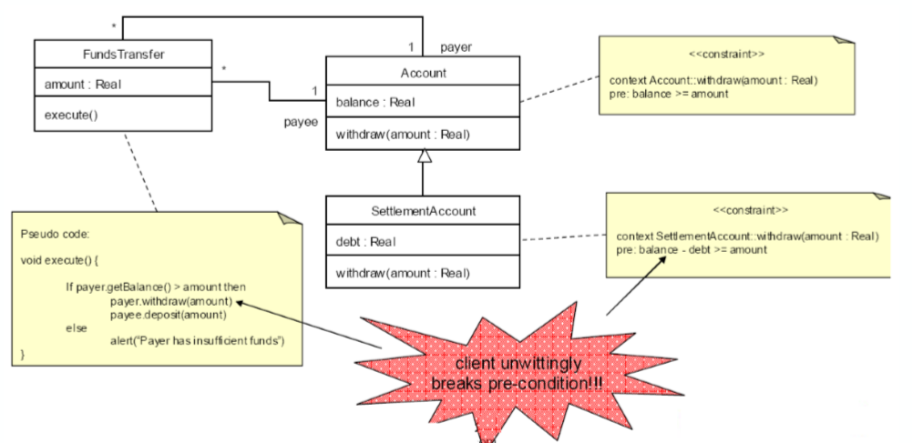

- SettleAccount继承至Account
  - SettleAccount的约束是 balance >= amount
  - Account的约束是 balance-debt >= amount

- 继承关系有问题吗？
- 继承后子类能够当做父类看待吗？不能，**因为子类要求比父类更强**
  - 因为父类能够满足的约束到了子类不一定能够满足，那么父类的指针

- 解决方案:在父类中增加新的变量完成

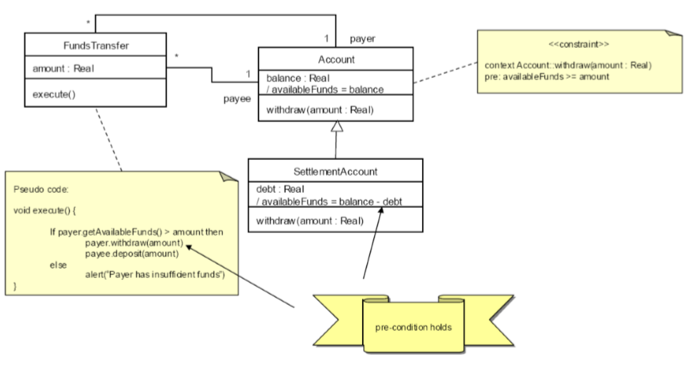

### 6.2.2. 问题案例二:Is a Square a Rectangle?
```java
Rect r = new Rect();
setWidth = 4;
setHeight = 5;
assert(20 == getArea());
class Square extends Rect{
   // Square invariant, height = width
   setWidth(x) {
      setHeight()=x;
   }
   setHeight(x) {
      setWidth(x)
   }
} // violate LSP?
```
1. 正方形继承长方形:正方形条件比长方形条件更强，多限制条件。
   1. 正方形要求长和宽相等，所以正方形的要求更强，所以没办法把正方形当成长方形？？？？
   2. 长方形只需要设置一条变，正方形徐娅保证两条边

2. 正方形继承长方形是不合适的。
3. 长方形继承正方形也是不合适的

### 6.2.3. 问题案例三:Penguin is a bird?
```java
class Bird {
   // has beak, wings,...
   public: virtual void fly();
   // Bird can fly
};
class Parrot : public Bird {
   // Parrot is a bird
   public: virtual void mimic();
   // Can Repeat words...
};
class Penguin : public Bird {
   public: void fly() {
      error ("Penguins don’t fly!");
   } 
};
```
- 不应该被叫做brid，而应该是flyingBird
- Penguins Fail to Fly!

```java
void PlayWithBird (Bird abird) {
   abird.fly();
   // OK if Parrot.
   // if bird happens to be Penguin...OOOPS!!
} 
```

1. 不建模：“企鹅不可能”，它建模“企鹅可能很好，但如果他们尝试是错误的”，则尝试运行时错误→不可取
2. 考虑可替代性-LSP失败

## 6.3. 里氏替换原则总结

设计子类需要考虑：子类的**前置条件需要更弱**，子类的**后置条件需要更强**，也仅当这样，父类的指针才能指向子类，而这就是子类能够100%替换父类的一个条件，即实现LSP原则的条件

3. LSP用来判断是否可以进行继承


### 6.3.1. 课堂练习
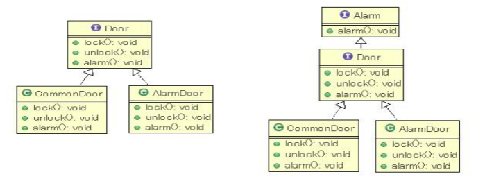

1. 实现的好不好在于子类能不能被当作父类来看待
2. 不好的原因：
   1. 父类中有alarm功能，但是commonDoor实际上不需要alarm功能，或者说它实现不了alarm功能，所以commonDoor不算Door
   2. Door的接口应该只有 lock和unlock，commonDoor继承这两个接口，alarmDoor再继承的基础上进而实现alarm功能

3. 两种设计都不好，因为前置条件强了

## 6.4. 设计原则八:组合代替继承
1. 组合优于继承
2. 使用继承实现多态
3. 使用委托不继承重用代码！

### 6.4.1. Coad的继承规则
1. 仅在满足以下所有条件时才使用继承：
   1. 子类表示“是一种特殊的”，而不是“是一种角色”
   2. 子类的实例永远不需要成为另一个类的对象
   3. 子类扩展而不是覆盖或取消其父类的职责
   4. 子类不会扩展仅是实用程序类的功能

### 6.4.2. 继承/组合 实例一
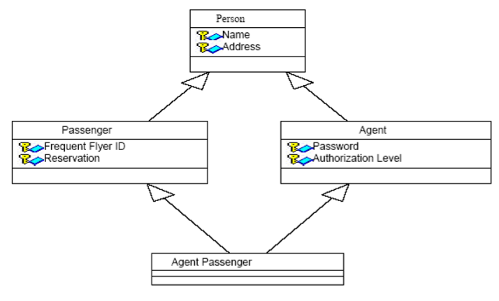

- 如果出现一个用户既是 Passenger 也是 Agent 
- Java不允许多继承

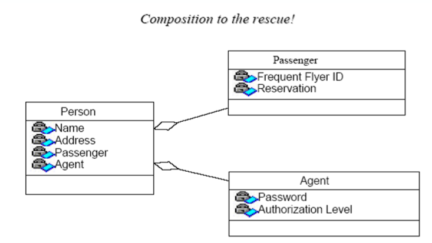

- 直接的想法就是直接组合
- Person里面持有Passenger、Agent，但是这时候对于单一身份的人是很奇怪的

### 6.4.3. 继承/组合 示例二
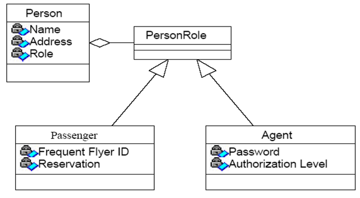

- Person持有Role，Passenger和Agent实现抽象接口PersonRole
- Role可以是一个List

```c++
class Object {  
	public: virtual void update() {}; 
	virtual void draw() {};
 	virtual void collide(Object objects[]) {}; 
}; 
class Visible : public Object { 
    public:
      virtual void draw() { 
        /* draw model at position of this object */ }; 
    private: Model* model; 
}; 
class Solid : public Object { 
    public:
      virtual void collide(Object objects[]) { 
	/* check and react to collisions with objects */ }; 
}; 
class Movable : public Object { 
    public:
      virtual void update() {
		 /* update position */ }; 
};
```

- 问题:游戏引擎中存在很多的对象,三个类分别实现方法之一
- 继承三件事但是只做了一件，Promise No Less不符合
- 接口应该拆成3个

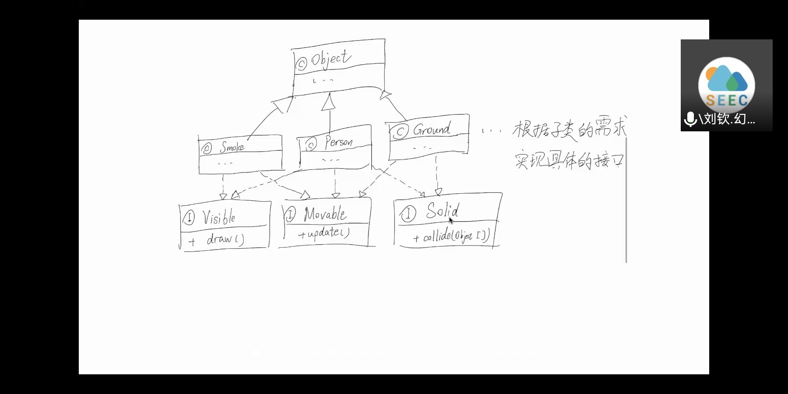

# 7. 内聚
1. 内聚的分类参考课本237页，功能内聚、信息内聚、过程内聚、时间内聚、逻辑内聚、偶然内聚。

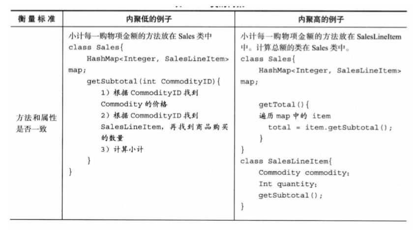

- 方法和属性保持一致

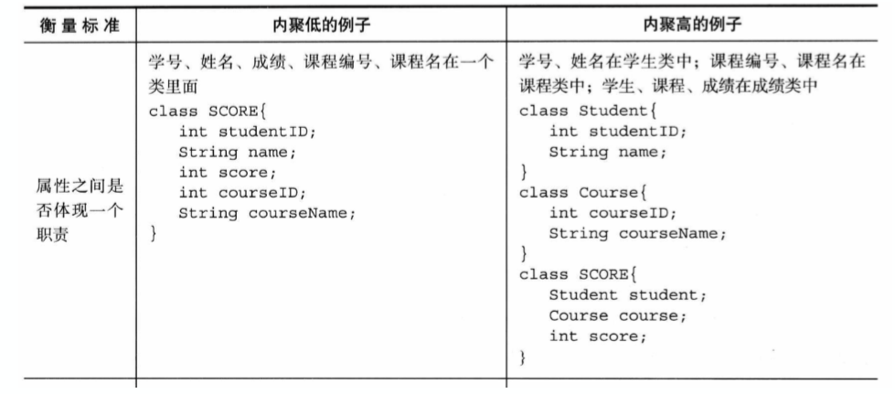

- 提高内聚性:将一个类分为三个类


- 将时间抽象出来

## 7.1. 方法内聚
1. 一类方法是普通耦合
2. 所有方法尽一责
   1. 信息内聚
   2. 相对功能(功能内聚)
   3. 第九个原则:单一职责原理

## 7.2. 提高内聚的方法

### 7.2.1. 原则九：单一责任原则（SRP）
>“一个类只有一个改变的理由”-罗伯特·马丁（Robert Martin）

1. 与内聚性相关并从中导出，即模块中的元素应在功能上紧密相关
2. 班级履行某种职责的责任也是班级变化的原因
3. 一个高内聚的类不仅要是信息内聚的，还应该是功能内聚的。

#### 7.2.1.1. 问题案例
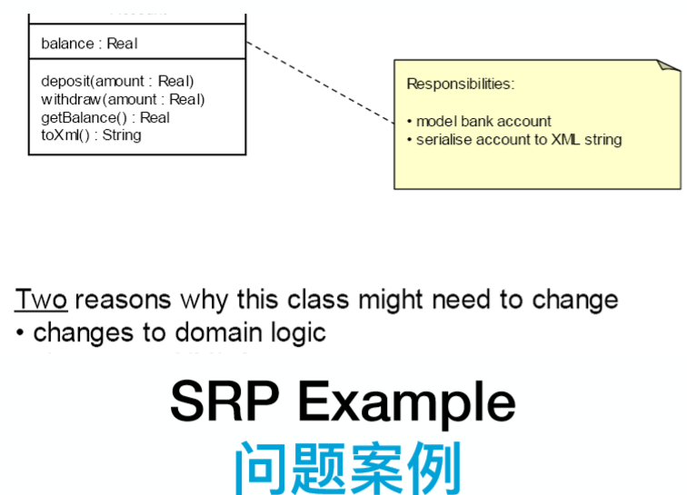

- 修改的原因:
  - 业务逻辑
  - XML格式
- 如何修改如何分开

#### 7.2.1.2. 结局方案
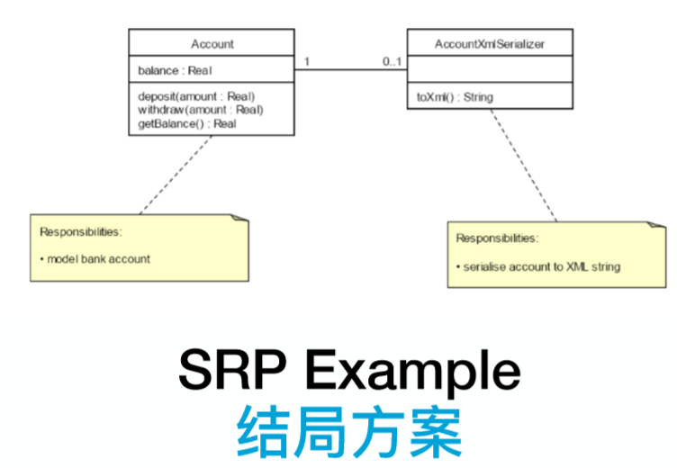

- 我们将两部分职责分离开

### 7.2.2. 单一职责原则
1. 班级只有一个改变的理由：职能/职责的凝聚力
2. 几个职责：表示更改的几个原因→更频繁的更改
3. 听起来很简单
   1. 在现实生活中并非如此轻松
   2. 具有复杂性，重复性，不透明性的Tradeo

## 7.3. 课堂练习

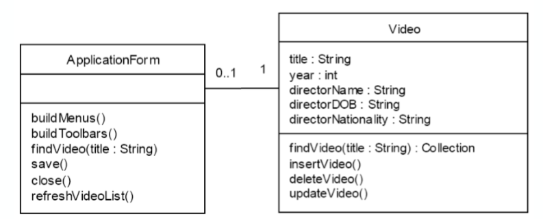
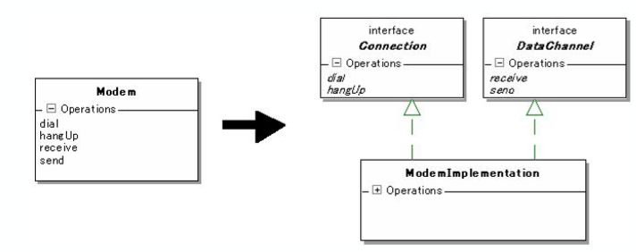

- 打电话和挂起两个职责分离开

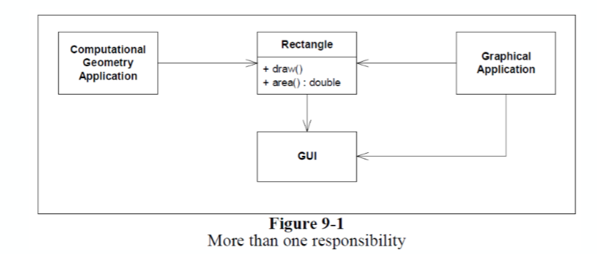

- 几何画板:Draw和Area的计算如何分开

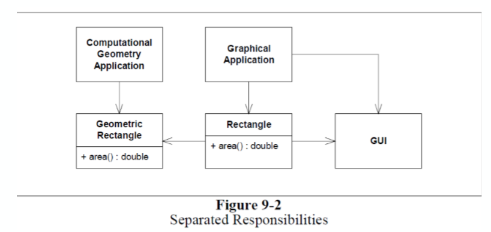

- 解决方案:集合长方形和图形长方形一一对应

# 8. 耦合和内聚的度量

## 8.1. 类之间的耦合度量

### 8.1.1. 第一种度量:CBO(方法调用耦合)
1. 对象类之间的耦合（CBO）
2. CBO = 该类访问他类的成员方法的数量 + 其他类的成员访问该类的成员方法的数量
3. 其他类的计数：
   1. 哪个访问此类中的方法或变量，或者
   2. 包含此类访问的方法或变量
   3. 不包括继承
4. 越低越好

### 8.1.2. 第二种度量:DAC(数据抽象耦合)
1. 数据抽象耦合（DAC）
2. DAC = 统计一类包含的其他类的其他类的实例的数量，不包括继承关系带来的实例引用
3. 具有ADT类型的属性数量取决于其他类的定义
4. 越低越好

### 8.1.3. 第三种度量:Ca和Ce(有效和)
1. Ce和Ca（有效和有效偶联）
   1. Ca:在此类之外依赖于这类内部的类的数量
   2. Ce:这个类中依赖于这个类的外部的类的数量
2. 越低越好

### 8.1.4. 第四种度量:DIT 继承树的深度
1. 继承树的深度
2. 从节点到树的根的最大长度
3. 随着DIT的增长，由于高度的继承性，很难预测类的行为
4. 积极地，较大的DIT值意味着可以重用许多方法
5. 理论上DIT是越大也好，但是同样也会带来很难实现LSP的问题，DIT>3同样也需要审查继承机制的正确性。

### 8.1.5. 第五种度量 Number of children (NOC) 子类的数量
1. 是一个类的直接子类的数量
2. 随着NOC的增长，可复用性增加，抽象减弱了
3. 随着NOC的增长，抽象可能变得稀疏
4. NOC的增加意味着测试量将增加
5. 一般NOC超过三，就需要认真审查继承机制的正确性，检查是否满足LSP

### 8.1.6. 衡量类凝聚力 LCOM
>Lack of cohesion in methods (LCOM) 

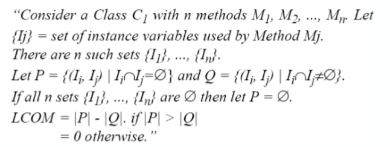

- 交集为空则在P中，交集不为空则在Q中

1. 值越低越好
2. 还定义了许多其他版本的LCOM
3. 如果LCOM>= 1，则应将类划分

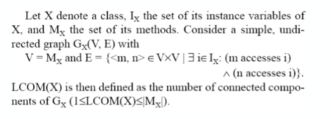

5. 课本241、242页

## 8.2. Summary:Principles from Modularization 模块化的原则
1. 《Global Variables Consider Harmful》 全局变量被认为是有害的
2. 《To be Explicit》让代码清晰一点
3. 《Do not Repeat》避免重复
4. 《Programming to Interface(Design by Contract)》面向接口编程，按照契约设计
5. 《The Law of Demeter》迪米特法则
6. 《Interface Segregation Principle(ISP)》接口分离原则
7. 《Liskov Substitution Principle (LSP)》里氏替换原则:Request No More, Promise No Less
8. 《Favor Composition Over Inheritance》 选择组合而不是继承
9. 《Single Responsibility Principle》单一职责原理